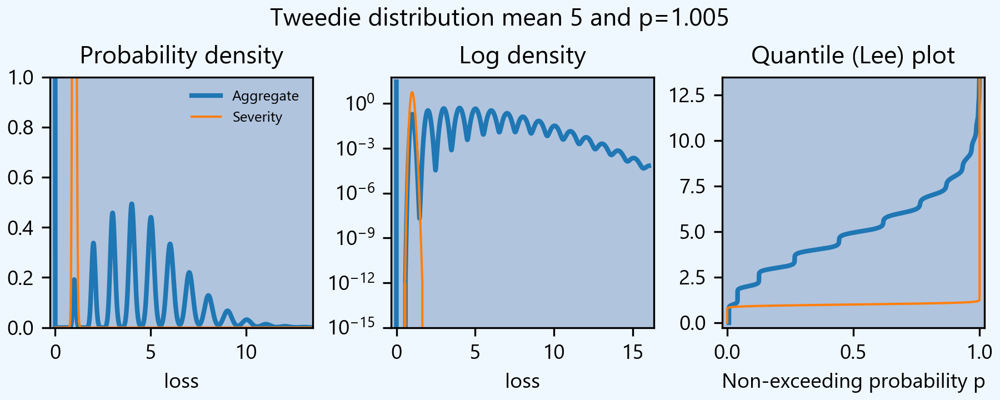

aggregate: a powerful aggregate distribution modeling library in Python
========================================================================

What is it?
-----------

**aggregate** is a Python package providing an expressive language and fast,
accurate computations to make working with aggregate (compound) probability
distributions easy and intuitive. It allows students and practitioners to
use realistic real-world distributions that reflect the underlying
frequency and severity generating processes. It has applications in
insurance, risk management, actuarial science, and related areas.

Documentation
-------------

https://aggregate.readthedocs.io/

Where to get it
---------------

https://github.com/mynl/aggregate

Installation
------------

::

  pip install aggregate

Getting started
---------------

To get started, import ``build``. It provides easy access to all functionality.

Here is a model of the sum of three dice rolls. The DataFrame ``describe`` compares exact mean, CV and skewness with the ``aggregate`` computation for the frequency, severity, and aggregate components. Common statistical functions like the cdf and quantile function are built-in. The whole probability distribution is available in ``a.density_df``.

::

  from aggregate import build
  a = build('agg Dice dfreq [3] dsev [1:6]')
  print(a.describe)

>>>        E[X] Est E[X]    Err E[X]   CV(X) Est CV(X)   Err CV(X) Skew(X) Est Skew(X)
>>>  X                                                                                
>>>  Freq     3                            0                                          
>>>  Sev    3.5      3.5           0 0.48795   0.48795 -3.3307e-16       0  2.8529e-15
>>>  Agg   10.5     10.5 -3.3307e-16 0.28172   0.28172 -8.6597e-15       0 -1.5813e-13

::

  print(f'\nProbability sum < 12 = {a.cdf(12):.3f}\nMedian = {a.q(0.5):.0f}')

>>>  Probability sum < 12 = 0.741
>>>  Median = 10

The Tweedie is a common distribution used
in GLM modeling. It is a compound Poisson aggregate with gamma severity. Users may be
surprised at the form of the density for small p. Here is a Tweedie with
mean 10, p=1.005, dispersion (phi, sigma^2)=4

::

  t = build('agg Tweedie tweedie 5 1.005 1')
  print(t.describe)

>>>        E[X] Est E[X]    Err E[X]    CV(X) Est CV(X)   Err CV(X)  Skew(X) Est Skew(X)
>>> X
>>> Freq 4.9848                       0.44789                        0.44789
>>> Sev   1.003    1.003 -8.6819e-14 0.070888  0.070888  4.9123e-07  0.14178     0.14178
>>> Agg       5   4.9992 -0.00015419  0.44902   0.44885 -0.00036361  0.45126     0.44581

::

  # check variance
  print(1 * 5**1.005, t.agg_var)

>>> 5.04039827609 5.04039827609

``aggregate`` can use any ``scipy.stats`` continuous random variable as a severity, and
supports all common frequency distributions. Here is a compound-Poisson with lognormal
severity, mean 50 and cv 2.

::

  a = build('agg Example 10 claims sev lognorm 50 cv 2 poisson')
  print(a.describe)

>>>       E[X] Est E[X]   Err E[X]   CV(X) Est CV(X) Err CV(X)  Skew(X) Est Skew(X)
>>> X
>>> Freq    10                     0.31623                      0.31623
>>> Sev     50   49.888 -0.0022464       2    1.9314 -0.034314       14      9.1099
>>> Agg    500   498.27 -0.0034695 0.70711   0.68235 -0.035007   3.5355      2.2421

::

  # cdf and quantiles
  print(f'Pr(X<=500)={a.cdf(500):.3f}\n0.99 quantile={a.q(0.99)}')

>>> Pr(X<=500)=0.611
>>> 0.99 quantile=1727.125

See the documentation for more examples.

Dependencies
------------

See requirements.txt.

License
-------

:ref:`BSD 3 licence <LICENSE>`

Contributing to aggregate
-------------------------

All contributions, bug reports, bug fixes, documentation improvements,
enhancements and ideas are welcome.

