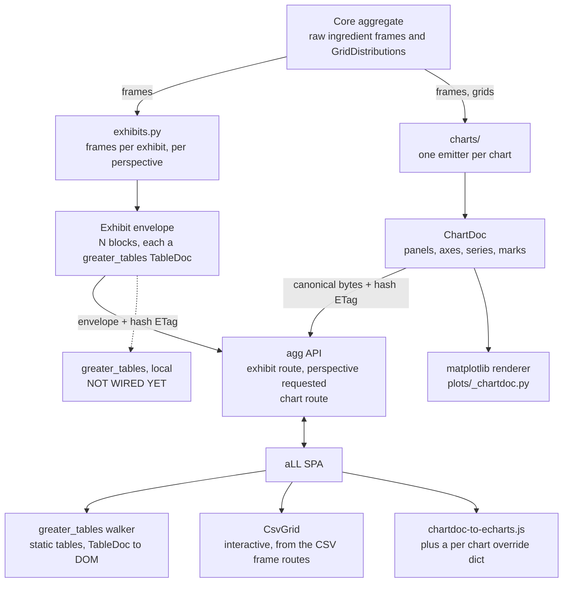

# Exhibits and charts: how the two workstreams fit together

> High level orientation, deliberately short. The detail lives in `dev/plan-exhibits.md` and `dev/plan-chart-ir.md`; progress lives in `dev/TODO.md` and `CHANGELOG.md`.

## The one idea

**Meaning lives in the library. Realization lives in the renderers.**

Core `aggregate` computes, and deals only in raw ingredients: DataFrames and `GridDistribution` accessors. It does not know what a business report looks like, and it does not know what a chart looks like.

Two thin translation layers sit on top of it, one for tables and one for charts. Each turns raw ingredients into a **semantic document**: what is being shown, on what scale, with what emphasis, and never in what color, font or size. Every consumer then realizes the same document its own way: matplotlib and greater_tables locally, ECharts and the greater_tables walker in the browser.

The payoff is that a decision gets made once, in one place, in Python, under test. Before this, the semantics of every app chart lived in JavaScript, and the semantics of every app table lived in per exhibit dictionaries of row flags, formats and captions.

## The picture

Left lane is tables, right lane is charts, and they are deliberately symmetric. The dashed leg is the one piece of the symmetry that does not exist yet.

## What each box is

**Core aggregate.** Unchanged by all of this. It computes distributions and serves frames. Neither translation layer is allowed to push presentation concerns back down into it.

**Exhibits** (`src/aggregate/exhibits/`). One registered exhibit is a named business view: summary, tail, stats, validation, bs_window, tail_behavior, reins, economic, economic_ratios, dependency. Building one produces an **envelope**: a title, metadata, a content hash, and one or more **blocks**, each a greater_tables `TableDoc` carrying the frame plus its formats, row flags, captions and emphasis.

**Perspective** multiplies the exhibits. It is the reader's seat: RAW is the library's own frames, INSURER is the business framing. INSURED and REINSURER are vocabulary today and implementations later. INSURER equals RAW unless an override is registered for that pair, so adding business framing is incremental and never a rewrite.

**Charts** (`src/aggregate/charts/`). One emitter per chart, returning a `ChartDoc`: panels, axes, series, marks, and chart level semantic facts. Log or linear is meaning and lives on the axis. Color, font, hover and camera are not, and have no field at all. There is deliberately no renderer passthrough anywhere in the schema: a need the schema cannot express changes the schema visibly, or the chart stays bespoke and is listed as bespoke.

**The API.** Two document routes, both serving deterministic bytes with the document's own content hash as the ETag, so a client revalidates cheaply and a cache never serves a stale picture. Both derive their menus from library capability queries (`available_exhibits`, `available_charts`), so a new exhibit or chart appears in the app with zero endpoint changes.

**The SPA.** Three realizations: the greater_tables walker for static tables, CsvGrid for interactive frames, and the generic ChartDoc to ECharts adapter for charts. The adapter is one walker plus a small per chart dictionary of chrome, a translator rather than a rebuild.

**Local rendering.** In JupyterLab and Quarto the same documents are realized without a browser: charts through the matplotlib renderer, tables through greater_tables. The long run direction for charts is that the existing `plots/` compositors converge onto the renderer, chart by chart, each move gated by an image comparison so nothing drifts silently.

## The invariants worth defending

- **`charts` never imports matplotlib**, and `exhibits` imports greater_tables lazily. `plots` may import `charts`, never the reverse. Tests enforce both.
- **Documents are deterministic.** Same object, same options, same bytes, same hash, on any machine and any run. That is what makes the ETag contract honest and what makes snapshot testing meaningful.
- **Capability is derived, never declared twice.** The menus come from the registries, so they cannot go stale.
- **Reduction is meaning.** Where a display grid is coarser than the computational grid, the reduction happens in the emitter and preserves mass. It is not the renderer's business to decide what a cell means.

## Where this stands

| | Library | App |
|---|---|---|
| Exhibits | 8 exhibits serving RAW; INSURER overrides for stats, validation and reins | both routes live; menu from capability still to come |
| Charts | schema v1, 2 of 8 emitters (surface, distortion) | route and adapter live, 1 of 8 charts migrated |

The two workstreams run in parallel and touch different files. Charts are gated on the schema sign off and the inventory judgment calls; exhibits are gated on the PnL business framing review.

## Open questions

1. **The dashed leg.** Should `Exhibit` gain a local render, so an exhibit displays in JupyterLab the way `plot_chartdoc` displays a chart? A `_repr_html_` on the envelope would do it, and would make the symmetry real rather than notional.
2. **Fixture vocabulary collision.** The app's `dev/fixtures/exhibits.json` currently holds *chart panel* fixtures, and the table exhibits now want that name too. Worth settling before the file grows a second meaning.
