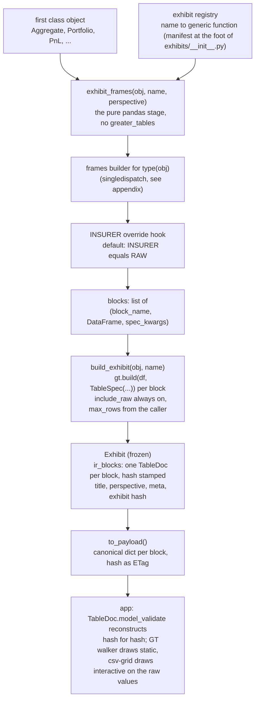
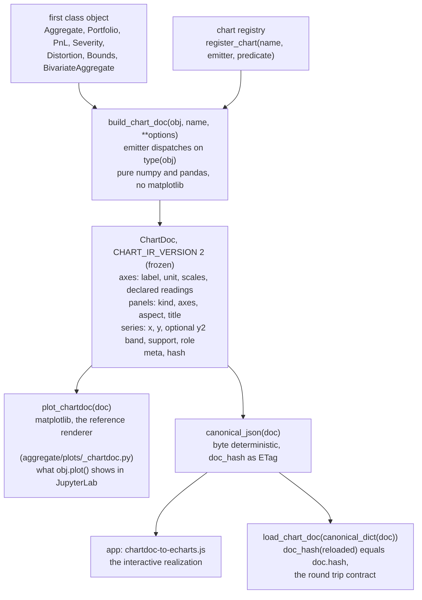

# Exhibits and charts: how they work, and who publishes what

One document, two halves. Part I explains the machinery: how a table or a
picture leaves the library, with the JupyterLab views and a singledispatch
appendix at the end; written 2026-08-14 and every code example run against
1.0.0a274. Part II is the registry reference: what is published, by whom,
with what options; read off the code in the a238 era, registry names
rechecked live at a274 (the pricing exhibits added then), fine detail worth
verifying before relying on it. Design rationale lives in
`dev/exhibits-and-charts.md`, `dev/plan-exhibits.md` and
`dev/plan-chart-ir.md`.

Both packages are provisional in the PEP 411 sense and outside the 1.0 API
contract. The design principle behind both is the same: **the library owns
meaning; a renderer draws what it is served.** A table or a chart is built
once, as a complete document that says what it means, and every renderer
(matplotlib in a notebook, the web app, anything later) realizes that
document without adding meaning of its own.

# Part I: how they work

## The short version

**Exhibits** turn an object's frames into servable table documents. You ask by
name (`'summary'`, `'tail'`, ...) and the machinery finds the right recipe for
your object's type, builds one or more pandas DataFrames (often just passing a
stored frame like `summary_df` through), attaches the presentation the library
intends (caption, formats, row emphasis), and freezes each into a
`greater_tables` `TableDoc`: a hash stamped document carrying the formatted
reading of every cell *and* the raw number behind it. The app serves that
document as JSON and draws it without knowing anything about actuarial
science; in JupyterLab you mostly look at the frames directly and let `GT`
format them.

**Charts** do the same for pictures. You ask by name (`'agg'`, `'envelope'`,
...) and an emitter for your object's type computes the data and writes a
`ChartDoc`: axes with units and declared readings, panels, and series of plain
numbers, with every semantic decision (log or linear, what is a band, what is
discrete) recorded in the document and no drawing library involved. Two
renderers then realize it: the library's own matplotlib renderer, which is
what `.plot()` shows you in JupyterLab, and the app's ECharts adapter, which
draws the same document interactively. One document, two drawings, and they
must agree wherever the decision is semantic.

## Exhibits, stage by stage



1. **The registry.** Each exhibit is a generic function manufactured by
   `_make_exhibit_function` in `exhibits/_core.py` and registered under its
   name (`summary`, `tail`, `stats`, `validation`, `reins`, the `pricing.*`
   family, ...). `available_exhibits(obj)` walks the registry and answers
   which exhibits this object can serve, and under which perspectives.

2. **The frame stage, `exhibit_frames(obj, name, perspective)`.** Deliberately
   greater_tables free. It dispatches the frames builder on `type(obj)`,
   applies the INSURER override hook when that perspective is asked (the
   standing rule: INSURER equals RAW unless an override is registered), and
   relabels every frame through `LabeledMixin._relabel` so `use_labels` and
   `renamer` are honored. It returns `(block_name, frame, spec_kwargs)`
   triples, where the kwargs are plain data `TableSpec` arguments: caption,
   formatters, row_flags. For most exhibits the RAW builder is a passthrough
   declared in the manifest at the foot of `exhibits/__init__.py`: the
   `summary` exhibit's one block *is* `summary_df`. That is the RAW
   invariant: a RAW block always names a public attribute on the dispatched
   object that returns a real frame.

3. **The document stage, `build_exhibit(obj, name)`.** Runs the frame stage,
   then per block calls `gt.build(df, TableSpec(...))`, producing one hash
   stamped `TableDoc`. Two defaults matter. `include_raw` is always on, a
   library decision rather than a caller option: every cell ships as
   `{'text': '17.50', 'raw': 17.5000001}` plus a machine readable format spec
   per column, because a document that dropped its numbers cannot be sorted,
   downloaded at precision, or drawn interactively, and no consumer can put
   back what was thrown away. `max_rows` (default 200) is the one
   presentation question the *caller* answers, because how much of a frame to
   ship belongs to the request; a truncated block says so in its notes. The
   result is a frozen `Exhibit`: the `TableDoc` blocks, a title
   (`'Summary: Example'`, resolved through the object's `_title_name`), the
   perspective, envelope metadata, and a 12 hex hash over the block hashes.

4. **The wire.** `Exhibit.to_payload()` emits
   `{name, title, perspective, meta, blocks, hash}` with each block in
   greater_tables canonical dict form, byte deterministic. The app validates
   each block back into a `TableDoc` hash for hash, then either walks it to
   static HTML (the GT walker) or feeds `irToGridInput` to csv-grid for the
   interactive view, which sorts and filters on the raw values. The direction
   only ever runs frame to document; nothing in the library manufactures a
   DataFrame back out of the IR.

## Charts, stage by stage



1. **The registry.** `register_chart(name, emitter, predicate, primary)` at
   the foot of each emitter module. `available_charts(obj)` answers which
   documents this object can emit (the predicate handles conditional ones,
   like `reins` needing reinsurance).

2. **The emitters.** One module per chart in `charts/_emit_*.py`, pure numpy
   and pandas. Each public emitter is a singledispatch generic
   (`chart_envelope = _emitter_base('envelope')`, then
   `@chart_envelope.register(Bounds)`), so one chart name can serve several
   types. Options are semantic, not cosmetic: `n_resamples=10` on the
   envelope says how densely to show the admissible set, never what color it
   is.

3. **The document.** `ChartDoc` and its parts are frozen dataclasses in
   `charts/ir.py`. Everything a renderer must not decide for itself is in the
   document: axis units and suggested windows, declared alternative readings
   (log, full range, return period, the reflected reading), panel aspect,
   each series' support (`continuous`, `discrete`, ...) and role, and bands
   as a single series with `y` the lower and `y2` the upper edge. The
   document is versioned by `CHART_IR_VERSION`; a reader refuses a version it
   does not know rather than drawing it plausibly and wrong.

4. **Two renderers, one authority.** The matplotlib renderer
   `plot_chartdoc` in `aggregate/plots/_chartdoc.py` is the reference
   implementation; `.plot()` on the first class classes is
   `plot_chartdoc(build_chart_doc(self, ...))`, so the notebook picture and
   the served document are the same object. The app's
   `chartdoc-to-echarts.js` realizes the same document interactively. Where a
   decision is semantic (windows, supports, equal aspect, readings) the two
   must agree; where it is realization (zoom, hover, pixels) they differ
   freely.

5. **The wire, both directions.** `canonical_json` serializes byte
   deterministically and `doc_hash` is the ETag. Unlike exhibits, charts also
   have a library side reader: `load_chart_doc` reconstructs a `ChartDoc`
   from the canonical dict with the contract
   `doc_hash(load_chart_doc(canonical_dict(doc))) == doc.hash`.

## Seeing it in JupyterLab

All of the below runs today; outputs shown are from a274.

```python
from aggregate import build, qd
a = build('agg Example 5 claims 100 xs 0 sev lognorm 50 cv 1.25 poisson')
```

**Exhibits.** Ask what the object serves, look at the frame stage, then the
document stage:

```python
from aggregate.exhibits import available_exhibits, build_exhibit, exhibit_frames

available_exhibits(a)
# [('summary', [RAW, INSURER]), ('tail', ...), ('stats', ...),
#  ('validation', ...), ('bs_window', ...), ('tail_behavior', ...)]

frames = exhibit_frames(a, 'summary')     # the pure pandas stage
block_name, df, kw = frames[0]
block_name, df.shape, sorted(kw)
# ('summary_df', (3, 7), ['caption', 'formatters'])

from greater_tables import GT
GT(df)                                    # look at the frame, formatted

ex = build_exhibit(a, 'summary')          # the document stage
ex.title, ex.hash
# ('Summary: Example', 'de83167bd01d')
ex.ir_blocks[0]                           # a greater_tables TableDoc
```

A `TableDoc` has no notebook repr of its own; render it explicitly to see
exactly what a consumer is served:

```python
import greater_tables as gt
print(gt.render_text(ex.ir_blocks[0]))    # monospace, in the terminal too

from IPython.display import HTML
HTML(gt.render_html(ex.ir_blocks[0]))     # the static HTML realization

ex.to_payload()                           # the JSON envelope the app receives
```

**Charts.** The everyday call is just `.plot()`; the rest is looking at the
machinery it rides on:

```python
a.plot()                                  # builds the document and draws it

from aggregate.charts import (available_charts, build_chart_doc,
                              canonical_dict, doc_hash, load_chart_doc)
from aggregate.plots import plot_chartdoc

available_charts(a)                       # ['agg']
doc = build_chart_doc(a, 'agg')
doc.hash                                  # '87d771e16a9f'
[p.id for p in doc.panels]                # ['density', 'lee']
[(s.name, s.panel_id, s.support) for s in doc.series]

plot_chartdoc(doc)                        # same picture a.plot() drew

doc2 = load_chart_doc(canonical_dict(doc))
doc_hash(doc2) == doc.hash                # True, the round trip contract
```

The `Bounds` envelope is the same pattern on a submodule class:

```python
from aggregate.bounds import Bounds
bd = Bounds(a, premium, a=assets)
bd.plot_envelope(10)                      # charts.chart_envelope, n_resamples=10
build_chart_doc(bd, 'envelope', n_resamples=10)   # the document it drew
```

# Part II: who publishes what

A registry maps a name to a `singledispatch` generic plus an availability
predicate, capability is derived from the registry rather than declared a
second time (`exhibits.available_exhibits(obj)`,
`charts.available_charts(obj)`), and one module function builds the document
(`exhibits.build_exhibit(obj, name, perspective)`,
`charts.build_chart_doc(obj, name, **options)`).

## 1. Exhibits

An exhibit is a titled envelope of one or more blocks, each block a
greater_tables `TableDoc` over one frame with its captions, formats and row
flags. **Perspective** is who is reading. The enum has four members, `RAW`,
`INSURED`, `INSURER`, `REINSURER`, and exactly two are implemented: `RAW` and
`INSURER`. `INSURED` and `REINSURER` are declared vocabulary so the enum does
not churn later; asking for either raises rather than guessing.

The governing rule is that **INSURER equals RAW unless an override is
registered for that (exhibit, class) pair**. So the "INSURER changes" column
below is the complete list of business translation that exists today, and a
blank means the two perspectives serve identical bytes.

| Exhibit | Title | Published by | Blocks (source frames) | Available when | INSURER changes |
|---|---|---|---|---|---|
| `summary` | Summary | Aggregate, Portfolio, PnL, Distortion, BivariateAggregate | 1: `summary_df` | always | Aggregate, Portfolio: caption, total/subtotal row flags, measure formats |
| `tail` | Return periods | Aggregate, Portfolio | 1: `tail_df` | updated | both: caption, 1-in-200 and 1-in-250 row emphasis |
| `stats` | Statistics | Aggregate, Portfolio, PnL, Distortion, BivariateAggregate | 1: `stats_df` | always | Aggregate, Portfolio, PnL: drops the raw noncentral rows `ex1`, `ex2`, `ex3` (26 rows becomes 23), caption |
| `validation` | Validation | Aggregate, Portfolio, PnL, Distortion, BivariateAggregate | 1: `validation_df` | always | Aggregate, Portfolio, Distortion, BivariateAggregate: caption, emphasis on rows failing the object's `validation_eps` gate |
| `reins` | Reinsurance | Aggregate, Portfolio | RAW 2: `reins_stats_df`, `reins_summary_df` | cedes and updated | Aggregate **restructures into 3 blocks**: `reins_layer_terms` and `reins_layer_moments`, layers down the rows, then the summary. Portfolio (no layer axis) drops the raw noncentral rows and flags the summary rows |
| `economic` | Economics | PnL | 1: `economic_df` | always | caption switches on whether the ladder is a kappa scenario or a marginal `P` ladder, ledger row flags, measure formats |
| `economic_ratios` | Economic ratios | PnL | RAW 2: `economic_ratios_df`, `legs_df` | always | **restructures into 3 blocks**: `amounts` (P, L, E, C, M), `ratios` (LR, ER, CR, E_*, shares), `legs`, so no column mixes two units |
| `economic_waterfall` | Economic waterfall | PnL | 2: `walk_df`, `evaluation_df` | multi-step walk (`_tower`) | none |
| `dependency` | Dependency | BivariateAggregate | 2: `dependency_df`, `axis_support_df` | updated | none |
| `bs_window` | Grid sizing | Aggregate, Portfolio, BivariateAggregate | 1: `bs_window_df` | updated | none |
| `sharpen` | Grid probe | Aggregate, Portfolio | RAW 1: `sharpen_df` | probed (`sharpen_df` present) | **restructures into 2 blocks**: `score_grid` (`score` unstacked by `d_log2`) then the full walk |
| `tail_behavior` | Tail behavior | Aggregate, Portfolio | 1: `tail_behavior_df` | updated | none |
| `pricing.calibrate` | Calibrated distortions | **CalibrationResult** (from `calibrate_distortions`, a259) | 1: `distortion_df` | always | none |
| `pricing.allocate` | Allocation | **CalibrationResult** | blocks by source shape: `calibration_df`, then `pricing_df` (Portfolio source) or `reins_price_df` (reinsured Aggregate source) | always | restructures per `dev/done/plan-pricing-exhibits.md` (view filtering, difference rows, stat slices) |
| `pricing.evaluate` | Breakeven acceptability | **EvaluationResult** (from `evaluate`, a259) | 1: `evaluation_df` | always | override registered (basis group framing) |

The three `pricing.*` exhibits (a263) dispatch on **result objects** rather
than stored first class objects: ruling `[Pricing-Keyed-On-Result]`, and the
reason `calibrate_distortions` returns a typed receipt. See the appendix.

Read by class, which is the question a landing page asks:

* **Aggregate**: `summary`, `tail`, `stats`, `validation`, `bs_window`, `tail_behavior`, plus `reins` when it cedes and `sharpen` once the grid probe has run. Six to eight.
* **Portfolio**: the same, per unit plus the total.
* **PnL**: `summary`, `stats`, `validation`, `economic`, `economic_ratios`, plus `economic_waterfall` on a walk.
* **BivariateAggregate**: `summary`, `stats`, `validation`, `dependency`, `bs_window`.
* **Distortion**: `summary`, `stats`, `validation`.
* **CalibrationResult / EvaluationResult**: the `pricing.*` leaves.
* **Severity**: none. It publishes a chart but no exhibit, which is a gap rather than a decision.

## 2. Charts

A chart emitter returns a `ChartDoc`: axes, panels, series, marks, and chart-level `meta`, carrying semantics only. Where an exhibit has a perspective, a chart has **declared readings**: an axis names every scale it may honestly be read on (`scales`) and whether a zoom-out exists (`full_range` alongside `suggested_range`); a probability axis may name a paired return-period axis (`reciprocal_of`) and a paired reflected axis (`complement_of`, the map `v` to `1 - v`, which turns a non-exceeding probability into the exceedance and so a quantile function into the survival function), each carrying its own label, scales and window; a panel may declare itself `invertible` and may offer more than one realization (`kinds`). The renderer's switches act on every axis or panel that declares the reading and on nothing else, so a caller never needs to know which chart it is holding.

Chart-level facts, one line each. Options are semantic arguments to the emitter, never renderer settings.

* **`agg`** on Aggregate, its primary chart. Available when updated. Option `xmax`. Entry point `Aggregate.plot(xmax, log, full_range, reflect, return_period, invert)`.
* **`port`** on Portfolio, primary. Updated. Option `xmax`. Entry point `Portfolio.plot(xmax, log, full_range)`.
* **`pnl`** on PnL, primary. Needs `result`. No options. Entry point `PnL.plot(log, full_range, reflect, return_period, invert)`.
* **`severity`** on Severity, primary. Always. Option `n` (default 512 quantile-spaced points). Entry point `Severity.plot(n, log, full_range, reflect, return_period, invert)`.
* **`reins`** on Aggregate, primary for nothing (it is a view of a book, not the book's own picture). Needs an occurrence program. No options. Entry point `Aggregate.reins_occ_plot(log, full_range, reflect, return_period, invert)`.
* **`distortion`** on Distortion, primary. Always. Option `dual`. Entry point `Distortion.plot(dual, ax)`.
* **`envelope`** on Bounds, primary. Always. Options `n_resamples` (bracketing curves inside the band, each carrying its weight as `ChartSeries.value`), `n`. Entry point `Bounds.plot_envelope(n_resamples)`.
* **`joint_surface`** on BivariateAggregate, primary. Needs the in-memory joint density. Options `window` (default 4, the marginal quantile depth **drawn**, measured on the fine lattice before the reduction; it selects the block factor and does not crop what is served, so the whole reduced lattice travels either way), `detail` (default 128 cells **across the window**, a ceiling reached by a power-of-two block sum, mass preservingly; the emitted axis runs the whole lattice at that step and so is longer, by the ratio of the lattice to the window) and `encoding` (default `f32b64`, also `f64b64` / `u16log12b64` / `json`). The surface block carries `x0/dx/nx`, `y0/dy/ny`, `edge='mid'` (a coordinate is the block's representative point, the mean of the fine coordinates it covers), `bs`, `k`, `window` as the drawing range inside the lattice with the share of mass in it, the exact `marginals`, fine-lattice `moments` and `deficit`. **No class method yet**: reach it through `charts.build_chart_doc` and `plots.plot_chartdoc`.

| Chart / panel | x axis | y axis | Series | Marks | Readings offered |
|---|---|---|---|---|---|
| `agg` / density | `outcome`, Loss, currency, linear or log, window `q(0.001) or 0 .. q(0.999)` padded 2%, full = whole grid | `mass`, Probability mass, density, linear or log, `(0, peak)`, no zoom-out | Aggregate and Severity, role `density`, atomic | mean, full weight | log x, log y, full x |
| `agg` / lee | `p`, Non-exceeding probability, `(0, 1)`, paired with `return_period` (log, `1 .. 1e9`) and `survival`, Exceeding probability, linear or log, `(0, 1)` | `outcome`, shared with the density panel | Aggregate and Severity, role `cdf` | none | log y, full y, reflect, return period, invert to "Distribution function" |
| `port` / density | `outcome`, Loss, currency, linear or log, window, full | `mass`, linear or log, `(0, top)` | one per unit (role `unit`) then Total (role `total`) last, so the book draws on top; each on its own native grid | mean | log x, log y, full x |
| `port` / kappa | `outcome`, shared | `kappa`, `E[Xi \| X = x]`, currency, linear or log, window = the loss window, full to the last kept point | same names again, role `unit` / `total`, support continuous; the Total curve **is** the diagonal | none | log x, log y, full x, full y; `aspect='equal'` is semantic |
| `pnl` / density | `outcome`, P&L, currency, **linear only** (signed), window not anchored at 0, full | `mass`, linear or log | one series, the result name | break even at 0, mean | log y, full x |
| `pnl` / lee | `p`, paired with `return_period` and `survival` | `outcome`, shared, linear only, full | the same series, role `cdf` | break even (horizontal) | full y, reflect, return period, invert |
| `severity` / density | `loss`, currency, linear or log, `0 .. isf(0.001)` padded, full | `pdf` (or Probability mass for a law with no density), linear or log, no window | one series; continuous unless the law is atomic, in which case the ordinate is read from the jumps of the cdf | none, deliberately | log x, log y, full x |
| `severity` / lee | `p`, paired with `return_period` and `survival` | `loss`, shared, linear or log, full | the same series, role `cdf` | none | log y, full y, reflect, return period, invert |
| `reins` / occurrence | `claim`, Loss per claim, currency, **linear only**, window = the occurrence limit padded 2%, full = grid | `sev_density`, Occurrence density, **log only**, no window | Gross, Ceded, Net, roles `gross` / `ceded` / `net`, net drawn last | none | full x only |
| `reins` / aggregate | `p`, paired with `return_period` and `survival` | `annual`, Aggregate loss, currency, linear or log, window from the gross curve, full | Gross, Ceded, Net again, as quantile curves | none | log y, full y, reflect, return period, invert |
| `distortion` / square | `s`, probability, linear, `(0, 1)`, paired with `s_complement`, `1 - s` | `g(s)`, probability, linear, `(0, 1)`, paired with `g_complement`, `1 - g(s)` | the distortion, the dual (optional), then identity | none | reflect, which draws the dual; nothing else, since the unit square **is** the window and `aspect='equal'` is the whole point |
| `envelope` / cloud | `s`, `(0, 1)`, paired with `s_complement` | `g(s)`, `(0, 1)`, paired with `g_complement` | Envelope (a `y2` band series, so the series is the region), `n_resamples` BiTVaR curves each carrying its weight, identity | none | reflect, which draws the envelope of the duals; equal aspect |
| `envelope` / calibrated | `s`, shared | `g(s)`, shared | the band again, then CCoC, TVaR(p\*), PH, Wang, Dual, then Avg extreme, then identity. **Panel omitted** where nothing is calibrated | none | reflect, which draws the envelope of the duals; equal aspect |
| `joint_surface` / joint | `x0`, resolved component label, currency | `x1`, resolved component label, currency; z axis `z`, density, linear or log | one `SurfaceData`, role `joint`, values are display-cell masses | none | log z. `kinds` declares only `'surface'` today, so the renderer's `kind` switch has nothing to choose between |

### Things worth knowing that no column holds

**Two panels, one axis, except once.** On `agg`, `pnl` and `severity` the outcome axis is a single `ChartAxis` referenced as the density panel's x and the Lee panel's y, so a window set on it moves both. On `port` both panels take it as x. `reins` is the deliberate exception: its two panels share nothing, because a per-claim loss and an annual aggregate are different quantities and one window across both would claim they were the same.

**Three floors, all measured rather than chosen.** `LOG_FLOOR = 1e-15` turns float dust into `None` gaps that a renderer must break the line at, never bridge. `SURVIVAL_FLOOR = 1e-9` is the deepest survival worth a panel and is what puts the return-period axis top at 1e9. `KAPPA_FLOOR = 1e-14` on the portfolio kappa panel is a decade above the dust floor because kappa divides by `p_total`, and the residual of the sum-to-diagonal identity is what measured the cliff.

**Support is a fact about the law.** `support='atomic'` says the points carry the whole distribution and there is nothing between them, which in this library is the normal case; `'continuous'` says they sample a function that exists everywhere between them, which is a distortion, a kappa curve, and a severity that has a density. The renderer picks stems, steps or a line from that plus the room it has.

**Three panels became two, twice.** The old aggregate compositor drew density, log density and Lee; the log density is not a third reading of the book, so it became a declared reading of the first, and the cdf panel came back as the Lee panel's declared inversion. The bounds compositor split five calibrated distortions across two panels by order of addition; all five now sit on one band.

**What is missing.** Severity publishes no exhibit. Bounds publishes a chart but no exhibit; its registration is the one open item of `dev/plan-exhibit-official-channels.md`. `joint_surface` has no class method. `INSURED` and `REINSURER` are vocabulary with no implementation. The joint panel declares one realization where the schema and the renderer both support a heatmap and surface toggle.

# Appendix: what singledispatch means

`functools.singledispatch` turns one function name into a small registry
keyed on the **type of the first argument**. You define a base
implementation, register alternatives per type, and the call picks the
implementation that matches what you passed:

```python
from functools import singledispatch

@singledispatch
def describe(obj):
    raise NotImplementedError(type(obj).__name__)

@describe.register(int)
def _(obj):
    return f'the integer {obj}'

@describe.register(str)
def _(obj):
    return f'the string {obj!r}'

describe(3)        # 'the integer 3'
describe('cat')    # "the string 'cat'"
describe(3.5)      # NotImplementedError: float
```

Dispatch respects inheritance: a subclass with no registration of its own
falls back to its base class's, and registration is open, so code outside the
library can add types without touching it.

Where it appears in this story:

* **Every exhibit generic function carries two such registries**: the frames
  builder (`summary.register(Aggregate)` supplies the recipe for an
  Aggregate) and the INSURER override hook (`summary.insurer.register(...)`),
  whose base implementation is the identity, which is how "INSURER equals RAW
  unless someone says otherwise" is implemented.
* **Every chart emitter is one**: `chart_envelope.register(Bounds)` says how
  a `Bounds` becomes the envelope document, and another registration could
  serve the same chart name for another type.
* **It is why `calibrate_distortions` returns a `CalibrationResult`** rather
  than a bare frame (1.0.0a259). The pricing exhibits (`pricing.calibrate`
  and friends) are registrations like every other exhibit, and what they
  register on is the result type. A `DataFrame` cannot carry that role: every
  frame has the same type, so there is nothing for dispatch to see, and no
  identity or position for the exhibit to title itself with. The typed
  receipt gives the machinery something to dispatch on and carries the
  inputs it was written about.
