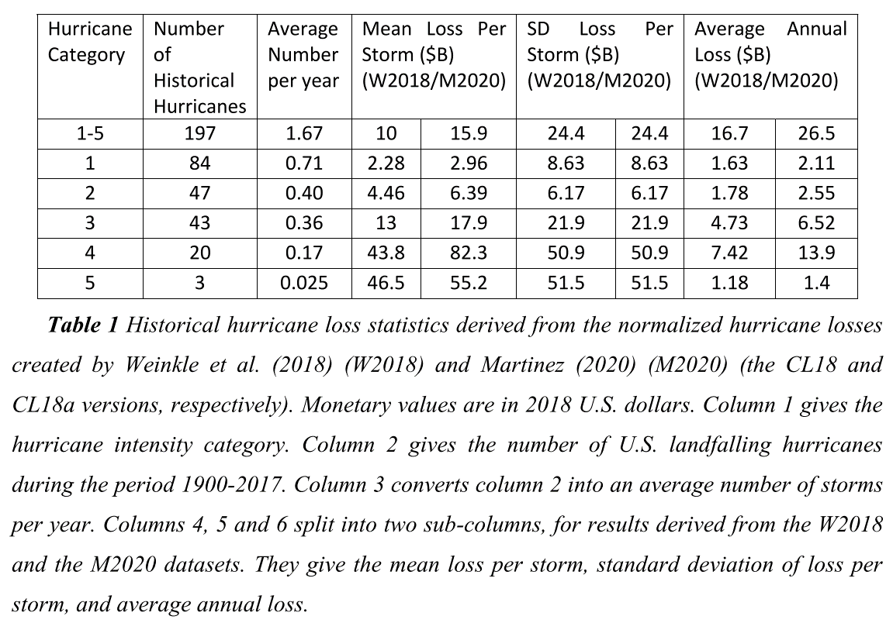

.. _2_x_cat:

Catastrophe Modeling
=====================

**Objectives:** Describe applications of ``aggregate`` to catastrophe risk management, including calculation of occurrence and aggregate exceeding probability (OEP, AEP) values, and loss costs for ILWs.

**Audience:** Catastrophe modelers and risk management professionals.

**Prerequisites:** Basics of catastrophe modeling, catastrophe insurance and reinsurance.

**See also:** :ref:`Specifying exposures <2_x_exposure>`.

NOAA Reforecast
---------------

Occ and Agg PMLs.

1851-2017

======== ===== =========
Category Count Frequency
======== ===== =========
1        116   0.69
2        75    0.45
3        76    0.46
4        20    0.12
5        3     0.02
======== ===== =========

Overall severity from RMI course lognormal (19.6, 2.58)

Jewson Estimates
-----------------

`Stephen Jewson <https://www.linkedin.com/in/steve-jewson-phd-052bb417/>`_ *Projections of Changes in U.S. Hurricane Damage Due to Projected Changes in Hurricane Frequencies*, (2020) reports the following frequency and severity statistics.

Here is a dataframe version that adds the severity CVs.

.. ipython:: python
    :okwarning:

    from aggregate import build, qd
    import pandas as pd
    from pandas import option_context as oc

    jewson = pd.DataFrame(
        {'Num': [197, 84, 47, 43, 20, 3],
        'EN': [1.67, 0.71, 0.4, 0.36, 0.17, 0.025],
        'ES_W': [10.0, 2.28, 4.46, 13.0, 43.8, 46.5],
        'ES_M': [15.9, 2.96, 6.39, 17.9, 82.3, 55.2],
        'SD_W': [24.4, 8.63, 6.17, 21.9, 50.9, 51.5],
        'SD_M': [24.4, 8.63, 6.17, 21.9, 50.9, 51.5],
        'EX_W': [16.7, 1.63, 1.78, 4.73, 7.42, 1.18],
        'EX_M': [26.5, 2.11, 2.55, 6.52, 13.9, 1.4]},
        index=pd.Index(['1-5', '1', '2', '3', '4', '5'],
        dtype='object', name='Cat')
        )

    jewson['CV_W'] = jewson.SD_W / jewson.ES_W
    jewson['CV_M'] = jewson.SD_M / jewson.ES_M

    with oc('display.float_format', lambda x: f'{x:.3g}'):
        print(jewson)

Let's build ``aggregate`` models of these two distributions. Set ``normalize=False`` for a thick tailed distribution, and increase the number of buckets, ``log2=19``. The bucket size was based on trial and error to minimize the error in the mean, see :ref:`selecting bucket size <2_x_approximation_error>`.

.. ipython:: python
    :okwarning:

    w = build(f'agg US.Wind.W {jewson.loc["1":"5", "EN"].to_numpy()} claims '
              f'sev lognorm {jewson.loc["1":"5", "ES_W"].to_numpy()}'
              f'cv {jewson.loc["1":"5", "SD_W"].to_numpy()}'
              'poisson', bs=1)

    m = build(f'agg US.Wind.M {jewson.loc["1":"5", "EN"].to_numpy()} claims '
              f'sev lognorm {jewson.loc["1":"5", "ES_M"].to_numpy()}'
              f'cv {jewson.loc["1":"5", "SD_M"].to_numpy()}'
              'poisson', bs=1)

    qd(m.describe)

    qd(w.describe)
