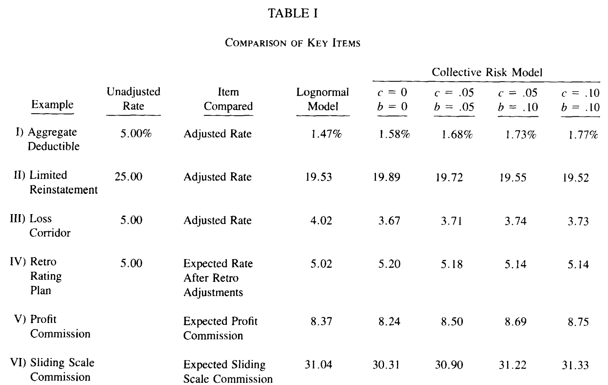

.. _2_x_re_pricing:

Reinsurance Pricing
========================

.. what about surplus share?
.. what about finite reinstatements by count?

**Objectives:** Use ``aggregate`` to evaluate inwards (assumed) and outwards (ceded) reinsurance.

**Audience:** Reinsurance pricing, broker, or ceded re actuary.

**Prerequisites:** DecL, underwriting and reinsurance terminology, aggregate distributions, risk measures.

**See also:** :doc:`DecL/080_reinsurance`, :doc:`2_x_ir_pricing`. For other related examples see :doc:`2_x_problems`, especially :doc:`problems/0x0_bahnemann`.

The examples in this section are illustrative. ``aggregate`` gives you the gross, ceded, and net distributions and with those in hand, the analytic world is your oyster. You can answer any reasonable question about a reinsurance program.

Contents
----------

* :ref:`Helpful references <re references>`
* :ref:`Basic examples <re basic examples>`
* :ref:`Modes of reinsurance analysis <re modes>`
* :ref:`Casualty exposure rating <re casualty exposure>`
* :ref:`Property exposure rating <re property exposure>`
* :ref:`Variable features <re variable>`
* :ref:`Inwards analysis of Bear and Nemlick variable features <re inwards variable>`

    - :ref:`Aggregate deductible <re bear 1>`
    - :ref:`Aggregate limit <re bear 2>`
    - :ref:`Loss corridor <re bear 3>`
    - :ref:`Retro rated program <re bear 4>`
    - :ref:`Profit share <re bear 5>`
    - :ref:`Sliding scale commission <re bear 6>`

* :ref:`Outwards analysis <re outwards analysis>`
* :ref:`Adjusting layer loss picks <re loss picks>`
* :ref:`re summary`

.. _re references:

Helpful References
--------------------

* General reinsurance: :cite:t:`Strain1997`, :cite:t:`Carter2013`, :cite:t:`Albrecher2017`

* General reinsurance pricing: :cite:t:`Bear1990`, :cite:t:`Mata2002`, :cite:t:`Clark2014`, David Clark *Basics of Reinsurance Pricing*, Actuarial Study Note, CAS (Arlington, VA) 2014 revised version.

* Property rating: :cite:t:`Bernegger1997`, :cite:t:`Ludwig1991`

* :cite:t:`Anderson1988` move to cat file.

.. _re basic examples:

Basic Examples
---------------

Here are some basic examples. They are not realistic, but it is easy to see what is going on. The subsequent sections add realism. The basic example gross loss is a "die roll of dice rolls": roll a die, then roll that many dice and sum, see :doc:`2_x_student`. The outcome is between 1 (probability 1/36) and 36 (probability 1/6**7), as confirmed by this output.

.. ipython:: python
    :okwarning:

    import pandas as pd
    from aggregate import build, qd
    a01 = build('agg Re:01 dfreq [1 2 3 4 5 6] dsev [1 2 3 4 5 6] ')
    @savefig DD_1.png scale=16
    a01.plot()
    qd(a01)
    print(f'Pr D = 1:  {a01.pmf(1) : 11.6g} = {a01.pmf(1) * 36:.0f} / 36\n'
          f'Pr D = 36: {a01.pmf(36):8.6g} = {a01.pmf(36) * 6**7:.0f} / 6**7')

An **occurrence excess of loss** reinsurance layer, 2 xs 4, is specified between the severity and frequency clauses (you need to know severity but not frequency)::

    occurrence net of 2 xs 4

Requesting ``net of`` propagates losses net of the cover through to the aggregate.

.. ipython:: python
    :okwarning:

    a02 = build('agg Re:02 dfreq [1:6] dsev [1:6] '
                     'occurrence net of 2 xs 4')
    a02.plot()
    @savefig DD_2x4.png scale=16
    qd(a02)

Note the use ``[1:6]`` as shorthand for ``[1,2,3,4,5,6]``.

The ``reinsurance_audit_df`` dataframe shows unconditional (per ground up claim) severity statistics by layer. Multiply by the claim count ``a02.n`` to get layer loss picks. The severity, ``ex``, equals (1 + 2) / 6 = 0.5 (first block). The expected loss to the layer equals 0.5 * 3.5 = 1.75 (second block).

.. ipython:: python
    :okwarning:

    qd(a02.reinsurance_audit_df['ceded'])
    qd(a02.reinsurance_audit_df['ceded'][['ex']] * a02.n)

An **aggregate excess of loss** reinsurance layer, 12 xs 24, is specified after the frequency clause (you need to know frequency)::

    aggregate ceded to 12 xs 34.

Requesting ``ceded to`` propagates the ceded losses through to the aggregate. Refer to ``agg.Re:01`` by name as a shorthand. ``reinsurance_audit_df`` reports expected loss to the aggregate layer.

.. ipython:: python
    :okwarning:

    a03 = build('agg Re:03 agg.Re:01 '
                 'aggregate ceded to 12 x 24')
    a03.plot()
    @savefig DD_12x24a.png scale=16
    qd(a03)
    qd(a03.reinsurance_audit_df.stack(0))

Both occurrence and aggregate programs can be applied at once. The ``ceded to`` and ``net of`` clauses can be mixed. You cannot refer to ``agg.Re:01`` by name because you need to see into the object to apply the occurrence reinsurance.

.. ipython:: python
    :okwarning:

    a04 = build('agg Re:04 dfreq [1:6] dsev [1:6] '
                 'occurrence net of 2 x 4 '
                 'aggregate net of 6 xs 16')
    @savefig DD_nn.png scale=16
    a04.plot()
    qd(a04)
    qd(a04.reinsurance_audit_df['ceded'])

Multiple layers can be applied at once. Layers can be specified as a **share of**  or **part of** to account for coinsurance (partial placement) of the layer:

* ``0.5 so 2 xs 2``, read 50% **share of** 2 xs 2, or
* ``1 po 4 xs 10``, read 1 **part of** 4 xs 10.

.. warning::

    ``aggregate`` works with discrete distributions. All outcomes are multiples of the bucket size, ``bs``. Any cession is rounded to a multiple of ``bs``. Ensure  ``bs`` is appropriate to capture cessions when applying share or part of. By default ``build`` uses ``bs=1`` when it detects a discrete distribution, such as the die roll example. Ceding to ``0.5 so 2 xs 2`` produces ceded losses of 0.5 and net losses of 2.5. To capture these needs a much smaller discretization grid. Non-discrete aggregates plot as though they are continuous or mixed distributions.

These concepts are illustrated in the next example. Note the bucket size.

.. ipython:: python
    :okwarning:

    a05 = build('agg Re:05 dfreq [1:6] dsev [1:6] '
                 'occurrence net of 0.5 so 2 x 2 and 2 x 4 '
                 'aggregate net of 1 po 4 x 10 '
                 , bs=1/512, log2=16)
    @savefig DD_nn2.png scale=16
    a05.plot()
    qd(a05)
    qd(a05.reinsurance_audit_df['ceded'])

A **tower** of limits can be specified by giving the attachment points of each layer. The shorthand::

    occurrence ceded to tower [0 1 2 5 10 20 36]

is equivalent to::

    occurrence ceded to 1 x 0 and 1 x 1 and 3 x 2 and 5 x 5 and 10 x 10 and 16 x 20

Here is a summary of these examples. The audit dataframe gives a layering of aggregate losses. The plot is omitted; it is identical to gross since the tower covers all losses.

.. ipython:: python
    :okwarning:

    a06 = build('agg Re:06 agg.Re:01 '
                    'aggregate ceded to tower [0 1 2 5 10 20 36]')
    a06.plot()
    qd(a06)
    with pd.option_context('display.multi_sparse', False):
        qd(a06.reinsurance_audit_df['ceded'])

.. _re modes:

Modes of Reinsurance Analysis
--------------------------------

Inwards reinsurance pricing is begins with an estimated loss pick, possibly supplemented by distribution and volatility statistics such as loss standard deviation or quantiles. ``aggregate`` can help in two ways.

1. Excess of loss exposure rating that accounts for the limits profile of the underlying business and how it interacts with excess layers. Uses only the severity distribution through difference of increased limits factors. This application is peripheral to the underlying purpose of ``aggregate``, but is very convenient nonetheless.
2. The impact of treaty **variable features** that are derived from the full aggregate distribution of ceded losses and expenses---a showcase application.

Outwards reinsurance is evaluated based on the loss pick and the impact of the cession on the distribution of retained losses. Ceded re and broker actuaries often want the full gross and net outcome distributions.

.. _re casualty exposure:

Casualty Exposure Rating
--------------------------

This example calculates the loss pick for excess layers across a subject portfolio with different underlying limits and deductibles but a common severity curve. The limit profile is given by a premium distribution and the expected loss ratio varies by limit. Values are in 000s. Policies at 1M and 2M limits are ground-up and those at 5M and 10M limits have a 100K and 250K deductible. The full assumptions are:

.. ipython:: python
    :okwarning:

    profile = pd.DataFrame({'limit': [1000, 2000, 5000, 10000],
                            'ded'  : [0, 0, 100, 250],
                            'premium': [10000, 5000, 2500, 1500],
                            'lr': [.75, .75, .7, .65]
                           }, index=pd.Index(range(4), name='class'))
    qd(profile)

The severity is a lognormal with an unlimited mean of 50 and cv of 10, :math:`\sigma=2.148`.
The gross portfolio and tower are created in ``cas``.
There layering analysis across a typical XOL tower up to 10M is created using a ``tower`` in the ``occurrence`` clause, which specifies the layer break points.

.. ipython:: python
    :okwarning:

    a07 = build('agg Re:07 '
                f'{profile.premium.values} premium at {profile.lr.values} lr '
                f'{profile.limit.values} xs {profile.ded.values} '
                'sev lognorm 50 cv 10 '
                'occurrence ceded to tower [0 250 500 1000 2000 5000 10000] '
                'poisson ', approximation='exact', log2=18, bs=1/2)
    qd(a07)

Why are there special options in ``build``? The claim count is high: 292.7. To force a convolution use ``approximation='exact'``. Reviewing the default ``bs=1/2`` and ``log2=16`` shows a moderate error. Looking at the density via::

    a07.density_df.p_total.plot(logy=True)

shows aliasing, i.e., not enough space in the answer. Adjust by increasing ``log2`` from 16 to 18 and leaving ``bs=1/2``.

To summarize the analysis, extract the ceded layering from ``reinsurance_audit_df`` into ``layers``. The column ``layers.ex`` shows unconditional expected layer loss (per ground-up claim); ``layers.severity`` shows layer severity conditional on the layer attaching; ``layers.aal`` shows the layer expected loss; ``layers.proportion`` shows the proportion of loss by layer.  ``a07.n`` is the expected claim count. The index of ``layers`` is replaced so it formats as numbers, not strings---purely cosmetic.

.. ipython:: python
    :okwarning:

    import numpy as np
    layers = a07.reinsurance_audit_df['ceded'][['ex']].droplevel([0,1])
    layers['severity'] = layers.ex / [a07.sev.sf(0 if type(i)==str else i)
            for i in layers.index.get_level_values(1)]
    layers['aal'] = layers.ex * a07.n
    layers['proportion'] = layers.aal / layers.aal.iloc[:-1].sum()
    idx = layers.index; nms = idx.names
    layers.index = pd.MultiIndex.from_tuples(
        idx.tolist()[:-1] + [(np.inf, 0)], names=nms)
    with pd.option_context('display.multi_sparse', False):
        qd(layers)

.. _re property exposure:

Property Risk Exposure Rating
-------------------------------

Property risk exposure rating differs from casualty in part because the severity distribution varies with each risk (location). Rather than a single ground-up severity curve per class, there is a size of loss distribution normalized by property total insured value (TIV).

We start by introducing the Swiss Re severity curves, :cite:t:`Bernegger1997` using a moments-matched beta distribution. The function ``G`` defines the MBBEFD distribution, parameterized by ``c``.

.. ipython:: python
    :okwarning:

    from aggregate import xsden_to_meancv
    import scipy.stats as ss
    import numpy as np
    import matplotlib.pyplot as plt

    def bb(c):
        return np.exp(3.1 - 0.15*c*(1+c))

    def bg(c):
        return np.exp((0.78 + 0.12*c)*c)

    def G(x, c):
        b = bb(c)
        g = bg(c)
        return np.log(((g - 1) * b + (1 - g * b) * b**x) / (1 - b)) / np.log(g * b)

Here are the base curves, compare Figure 4.2 in :cite:t:`Bernegger1997`. The curve ``c=5`` is close to the Lloyd's curve (scale).

.. ipython:: python
    :okwarning:

    fig, ax = plt.subplots(1, 1, figsize=(2.45, 2.55))
    ans = []
    ps = np.linspace(0,1,101)
    for c in [0, 1, 2, 3, 4, 5]:
        gs = G(ps, c)
        ax.plot(ps, gs, label=f'c={c}')
        ans.append([c, *xsden_to_meancv(ps[1:], np.diff(gs))])
    ax.legend(loc='lower right');
    @savefig prop_ch1.png scale=20
    ax.set(xlabel='Proportion of limit', ylabel='Proportion of expected loss',
           title='Swiss Re property scales');

Next, approximate these curves with a beta distribution to make them easier for us to use in ``aggregate``. Here are the parameters and fit graphs for each curve.

.. ipython:: python
    :okwarning:

    swiss = pd.DataFrame(ans, columns=['c', 'mean', 'cv'])

    def beta_ab(m, cv):
        v = (m * cv) ** 2
        sev_a = m * (m * (1 - m) / v - 1)
        sev_b = (1 - m) * (m * (1 - m) / v - 1)
        return sev_a, sev_b

    a, b = beta_ab(swiss['mean'], swiss.cv)
    swiss['a'] = a
    swiss['b'] = b
    swiss = swiss.set_index('c')
    qd(swiss)
    fig, axs = plt.subplots(2, 3, figsize=(3 * 2.45, 2 * 2.45), constrained_layout=True)
    for ax, (c, r) in zip(axs.flat, swiss.iterrows()):
        gs = G(ps, c)
        fz = ss.beta(r.a, r.b)
        ax.plot(ps, gs, label=f'c={c}')
        ax.plot(ps, fz.cdf(ps), label=f'beta fit')
        ans.append([c, *xsden_to_meancv(ps[1:], np.diff(gs))])
        ax.legend(loc='lower right');
    @savefig prop_ch2.png scale=20
    fig.suptitle('Beta approximations to Swiss Re property curves');

Work on a property schedule with the following TIVs and deductibles. The premium rate is 0.35 per 100 and the loss ratio is 55%.

.. ipython:: python
    :okwarning:

    schedule = pd.DataFrame({
        'locid': range(10),
        'tiv': [850, 950, 1250, 1500, 4500, 8000, 9000, 12000, 25000, 50000],
        'ded': [ 10,  10,   20,   20,   50,   100, 500,  1000,  5000,  5000]}
        ).set_index('locid')
    schedule['premium'] = schedule.tiv / 100 * 0.35
    schedule['lr'] = 0.55
    qd(schedule)

Build the stochastic model using a Swiss Re ``c=3`` scale. Use a gamma mixed Poisson frequency with a CV of 3 to reflect the potential for catastrophe losses. Use a ``tower`` clause to set up the analysis of a per risk tower. Increase ``bs`` to 2 based on high error with recommended ``bs=1``.

.. ipython:: python
    :okwarning:

    beta_a, beta_b = swiss.loc[3, ['a', 'b']]
    a08 = build('agg Re:08 '
              f'{schedule.premium.values} premium at {schedule.lr.values} lr '
              f'{schedule.tiv.values} xs {schedule.ded.values} '
              f'sev {schedule.tiv.values} * beta {beta_a} {beta_b} ! '
               'occurrence ceded to tower [0 1000 5000 10000 20000 inf] '
               'mixed gamma 2 ',
               bs=2)
    qd(a08)

The shared mixing increases the frequency and aggregate CV and skewness.

.. ipython:: python
    :okwarning:

    qd(a08.report_df.loc[
        ['freq_m', 'freq_cv', 'freq_skew', 'agg_cv', 'agg_skew'],
        ['independent', 'mixed']])

To summarize the analysis, extract the ceded layering from ``reinsurance_audit_df`` into ``layers`` as for Casualty.

.. ipython:: python
    :okwarning:

    layers = a08.reinsurance_audit_df['ceded'][['ex']]
    layers['severity'] = layers.ex / [a08.sev.sf(0 if i=='gup' else i)
                          for i in layers.index.get_level_values('attach')]
    layers['aal'] = layers['ex'] * a08.n
    layers['proportion'] = layers.aal / layers.aal.iloc[:-1].sum()
    qd(layers.droplevel([0,1]))

Add plots of gross, ceded, and net severity with the placed program, 4000 xs 1000 and 5000 xs 5000. (The net is zero with the ``tower`` clause, so we have to recompute.) The left and right plots differ only in the x-axis scale.

.. ipython:: python
    :okwarning:

    a09 = build('agg Re:09 '
              f'{schedule.premium.values} premium at {schedule.lr.values} lr '
              f'{schedule.tiv.values} xs {schedule.ded.values} '
              f'sev {schedule.tiv.values} * beta {beta_a} {beta_b} ! '
               'occurrence ceded to 4000 xs 1000 and 5000 xs 5000 '
               'mixed gamma 2 ', bs=2)
    qd(a09)
    fig, axs = plt.subplots(1, 2, figsize=(2 * 3.5, 2.45), constrained_layout=True)
    ax0, ax1 = axs.flat
    df = a09.reinsurance_df
    df.filter(regex='sev_[gcn]').plot(logy=True, xlim=[-50, 2000], ylim=[0.8e-6, 1] , ax=ax0);
    df.filter(regex='sev_[gcn]').plot(logy=True, xlim=[0, 50000], ylim=[0.8e-6, 1], ax=ax1);
    ax0.set(xlabel='loss (zoom)', ylabel='Log density');
    @savefig prop_g1.png scale=20
    ax1.set(xlabel='loss', ylabel='');

And finally, the corresponding aggregate distributions.

.. ipython:: python
    :okwarning:

    fig, axs = plt.subplots(2, 2, figsize=(2 * 3.5, 2 * 2.45), constrained_layout=True)
    ax0, ax1, ax2, ax3 = axs.flat
    df.filter(regex='agg_.*_occ').plot(logy=True, xlim=[-50, 2000], ylim=[0.8e-6, 1] , ax=ax0);
    (1 - df.filter(regex='agg_.*_occ').cumsum()).plot(logy=True, xlim=[-50, 2000], ylim=[1e-3, 1], ax=ax2);
    df.filter(regex='agg_.*_occ').plot(logy=True, xlim=[0, 50000], ylim=[0.8e-12, 1], ax=ax1);
    (1 - df.filter(regex='agg_.*_occ').cumsum()).plot(logy=True, xlim=[0, 50000], ylim=[1e-9, 1], ax=ax3);

    ax0.set(xlabel='', ylabel='Log density');
    ax1.set(xlabel='', ylabel='');
    ax2.set(xlabel='loss (zoom)', ylabel='Log survival');
    @savefig prop_g2.png scale=20
    ax3.set(xlabel='loss', ylabel='');

.. _re variable:

Variable Features
------------------

Reinsurance treaties can incorporate **variable features** that alter the contract cash flows. These can impact losses, premiums, or expenses (through the ceding commission). They can apply to quota share and excess treaties.

* Variable features altering **Loss** cash flows

    - Aggregate limits and deductibles
    - Loss corridor
    - Limited reinstatements for excess treaties, by number of covered events or an aggregate limit

* Variable features altering **Premium** cash flows

    - Swing or retro rating or margin-plus premium, where the premium equals losses times an expense factor subject to a maximum and minimum. See also :doc:`2_x_ir_pricing`.

* Variable features altering **Expense** cash flows

    - Sliding scale commission
    - Profit commission or profit share

A loss corridor and sliding scale commission have a similar impact; both concentrate the impact of the treaty on tail outcomes.
Aggregate features have the opposite effect; concentrating the impact on body outcomes and lowering effectiveness on tail outcomes.

Premium and expense related features are substitutes, the former used on treaties without ceding commissions.

.. _re inwards variable:

Inwards Analysis of Bear and Nemlick Variable Features
----------------------------------------------------------

:cite:t:`Bear1990` analyze six treaties with variable features across four portfolios.
These examples are included because they are realistic and show that ``aggregate`` produces the same answers as a published reference.
The subject losses defined as follows.

* **Treaty 1 and 4.**

    - Cover: 160 xs 40
    - Subject business

        * Two classes
        * Subject premium 3000 and 6000
        * Loss rate 4% and 3%
        * Severity: single parameter Pareto with shape 0.9 and 0.95

* **Treaty 2 and 5.**

    - Cover: 700 xs 300
    - Subject business

        * Three classes
        * Subject premium 2000 each
        * Loss rate 10%, 14%, 21%
        * Severity: single parameter Pareto with shape 1.5, 1.3, 1.1

* **Treaty 3.**

    - Cover: 400 xs 100
    - Subject business

        * Three classes
        * Subject premium 4500, 4500, 1000
        * Loss rate 3.2%, 3.8%, 3.5%
        * Severity: single parameter Pareto with shape 1.1.

* **Treaty 6.**

    - Cover: 900 xs 100
    - Subject business

        * Subject premium 25000
        * Layer loss cost 10% of subject premium
        * Portfolio CV 0.485

They include a variety of frequency assumptions, including Poisson, negative binomial with variance multiplier based on a gross multiplier of 2 or 3 adjusted for excess frequency, mixing variance 0.05 and 0.10. Excess counts get closer to Poisson and so the difference between the two is slight.

The next Table shows Bear and Nemlick's estimated premium rates.

The Lognormal Model column uses a method of moments fit to the aggregate mean and CV.

The Collective Risk Model columns use the :cite:t:`Heckman1983` continuous FFT method. Heckman and Meyers describe claim count contagion and frequency parameter uncertainty, which they model using a mixed-Poisson frequency distribution. Their parameter :math:`c` is the variance of the mixing distribution. The value ``c=0.05`` is replicated in DecL with the frequency clause ``mixed gamma 0.05**0.5``, since DecL is based on the CV of the mixing distribution (the mean is always 1).

Heckman and Meyers also describe severity parameter uncertainty, which they model with an inverse gamma variable with mean 1 and variance :math:`b`. There is no analog of severity uncertainty in DecL. For finite excess layers it has a muted impact on results.  Heckman and Meyers call :math:`c` the contagion parameter and :math:`b` the mixing parameter, which is confusing in our context. To approximate these columns use

* ``c=0,b=0`` corresponds to the DecL frequency clause ``poisson``.
* ``c=0.05,b=...`` is close to DecL frequency clause ``mixed gamma 0.05**0.5``.
* ``c=0.1,b=...`` is close to DecL frequency clause ``mixed gamma 0.1**0.5``.

Specifying the Single Parameter Pareto (move)
~~~~~~~~~~~~~~~~~~~~~~~~~~~~~~~~~~~~~~~~~~~~~~~~

Losses to an excess layer specified by a single parameter Pareto are the same as losses to a ground-up layer with a shifted Pareto.

**Example.** For 400 xs 100 and Pareto shape 1.1, these two DecL programs produce identical results::

    4 claims
    400 xs 100
    sev 100 * pareto 1.1
    poisson

    4 claims
    400 xs 0
    sev 100 * pareto 1.1 - 100
    poisson

.. _re bear 1:

Treaty 1: Aggregate Deductible
~~~~~~~~~~~~~~~~~~~~~~~~~~~~~~~~~

Treaty 1 adds an aggregate deductible of 360, equal to 3% of subject premium.

Setup the gross portfolio.

.. ipython:: python
    :okwarning:

    import numpy as np
    from aggregate import build, mv, qd, xsden_to_meancvskew, \
         mu_sigma_from_mean_cv, lognorm_lev

    mix_cv = ((1.036-1)/5.154)**.5; mix_cv

    a10 = build('agg Re:BN1 '
              '[9000 3000] exposure at [0.04 0.03] rate '
              '160 x 0 '
              'sev 40 * pareto [0.9 0.95] - 40 '
              f'mixed gamma {mix_cv} ')
    qd(a10)

The portfolio CV matches 0.528, reported in Bear and Nemlick Appendix F, Exhibit 1.

There are several ways to estimate the impact of the AAD on recovered losses.

By hand, adjust losses and use the distribution of outcomes from ``a.density_df``. The last line computes the sum-product of losses net of AAD times probabilities, i.e., the expected loss cost.

.. ipython:: python
    :okwarning:

    bit = a10.density_df[['loss', 'p_total']]
    bit['loss'] = np.maximum(0, bit.loss - 360)
    bit.prod(axis=1).sum()

More in the spirit of ``aggregate``: create a new :class:`Aggregate` applying the AAD using a DecL ``aggregate net of`` reinsurance clause. Alternatively use ``aggregate ceded to inf xs 360`` (not shown).

.. ipython:: python
    :okwarning:

    a11 = build('agg Re:BN1a '
              '[9000 3000] exposure at [0.04 0.03] rate '
              '160 x 0 '
              'sev 40 * pareto [0.9 0.95] - 40 '
              f'mixed gamma {mix_cv} '
              'aggregate net of 360 x 0 ')
    qd(a11)

    gross = a11.agg_m; net = a11.est_m; ins_charge = net / gross
    net, ins_charge

Bear and Nemlick use a lognormal approximation to the aggregate.

.. ipython:: python
    :okwarning:

    mu, sigma = mu_sigma_from_mean_cv(a10.agg_m, a10.agg_cv)
    elim_approx = lognorm_lev(mu, sigma, 1, 360)
    a11.agg_m - elim_approx, 1 - elim_approx / a11.agg_m

The lognormal overstates the value of the AAD, resulting in a lower net premium. This is because the approximating lognormal is much more skewed.

.. ipython:: python
    :okwarning:

    fz = a11.approximate('lognorm')
    fz.stats('s'), a11.est_skew

Bear and Nemlick report the Poisson approximation and a Heckman-Meyers convolution with mixing and contagion equal 0.05. We can compute the Poisson exactly and approximate Heckman-Meyers with contagion but no mixing. Changing 0.05 to 0.10 is close to the b=0.1 column.

.. ipython:: python
    :okwarning:

    a12 = build('agg Re:BN1p '
              '[9000 3000] exposure at [0.04 0.03] rate '
              '160 x 0 '
              'sev 40 * pareto [0.9 0.95] - 40 '
              f'poisson '
              'aggregate net of 360 x 0 ')
    qd(a12)

    a13 = build('agg Re:BN1c '
              '[9000 3000] exposure at [0.04 0.03] rate '
              '160 x 0 '
              'sev 40 * pareto [0.9 0.95] - 40 '
              'mixed gamma 0.05**.5 '
              'aggregate net of 360 x 0 ')
    qd(a13)

Here is a summary of the different methods, compare Bear and Nemlick Table 1, row 1, page 75.

.. ipython:: python
    :okwarning:

    bit = pd.DataFrame([a10.agg_m,
        a11.describe.iloc[-1, 1],
        a12.describe.iloc[-1, 1],
        a13.describe.iloc[-1, 1],
        a11.agg_m - elim_approx],
        columns=['Loss cost'],
        index=pd.Index(['Gross', 'NB', 'Poisson', 'c=0.05', 'lognorm'],
                      name='Method'))
    bit['Premium'] = bit['Loss cost'] * 100 / 75
    bit['Rate'] = bit.Premium / 12000
    qd(bit, accuracy=5)

.. _re bear 2:

Treaty 2: Aggregate Limit
~~~~~~~~~~~~~~~~~~~~~~~~~~~~~~

Treaty 2 adds an aggregate limit of 2800, i.e., 3 full reinstatements plus the original limit.

Setup the gross portfolio.

.. ipython:: python
    :okwarning:

    a14 = build('agg Re:BN2 '
               '[2000 2000 2000] exposure at [.1 .14 .21] rate '
               '700 xs 0 '
               'sev 300 * pareto [1.5 1.3 1.1] - 300 '
               'mixed gamma 0.07 '
               , bs=1/8)
    qd(a14)

Specify ``bs=1/8`` since the error was too high with the default ``bs=1/16``.
The portfolio CV matches 0.770, reported in Bear and Nemlick Appendix G, Exhibit 1. The easiest way to value the aggregate limit to use an ``aggregate ceded to`` clause.

.. ipython:: python
    :okwarning:

    a14n = build('agg Re:BN2a '
               '[2000 2000 2000] exposure at [.1 .14 .21] rate '
               '700 xs 0 '
               'sev 300 * pareto [1.5 1.3 1.1] - 300 '
               'mixed gamma 0.07 '
               'aggregate ceded to 2800 xs 0'
               , bs=1/8)
    qd(a14n)

Applying a 20% coinsurance and grossing up by 100/60 produces the premium and rate. Using Poisson frequency, or mixed gamma with mix :math:`\sqrt{0.05}` or :math:`\sqrt{0.1}` ties closely to Table I, row 2.

.. ipython:: python
    :okwarning:

    p = a14n.est_m * (1 - 0.2) * 100 / 60
    p, p / 6000

``aggregate`` induces correlation between the three classes because they share mixing variables. The ``report_df`` shows the details by line and compares with an independent sum.

.. ipython:: python
    :okwarning:

    qd(a14.report_df.iloc[:, :-2])

.. _re bear 3:

Treaty 3: Loss Corridor
~~~~~~~~~~~~~~~~~~~~~~~~~~~

Treaty 3 is a loss corridor from expected layer losses to twice expected. The reinsurance pays up to expected and beyond twice expected.

Setup the gross portfolio with CV 0.905. Use a larger ``bs`` to reduce error.

.. ipython:: python
    :okwarning:

    a15 = build('agg Re:BN3 '
               '[4500 4500 1000] exposure at [.032 .038 .035] rate '
               '400 xs 0 '
               'sev 100 * pareto 1.1 - 100 '
               'poisson', bs=1/16)
    qd(a15)

There are several ways to model a loss corridor, but the most natural is to use an ``aggregate net of 350 xs 350`` clause; expected layer loss equals 350.

.. ipython:: python
    :okwarning:

    a15_lc = build('agg Re:BN3lc '
               '[4500 4500 1000] exposure at [.032 .038 .035] rate '
               '400 xs 0 '
               'sev 100 * pareto 1.1 - 100 '
               'poisson '
               'aggregate net of 350 xs 350 ', bs=1/16)
    qd(a15_lc)

Compare the results with the lognormal approximation, see Table 1 line 3.

.. ipython:: python
    :okwarning:

    mu, sigma = mu_sigma_from_mean_cv(1, 0.905)
    ler = lognorm_lev(mu, sigma, 1, 2) - lognorm_lev(mu, sigma, 1, 1)
    p = a15_lc.est_m * 100 / 70
    bit = pd.DataFrame(
        [a15_lc.est_m, 1 - a15_lc.est_m / a15.est_m, ler, p, p/10000,
         350 * (1 - ler) * 100 / 70 / 10000, 350 * 100 / 70 / 10000],
        index=pd.Index(['Loss cost', 'LER', 'Lognorm LER', 'Premium',
                       'Rate', 'Lognorm rate', 'Unadjusted rate'],name='Item'),
        columns=['Value'])
    qd(bit, accuracy=4)

.. _re bear 4:

Treaty 4: Retro Rated Program
~~~~~~~~~~~~~~~~~~~~~~~~~~~~~~~~~~~~~~~

Treaty 4 is a retro rated program on the same business as Treaty 1. The flat rate is 5%, given by a 100/75 load on the 3.75% loss cost. Subject premium equals 12000. The retrospective rating plan has a one-year adjustment period. The adjusted treaty premium equals 100/75 times incurred losses and ALAE in the layer limited to a maximum of 10% of subject premium and a minimum of 3%.

The gross portfolio is the same as Treaty 1. Use Poisson frequency.

.. ipython:: python
    :okwarning:

    a16 = build('agg Re:BN4 '
          '[9000 3000] exposure at [0.04 0.03] rate '
          '160 x 0 '
          'sev 40 * pareto [0.9 0.95] - 40 '
          'poisson ')
    qd(a16)

The estimated retro premium (``erp``) and corresponding rate are easy to compute.

.. ipython:: python
    :okwarning:

    bit = a16.density_df[['loss', 'p_total']]
    subject = 12000; min_rate = 0.03; max_rate = 0.10; lcf = 100 / 75
    bit['premium'] = np.minimum(max_rate * subject,
                                np.maximum(min_rate * subject, lcf * bit.loss))
    erp = bit[['premium', 'p_total']].prod(1).sum()
    erp, erp / subject

Bear and Nemlick also report the lognormal approximation.

.. ipython:: python
    :okwarning:

    from scipy.integrate import quad
    fz = a16.approximate('lognorm')
    lognorm_approx = quad(lambda x: min(max_rate * subject,
                          max(min_rate * subject, lcf * x)) * fz.pdf(x),
                         0, np.inf)
    lognorm_approx[0], lognorm_approx[0] / subject

.. _re bear 5:

Treaty 5: Profit Share
~~~~~~~~~~~~~~~~~~~~~~~

Treaty 5 models a three-year profit commission on the business underlying Treaty 2. The three years are modeled independently with no change in exposure, giving 18M subject premium. The terms of the profit commission are a 25% share after a 20% expense allowance ("25% after 20%"), meaning a profit share payment equal to 25% of the "profit" to the reinsurer after losses and a 20% expense allowance.

The treaty rate equals 25% of subject premium. There is a 20% proportional coinsurance that does not correspond to an explicit share of the reinsurance premium (i.e., the 25% rate is for 80% cover). The analysis of Treaty 2 shows the loss cost equals 900, or a 15% rate.

The ceded loss ratio equals (loss rate) x (coinsurance) / (premium rate) = 0.15 * 0.8 / 0.25 = 0.48.

The profit commission formula is::

    pc = 0.25 * max(0, 1 - (loss ratio) - 0.2) * (subject premium)
       = 0.25 * max(0, premium * 0.8 - loss).

The expected profit commission rate, ignoring `Jensen's inequality <https://en.wikipedia.org/wiki/Jensen%27s_inequality>`_, equals::

    pc rate = 0.25 * (1 - 0.48 - 0.2) = 0.25 * 0.32 = 0.08.

We can compute the expected value across the range of outcomes from the aggregate distribution.

Use a :class:`Portfolio` object to aggregate the three years. It is convenient to create the single year distribution and then use the ``Underwriter`` to refer to it by name.

.. ipython:: python
    :okwarning:

    a17 = build('agg Re:BN2p '
               '[2000 2000 2000] exposure at [.1 .14 .21] rate '
               '700 xs 0 '
               'sev 300 * pareto [1.5 1.3 1.1] - 300 '
               'poisson'
               )

    p17 = build('port Treaty.5 '
               'agg Year.1 agg.Re:BN2p '
               'agg Year.2 agg.Re:BN2p '
               'agg Year.3 agg.Re:BN2p '
               , bs=1/4)
    qd(p17)

The three-year total CV equals 0.443 with Poisson frequency. Bear and Nemlick Appendix J, Exhibit 2, shows 0.444 with negative binomial frequency.

Compute the estimated profit share payment by hand.

.. ipython:: python
    :okwarning:

    subject_premium = 18000; coinsurance = 0.2; re_rate = 0.25
    pc_share = 0.25; pc_expense = 0.2
    bit = p17.density_df[['loss', 'p_total']]
    bit['lr'] = bit.loss * (1 - coinsurance) / (re_rate * subject_premium)
    bit['pc_rate'] = np.maximum(0, pc_share * (1 - pc_expense - bit.lr))
    pc_pmt = (bit.pc_rate * bit.p_total).sum()
    print(f'Estimated pc payment rate = {pc_pmt:.4g}')

Table 1 shows a rate of 8.24% for Poisson frequency.

**Exercise.** Replicate the rate computed using a lognormal approximation and a negative binomial ``c=0.05``. Reconcile to Table 1.

**Note.** If the premium varies by year then the builtin object can be scaled. There are two ways to scale aggregate distributions.

1. **Homogeneous** scaling, using ``*`` to scale severity;
2. **Inhomogeneous** scaling, using ``@`` to scale expected frequency and exposure.

See :cite:t:`Mildenhall2004` and :cite:t:`Mildenhall2017b` for an explanation of why homogeneous scaling is appropriate for assets whereas inhomogeneous scaling applies to insurance. See :cite:t:`Boonen2017` for an application.

Here is an extreme example to illustrate the differences. Homogeneous scaling does not change the aggregate CV or skewness (or any other scaled higher moment or the shape of the distribution). Inhomogeneous scaling changes the shape of the distribution; it becomes more symmetric, decreasing the CV and skewness.

.. ipython:: python
    :okwarning:

    p17growing = build('port Treaty.5 '
               'agg Year.1 agg.Re:BN2p '
               'agg Year.2 2 @ agg.Re:BN2p '
               'agg Year.3 2 * agg.Re:BN2p '
               , bs=1/4)
    qd(p17growing)

**Note.** The following DecL program will produce the same answer as the ``Portfolio`` called ``p17`` above. The exposure has been tripled.

.. ipython:: python
    :okwarning:

    a17p= build('agg Re:BN6p '
               '[6000 6000 6000] exposure at [.1 .14 .21] rate '
               '700 xs 0 '
               'sev 300 * pareto [1.5 1.3 1.1] - 300 '
               'poisson'
               , bs=1/4)
    qd(a17p)

However, for a mixed frequency the answers are different, because mixing is shared mixing across class and year, producing a higher CV and skewness.

.. ipython:: python
    :okwarning:

    a17nb = build('agg Re:BN6c '
               '[6000 6000 6000] exposure at [.1 .14 .21] rate '
               '700 xs 0 '
               'sev 300 * pareto [1.5 1.3 1.1] - 300 '
               'mixed gamma 0.1**.5'
               , bs=1/4)
    qd(a17nb)

.. _re bear 6:

Treaty 6: Sliding Scale Commission
~~~~~~~~~~~~~~~~~~~~~~~~~~~~~~~~~~~~~~~

Treaty 6 models a one-year sliding scale commission plan. The details of the plan are:

* Minimum commission of 20% at or above a 65% loss ratio
* Slide 0.5:1 between 55% and 65% to a 25% commission
* Slide 0.75:1 between 35% and 55% to a 40% commission
* Maximum commission of 40% at or below a 35% loss ratio.

The underlying portfolio is specified only as a 900 xs 100 layer on 25M premium with a 10% layer loss cost and a CV of 0.485. No other details are provided. Based on trial and error and the other examples, model the portfolio using a single parameter Pareto with :math:`q=1.05` and a gamma mixed Poisson with mixing CV 0.095.

.. ipython:: python
    :okwarning:

    a18 = build('agg Re:BN5 '
               '25000 exposure at 0.1 rate '
               '900 xs 0 '
               'sev 100 * pareto 1.05 - 100 '
               'mixed gamma 0.095')
    qd(a18)

We use the function  ``make_ceder_netter`` to model the commission function. It takes a list of triples ``(s, y, a)`` as argument, interpreted as a share ``s`` of the layer ``y`` excess ``a``. It returns two functions, a netter and a ceder, that map a subject loss to net or ceded. Multiple non-overlapping layers can be provided. They are combined into a single function. We will model the slide as the maximum 40% commission minus a cession to two layers with different shares. The required layer descriptions, in loss ratio points, are

* Layer 1 ``(0.25, 0.2, 0.35)`` for the slide between 35% and 55% and
* Layer 1 ``(0.5,  0.1, 0.55)`` for the slide between 55% and 65%.

The function giving the slide payoff is easy to create, using a Python ``lambda`` function. The figure illustrates the ceder and netter functions and the function that computes the slide.

.. ipython:: python
    :okwarning:

    from aggregate import make_ceder_netter
    import matplotlib.pyplot as plt
    from matplotlib import ticker

    c, n = make_ceder_netter([(0.25, .2, .35), (0.5, .1, .55)])
    f = lambda x: 0.4 - c(x);                \
    lrs = np.linspace(0.2, 0.8, 61);         \
    slide = f(lrs);
    fig, axs = plt.subplots(1,3,figsize=(3*3.5, 2.45), constrained_layout=True); \
    ax0, ax1, ax2 = axs.flat

    ax0.plot(lrs, c(lrs));
    ax0.set(xlabel='Loss ratio', ylabel='"Ceded"');

    ax1.plot(lrs, n(lrs));
    ax1.set(xlabel='Loss ratio', ylabel='"Net"');

    ax2.plot(lrs, slide);

    for ax in axs.flat:
        ax.xaxis.set_major_locator(ticker.MultipleLocator(0.1))
        ax.xaxis.set_minor_locator(ticker.MultipleLocator(0.05))
        ax.xaxis.set_major_formatter(ticker.StrMethodFormatter('{x:.0%}'))
        ax.yaxis.set_major_formatter(ticker.StrMethodFormatter('{x:.0%}'))
        if ax is ax1:
            ax.yaxis.set_major_locator(ticker.MultipleLocator(0.1))
            ax.yaxis.set_minor_locator(ticker.MultipleLocator(0.05))
        else:
            ax.yaxis.set_major_locator(ticker.MultipleLocator(0.05))
            ax.yaxis.set_minor_locator(ticker.MultipleLocator(0.025))
        ax.grid(lw=.25, c='w')

    @savefig bn_nc.png scale=16
    ax2.set(xlabel='Loss ratio', ylabel='Slide commission');

The expected commission across the estimated aggregate distribution can be computed by hand.

.. ipython:: python
    :okwarning:

    subject = 25000;  re_rate = 0.2;  re_premium = subject * re_rate
    bit = a18.density_df[['loss', 'p_total']]
    bit['lr'] = bit.loss / re_premium
    bit['slide'] = f(bit.lr)
    (bit.slide * bit.p_total).sum()

The same quantity can be estimated using a lognormal approximation and numerical integration. The second value returned by ``quad`` estimates the relative error of the answer.

.. ipython:: python
    :okwarning:

    import scipy.stats as ss
    mu, sigma = mu_sigma_from_mean_cv(0.5, 0.485)
    fz = ss.lognorm(sigma, scale=np.exp(mu))
    quad(lambda x: (0.4 - c(x)) * fz.pdf(x), 0, np.inf)

Bear and Nemlick use a coarser lognormal approximation to estimate the slide commission, Appendix K Exhibit I.

.. ipython:: python
    :okwarning:

    mu, sigma = mu_sigma_from_mean_cv(1, 0.485)
    lr = 0.5; max_slide = 0.4
    entry_ratios = [1.3, 1.1, 0.7, 0]
    ins_charge = [1 - lognorm_lev(mu, sigma, 1, i) for i in entry_ratios]
    lr_points = np.diff(np.array(ins_charge), prepend=0) * lr
    slide_scale = np.array([0, .5, .75, 0])
    red_from_max = slide_scale * lr_points
    expected_slide = max_slide - np.sum(red_from_max)
    expected_slide

The lognormal distribution is not a great fit to the specified distribution.

.. ipython:: python
    :okwarning:

    bit['logn'] = fz.pdf(bit.loss / re_premium)
    bit.logn = bit.logn / bit.logn.sum()
    fig, axs = plt.subplots(1, 2, figsize=(2 * 3.5, 2.45), constrained_layout=True)
    ax0, ax1 = axs.flat
    bit.index = bit.index / re_premium
    bit[['p_total', 'logn']].plot(ax=ax0);
    bit[['p_total', 'logn']].cumsum().plot(ax=ax1);
    for ax in axs.flat:
        for lr in [.35, .55, .65]:
            ax.axvline(lr, lw=.5, c='C7')
    ax0.set(ylabel='Probability density or mass');
    @savefig bn_t6.png scale=20
    ax1.set(ylabel='Probability distribution');

TODO: investigate differences!

.. _re outwards analysis:

Outwards Analysis
------------------

Bear and Nemlick's analysis starts with a description of the frequency and severity of ceded loss. They do not consider the gross portfolio from which the cession occurs. In this section, we model gross, ceded, and net portfolios, mimicking a ceded re or broker actuary evaluation. We use an example from :cite:t:`Mata2002`. Our methods are similar in spirit to theirs, but the details are slightly different, and our estimates do not tie exactly to what they report.

**Subject business.**

Lawyers and Errors and Omissions (E&O).

* Lawyers

    - Severity curve: lognormal :math:`\mu=8,\ \sigma=2.5`
    - Loss ratio 65%
    - Exposure

        * 1M premium written with a 750K limit and 10K deductible
        * 2M premium written with a 1M limit and 25K deductible

* E&O

    - Severity curve: lognormal :math:`\mu=9,\ \sigma=3`
    - Loss ratio 75%
    - Exposure

        * 2M premium written with a 1.5M limit and 50K deductible
        * 3M premium written with a 2M limit and 50K deductible

The total premium equals 8M, assumed split 7.2M for the first million and 800K for the second.

**Cessions.**

* Layer 1: 500 xs 500

    - Margin plus (retro) rated with provisional rate 12.5% of the premium for the first million, a minimum of 7%, maximum of 18%, and a load (lcf) of 107.5%.
    - Profit commission of 15% after 20% expenses.
    - Brokerage: 10% of provisional.

* Layer 2: 1M xs 1M

    - Cessions rated, 800K ceded premium
    - 15% ceding commission
    - Profit commission 15% after 20%
    - Brokerage: 10% on gross.

Treaty pricing with these variable features follows the same pattern as Bear and Nemlick and is left as an exercise. This section works with the gross, ceded, and net severity distributions, accounting for the limit profile, and the gross, ceded, and net aggregate distributions.

Stochastic Model
~~~~~~~~~~~~~~~~~~~

Mata et al. assume a negative binomial (gamma mixed Poisson) frequency distribution with a variance to mean ratio of 2.0. When there are relatively few excess claims the resulting mixing CV is close to 0 and the negative binomial is close to a Poisson. We start using a Poisson frequency and then show the impact of moving to a negative binomial.

The basic stochastic model is as follows. Work in 000s. Using ``bs=1/2`` results in a slightly better match to the mean and CV than the recommended ``bs=1/4``.

.. ipython:: python
    :okwarning:

    a19 = build('agg Re:MFV41 '
              '[1000 2000 2000 3000] premium at [.65 .65 .75 .75] lr '
              '[750 1000 1500 2000] xs [10 25 50 50] '
              'sev [exp(8)/1000 exp(8)/1000 exp(9)/1000 exp(9)/1000] '
              '* lognorm [2.5 2.5 3 3]  '
              'poisson', bs=1/2)
    qd(a19)

The ``report_df`` dataframe shows the theoretic and empirical (i.e., modeled) statistics for each unit.

.. ipython:: python
    :okwarning:

    qd(a19.report_df.iloc[:, [0,1,2,3,4,-2]])

Mata et al. pay careful attention to the implied severity in each ceded layer, accounting for probability masses. They do this by considering losses in small intervals and weighting the underlying severity curves. ``aggregate`` automatically performs the same calculations to estimate the total layer severity. In this example, it uses a smaller bucket size of 0.5K compared to 2.5K in the original paper. The next plots reproduce [TODO Differences?!] Figures 2 and 3. The masses (spikes in density; jumps in distribution) occur when the lower limit unit has only limit losses.

.. ipython:: python
    :okwarning:

    fig, axs = plt.subplots(2, 2, figsize=(2 * 3.5, 2 * 2.45), constrained_layout=True)
    ax0, ax1, ax2, ax3 = axs.flat
    (a19.density_df.p_sev / a19.sev.sf(500)).plot(xlim=[500, 1005],   logy=True, ax=ax0);
    (a19.density_df.p_sev / a19.sev.sf(1000)).plot(xlim=[1000, 2005], logy=True, ax=ax1);
    ((a19.density_df.F_sev - a19.sev.cdf(500)) / (a19.sev.cdf(1000) - a19.sev.cdf(500))).plot(xlim=[500, 1005], ylim=[-0.05, 1.05], ax=ax2);
    ((a19.density_df.F_sev - a19.sev.cdf(1000)) / (a19.sev.cdf(2000) - a19.sev.cdf(1000))).plot(xlim=[1000, 2005], ylim=[-0.05, 1.05], ax=ax3);
    for ax, y in zip(axs.flat, ['Log density', 'Log density', 'Density', 'Density']):
        ax.set(ylabel=y);
    @savefig mata_2_3.png scale=20
    fig.suptitle('Layer loss log density and distribution');

Use an ``occurrence net of`` clause to apply the two excess of loss reinsurance layers. The estimated statistics refer to the net portfolio and reflect a pure exposure rating approach. Gross, ceded, and net expected losses are reported last.

.. ipython:: python
    :okwarning:

    a19n = build('agg Re:MFV41n '
              '[1000 2000 2000 3000] premium at [.65 .65 .75 .75] lr '
              '[750 1000 1500 2000] xs [10 25 50 50] '
              'sev [exp(8)/1000 exp(8)/1000 exp(9)/1000 exp(9)/1000] * lognorm [2.5 2.5 3 3]  '
              'occurrence net of 500 xs 500 and 1000 xs 1000 '
              'poisson', bs=1/2)
    qd(a19n)
    print(f'Gross expected loss {a19.est_m:,.1f}\n'
          f'Ceded expected loss {a19.est_m - a19n.est_m:,.1f}\n'
          f'Net expected loss   {a19n.est_m:,.1f}')

The ``reinsurance_audit_df`` dataframe summarizes ground-up (unconditional) layer loss statistics for occurrence covers. Thus, ``ex`` reports the layer severity per ground-up claim. The subject (gross) row is the same for all layers and replicates the gross severity statistics shown above for ``a``.

.. ipython:: python
    :okwarning:

    qd(a19n.reinsurance_audit_df.stack(0))

Divide by the probability of attachment to convert to layer severity.
Multiply by the expected ground-up claim count to convert to expected layer losses, ``el``. The last row shows the sum over all cessions.

.. ipython:: python
    :okwarning:

    bit = a19n.reinsurance_audit_df['ceded'][['ex']]
    bit['severity'] = bit.ex / np.array([a19.sev.sf(i) for i in [500, 1000, 0]])
    bit['count'] = np.array([a19.sev.sf(i) for i in [500, 1000, 0]]) * a19.n
    bit['el'] = bit.ex * a19.n
    qd(bit)

The layer severities show above differ slightly from Mata et al. Table 3. The ``aggregate`` computation is closest to Method 3. The reported severities are 351.1 and 628.8.

The ``reinsurance_df`` dataframe provides the gross, ceded, and net severity and aggregate distributions:

* Severity distributions: ``p_sev_gross``, ``p_sev_ceded``, ``p_sev_net``
* Aggregate distribution: ``p_agg_gross_occ``, ``p_agg_ceded_occ``, ``p_agg_net_occ`` show the aggregate distributions computed using gross, cede, and net severity (occurrence) distributions. These are the portfolio gross, ceded and net distributions.
* The columns ``p_agg_gross``, ``p_agg_ceded``, ``p_agg_net`` are relevant only when there is are ``occurrence`` and  ``aggregate`` reinsurance clauses. They report gross, ceded and net of the aggregate covers, using the severity requested in the occurrence clause. In this case ``p_agg_gross`` is the same as ``p_agg_net_occ`` because the occurrence clause specified ``net of``.

Here is an extract from the severity distributions. Ceded severity is at most 1500. The masses at 250, 500, 1000 and 1500 are evident.

.. ipython:: python
    :okwarning:

    qd(a19n.reinsurance_df.loc[0:2000:250,
        ['p_sev_gross', 'p_sev_ceded', 'p_sev_net']])

Here is an extract from the aggregate distributions, followed by the density and distribution plots. The masses are caused by outcomes involving only limit losses.

.. ipython:: python
    :okwarning:

    qd(a19n.reinsurance_df.loc[3000:6000:500,
        ['p_agg_gross_occ', 'p_agg_ceded_occ', 'p_agg_net_occ']])

    fig, axs = plt.subplots(1, 3, figsize=(3 * 3.5, 2.45), constrained_layout=True)
    ax0, ax1, ax2 = axs.flat
    bit = a19n.reinsurance_df[['p_agg_gross_occ', 'p_agg_ceded_occ', 'p_agg_net_occ']]
    bit.plot(ax=ax0);
    bit.plot(logy=True, ax=ax1);
    bit.cumsum().plot(ax=ax2);
    for ax in axs.flat:
        ax.set(xlim=[0, 12500]);
    ax0.set(ylabel='Mixed density');
    ax1.set(ylabel='Log mixed density');
    @savefig mata_agg_gcn.png scale=16
    ax2.set(ylabel='Distribution');

Any desired risk management evaluation can be computed from ``reinsurance_df``, which contains the gross, ceded, and net distributions. For example, here is a tail return period plot and a dataframe of summary statistics.

.. ipython:: python
    :okwarning:

    fig, axs = plt.subplots(1, 2, figsize=(2 * 2.45, 3.5), constrained_layout=True)
    ax0, ax1 = axs.flat
    for c in bit.columns:
        ax0.plot(bit[c].cumsum(), bit.index, label=c.split('_')[2])
        rp = 1 / (1 - bit[c].cumsum())
        ax1.plot(rp, bit.index, label=c)
    ax0.xaxis.set_major_locator(ticker.MultipleLocator(0.25))
    ax0.set(ylim=[0, a19n.q(1-1e-10)], title='$x$ vs $F(x)$', xlabel='$F(x)$', ylabel='Outcome, $x$');
    ax1.set(xscale='log', xlim=[1, 1e10], ylim=[0, a19n.q(1-1e-10)], xlabel='Log return period');
    @savefig mata_gcn_tail.png scale=20
    ax0.legend(loc='upper left');
    df = pd.DataFrame({c.split('_')[2]: xsden_to_meancvskew(bit.index, bit[c]) for c in bit.columns},
                 index=['mean', 'cv', 'skew'])
    qd(df)

Mata Figures 4, 5, 6 and 7 show the aggregate mixed density and distribution functions for each layer. These plots are replicated below. Our model uses a gamma mixed Poisson frequency with a variance multiplier of 2.0, resulting in a lower variance multiplier for excess layers (see REF). The plots in Mata appear to use a variance multiplier of 2.0 for the excess layer, resulting in a more skewed distribution.

.. ipython:: python
    :okwarning:

    from aggregate import lognorm_approx
    vm = 2.0; c = (vm - 1) / a19.n; cv = c**0.5
    a20 = build('agg Re:MFV41n1 '
              '[1000 2000 2000 3000] premium at [.65 .65 .75 .75] lr '
              '[750 1000 1500 2000] xs [10 25 50 50] '
              'sev [exp(8)/1000 exp(8)/1000 exp(9)/1000 exp(9)/1000] * lognorm [2.5 2.5 3 3]  '
              'occurrence net of 500 xs 500 '
              f'mixed gamma {cv}', bs=1/2)
    a21 = build('agg Re:MFV41n2 '
              '[1000 2000 2000 3000] premium at [.65 .65 .75 .75] lr '
              '[750 1000 1500 2000] xs [10 25 50 50] '
              'sev [exp(8)/1000 exp(8)/1000 exp(9)/1000 exp(9)/1000] * lognorm [2.5 2.5 3 3]  '
              'occurrence net of 1000 xs 1000 '
              f'mixed gamma {cv}', bs=1/2)
    qd(a20)
    qd(a21)
    fig, axs = plt.subplots(2, 2, figsize=(2 * 3.5, 2 * 2.45), constrained_layout=True); \
    ax0, ax1, ax2, ax3 = axs.flat; \
    a20.reinsurance_df.p_agg_ceded_occ.plot(ax=ax0); \
    a20.reinsurance_df.p_agg_ceded_occ.cumsum().plot(ax=ax2); \
    a21.reinsurance_df.p_agg_ceded_occ.plot(ax=ax1); \
    a21.reinsurance_df.p_agg_ceded_occ.cumsum().plot(ax=ax3); \
    xs = np.linspace(0, 5000, 501); \
    fz = lognorm_approx(a20.reinsurance_df.p_agg_ceded_occ); \
    ax2.plot(xs, fz.cdf(xs), label='lognorm approx'); \
    fz = lognorm_approx(a21.reinsurance_df.p_agg_ceded_occ); \
    ax3.plot(xs, fz.cdf(xs), label='lognorm approx'); \
    ax2.legend(); \
    ax3.legend(); \
    ax0.set(xlim=[-50, 5000], xlabel=None, ylabel='500 xs 500 density'); \
    ax2.set(xlim=[-50, 5000], ylabel='500 xs 500 distribution'); \
    ax1.set(xlim=[-50, 5000], xlabel=None, ylabel='1M xs 1M density');
    @savefig mata_l1l2.png scale=20
    ax3.set(xlim=[-50, 5000], ylabel='1M xs 1M distribution');

.. _re summary:

Summary of Objects Created by DecL
-------------------------------------

Objects created by :meth:`build` in this guide.

.. ipython:: python
    :okwarning:
    :okexcept:

    from aggregate import pprint_ex
    for n, r in build.qshow('^(Re):').iterrows():
        pprint_ex(r.program, split=20)

.. ipython:: python
    :suppress:

    plt.close('all')
