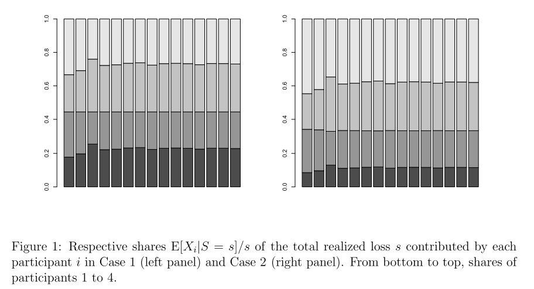

Denuit (2019)
-----------------

:cite:`Denuit2019` or
:cite:p:`Denuit2019` or
:cite:t:`Denuit2019`

Denuit, Michel: Size-biased transform and conditional mean risk sharing, with application to p2p insurance and tontines

Poisson/Discrete Example (6.1)
~~~~~~~~~~~~~~~~~~~~~~~~~~~~~~~

.. ipython:: python
    :okwarning:

    from aggregate import build, qd

    p = build('''
    port Denuit6.1
        agg P1 0.08 claims dsev [1 2 3 4] [.1  .2  .4 .3] poisson
        agg P2 0.08 claims dsev [1 2 3 4] [.15 .25 .3 .3] poisson
        agg P3 0.10 claims dsev [1 2 3 4] [.1  .2  .4 .3] poisson
        agg P4 0.10 claims dsev [1 2 3 4] [.15 .25 .3 .3] poisson
    ''', bs=1, log2=10)
    qd(p)

Computation of :math:`\mathsf{E}[X_i\mid X=x]` and :math:`\mathsf{E}[X_i\mid X=x]/x` as a function of :math:`x`.
The first function, called :math:`\kappa_i(x)` in PIR, is computed automatically by the :class:`portfolio` class as
``exeqa_line`` (expectation given :math:`X` equals :math:`x`). The original figure is shown below.

.. ipython:: python

    bit = p.density_df.query('p_total > 0').iloc[1:]
    rat = bit.filter(regex='exeqa_P').apply(
        lambda x: x / bit.loss.to_numpy(), axis=0)
    ax = rat.plot.bar(ylim=[-0.05,1.05], stacked=True)
    ax.set(xlim=[-0.5, 15.5], ylim=[0,1])
    @savefig denuit_19.png
    ax.legend().set(visible=False);

All the values are available as a table. These are consistent with numbers mentioned in the text.

.. ipython:: python

    from pandas import option_context
    b = bit.filter(regex='exeqa_P').apply(
        lambda x: x / bit.loss.to_numpy(), axis=0)
    b.index = b.index.astype(int)
    b.index.name = 'a'
    qd(b)

Proportion of expected loss by unit.

.. ipython:: python

    bb = p.describe.xs('Agg', axis=0, level=1)[['E[X]']]
    qd(bb / bb.iloc[-1,0])

