.. _answer:

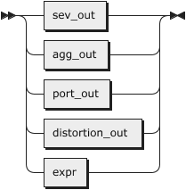

.. container:: ebnf

   ````

   .. container::

      `answer <#answer>`__   ::= `sev_out <#sev_out>`__

   .. container::

                 \| `agg_out <#agg_out>`__

   .. container::

                 \| `port_out <#port_out>`__

   .. container::

                 \| `distortion_out <#distortion_out>`__

   .. container::

                 \| `expr <#expr>`__

no references

| 

distortion_out:

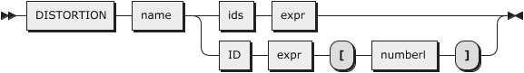

.. container:: ebnf

   ````

   .. container::

      `distortion_out <#distortion_out>`__

   .. container::

               ::= `DISTORTION <#DISTORTION>`__ `name <#name>`__ (
      `ids <#ids>`__ `expr <#expr>`__ \| `ID <#ID>`__ `expr <#expr>`__
      '[' `numberl <#numberl>`__ ']' )

referenced by:

-  `answer <#answer>`__

| 

port_out:

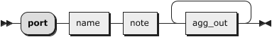

.. container:: ebnf

   ````

   .. container::

      `port_out <#port_out>`__ ::= 'port' `name <#name>`__
      `note <#note>`__ `agg_out <#agg_out>`__\ +

referenced by:

-  `answer <#answer>`__

| 

agg_out:

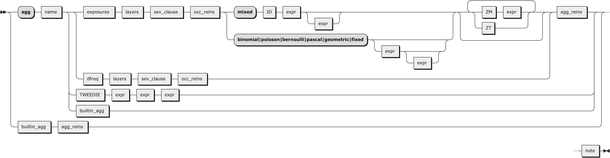

.. container:: ebnf

   ````

   .. container::

      `agg_out <#agg_out>`__  ::= ( 'agg' `name <#name>`__ ( (
      `exposures <#exposures>`__ `layers <#layers>`__
      `sev_clause <#sev_clause>`__ `occ_reins <#occ_reins>`__ ( 'mixed'
      `ID <#ID>`__ `expr <#expr>`__ `expr <#expr>`__? \|
      'binomial|poisson|bernoulli|pascal|geometric|fixed' (
      `expr <#expr>`__ `expr <#expr>`__? )? ) ( `ZM <#ZM>`__
      `expr <#expr>`__ \| `ZT <#ZT>`__ )\* \| `dfreq <#dfreq>`__
      `layers <#layers>`__ `sev_clause <#sev_clause>`__
      `occ_reins <#occ_reins>`__ ) `agg_reins <#agg_reins>`__ \|
      `TWEEDIE <#TWEEDIE>`__ `expr <#expr>`__ `expr <#expr>`__
      `expr <#expr>`__ \| `builtin_agg <#builtin_agg>`__ ) \|
      `builtin_agg <#builtin_agg>`__ `agg_reins <#agg_reins>`__ )
      `note <#note>`__

referenced by:

-  `answer <#answer>`__
-  `port_out <#port_out>`__

| 

sev_out:

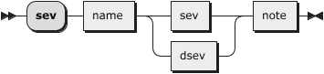

.. container:: ebnf

   ````

   .. container::

      `sev_out <#sev_out>`__  ::= 'sev' `name <#name>`__ (
      `sev <#sev>`__ \| `dsev <#dsev>`__ ) `note <#note>`__

referenced by:

-  `answer <#answer>`__

| 

agg_reins:

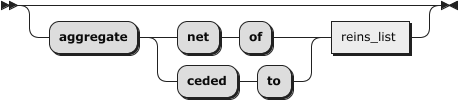

.. container:: ebnf

   ````

   .. container::

      `agg_reins <#agg_reins>`__

   .. container::

               ::= ( 'aggregate' ( 'net' 'of' \| 'ceded' 'to' )
      `reins_list <#reins_list>`__ )?

referenced by:

-  `agg_out <#agg_out>`__

| 

occ_reins:

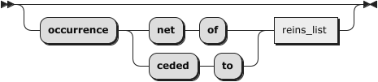

.. container:: ebnf

   ````

   .. container::

      `occ_reins <#occ_reins>`__

   .. container::

               ::= ( 'occurrence' ( 'net' 'of' \| 'ceded' 'to' )
      `reins_list <#reins_list>`__ )?

referenced by:

-  `agg_out <#agg_out>`__

| 

reins_list:

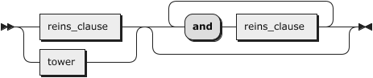

.. container:: ebnf

   ````

   .. container::

      `reins_list <#reins_list>`__

   .. container::

               ::= ( `reins_clause <#reins_clause>`__ \|
      `tower <#tower>`__ ) ( 'and' `reins_clause <#reins_clause>`__ )\*

referenced by:

-  `agg_reins <#agg_reins>`__
-  `occ_reins <#occ_reins>`__

| 

reins_clause:

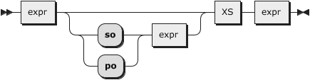

.. container:: ebnf

   ````

   .. container::

      `reins_clause <#reins_clause>`__

   .. container::

               ::= `expr <#expr>`__ ( ( 'so' \| 'po' ) `expr <#expr>`__
      )? `XS <#XS>`__ `expr <#expr>`__

referenced by:

-  `reins_list <#reins_list>`__

| 

sev_clause:

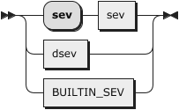

.. container:: ebnf

   ````

   .. container::

      `sev_clause <#sev_clause>`__

   .. container::

               ::= 'sev' `sev <#sev>`__

   .. container::

                 \| `dsev <#dsev>`__

   .. container::

                 \| `BUILTIN_SEV <#BUILTIN_SEV>`__

referenced by:

-  `agg_out <#agg_out>`__

| 

sev:

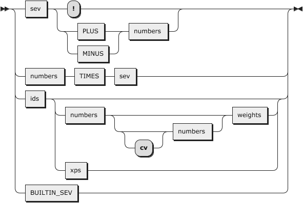

.. container:: ebnf

   ````

   .. container::

      `sev <#sev>`__      ::= `sev <#sev>`__ ( '!' \| ( `PLUS <#PLUS>`__
      \| `MINUS <#MINUS>`__ ) `numbers <#numbers>`__ )

   .. container::

                 \| `numbers <#numbers>`__ `TIMES <#TIMES>`__
      `sev <#sev>`__

   .. container::

                 \| `ids <#ids>`__ ( `numbers <#numbers>`__ ( 'cv'?
      `numbers <#numbers>`__ )? `weights <#weights>`__ \| `xps <#xps>`__
      )?

   .. container::

                 \| `BUILTIN_SEV <#BUILTIN_SEV>`__

referenced by:

-  `sev <#sev>`__
-  `sev_clause <#sev_clause>`__
-  `sev_out <#sev_out>`__

| 

xps:


.. container:: ebnf

   ````

   .. container::

      `xps <#xps>`__      ::= 'xps' `doutcomes <#doutcomes>`__
      `dprobs <#dprobs>`__

referenced by:

-  `sev <#sev>`__

| 

dsev:


.. container:: ebnf

   ````

   .. container::

      `dsev <#dsev>`__     ::= 'dsev' `doutcomes <#doutcomes>`__
      `dprobs <#dprobs>`__

referenced by:

-  `sev_clause <#sev_clause>`__
-  `sev_out <#sev_out>`__

| 

dfreq:


.. container:: ebnf

   ````

   .. container::

      `dfreq <#dfreq>`__    ::= 'dfreq' `doutcomes <#doutcomes>`__
      `dprobs <#dprobs>`__

referenced by:

-  `agg_out <#agg_out>`__

| 

doutcomes:

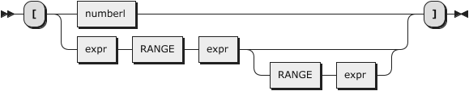

.. container:: ebnf

   ````

   .. container::

      `doutcomes <#doutcomes>`__

   .. container::

               ::= '[' ( `numberl <#numberl>`__ \| `expr <#expr>`__
      `RANGE <#RANGE>`__ `expr <#expr>`__ ( `RANGE <#RANGE>`__
      `expr <#expr>`__ )? ) ']'

referenced by:

-  `dfreq <#dfreq>`__
-  `dsev <#dsev>`__
-  `tower <#tower>`__
-  `xps <#xps>`__

| 

dprobs:

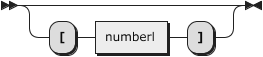

.. container:: ebnf

   ````

   .. container::

      `dprobs <#dprobs>`__   ::= ( '[' `numberl <#numberl>`__ ']' )?

referenced by:

-  `dfreq <#dfreq>`__
-  `dsev <#dsev>`__
-  `xps <#xps>`__

| 

weights:

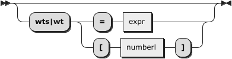

.. container:: ebnf

   ````

   .. container::

      `weights <#weights>`__  ::= ( 'wts|wt' ( '=' `expr <#expr>`__ \|
      '[' `numberl <#numberl>`__ ']' ) )?

referenced by:

-  `sev <#sev>`__

| 

layers:

.. image:: diagram/layers.png
   :width: 327px
   :height: 101px

.. container:: ebnf

   ````

   .. container::

      `layers <#layers>`__   ::= ( `numbers <#numbers>`__ `XS <#XS>`__
      `numbers <#numbers>`__ \| `tower <#tower>`__ )?

referenced by:

-  `agg_out <#agg_out>`__

| 

tower:


.. container:: ebnf

   ````

   .. container::

      `tower <#tower>`__    ::= `TOWER <#TOWER>`__
      `doutcomes <#doutcomes>`__

referenced by:

-  `layers <#layers>`__
-  `reins_list <#reins_list>`__

| 

note:

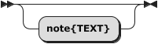

.. container:: ebnf

   ````

   .. container::

      `note <#note>`__     ::= 'note{TEXT}'?

referenced by:

-  `agg_out <#agg_out>`__
-  `port_out <#port_out>`__
-  `sev_out <#sev_out>`__

| 

exposures:

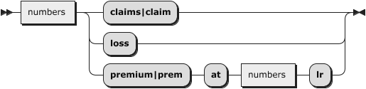

.. container:: ebnf

   ````

   .. container::

      `exposures <#exposures>`__

   .. container::

               ::= `numbers <#numbers>`__ ( 'claims|claim' \| 'loss' \|
      'premium|prem' 'at' `numbers <#numbers>`__ 'lr' )

referenced by:

-  `agg_out <#agg_out>`__

| 

ids:

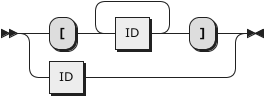

.. container:: ebnf

   ````

   .. container::

      `ids <#ids>`__      ::= '[' `ID <#ID>`__\ + ']'

   .. container::

                 \| `ID <#ID>`__

referenced by:

-  `distortion_out <#distortion_out>`__
-  `sev <#sev>`__

| 

builtin_agg:

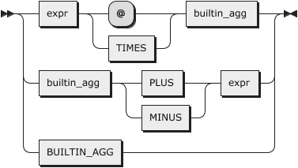

.. container:: ebnf

   ````

   .. container::

      `builtin_agg <#builtin_agg>`__

   .. container::

               ::= `expr <#expr>`__ ( '@' \| `TIMES <#TIMES>`__ )
      `builtin_agg <#builtin_agg>`__

   .. container::

                 \| `builtin_agg <#builtin_agg>`__ ( `PLUS <#PLUS>`__ \|
      `MINUS <#MINUS>`__ ) `expr <#expr>`__

   .. container::

                 \| `BUILTIN_AGG <#BUILTIN_AGG>`__

referenced by:

-  `agg_out <#agg_out>`__
-  `builtin_agg <#builtin_agg>`__

| 

name:


.. container:: ebnf

   ````

   .. container::

      `name <#name>`__     ::= `ID <#ID>`__

referenced by:

-  `agg_out <#agg_out>`__
-  `distortion_out <#distortion_out>`__
-  `port_out <#port_out>`__
-  `sev_out <#sev_out>`__

| 

numbers:

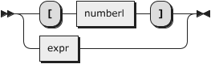

.. container:: ebnf

   ````

   .. container::

      `numbers <#numbers>`__  ::= '[' `numberl <#numberl>`__ ']'

   .. container::

                 \| `expr <#expr>`__

referenced by:

-  `exposures <#exposures>`__
-  `layers <#layers>`__
-  `sev <#sev>`__

| 

numberl:


.. container:: ebnf

   ````

   .. container::

      `numberl <#numberl>`__  ::= `expr <#expr>`__\ +

referenced by:

-  `distortion_out <#distortion_out>`__
-  `doutcomes <#doutcomes>`__
-  `dprobs <#dprobs>`__
-  `numbers <#numbers>`__
-  `weights <#weights>`__

| 

expr:


.. container:: ebnf

   ````

   .. container::

      `expr <#expr>`__     ::= `term <#term>`__

referenced by:

-  `agg_out <#agg_out>`__
-  `answer <#answer>`__
-  `builtin_agg <#builtin_agg>`__
-  `distortion_out <#distortion_out>`__
-  `doutcomes <#doutcomes>`__
-  `numberl <#numberl>`__
-  `numbers <#numbers>`__
-  `reins_clause <#reins_clause>`__
-  `weights <#weights>`__

| 

term:

.. image:: diagram/term.png
   :width: 163px
   :height: 81px

.. container:: ebnf

   ````

   .. container::

      `term <#term>`__     ::= `factor <#factor>`__ (
      `DIVIDE <#DIVIDE>`__ `factor <#factor>`__ )\*

referenced by:

-  `expr <#expr>`__
-  `factor <#factor>`__

| 

factor:

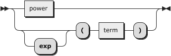

.. container:: ebnf

   ````

   .. container::

      `factor <#factor>`__   ::= `power <#power>`__

   .. container::

                 \| 'exp'? '(' `term <#term>`__ ')'

referenced by:

-  `power <#power>`__
-  `term <#term>`__

| 

power:

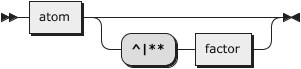

.. container:: ebnf

   ````

   .. container::

      `power <#power>`__    ::= `atom <#atom>`__ ( '^|**'
      `factor <#factor>`__ )?

referenced by:

-  `factor <#factor>`__

| 

atom:

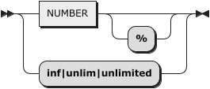

.. container:: ebnf

   ````

   .. container::

      `atom <#atom>`__     ::= `NUMBER <#NUMBER>`__ '%'?

   .. container::

                 \| 'inf|unlim|unlimited'

referenced by:

-  `power <#power>`__

| 

--------------

+---+-----------------------------------------------------+----------+
|   | ... generated by `RR - Railroad Diagram             | |image3| |
|   | Generator <https://www.bottlecaps.de/rr/ui>`__      |          |
+---+-----------------------------------------------------+----------+

.. |image1| image:: diagram/rr-1.63.png
   :width: 16px
   :height: 16px
   :target: https://www.bottlecaps.de/rr/ui
.. |image2| image:: diagram/rr-1.63.png
   :width: 16px
   :height: 16px
   :target: https://www.bottlecaps.de/rr/ui
.. |image3| image:: diagram/rr-1.63.png
   :width: 16px
   :height: 16px
   :target: https://www.bottlecaps.de/rr/ui
