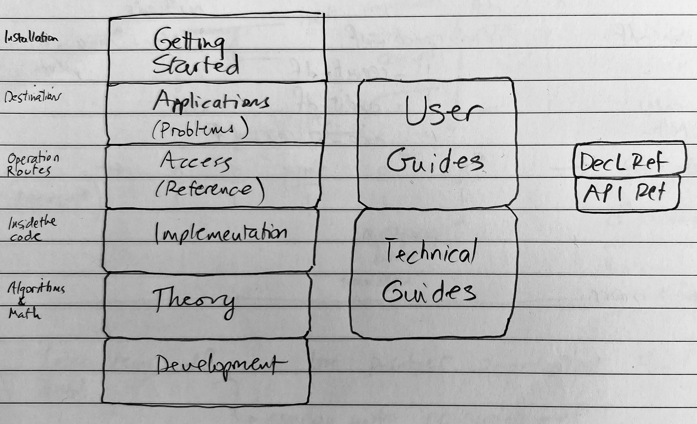

.. _development:

************************
Design and Development
************************

Help Structure
===============

    Documentation roadmap.

The documentation is structured around application, access, implementation, and theory.

* **Application**: destinations, where you can go with the code and problems you can solve.

    - :doc:`2_User_Guides`, problem sections

* **Access**: operating manual, how you access the functions you need to solve your problems

    - :doc:`2_User_Guides`, problem sections
    - :doc:`3_Reference`, traditional API reference documentation
    - :doc:`4_dec_Language_Reference`

* **Implementation**: how the functionality is coded; algorithms.

    - :doc:`5_Technical_Guides`

* **Theory**:  the underlying mathematics.

    - :doc:`5_Technical_Guides`

Design Philosophy
====================

* Work at the correct speed order...
* ...but don't worry about speed until it becomes a problem
* Save everything until space becomes an issue
* Offer sensible defaults for (almost) everything
* Separate internal naming from user naming and offer standard dataframe renamer dictionaries
* Use sensible number formats

History
=========

I have built several iterations of software to work with aggregate distributions.

* Late 1990s: a Matlab tool for CNA Re with a graphical interface. Computed aggregates by business unit and the portfolio total. Used to discover the shocking fact there was only a 53 percent chance of achieving plan...which is obvious in hindsight but was a surprise at the time.
* Late 1990s: a C++ version of the Matlab code called SADCo in 1997-99. This code sits behind `MALT <http://www.mynl.com/old/MALT/home.html>`_. It won the CAS award for an online contribution.
* Early 2000s: another C++ version with an implementation of the Iman-Conover method to combine aggregates with correlation using the (gasp) normal copula, `SCARE <http://www.mynl.com/old/wp/default.html>`_. Used by SCOR.
* 2003-2005: I worked on Aon Re Services' simulation based tools called the ALG (Aggregate Loss Generator) which simulated losses, and Prime/Re which manipulated the simulations and applied various reinsurance structures. ALG used a shared mixing variables approach to correlation.
* Late 2000s:  At Aon Re, I also built related tools

  -  The Levy measure maker
  -  A simple approach to multi-year modeling based on re-scaling a base year, convolving using FFTs and tracking (and stopping) in default scenarios

*  2010s: At Aon Benfield, I was involved with `ReMetrica <https://www.aon.com/reinsurance/remetrica/default.jsp>`_, a very sophisticated, general purpose DFA/ERM simulation tool.

