``aggregate``: Simple Examples
==============================

.. code:: ipython3

    import pandas as pd
    import matplotlib.pyplot as plt
    import numpy as np
    import seaborn as sns
    from IPython.core.display import HTML, display
    from importlib import reload
    
    # pandas options 
    pd.set_option('max_rows', 50)
    pd.set_option('max_columns', 30)
    pd.set_option('display.max_colwidth', 150)
    
    # matplotlib and plotting options 
    %matplotlib inline
    %config InlineBackend.figure_format = 'svg'
    
    # seaborn options 
    sns.set(context='paper', style='darkgrid', font='serif')
    # sns.set(context='paper', style='ticks', font='serif')
    
    # warnings
    import warnings
    # warnings.simplefilter('error')
    # warnings.simplefilter('ignore')
    import logging
    logging.getLogger("matplotlib").setLevel(logging.CRITICAL)

.. code:: ipython3

    # this file is in examples
    from importlib import reload
    import sys
    sys.path.insert(0,'..')
    import aggregate as agg
    
    import aggregate.parser as parser
    import aggregate.underwriter as trash
    
    uw = trash.Underwriter(debug=False)

.. code:: ipython3

    uw

.. raw:: html

    <h1>Underwriter Rory</h1>
    Underwriter expert in all classes including 11 severities, 37 aggregates and 11 portfolios 
    <b>Severity</b>: 
    cata, catb, catc, catd, cate, directorsA, directorsB, directorsC, liaba, liabb, liabc
     
    <b>Aggregate</b>: 
    A, Attrit, B, C, CAL, CMP, Casxol, Cata, Catb, Catc, Catd, Cate, CommAuto, CommProp, Homeowners, InlandMarine, Large, LognormalCat, Medium, MixedLine, MixedSev, MyEarthquake, MyWind, Noncata, PPAL, ParetoCat, PersAuto, Scs, Single, Small, Sublines, WorkComp, a, b, c, quake, wind
     
    <b>Portfolio</b>: 
    BODOFF1, BODOFF2, BODOFF3, BODOFF4, INTERESTING~CAT, MASSTEST, MIXED, SMALL~MEDIUM~LARGE, SUBLINES, THREE~LINE~EXAMPLE, single
     
    <h3>Settings</h3>
    update: False; 
    log2: 10; 
    store_mode: True; 
    verbose: False; 
    last_spec: None; 

.. code:: ipython3

    uw.list().T

.. raw:: html

    

    
    <table border="1" class="dataframe">
      <thead>
        <tr style="text-align: right;">
          <th></th>
          <th>0</th>
          <th>1</th>
          <th>2</th>
          <th>3</th>
          <th>4</th>
          <th>5</th>
          <th>6</th>
          <th>7</th>
          <th>8</th>
          <th>9</th>
          <th>10</th>
          <th>11</th>
          <th>12</th>
          <th>13</th>
          <th>14</th>
          <th>...</th>
          <th>22</th>
          <th>23</th>
          <th>24</th>
          <th>25</th>
          <th>26</th>
          <th>27</th>
          <th>28</th>
          <th>29</th>
          <th>30</th>
          <th>31</th>
          <th>32</th>
          <th>33</th>
          <th>34</th>
          <th>35</th>
          <th>36</th>
        </tr>
      </thead>
      <tbody>
        <tr>
          <th>Portfolio</th>
          <td>BODOFF1</td>
          <td>BODOFF2</td>
          <td>BODOFF3</td>
          <td>BODOFF4</td>
          <td>INTERESTING~CAT</td>
          <td>MASSTEST</td>
          <td>MIXED</td>
          <td>SMALL~MEDIUM~LARGE</td>
          <td>SUBLINES</td>
          <td>THREE~LINE~EXAMPLE</td>
          <td>single</td>
          <td></td>
          <td></td>
          <td></td>
          <td></td>
          <td>...</td>
          <td></td>
          <td></td>
          <td></td>
          <td></td>
          <td></td>
          <td></td>
          <td></td>
          <td></td>
          <td></td>
          <td></td>
          <td></td>
          <td></td>
          <td></td>
          <td></td>
          <td></td>
        </tr>
        <tr>
          <th>Aggregate</th>
          <td>A</td>
          <td>Attrit</td>
          <td>B</td>
          <td>C</td>
          <td>CAL</td>
          <td>CMP</td>
          <td>Casxol</td>
          <td>Cata</td>
          <td>Catb</td>
          <td>Catc</td>
          <td>Catd</td>
          <td>Cate</td>
          <td>CommAuto</td>
          <td>CommProp</td>
          <td>Homeowners</td>
          <td>...</td>
          <td>MyWind</td>
          <td>Noncata</td>
          <td>PPAL</td>
          <td>ParetoCat</td>
          <td>PersAuto</td>
          <td>Scs</td>
          <td>Single</td>
          <td>Small</td>
          <td>Sublines</td>
          <td>WorkComp</td>
          <td>a</td>
          <td>b</td>
          <td>c</td>
          <td>quake</td>
          <td>wind</td>
        </tr>
        <tr>
          <th>Severity</th>
          <td>cata</td>
          <td>catb</td>
          <td>catc</td>
          <td>catd</td>
          <td>cate</td>
          <td>directorsA</td>
          <td>directorsB</td>
          <td>directorsC</td>
          <td>liaba</td>
          <td>liabb</td>
          <td>liabc</td>
          <td></td>
          <td></td>
          <td></td>
          <td></td>
          <td>...</td>
          <td></td>
          <td></td>
          <td></td>
          <td></td>
          <td></td>
          <td></td>
          <td></td>
          <td></td>
          <td></td>
          <td></td>
          <td></td>
          <td></td>
          <td></td>
          <td></td>
          <td></td>
        </tr>
      </tbody>
    </table>
    
3 rows × 37 columns

    

.. code:: ipython3

    uw.describe().head()

.. raw:: html

    

    
    <table border="1" class="dataframe">
      <thead>
        <tr style="text-align: right;">
          <th></th>
          <th>Type</th>
          <th>Severity</th>
          <th>ESev</th>
          <th>Sev_a</th>
          <th>Sev_b</th>
          <th>EN</th>
          <th>Freq_a</th>
          <th>ELoss</th>
          <th>Notes</th>
        </tr>
        <tr>
          <th>Name</th>
          <th></th>
          <th></th>
          <th></th>
          <th></th>
          <th></th>
          <th></th>
          <th></th>
          <th></th>
          <th></th>
        </tr>
      </thead>
      <tbody>
        <tr>
          <th>BODOFF1</th>
          <td>portfolio</td>
          <td></td>
          <td>0.0</td>
          <td>0.0</td>
          <td>0</td>
          <td>0</td>
          <td>0.0</td>
          <td>0</td>
          <td></td>
        </tr>
        <tr>
          <th>BODOFF2</th>
          <td>portfolio</td>
          <td></td>
          <td>0.0</td>
          <td>0.0</td>
          <td>0</td>
          <td>0</td>
          <td>0.0</td>
          <td>0</td>
          <td></td>
        </tr>
        <tr>
          <th>BODOFF3</th>
          <td>portfolio</td>
          <td></td>
          <td>0.0</td>
          <td>0.0</td>
          <td>0</td>
          <td>0</td>
          <td>0.0</td>
          <td>0</td>
          <td></td>
        </tr>
        <tr>
          <th>BODOFF4</th>
          <td>portfolio</td>
          <td></td>
          <td>0.0</td>
          <td>0.0</td>
          <td>0</td>
          <td>0</td>
          <td>0.0</td>
          <td>0</td>
          <td></td>
        </tr>
        <tr>
          <th>THREE~LINE~EXAMPLE</th>
          <td>portfolio</td>
          <td></td>
          <td>0.0</td>
          <td>0.0</td>
          <td>0</td>
          <td>0</td>
          <td>0.0</td>
          <td>0</td>
          <td></td>
        </tr>
      </tbody>
    </table>
    

.. code:: ipython3

    uw.update = False

Create a simple aggregate distribution, plot and statistics
-----------------------------------------------------------

.. code:: ipython3

    xx = uw('agg newAgg 10 claims sev lognorm 12 cv 1.75 poisson note{here is note}')

.. code:: ipython3

    xx

.. raw:: html

    <h3>Aggregate object: newAgg</h3>
    Claim count 10.00, poisson distribution 
    Severity: lognorm distribution, unlimited 

    
    <table border="1" class="dataframe">
      <thead>
        <tr style="text-align: right;">
          <th></th>
          <th>E(X)</th>
          <th>CV(X)</th>
          <th>Skew(X)</th>
        </tr>
        <tr>
          <th>X</th>
          <th></th>
          <th></th>
          <th></th>
        </tr>
      </thead>
      <tbody>
        <tr>
          <th>Sev</th>
          <td>12.0</td>
          <td>1.750000</td>
          <td>10.609375</td>
        </tr>
        <tr>
          <th>Freq</th>
          <td>10.0</td>
          <td>0.316228</td>
          <td>0.316228</td>
        </tr>
        <tr>
          <th>Agg</th>
          <td>120.0</td>
          <td>0.637377</td>
          <td>2.589346</td>
        </tr>
      </tbody>
    </table>
    

.. code:: ipython3

    uw['newAgg']

.. parsed-literal::

    ('agg',
     {'exp_en': 10.0,
      'freq_name': 'poisson',
      'name': 'newAgg',
      'note': 'here is note',
      'sev_cv': 1.75,
      'sev_mean': 12.0,
      'sev_name': 'lognorm',
      'sev_wt': 1})

.. code:: ipython3

    xx.recommend_bucket(16)

.. parsed-literal::

    0.0099772153657470899

.. code:: ipython3

    # trial and error shows 0.1 has lower CV error 
    xx.update(np.arange(1<<16, dtype=float) * 0.1)
    xx

.. raw:: html

    <h3>Aggregate object: newAgg</h3>
    Claim count 10.00, poisson distribution 
    Severity: lognorm distribution, unlimited 
    Updated with bucket size 0.10 and log2 = 16

    
    <table border="1" class="dataframe">
      <thead>
        <tr style="text-align: right;">
          <th></th>
          <th>E(X)</th>
          <th>Est E(X)</th>
          <th>Err E(X)</th>
          <th>CV(X)</th>
          <th>Est CV(X)</th>
          <th>Err CV(X)</th>
          <th>Skew(X)</th>
        </tr>
        <tr>
          <th>X</th>
          <th></th>
          <th></th>
          <th></th>
          <th></th>
          <th></th>
          <th></th>
          <th></th>
        </tr>
      </thead>
      <tbody>
        <tr>
          <th>Sev</th>
          <td>12.0</td>
          <td>12</td>
          <td>-1.09042e-06</td>
          <td>1.750000</td>
          <td>1.74978</td>
          <td>-0.000126588</td>
          <td>10.609375</td>
        </tr>
        <tr>
          <th>Freq</th>
          <td>10.0</td>
          <td></td>
          <td></td>
          <td>0.316228</td>
          <td></td>
          <td></td>
          <td>0.316228</td>
        </tr>
        <tr>
          <th>Agg</th>
          <td>120.0</td>
          <td>120</td>
          <td>-1.18374e-06</td>
          <td>0.637377</td>
          <td>0.637313</td>
          <td>-0.000101459</td>
          <td>2.589346</td>
        </tr>
      </tbody>
    </table>
    

.. code:: ipython3

    xx.audit_df

.. raw:: html

    

    
    <table border="1" class="dataframe">
      <thead>
        <tr style="text-align: right;">
          <th></th>
          <th>name</th>
          <th>limit</th>
          <th>attachment</th>
          <th>el</th>
          <th>freq_1</th>
          <th>sev_1</th>
          <th>agg_m</th>
          <th>agg_cv</th>
          <th>agg_skew</th>
          <th>emp_sev_1</th>
          <th>emp_sev_cv</th>
          <th>emp_agg_1</th>
          <th>emp_agg_cv</th>
        </tr>
      </thead>
      <tbody>
        <tr>
          <th>0</th>
          <td>newAgg</td>
          <td>inf</td>
          <td>0</td>
          <td>120</td>
          <td>10</td>
          <td>12</td>
          <td>120</td>
          <td>0.637377</td>
          <td>2.58935</td>
          <td>NaN</td>
          <td>NaN</td>
          <td>NaN</td>
          <td>NaN</td>
        </tr>
        <tr>
          <th>mixed</th>
          <td>newAgg</td>
          <td>inf</td>
          <td>0</td>
          <td>120</td>
          <td>10</td>
          <td>12</td>
          <td>120</td>
          <td>0.637377</td>
          <td>2.58935</td>
          <td>11.999987</td>
          <td>1.749778</td>
          <td>119.999858</td>
          <td>0.637313</td>
        </tr>
      </tbody>
    </table>
    

.. code:: ipython3

    xx.plot()

.. image:: output_14_0.svg

.. code:: ipython3

    xx.plot('long')

.. image:: output_15_0.svg

.. code:: ipython3

    xx.report('audit')

.. raw:: html

    <h1> Newagg Audit Report

.. raw:: html

    

    
    <table border="1" class="dataframe">
      <thead>
        <tr style="text-align: right;">
          <th></th>
          <th>name</th>
          <th>limit</th>
          <th>attachment</th>
          <th>el</th>
          <th>freq_1</th>
          <th>sev_1</th>
          <th>agg_m</th>
          <th>agg_cv</th>
          <th>agg_skew</th>
          <th>emp_sev_1</th>
          <th>emp_sev_cv</th>
          <th>emp_agg_1</th>
          <th>emp_agg_cv</th>
        </tr>
      </thead>
      <tbody>
        <tr>
          <th>0</th>
          <td>newAgg</td>
          <td>inf</td>
          <td>0</td>
          <td>120</td>
          <td>10</td>
          <td>12</td>
          <td>120</td>
          <td>0.637377</td>
          <td>2.58935</td>
          <td>NaN</td>
          <td>NaN</td>
          <td>NaN</td>
          <td>NaN</td>
        </tr>
        <tr>
          <th>mixed</th>
          <td>newAgg</td>
          <td>inf</td>
          <td>0</td>
          <td>120</td>
          <td>10</td>
          <td>12</td>
          <td>120</td>
          <td>0.637377</td>
          <td>2.58935</td>
          <td>11.999987</td>
          <td>1.749778</td>
          <td>119.999858</td>
          <td>0.637313</td>
        </tr>
      </tbody>
    </table>
    

.. code:: ipython3

    display(xx.audit_df)
    display(xx.statistics_df)
    display(xx.statistics_total_df)

.. raw:: html

    

    
    <table border="1" class="dataframe">
      <thead>
        <tr style="text-align: right;">
          <th></th>
          <th>name</th>
          <th>limit</th>
          <th>attachment</th>
          <th>el</th>
          <th>freq_1</th>
          <th>sev_1</th>
          <th>agg_m</th>
          <th>agg_cv</th>
          <th>agg_skew</th>
          <th>emp_sev_1</th>
          <th>emp_sev_cv</th>
          <th>emp_agg_1</th>
          <th>emp_agg_cv</th>
        </tr>
      </thead>
      <tbody>
        <tr>
          <th>0</th>
          <td>newAgg</td>
          <td>inf</td>
          <td>0</td>
          <td>120</td>
          <td>10</td>
          <td>12</td>
          <td>120</td>
          <td>0.637377</td>
          <td>2.58935</td>
          <td>NaN</td>
          <td>NaN</td>
          <td>NaN</td>
          <td>NaN</td>
        </tr>
        <tr>
          <th>mixed</th>
          <td>newAgg</td>
          <td>inf</td>
          <td>0</td>
          <td>120</td>
          <td>10</td>
          <td>12</td>
          <td>120</td>
          <td>0.637377</td>
          <td>2.58935</td>
          <td>11.999987</td>
          <td>1.749778</td>
          <td>119.999858</td>
          <td>0.637313</td>
        </tr>
      </tbody>
    </table>
    

.. raw:: html

    

    
    <table border="1" class="dataframe">
      <thead>
        <tr style="text-align: right;">
          <th></th>
          <th>name</th>
          <th>limit</th>
          <th>attachment</th>
          <th>sevcv_param</th>
          <th>el</th>
          <th>prem</th>
          <th>lr</th>
          <th>freq_1</th>
          <th>freq_2</th>
          <th>freq_3</th>
          <th>freq_m</th>
          <th>freq_cv</th>
          <th>freq_skew</th>
          <th>sev_1</th>
          <th>sev_2</th>
          <th>sev_3</th>
          <th>sev_m</th>
          <th>sev_cv</th>
          <th>sev_skew</th>
          <th>agg_1</th>
          <th>agg_2</th>
          <th>agg_3</th>
          <th>agg_m</th>
          <th>agg_cv</th>
          <th>agg_skew</th>
          <th>mix_cv</th>
          <th>wt</th>
        </tr>
      </thead>
      <tbody>
        <tr>
          <th>0</th>
          <td>newAgg</td>
          <td>inf</td>
          <td>0</td>
          <td>1.75</td>
          <td>120</td>
          <td>0</td>
          <td>0</td>
          <td>10</td>
          <td>110</td>
          <td>1310</td>
          <td>10</td>
          <td>0.316228</td>
          <td>0.316228</td>
          <td>12</td>
          <td>585</td>
          <td>115857</td>
          <td>12</td>
          <td>1.75</td>
          <td>10.6094</td>
          <td>120</td>
          <td>20250</td>
          <td>4.99257e+06</td>
          <td>120</td>
          <td>0.637377</td>
          <td>2.58935</td>
          <td>0</td>
          <td>1</td>
        </tr>
      </tbody>
    </table>
    

.. raw:: html

    

    
    <table border="1" class="dataframe">
      <thead>
        <tr style="text-align: right;">
          <th></th>
          <th>name</th>
          <th>limit</th>
          <th>attachment</th>
          <th>sevcv_param</th>
          <th>el</th>
          <th>prem</th>
          <th>lr</th>
          <th>freq_1</th>
          <th>freq_2</th>
          <th>freq_3</th>
          <th>freq_m</th>
          <th>freq_cv</th>
          <th>freq_skew</th>
          <th>sev_1</th>
          <th>sev_2</th>
          <th>sev_3</th>
          <th>sev_m</th>
          <th>sev_cv</th>
          <th>sev_skew</th>
          <th>agg_1</th>
          <th>agg_2</th>
          <th>agg_3</th>
          <th>agg_m</th>
          <th>agg_cv</th>
          <th>agg_skew</th>
          <th>mix_cv</th>
          <th>wt</th>
        </tr>
      </thead>
      <tbody>
        <tr>
          <th>mixed</th>
          <td>newAgg</td>
          <td>inf</td>
          <td>0</td>
          <td>0</td>
          <td>120</td>
          <td>0</td>
          <td>NaN</td>
          <td>10</td>
          <td>110</td>
          <td>1310</td>
          <td>10</td>
          <td>0.316228</td>
          <td>0.316228</td>
          <td>12</td>
          <td>585</td>
          <td>115857</td>
          <td>12</td>
          <td>1.75</td>
          <td>10.6094</td>
          <td>120</td>
          <td>20250</td>
          <td>4.99257e+06</td>
          <td>120</td>
          <td>0.637377</td>
          <td>2.58935</td>
          <td>0</td>
          <td>1.0</td>
        </tr>
        <tr>
          <th>independent</th>
          <td>newAgg</td>
          <td>inf</td>
          <td>0</td>
          <td>0</td>
          <td>120</td>
          <td>0</td>
          <td>NaN</td>
          <td>10</td>
          <td>110</td>
          <td>1310</td>
          <td>10</td>
          <td>0.316228</td>
          <td>0.316228</td>
          <td>12</td>
          <td>585</td>
          <td>115857</td>
          <td>12</td>
          <td>1.75</td>
          <td>10.6094</td>
          <td>120</td>
          <td>20250</td>
          <td>4.99257e+06</td>
          <td>120</td>
          <td>0.637377</td>
          <td>2.58935</td>
          <td>0</td>
          <td>1.0</td>
        </tr>
      </tbody>
    </table>
    

Portfolio Examples
------------------

.. code:: ipython3

    testa = f"""
    port Complex~Portfolio~Mixed
        agg LineA  50  claims           sev lognorm 12 cv [2, 3, 4] wt [.3 .5 .2] mixed gamma 0.4
        agg LineB  24  claims 10 x 5    sev lognorm 12 cv [{', '.join([str(i) for i in np.linspace(2,5, 20)])}] wt=20 mixed gamma 0.35
        agg LineC 124  claims 120 x 5   sev lognorm 16 cv 3.4                     mixed gamma 0.45
    """
    
    testb = """
    port Complex~Portfolio
        agg Line3  50  claims [5 10 15] x 0         sev lognorm 12 cv [1, 2, 3]        mixed gamma 0.25
        agg Line9  24  claims [5 10 15] x 5         sev lognorm 12 cv [1, 2, 3] wt=3   mixed gamma 0.25
    """
    
    testc = """
    port Portfolio~2 
        agg CA 500 prem at .5 lr 15 x 12  sev gamma 12 cv [2 3 4] wt [.3 .5 .2] mixed gamma 0.4
        agg FL 1.7 claims 100 x 5         sev 10000 * pareto 1.3 - 10000        poisson
        agg IL 1e-8 * agg.CMP
        agg OH agg.CMP * 1e-8
        agg NY 500 prem at .5 lr 15 x 12  sev [20 30 40 10] * gamma [9 10 11 12] cv [1 2 3 4] wt =4 mixed gamma 0.4
    
    sev proda 30000 * lognorm 2
    """
    
    testd = """
    sev prodc:   50000 * lognorm(3) 
    sev weird    50000 * beta(1, 4) + 10000
    sev premsop1 25000 * lognorm 2.3; sev premsop2 35000 * lognorm 2.4;
    sev premsop3 45000 * \
    lognorm 2.8
    """
    
    teste = """
    agg Agg1     20 claims 10 x 2 sev lognorm 12 cv 0.2 mixed gamma 0.8
    agg Agg2     20 claims 10 x 2 sev 15 * lognorm 2.5  poisson;
    sev premsop1 25000 * lognorm 2.3; 
    agg Agg3     20 claims 10 x 2 on 25 * lognorm 2 fixed;
    """
    
    testall = testa + testb + testc + testd + teste
    # write test is a debug mode 
    a, b, c = uw.write_test(testall)
    # del b['note']
    agg.html_title('Severities')
    display(a)
    agg.html_title('Aggregates')
    display(b)
    agg.html_title('Portfolios')
    display(c)

.. raw:: html

    <h1> Severities

.. raw:: html

    

    
    <table border="1" class="dataframe">
      <thead>
        <tr style="text-align: right;">
          <th></th>
          <th>note</th>
          <th>sev_a</th>
          <th>sev_b</th>
          <th>sev_cv</th>
          <th>sev_loc</th>
          <th>sev_mean</th>
          <th>sev_name</th>
          <th>sev_scale</th>
          <th>sev_wt</th>
        </tr>
      </thead>
      <tbody>
        <tr>
          <th>proda</th>
          <td></td>
          <td>2.0</td>
          <td>0.0</td>
          <td>0</td>
          <td>0.0</td>
          <td>0</td>
          <td>lognorm</td>
          <td>30000.0</td>
          <td>1</td>
        </tr>
        <tr>
          <th>prodc</th>
          <td></td>
          <td>3.0</td>
          <td>0.0</td>
          <td>0</td>
          <td>0.0</td>
          <td>0</td>
          <td>lognorm</td>
          <td>50000.0</td>
          <td>1</td>
        </tr>
        <tr>
          <th>weird</th>
          <td></td>
          <td>1.0</td>
          <td>4.0</td>
          <td>0</td>
          <td>10000.0</td>
          <td>0</td>
          <td>beta</td>
          <td>50000.0</td>
          <td>1</td>
        </tr>
        <tr>
          <th>premsop1</th>
          <td></td>
          <td>2.3</td>
          <td>0.0</td>
          <td>0</td>
          <td>0.0</td>
          <td>0</td>
          <td>lognorm</td>
          <td>25000.0</td>
          <td>1</td>
        </tr>
        <tr>
          <th>premsop2</th>
          <td></td>
          <td>2.4</td>
          <td>0.0</td>
          <td>0</td>
          <td>0.0</td>
          <td>0</td>
          <td>lognorm</td>
          <td>35000.0</td>
          <td>1</td>
        </tr>
        <tr>
          <th>premsop3</th>
          <td></td>
          <td>2.8</td>
          <td>0.0</td>
          <td>0</td>
          <td>0.0</td>
          <td>0</td>
          <td>lognorm</td>
          <td>45000.0</td>
          <td>1</td>
        </tr>
      </tbody>
    </table>
    

.. raw:: html

    <h1> Aggregates

.. raw:: html

    

    
    <table border="1" class="dataframe">
      <thead>
        <tr style="text-align: right;">
          <th></th>
          <th>exp_attachment</th>
          <th>exp_el</th>
          <th>exp_en</th>
          <th>exp_limit</th>
          <th>exp_lr</th>
          <th>exp_premium</th>
          <th>freq_a</th>
          <th>freq_b</th>
          <th>freq_name</th>
          <th>name</th>
          <th>note</th>
          <th>sev_a</th>
          <th>sev_b</th>
          <th>sev_cv</th>
          <th>sev_loc</th>
          <th>sev_mean</th>
          <th>sev_name</th>
          <th>sev_scale</th>
          <th>sev_wt</th>
        </tr>
      </thead>
      <tbody>
        <tr>
          <th>LineA</th>
          <td>0.0</td>
          <td>0.0</td>
          <td>50.000000</td>
          <td>inf</td>
          <td>0.0</td>
          <td>0.0</td>
          <td>0.40</td>
          <td>0</td>
          <td>gamma</td>
          <td>LineA</td>
          <td></td>
          <td>0.0</td>
          <td>0</td>
          <td>[2.0, 3.0, 4.0]</td>
          <td>0.0</td>
          <td>12</td>
          <td>lognorm</td>
          <td>0.0</td>
          <td>[0.3, 0.5, 0.2]</td>
        </tr>
        <tr>
          <th>LineB</th>
          <td>5.0</td>
          <td>0.0</td>
          <td>24.000000</td>
          <td>10</td>
          <td>0.0</td>
          <td>0.0</td>
          <td>0.35</td>
          <td>0</td>
          <td>gamma</td>
          <td>LineB</td>
          <td></td>
          <td>0.0</td>
          <td>0</td>
          <td>[2.0, 2.15789473684, 2.31578947368, 2.47368421053, 2.63157894737, 2.78947368421, 2.94736842105, 3.10526315789, 3.26315789474, 3.42105263158, 3.578...</td>
          <td>0.0</td>
          <td>12</td>
          <td>lognorm</td>
          <td>0.0</td>
          <td>[0.05, 0.05, 0.05, 0.05, 0.05, 0.05, 0.05, 0.05, 0.05, 0.05, 0.05, 0.05, 0.05, 0.05, 0.05, 0.05, 0.05, 0.05, 0.05, 0.05]</td>
        </tr>
        <tr>
          <th>LineC</th>
          <td>5.0</td>
          <td>0.0</td>
          <td>124.000000</td>
          <td>120</td>
          <td>0.0</td>
          <td>0.0</td>
          <td>0.45</td>
          <td>0</td>
          <td>gamma</td>
          <td>LineC</td>
          <td></td>
          <td>0.0</td>
          <td>0</td>
          <td>3.4</td>
          <td>0.0</td>
          <td>16</td>
          <td>lognorm</td>
          <td>0.0</td>
          <td>1</td>
        </tr>
        <tr>
          <th>Line3</th>
          <td>0.0</td>
          <td>0.0</td>
          <td>50.000000</td>
          <td>[5.0, 10.0, 15.0]</td>
          <td>0.0</td>
          <td>0.0</td>
          <td>0.25</td>
          <td>0</td>
          <td>gamma</td>
          <td>Line3</td>
          <td></td>
          <td>0.0</td>
          <td>0</td>
          <td>[1.0, 2.0, 3.0]</td>
          <td>0.0</td>
          <td>12</td>
          <td>lognorm</td>
          <td>0.0</td>
          <td>1</td>
        </tr>
        <tr>
          <th>Line9</th>
          <td>5.0</td>
          <td>0.0</td>
          <td>24.000000</td>
          <td>[5.0, 10.0, 15.0]</td>
          <td>0.0</td>
          <td>0.0</td>
          <td>0.25</td>
          <td>0</td>
          <td>gamma</td>
          <td>Line9</td>
          <td></td>
          <td>0.0</td>
          <td>0</td>
          <td>[1.0, 2.0, 3.0]</td>
          <td>0.0</td>
          <td>12</td>
          <td>lognorm</td>
          <td>0.0</td>
          <td>[0.333333333333, 0.333333333333, 0.333333333333]</td>
        </tr>
        <tr>
          <th>CA</th>
          <td>12.0</td>
          <td>250.0</td>
          <td>0.000000</td>
          <td>15</td>
          <td>0.5</td>
          <td>500.0</td>
          <td>0.40</td>
          <td>0</td>
          <td>gamma</td>
          <td>CA</td>
          <td></td>
          <td>0.0</td>
          <td>0</td>
          <td>[2.0, 3.0, 4.0]</td>
          <td>0.0</td>
          <td>12</td>
          <td>gamma</td>
          <td>0.0</td>
          <td>[0.3, 0.5, 0.2]</td>
        </tr>
        <tr>
          <th>FL</th>
          <td>5.0</td>
          <td>0.0</td>
          <td>1.700000</td>
          <td>100</td>
          <td>0.0</td>
          <td>0.0</td>
          <td>0.00</td>
          <td>0</td>
          <td>poisson</td>
          <td>FL</td>
          <td></td>
          <td>1.3</td>
          <td>0</td>
          <td>0</td>
          <td>-10000.0</td>
          <td>0</td>
          <td>pareto</td>
          <td>10000.0</td>
          <td>1</td>
        </tr>
        <tr>
          <th>IL</th>
          <td>0.0</td>
          <td>0.0</td>
          <td>268153.900000</td>
          <td>inf</td>
          <td>0.0</td>
          <td>0.0</td>
          <td>0.28</td>
          <td>0</td>
          <td>gamma</td>
          <td>IL</td>
          <td></td>
          <td>0.0</td>
          <td>0</td>
          <td>0.5</td>
          <td>0.0</td>
          <td>0.001</td>
          <td>lognorm</td>
          <td>0.0</td>
          <td>1</td>
        </tr>
        <tr>
          <th>OH</th>
          <td>0.0</td>
          <td>0.0</td>
          <td>0.002682</td>
          <td>inf</td>
          <td>0.0</td>
          <td>0.0</td>
          <td>0.28</td>
          <td>0</td>
          <td>gamma</td>
          <td>OH</td>
          <td></td>
          <td>0.0</td>
          <td>0</td>
          <td>0.5</td>
          <td>0.0</td>
          <td>100000</td>
          <td>lognorm</td>
          <td>0.0</td>
          <td>1</td>
        </tr>
        <tr>
          <th>NY</th>
          <td>12.0</td>
          <td>250.0</td>
          <td>0.000000</td>
          <td>15</td>
          <td>0.5</td>
          <td>500.0</td>
          <td>0.40</td>
          <td>0</td>
          <td>gamma</td>
          <td>NY</td>
          <td></td>
          <td>0.0</td>
          <td>0</td>
          <td>[1.0, 2.0, 3.0, 4.0]</td>
          <td>0.0</td>
          <td>[180.0, 300.0, 440.0, 120.0]</td>
          <td>gamma</td>
          <td>0.0</td>
          <td>[0.25, 0.25, 0.25, 0.25]</td>
        </tr>
        <tr>
          <th>Agg1</th>
          <td>2.0</td>
          <td>0.0</td>
          <td>20.000000</td>
          <td>10</td>
          <td>0.0</td>
          <td>0.0</td>
          <td>0.80</td>
          <td>0</td>
          <td>gamma</td>
          <td>Agg1</td>
          <td></td>
          <td>0.0</td>
          <td>0</td>
          <td>0.2</td>
          <td>0.0</td>
          <td>12</td>
          <td>lognorm</td>
          <td>0.0</td>
          <td>1</td>
        </tr>
        <tr>
          <th>Agg2</th>
          <td>2.0</td>
          <td>0.0</td>
          <td>20.000000</td>
          <td>10</td>
          <td>0.0</td>
          <td>0.0</td>
          <td>0.00</td>
          <td>0</td>
          <td>poisson</td>
          <td>Agg2</td>
          <td></td>
          <td>2.5</td>
          <td>0</td>
          <td>0</td>
          <td>0.0</td>
          <td>0</td>
          <td>lognorm</td>
          <td>15.0</td>
          <td>1</td>
        </tr>
        <tr>
          <th>Agg3</th>
          <td>2.0</td>
          <td>0.0</td>
          <td>20.000000</td>
          <td>10</td>
          <td>0.0</td>
          <td>0.0</td>
          <td>0.00</td>
          <td>0</td>
          <td>fixed</td>
          <td>Agg3</td>
          <td></td>
          <td>2.0</td>
          <td>0</td>
          <td>0</td>
          <td>0.0</td>
          <td>0</td>
          <td>lognorm</td>
          <td>25.0</td>
          <td>1</td>
        </tr>
      </tbody>
    </table>
    

.. raw:: html

    <h1> Portfolios

.. raw:: html

    

    
    <table border="1" class="dataframe">
      <thead>
        <tr style="text-align: right;">
          <th></th>
          <th>note</th>
          <th>spec</th>
        </tr>
      </thead>
      <tbody>
        <tr>
          <th>Complex~Portfolio~Mixed</th>
          <td></td>
          <td>[LineA, LineB, LineC]</td>
        </tr>
        <tr>
          <th>Complex~Portfolio</th>
          <td></td>
          <td>[Line3, Line9]</td>
        </tr>
        <tr>
          <th>Portfolio~2</th>
          <td></td>
          <td>[CA, FL, IL, OH, NY]</td>
        </tr>
      </tbody>
    </table>
    

.. code:: ipython3

    uw['LineA']

.. parsed-literal::

    ('agg',
     {'exp_attachment': 0,
      'exp_el': 0,
      'exp_en': 50.0,
      'exp_limit': inf,
      'exp_lr': 0,
      'exp_premium': 0,
      'freq_a': 0.4,
      'freq_b': 0,
      'freq_name': 'gamma',
      'name': 'LineA',
      'note': '',
      'sev_a': 0,
      'sev_b': 0,
      'sev_cv': [2.0, 3.0, 4.0],
      'sev_loc': 0,
      'sev_mean': 12.0,
      'sev_name': 'lognorm',
      'sev_scale': 0,
      'sev_wt': [0.3, 0.5, 0.2]})

.. code:: ipython3

    uw.update = True
    uw.log2 = 12

.. code:: ipython3

    # actually create a LineA object
    print(uw['LineA'])
    ob = uw('LineA')
    ob

.. parsed-literal::

    ('agg', {'name': 'LineA', 'exp_en': 50.0, 'sev_name': 'lognorm', 'sev_mean': 12.0, 'sev_cv': [2.0, 3.0, 4.0], 'sev_wt': [0.3, 0.5, 0.2], 'freq_name': 'gamma', 'freq_a': 0.4, 'note': '', 'exp_el': 0, 'exp_premium': 0, 'exp_lr': 0, 'exp_attachment': 0, 'exp_limit': inf, 'sev_a': 0, 'sev_b': 0, 'sev_scale': 0, 'sev_loc': 0, 'freq_b': 0})
    

.. raw:: html

    <h3>Aggregate object: LineA</h3>
    Claim count 50.00, gamma distribution 
    Severity with 3 components 
    Updated with bucket size 0.84 and log2 = 12

    
    <table border="1" class="dataframe">
      <thead>
        <tr style="text-align: right;">
          <th></th>
          <th>E(X)</th>
          <th>Est E(X)</th>
          <th>Err E(X)</th>
          <th>CV(X)</th>
          <th>Est CV(X)</th>
          <th>Err CV(X)</th>
          <th>Skew(X)</th>
        </tr>
        <tr>
          <th>X</th>
          <th></th>
          <th></th>
          <th></th>
          <th></th>
          <th></th>
          <th></th>
          <th></th>
        </tr>
      </thead>
      <tbody>
        <tr>
          <th>Sev</th>
          <td>12.0</td>
          <td>11.9721</td>
          <td>-0.00232559</td>
          <td>2.983287</td>
          <td>2.8074</td>
          <td>-0.0589572</td>
          <td>56.208272</td>
        </tr>
        <tr>
          <th>Freq</th>
          <td>50.0</td>
          <td></td>
          <td></td>
          <td>0.424264</td>
          <td></td>
          <td></td>
          <td>0.801388</td>
        </tr>
        <tr>
          <th>Agg</th>
          <td>600.0</td>
          <td>597.617</td>
          <td>-0.00397154</td>
          <td>0.598331</td>
          <td>0.575662</td>
          <td>-0.0378879</td>
          <td>3.521341</td>
        </tr>
      </tbody>
    </table>
    

.. code:: ipython3

    ob.plot()

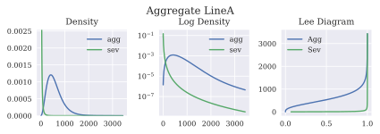

.. code:: ipython3

    ob.audit_df

.. raw:: html

    

    
    <table border="1" class="dataframe">
      <thead>
        <tr style="text-align: right;">
          <th></th>
          <th>name</th>
          <th>limit</th>
          <th>attachment</th>
          <th>el</th>
          <th>freq_1</th>
          <th>sev_1</th>
          <th>agg_m</th>
          <th>agg_cv</th>
          <th>agg_skew</th>
          <th>emp_sev_1</th>
          <th>emp_sev_cv</th>
          <th>emp_agg_1</th>
          <th>emp_agg_cv</th>
        </tr>
      </thead>
      <tbody>
        <tr>
          <th>0</th>
          <td>LineA</td>
          <td>inf</td>
          <td>0</td>
          <td>180</td>
          <td>15</td>
          <td>12</td>
          <td>180</td>
          <td>0.702377</td>
          <td>2.21282</td>
          <td>NaN</td>
          <td>NaN</td>
          <td>NaN</td>
          <td>NaN</td>
        </tr>
        <tr>
          <th>1</th>
          <td>LineA</td>
          <td>inf</td>
          <td>0</td>
          <td>300</td>
          <td>25</td>
          <td>12</td>
          <td>300</td>
          <td>0.748331</td>
          <td>4.39836</td>
          <td>NaN</td>
          <td>NaN</td>
          <td>NaN</td>
          <td>NaN</td>
        </tr>
        <tr>
          <th>2</th>
          <td>LineA</td>
          <td>inf</td>
          <td>0</td>
          <td>120</td>
          <td>10</td>
          <td>12</td>
          <td>120</td>
          <td>1.36382</td>
          <td>19.7095</td>
          <td>NaN</td>
          <td>NaN</td>
          <td>NaN</td>
          <td>NaN</td>
        </tr>
        <tr>
          <th>mixed</th>
          <td>LineA</td>
          <td>inf</td>
          <td>0</td>
          <td>600</td>
          <td>50</td>
          <td>12</td>
          <td>600</td>
          <td>0.598331</td>
          <td>3.52134</td>
          <td>11.972093</td>
          <td>2.807401</td>
          <td>597.617077</td>
          <td>0.575662</td>
        </tr>
      </tbody>
    </table>
    

.. code:: ipython3

    uw['PPAL']

.. parsed-literal::

    ('agg',
     {'exp_en': 5676073.3,
      'freq_a': 0.08,
      'freq_name': 'gamma',
      'name': 'PPAL',
      'note': 'US statutory industry private passenger auto liability, SNL 2017',
      'sev_cv': 10.0,
      'sev_mean': 5000.0,
      'sev_name': 'lognorm',
      'sev_wt': 1})

.. code:: ipython3

    ob = uw('PPAL')
    display(ob.statistics_df)
    ob.sevs[0].plot()

.. parsed-literal::

    ..\aggregate\utils.py:682: RuntimeWarning: invalid value encountered in sqrt
      sd = np.sqrt(var)
    

.. raw:: html

    

    
    <table border="1" class="dataframe">
      <thead>
        <tr style="text-align: right;">
          <th></th>
          <th>name</th>
          <th>limit</th>
          <th>attachment</th>
          <th>sevcv_param</th>
          <th>el</th>
          <th>prem</th>
          <th>lr</th>
          <th>freq_1</th>
          <th>freq_2</th>
          <th>freq_3</th>
          <th>freq_m</th>
          <th>freq_cv</th>
          <th>freq_skew</th>
          <th>sev_1</th>
          <th>sev_2</th>
          <th>sev_3</th>
          <th>sev_m</th>
          <th>sev_cv</th>
          <th>sev_skew</th>
          <th>agg_1</th>
          <th>agg_2</th>
          <th>agg_3</th>
          <th>agg_m</th>
          <th>agg_cv</th>
          <th>agg_skew</th>
          <th>mix_cv</th>
          <th>wt</th>
        </tr>
      </thead>
      <tbody>
        <tr>
          <th>0</th>
          <td>PPAL</td>
          <td>inf</td>
          <td>0</td>
          <td>10</td>
          <td>2.83804e+10</td>
          <td>0</td>
          <td>0</td>
          <td>5.67607e+06</td>
          <td>3.2424e+13</td>
          <td>1.86397e+20</td>
          <td>5.67607e+06</td>
          <td>0.0800011</td>
          <td>0.16</td>
          <td>5000</td>
          <td>247699</td>
          <td>9.83768e+07</td>
          <td>5000</td>
          <td>NaN</td>
          <td>NaN</td>
          <td>2.83804e+10</td>
          <td>8.106e+20</td>
          <td>2.32996e+31</td>
          <td>2.83804e+10</td>
          <td>0.08</td>
          <td>0.16</td>
          <td>0.08</td>
          <td>1</td>
        </tr>
      </tbody>
    </table>
    

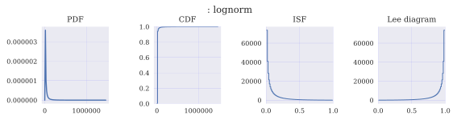

.. code:: ipython3

    ob.audit_df

.. raw:: html

    

    
    <table border="1" class="dataframe">
      <thead>
        <tr style="text-align: right;">
          <th></th>
          <th>name</th>
          <th>limit</th>
          <th>attachment</th>
          <th>el</th>
          <th>freq_1</th>
          <th>sev_1</th>
          <th>agg_m</th>
          <th>agg_cv</th>
          <th>agg_skew</th>
          <th>emp_sev_1</th>
          <th>emp_sev_cv</th>
          <th>emp_agg_1</th>
          <th>emp_agg_cv</th>
        </tr>
      </thead>
      <tbody>
        <tr>
          <th>0</th>
          <td>PPAL</td>
          <td>inf</td>
          <td>0</td>
          <td>2.83804e+10</td>
          <td>5.67607e+06</td>
          <td>5000</td>
          <td>2.83804e+10</td>
          <td>0.08</td>
          <td>0.16</td>
          <td>NaN</td>
          <td>NaN</td>
          <td>NaN</td>
          <td>NaN</td>
        </tr>
        <tr>
          <th>mixed</th>
          <td>PPAL</td>
          <td>inf</td>
          <td>0</td>
          <td>2.83804e+10</td>
          <td>5.67607e+06</td>
          <td>5000</td>
          <td>2.83804e+10</td>
          <td>0.08</td>
          <td>0.16</td>
          <td>NaN</td>
          <td>NaN</td>
          <td>2.837202e+10</td>
          <td>0.07952</td>
        </tr>
      </tbody>
    </table>
    

.. code:: ipython3

    uw.update=True
    if 1:
        print(f'Script:\n{testa}')
        p = uw.write(testa, log2=16, bs=0.2)
    else:
        print(f'Script:\n{testb}')
        p = uw.write(testb, log2=16, bs=0.04)
    p.plot(subplots=True)
    p

.. parsed-literal::

    Script:
    
    port Complex~Portfolio~Mixed
        agg LineA  50  claims           sev lognorm 12 cv [2, 3, 4] wt [.3 .5 .2] mixed gamma 0.4
        agg LineB  24  claims 10 x 5    sev lognorm 12 cv [2.0, 2.15789473684, 2.31578947368, 2.47368421053, 2.63157894737, 2.78947368421, 2.94736842105, 3.10526315789, 3.26315789474, 3.42105263158, 3.57894736842, 3.73684210526, 3.89473684211, 4.05263157895, 4.21052631579, 4.36842105263, 4.52631578947, 4.68421052632, 4.84210526316, 5.0] wt=20 mixed gamma 0.35
        agg LineC 124  claims 120 x 5   sev lognorm 16 cv 3.4                     mixed gamma 0.45
    
    

.. raw:: html

    <h2>Portfolio object: Complex~Portfolio~Mixed</h2>
    Portfolio contains 3 aggregate components
    

    
    <table border="1" class="dataframe">
      <thead>
        <tr style="text-align: right;">
          <th></th>
          <th>LineA</th>
          <th>LineB</th>
          <th>LineC</th>
          <th>total</th>
        </tr>
      </thead>
      <tbody>
        <tr>
          <th>(freq, mean)</th>
          <td>50</td>
          <td>24</td>
          <td>124</td>
          <td>198</td>
        </tr>
        <tr>
          <th>(freq, cv)</th>
          <td>0.424264</td>
          <td>0.405175</td>
          <td>0.458873</td>
          <td>0.310604</td>
        </tr>
        <tr>
          <th>(freq, skew)</th>
          <td>0.801388</td>
          <td>0.707513</td>
          <td>0.900172</td>
          <td>0.748623</td>
        </tr>
        <tr>
          <th>(sev, mean)</th>
          <td>12</td>
          <td>6.46204</td>
          <td>20.996</td>
          <td>16.9626</td>
        </tr>
        <tr>
          <th>(sev, cv)</th>
          <td>2.98329</td>
          <td>0.577008</td>
          <td>1.39111</td>
          <td>1.75811</td>
        </tr>
        <tr>
          <th>(sev, skew)</th>
          <td>56.2083</td>
          <td>-0.403796</td>
          <td>2.15914</td>
          <td>25.8793</td>
        </tr>
        <tr>
          <th>(agg, mean)</th>
          <td>600</td>
          <td>155.089</td>
          <td>2603.5</td>
          <td>3358.59</td>
        </tr>
        <tr>
          <th>(agg, cv)</th>
          <td>0.598331</td>
          <td>0.421947</td>
          <td>0.475574</td>
          <td>0.384332</td>
        </tr>
        <tr>
          <th>(agg, skew)</th>
          <td>3.52134</td>
          <td>0.715608</td>
          <td>0.903796</td>
          <td>0.873489</td>
        </tr>
        <tr>
          <th>Mean</th>
          <td>600</td>
          <td>155.089</td>
          <td>2603.5</td>
          <td>3358.59</td>
        </tr>
        <tr>
          <th>EmpMean</th>
          <td>599.913</td>
          <td>155.085</td>
          <td>2605.39</td>
          <td>3360.2</td>
        </tr>
        <tr>
          <th>MeanErr</th>
          <td>-0.000144325</td>
          <td>-2.41338e-05</td>
          <td>0.000724096</td>
          <td>0.000479016</td>
        </tr>
        <tr>
          <th>CV</th>
          <td>0.598331</td>
          <td>0.421947</td>
          <td>0.475574</td>
          <td>0.384332</td>
        </tr>
        <tr>
          <th>EmpCV</th>
          <td>0.594323</td>
          <td>0.421953</td>
          <td>0.474514</td>
          <td>0.383256</td>
        </tr>
        <tr>
          <th>CVErr</th>
          <td>-0.00669826</td>
          <td>1.53506e-05</td>
          <td>-0.00222909</td>
          <td>-0.00280043</td>
        </tr>
        <tr>
          <th>P99.0</th>
          <td>1742.8</td>
          <td>340.4</td>
          <td>6284</td>
          <td>7143.8</td>
        </tr>
      </tbody>
    </table>
    

.. image:: output_28_2.svg

.. code:: ipython3

    p.report('all')

.. raw:: html

    <h1> Statistics Report

.. raw:: html

      
    <table id="T_5aaca1ec_c4cb_11e8_b89b_c49ded152ae4" > 
    <thead>    <tr> 
            <th class="blank" ></th> 
            <th class="blank level0" ></th> 
            <th class="col_heading level0 col0" >LineA</th> 
            <th class="col_heading level0 col1" >LineB</th> 
            <th class="col_heading level0 col2" >LineC</th> 
            <th class="col_heading level0 col3" >total</th> 
        </tr>    <tr> 
            <th class="index_name level0" >component</th> 
            <th class="index_name level1" >measure</th> 
            <th class="blank" ></th> 
            <th class="blank" ></th> 
            <th class="blank" ></th> 
            <th class="blank" ></th> 
        </tr></thead> 
    <tbody>    <tr> 
            <th id="T_5aaca1ec_c4cb_11e8_b89b_c49ded152ae4level0_row0" class="row_heading level0 row0" rowspan=6>freq</th> 
            <th id="T_5aaca1ec_c4cb_11e8_b89b_c49ded152ae4level1_row0" class="row_heading level1 row0" >ex1</th> 
            <td id="T_5aaca1ec_c4cb_11e8_b89b_c49ded152ae4row0_col0" class="data row0 col0" >50</td> 
            <td id="T_5aaca1ec_c4cb_11e8_b89b_c49ded152ae4row0_col1" class="data row0 col1" >24</td> 
            <td id="T_5aaca1ec_c4cb_11e8_b89b_c49ded152ae4row0_col2" class="data row0 col2" >124</td> 
            <td id="T_5aaca1ec_c4cb_11e8_b89b_c49ded152ae4row0_col3" class="data row0 col3" >198</td> 
        </tr>    <tr> 
            <th id="T_5aaca1ec_c4cb_11e8_b89b_c49ded152ae4level1_row1" class="row_heading level1 row1" >ex2</th> 
            <td id="T_5aaca1ec_c4cb_11e8_b89b_c49ded152ae4row1_col0" class="data row1 col0" >2950</td> 
            <td id="T_5aaca1ec_c4cb_11e8_b89b_c49ded152ae4row1_col1" class="data row1 col1" >670.56</td> 
            <td id="T_5aaca1ec_c4cb_11e8_b89b_c49ded152ae4row1_col2" class="data row1 col2" >18613.6</td> 
            <td id="T_5aaca1ec_c4cb_11e8_b89b_c49ded152ae4row1_col3" class="data row1 col3" >42986.2</td> 
        </tr>    <tr> 
            <th id="T_5aaca1ec_c4cb_11e8_b89b_c49ded152ae4level1_row2" class="row_heading level1 row2" >ex3</th> 
            <td id="T_5aaca1ec_c4cb_11e8_b89b_c49ded152ae4row2_col0" class="data row2 col0" >200150</td> 
            <td id="T_5aaca1ec_c4cb_11e8_b89b_c49ded152ae4row2_col1" class="data row2 col1" >21282.9</td> 
            <td id="T_5aaca1ec_c4cb_11e8_b89b_c49ded152ae4row2_col2" class="data row2 col2" >3.27686e+06</td> 
            <td id="T_5aaca1ec_c4cb_11e8_b89b_c49ded152ae4row2_col3" class="data row2 col3" >1.01832e+07</td> 
        </tr>    <tr> 
            <th id="T_5aaca1ec_c4cb_11e8_b89b_c49ded152ae4level1_row3" class="row_heading level1 row3" >mean</th> 
            <td id="T_5aaca1ec_c4cb_11e8_b89b_c49ded152ae4row3_col0" class="data row3 col0" >50</td> 
            <td id="T_5aaca1ec_c4cb_11e8_b89b_c49ded152ae4row3_col1" class="data row3 col1" >24</td> 
            <td id="T_5aaca1ec_c4cb_11e8_b89b_c49ded152ae4row3_col2" class="data row3 col2" >124</td> 
            <td id="T_5aaca1ec_c4cb_11e8_b89b_c49ded152ae4row3_col3" class="data row3 col3" >198</td> 
        </tr>    <tr> 
            <th id="T_5aaca1ec_c4cb_11e8_b89b_c49ded152ae4level1_row4" class="row_heading level1 row4" >cv</th> 
            <td id="T_5aaca1ec_c4cb_11e8_b89b_c49ded152ae4row4_col0" class="data row4 col0" >0.424264</td> 
            <td id="T_5aaca1ec_c4cb_11e8_b89b_c49ded152ae4row4_col1" class="data row4 col1" >0.405175</td> 
            <td id="T_5aaca1ec_c4cb_11e8_b89b_c49ded152ae4row4_col2" class="data row4 col2" >0.458873</td> 
            <td id="T_5aaca1ec_c4cb_11e8_b89b_c49ded152ae4row4_col3" class="data row4 col3" >0.310604</td> 
        </tr>    <tr> 
            <th id="T_5aaca1ec_c4cb_11e8_b89b_c49ded152ae4level1_row5" class="row_heading level1 row5" >skew</th> 
            <td id="T_5aaca1ec_c4cb_11e8_b89b_c49ded152ae4row5_col0" class="data row5 col0" >0.801388</td> 
            <td id="T_5aaca1ec_c4cb_11e8_b89b_c49ded152ae4row5_col1" class="data row5 col1" >0.707513</td> 
            <td id="T_5aaca1ec_c4cb_11e8_b89b_c49ded152ae4row5_col2" class="data row5 col2" >0.900172</td> 
            <td id="T_5aaca1ec_c4cb_11e8_b89b_c49ded152ae4row5_col3" class="data row5 col3" >0.748623</td> 
        </tr>    <tr> 
            <th id="T_5aaca1ec_c4cb_11e8_b89b_c49ded152ae4level0_row6" class="row_heading level0 row6" rowspan=6>sev</th> 
            <th id="T_5aaca1ec_c4cb_11e8_b89b_c49ded152ae4level1_row6" class="row_heading level1 row6" >ex1</th> 
            <td id="T_5aaca1ec_c4cb_11e8_b89b_c49ded152ae4row6_col0" class="data row6 col0" >12</td> 
            <td id="T_5aaca1ec_c4cb_11e8_b89b_c49ded152ae4row6_col1" class="data row6 col1" >6.46204</td> 
            <td id="T_5aaca1ec_c4cb_11e8_b89b_c49ded152ae4row6_col2" class="data row6 col2" >20.996</td> 
            <td id="T_5aaca1ec_c4cb_11e8_b89b_c49ded152ae4row6_col3" class="data row6 col3" >16.9626</td> 
        </tr>    <tr> 
            <th id="T_5aaca1ec_c4cb_11e8_b89b_c49ded152ae4level1_row7" class="row_heading level1 row7" >ex2</th> 
            <td id="T_5aaca1ec_c4cb_11e8_b89b_c49ded152ae4row7_col0" class="data row7 col0" >1425.6</td> 
            <td id="T_5aaca1ec_c4cb_11e8_b89b_c49ded152ae4row7_col1" class="data row7 col1" >55.6608</td> 
            <td id="T_5aaca1ec_c4cb_11e8_b89b_c49ded152ae4row7_col2" class="data row7 col2" >1293.93</td> 
            <td id="T_5aaca1ec_c4cb_11e8_b89b_c49ded152ae4row7_col3" class="data row7 col3" >1177.08</td> 
        </tr>    <tr> 
            <th id="T_5aaca1ec_c4cb_11e8_b89b_c49ded152ae4level1_row8" class="row_heading level1 row8" >ex3</th> 
            <td id="T_5aaca1ec_c4cb_11e8_b89b_c49ded152ae4row8_col0" class="data row8 col0" >2.62673e+06</td> 
            <td id="T_5aaca1ec_c4cb_11e8_b89b_c49ded152ae4row8_col1" class="data row8 col1" >518.432</td> 
            <td id="T_5aaca1ec_c4cb_11e8_b89b_c49ded152ae4row8_col2" class="data row8 col2" >116790</td> 
            <td id="T_5aaca1ec_c4cb_11e8_b89b_c49ded152ae4row8_col3" class="data row8 col3" >736520</td> 
        </tr>    <tr> 
            <th id="T_5aaca1ec_c4cb_11e8_b89b_c49ded152ae4level1_row9" class="row_heading level1 row9" >mean</th> 
            <td id="T_5aaca1ec_c4cb_11e8_b89b_c49ded152ae4row9_col0" class="data row9 col0" >12</td> 
            <td id="T_5aaca1ec_c4cb_11e8_b89b_c49ded152ae4row9_col1" class="data row9 col1" >6.46204</td> 
            <td id="T_5aaca1ec_c4cb_11e8_b89b_c49ded152ae4row9_col2" class="data row9 col2" >20.996</td> 
            <td id="T_5aaca1ec_c4cb_11e8_b89b_c49ded152ae4row9_col3" class="data row9 col3" >16.9626</td> 
        </tr>    <tr> 
            <th id="T_5aaca1ec_c4cb_11e8_b89b_c49ded152ae4level1_row10" class="row_heading level1 row10" >cv</th> 
            <td id="T_5aaca1ec_c4cb_11e8_b89b_c49ded152ae4row10_col0" class="data row10 col0" >2.98329</td> 
            <td id="T_5aaca1ec_c4cb_11e8_b89b_c49ded152ae4row10_col1" class="data row10 col1" >0.577008</td> 
            <td id="T_5aaca1ec_c4cb_11e8_b89b_c49ded152ae4row10_col2" class="data row10 col2" >1.39111</td> 
            <td id="T_5aaca1ec_c4cb_11e8_b89b_c49ded152ae4row10_col3" class="data row10 col3" >1.75811</td> 
        </tr>    <tr> 
            <th id="T_5aaca1ec_c4cb_11e8_b89b_c49ded152ae4level1_row11" class="row_heading level1 row11" >skew</th> 
            <td id="T_5aaca1ec_c4cb_11e8_b89b_c49ded152ae4row11_col0" class="data row11 col0" >56.2083</td> 
            <td id="T_5aaca1ec_c4cb_11e8_b89b_c49ded152ae4row11_col1" class="data row11 col1" >-0.403796</td> 
            <td id="T_5aaca1ec_c4cb_11e8_b89b_c49ded152ae4row11_col2" class="data row11 col2" >2.15914</td> 
            <td id="T_5aaca1ec_c4cb_11e8_b89b_c49ded152ae4row11_col3" class="data row11 col3" >25.8793</td> 
        </tr>    <tr> 
            <th id="T_5aaca1ec_c4cb_11e8_b89b_c49ded152ae4level0_row12" class="row_heading level0 row12" rowspan=8>agg</th> 
            <th id="T_5aaca1ec_c4cb_11e8_b89b_c49ded152ae4level1_row12" class="row_heading level1 row12" >ex1</th> 
            <td id="T_5aaca1ec_c4cb_11e8_b89b_c49ded152ae4row12_col0" class="data row12 col0" >600</td> 
            <td id="T_5aaca1ec_c4cb_11e8_b89b_c49ded152ae4row12_col1" class="data row12 col1" >155.089</td> 
            <td id="T_5aaca1ec_c4cb_11e8_b89b_c49ded152ae4row12_col2" class="data row12 col2" >2603.5</td> 
            <td id="T_5aaca1ec_c4cb_11e8_b89b_c49ded152ae4row12_col3" class="data row12 col3" >3358.59</td> 
        </tr>    <tr> 
            <th id="T_5aaca1ec_c4cb_11e8_b89b_c49ded152ae4level1_row13" class="row_heading level1 row13" >ex2</th> 
            <td id="T_5aaca1ec_c4cb_11e8_b89b_c49ded152ae4row13_col0" class="data row13 col0" >488880</td> 
            <td id="T_5aaca1ec_c4cb_11e8_b89b_c49ded152ae4row13_col1" class="data row13 col1" >28334.9</td> 
            <td id="T_5aaca1ec_c4cb_11e8_b89b_c49ded152ae4row13_col2" class="data row13 col2" >8.31127e+06</td> 
            <td id="T_5aaca1ec_c4cb_11e8_b89b_c49ded152ae4row13_col3" class="data row13 col3" >1.29463e+07</td> 
        </tr>    <tr> 
            <th id="T_5aaca1ec_c4cb_11e8_b89b_c49ded152ae4level1_row14" class="row_heading level1 row14" >ex3</th> 
            <td id="T_5aaca1ec_c4cb_11e8_b89b_c49ded152ae4row14_col0" class="data row14 col0" >6.10908e+08</td> 
            <td id="T_5aaca1ec_c4cb_11e8_b89b_c49ded152ae4row14_col1" class="data row14 col1" >5.92324e+06</td> 
            <td id="T_5aaca1ec_c4cb_11e8_b89b_c49ded152ae4row14_col2" class="data row14 col2" >3.13365e+10</td> 
            <td id="T_5aaca1ec_c4cb_11e8_b89b_c49ded152ae4row14_col3" class="data row14 col3" >5.65523e+10</td> 
        </tr>    <tr> 
            <th id="T_5aaca1ec_c4cb_11e8_b89b_c49ded152ae4level1_row15" class="row_heading level1 row15" >mean</th> 
            <td id="T_5aaca1ec_c4cb_11e8_b89b_c49ded152ae4row15_col0" class="data row15 col0" >600</td> 
            <td id="T_5aaca1ec_c4cb_11e8_b89b_c49ded152ae4row15_col1" class="data row15 col1" >155.089</td> 
            <td id="T_5aaca1ec_c4cb_11e8_b89b_c49ded152ae4row15_col2" class="data row15 col2" >2603.5</td> 
            <td id="T_5aaca1ec_c4cb_11e8_b89b_c49ded152ae4row15_col3" class="data row15 col3" >3358.59</td> 
        </tr>    <tr> 
            <th id="T_5aaca1ec_c4cb_11e8_b89b_c49ded152ae4level1_row16" class="row_heading level1 row16" >cv</th> 
            <td id="T_5aaca1ec_c4cb_11e8_b89b_c49ded152ae4row16_col0" class="data row16 col0" >0.598331</td> 
            <td id="T_5aaca1ec_c4cb_11e8_b89b_c49ded152ae4row16_col1" class="data row16 col1" >0.421947</td> 
            <td id="T_5aaca1ec_c4cb_11e8_b89b_c49ded152ae4row16_col2" class="data row16 col2" >0.475574</td> 
            <td id="T_5aaca1ec_c4cb_11e8_b89b_c49ded152ae4row16_col3" class="data row16 col3" >0.384332</td> 
        </tr>    <tr> 
            <th id="T_5aaca1ec_c4cb_11e8_b89b_c49ded152ae4level1_row17" class="row_heading level1 row17" >skew</th> 
            <td id="T_5aaca1ec_c4cb_11e8_b89b_c49ded152ae4row17_col0" class="data row17 col0" >3.52134</td> 
            <td id="T_5aaca1ec_c4cb_11e8_b89b_c49ded152ae4row17_col1" class="data row17 col1" >0.715608</td> 
            <td id="T_5aaca1ec_c4cb_11e8_b89b_c49ded152ae4row17_col2" class="data row17 col2" >0.903796</td> 
            <td id="T_5aaca1ec_c4cb_11e8_b89b_c49ded152ae4row17_col3" class="data row17 col3" >0.873489</td> 
        </tr>    <tr> 
            <th id="T_5aaca1ec_c4cb_11e8_b89b_c49ded152ae4level1_row18" class="row_heading level1 row18" >limit</th> 
            <td id="T_5aaca1ec_c4cb_11e8_b89b_c49ded152ae4row18_col0" class="data row18 col0" >inf</td> 
            <td id="T_5aaca1ec_c4cb_11e8_b89b_c49ded152ae4row18_col1" class="data row18 col1" >10</td> 
            <td id="T_5aaca1ec_c4cb_11e8_b89b_c49ded152ae4row18_col2" class="data row18 col2" >120</td> 
            <td id="T_5aaca1ec_c4cb_11e8_b89b_c49ded152ae4row18_col3" class="data row18 col3" >inf</td> 
        </tr>    <tr> 
            <th id="T_5aaca1ec_c4cb_11e8_b89b_c49ded152ae4level1_row19" class="row_heading level1 row19" >P99.9e</th> 
            <td id="T_5aaca1ec_c4cb_11e8_b89b_c49ded152ae4row19_col0" class="data row19 col0" >3433.91</td> 
            <td id="T_5aaca1ec_c4cb_11e8_b89b_c49ded152ae4row19_col1" class="data row19 col1" >431.317</td> 
            <td id="T_5aaca1ec_c4cb_11e8_b89b_c49ded152ae4row19_col2" class="data row19 col2" >8221.21</td> 
            <td id="T_5aaca1ec_c4cb_11e8_b89b_c49ded152ae4row19_col3" class="data row19 col3" >9149.5</td> 
        </tr></tbody> 
    </table> 

.. raw:: html

    <h1> Quick Report

.. raw:: html

      
    <table id="T_5aadb2a4_c4cb_11e8_8981_c49ded152ae4" > 
    <thead>    <tr> 
            <th class="blank level0" ></th> 
            <th class="col_heading level0 col0" >Mean</th> 
            <th class="col_heading level0 col1" >EmpMean</th> 
            <th class="col_heading level0 col2" >MeanErr</th> 
            <th class="col_heading level0 col3" >CV</th> 
            <th class="col_heading level0 col4" >EmpCV</th> 
            <th class="col_heading level0 col5" >CVErr</th> 
            <th class="col_heading level0 col6" >P99.0</th> 
        </tr></thead> 
    <tbody>    <tr> 
            <th id="T_5aadb2a4_c4cb_11e8_8981_c49ded152ae4level0_row0" class="row_heading level0 row0" >LineA</th> 
            <td id="T_5aadb2a4_c4cb_11e8_8981_c49ded152ae4row0_col0" class="data row0 col0" >600</td> 
            <td id="T_5aadb2a4_c4cb_11e8_8981_c49ded152ae4row0_col1" class="data row0 col1" >599.913</td> 
            <td id="T_5aadb2a4_c4cb_11e8_8981_c49ded152ae4row0_col2" class="data row0 col2" >-0.000144325</td> 
            <td id="T_5aadb2a4_c4cb_11e8_8981_c49ded152ae4row0_col3" class="data row0 col3" >0.598331</td> 
            <td id="T_5aadb2a4_c4cb_11e8_8981_c49ded152ae4row0_col4" class="data row0 col4" >0.594323</td> 
            <td id="T_5aadb2a4_c4cb_11e8_8981_c49ded152ae4row0_col5" class="data row0 col5" >-0.00669826</td> 
            <td id="T_5aadb2a4_c4cb_11e8_8981_c49ded152ae4row0_col6" class="data row0 col6" >1742.8</td> 
        </tr>    <tr> 
            <th id="T_5aadb2a4_c4cb_11e8_8981_c49ded152ae4level0_row1" class="row_heading level0 row1" >LineB</th> 
            <td id="T_5aadb2a4_c4cb_11e8_8981_c49ded152ae4row1_col0" class="data row1 col0" >155.089</td> 
            <td id="T_5aadb2a4_c4cb_11e8_8981_c49ded152ae4row1_col1" class="data row1 col1" >155.085</td> 
            <td id="T_5aadb2a4_c4cb_11e8_8981_c49ded152ae4row1_col2" class="data row1 col2" >-2.41338e-05</td> 
            <td id="T_5aadb2a4_c4cb_11e8_8981_c49ded152ae4row1_col3" class="data row1 col3" >0.421947</td> 
            <td id="T_5aadb2a4_c4cb_11e8_8981_c49ded152ae4row1_col4" class="data row1 col4" >0.421953</td> 
            <td id="T_5aadb2a4_c4cb_11e8_8981_c49ded152ae4row1_col5" class="data row1 col5" >1.53506e-05</td> 
            <td id="T_5aadb2a4_c4cb_11e8_8981_c49ded152ae4row1_col6" class="data row1 col6" >340.4</td> 
        </tr>    <tr> 
            <th id="T_5aadb2a4_c4cb_11e8_8981_c49ded152ae4level0_row2" class="row_heading level0 row2" >LineC</th> 
            <td id="T_5aadb2a4_c4cb_11e8_8981_c49ded152ae4row2_col0" class="data row2 col0" >2603.5</td> 
            <td id="T_5aadb2a4_c4cb_11e8_8981_c49ded152ae4row2_col1" class="data row2 col1" >2605.39</td> 
            <td id="T_5aadb2a4_c4cb_11e8_8981_c49ded152ae4row2_col2" class="data row2 col2" >0.000724096</td> 
            <td id="T_5aadb2a4_c4cb_11e8_8981_c49ded152ae4row2_col3" class="data row2 col3" >0.475574</td> 
            <td id="T_5aadb2a4_c4cb_11e8_8981_c49ded152ae4row2_col4" class="data row2 col4" >0.474514</td> 
            <td id="T_5aadb2a4_c4cb_11e8_8981_c49ded152ae4row2_col5" class="data row2 col5" >-0.00222909</td> 
            <td id="T_5aadb2a4_c4cb_11e8_8981_c49ded152ae4row2_col6" class="data row2 col6" >6284</td> 
        </tr>    <tr> 
            <th id="T_5aadb2a4_c4cb_11e8_8981_c49ded152ae4level0_row3" class="row_heading level0 row3" >total</th> 
            <td id="T_5aadb2a4_c4cb_11e8_8981_c49ded152ae4row3_col0" class="data row3 col0" >3358.59</td> 
            <td id="T_5aadb2a4_c4cb_11e8_8981_c49ded152ae4row3_col1" class="data row3 col1" >3360.2</td> 
            <td id="T_5aadb2a4_c4cb_11e8_8981_c49ded152ae4row3_col2" class="data row3 col2" >0.000479016</td> 
            <td id="T_5aadb2a4_c4cb_11e8_8981_c49ded152ae4row3_col3" class="data row3 col3" >0.384332</td> 
            <td id="T_5aadb2a4_c4cb_11e8_8981_c49ded152ae4row3_col4" class="data row3 col4" >0.383256</td> 
            <td id="T_5aadb2a4_c4cb_11e8_8981_c49ded152ae4row3_col5" class="data row3 col5" >-0.00280043</td> 
            <td id="T_5aadb2a4_c4cb_11e8_8981_c49ded152ae4row3_col6" class="data row3 col6" >7143.8</td> 
        </tr></tbody> 
    </table> 

.. raw:: html

    <h1> Audit Report

.. raw:: html

      
    <table id="T_5aae9c78_c4cb_11e8_8979_c49ded152ae4" > 
    <thead>    <tr> 
            <th class="blank level0" ></th> 
            <th class="col_heading level0 col0" >Mean</th> 
            <th class="col_heading level0 col1" >CV</th> 
            <th class="col_heading level0 col2" >Skew</th> 
            <th class="col_heading level0 col3" >Limit</th> 
            <th class="col_heading level0 col4" >P99.9Est</th> 
            <th class="col_heading level0 col5" >Sum log</th> 
            <th class="col_heading level0 col6" >EmpMean</th> 
            <th class="col_heading level0 col7" >EmpCV</th> 
            <th class="col_heading level0 col8" >EmpSkew</th> 
            <th class="col_heading level0 col9" >EmpEX1</th> 
            <th class="col_heading level0 col10" >EmpEX2</th> 
            <th class="col_heading level0 col11" >EmpEX3</th> 
            <th class="col_heading level0 col12" >P90.0</th> 
            <th class="col_heading level0 col13" >P95.0</th> 
            <th class="col_heading level0 col14" >P99.0</th> 
            <th class="col_heading level0 col15" >P99.6</th> 
            <th class="col_heading level0 col16" >P99.9</th> 
            <th class="col_heading level0 col17" >P99.99</th> 
            <th class="col_heading level0 col18" >P99.9999</th> 
            <th class="col_heading level0 col19" >MeanErr</th> 
            <th class="col_heading level0 col20" >CVErr</th> 
            <th class="col_heading level0 col21" >SkewErr</th> 
        </tr></thead> 
    <tbody>    <tr> 
            <th id="T_5aae9c78_c4cb_11e8_8979_c49ded152ae4level0_row0" class="row_heading level0 row0" >LineA</th> 
            <td id="T_5aae9c78_c4cb_11e8_8979_c49ded152ae4row0_col0" class="data row0 col0" >600</td> 
            <td id="T_5aae9c78_c4cb_11e8_8979_c49ded152ae4row0_col1" class="data row0 col1" >0.598331</td> 
            <td id="T_5aae9c78_c4cb_11e8_8979_c49ded152ae4row0_col2" class="data row0 col2" >3.52134</td> 
            <td id="T_5aae9c78_c4cb_11e8_8979_c49ded152ae4row0_col3" class="data row0 col3" >inf</td> 
            <td id="T_5aae9c78_c4cb_11e8_8979_c49ded152ae4row0_col4" class="data row0 col4" >3433.91</td> 
            <td id="T_5aae9c78_c4cb_11e8_8979_c49ded152ae4row0_col5" class="data row0 col5" >0.999999</td> 
            <td id="T_5aae9c78_c4cb_11e8_8979_c49ded152ae4row0_col6" class="data row0 col6" >599.913</td> 
            <td id="T_5aae9c78_c4cb_11e8_8979_c49ded152ae4row0_col7" class="data row0 col7" >0.594323</td> 
            <td id="T_5aae9c78_c4cb_11e8_8979_c49ded152ae4row0_col8" class="data row0 col8" >2.37359</td> 
            <td id="T_5aae9c78_c4cb_11e8_8979_c49ded152ae4row0_col9" class="data row0 col9" >599.913</td> 
            <td id="T_5aae9c78_c4cb_11e8_8979_c49ded152ae4row0_col10" class="data row0 col10" >487019</td> 
            <td id="T_5aae9c78_c4cb_11e8_8979_c49ded152ae4row0_col11" class="data row0 col11" >5.52276e+08</td> 
            <td id="T_5aae9c78_c4cb_11e8_8979_c49ded152ae4row0_col12" class="data row0 col12" >1038</td> 
            <td id="T_5aae9c78_c4cb_11e8_8979_c49ded152ae4row0_col13" class="data row0 col13" >1238.6</td> 
            <td id="T_5aae9c78_c4cb_11e8_8979_c49ded152ae4row0_col14" class="data row0 col14" >1742.8</td> 
            <td id="T_5aae9c78_c4cb_11e8_8979_c49ded152ae4row0_col15" class="data row0 col15" >2096.6</td> 
            <td id="T_5aae9c78_c4cb_11e8_8979_c49ded152ae4row0_col16" class="data row0 col16" >2853.2</td> 
            <td id="T_5aae9c78_c4cb_11e8_8979_c49ded152ae4row0_col17" class="data row0 col17" >5266.6</td> 
            <td id="T_5aae9c78_c4cb_11e8_8979_c49ded152ae4row0_col18" class="data row0 col18" >12932</td> 
            <td id="T_5aae9c78_c4cb_11e8_8979_c49ded152ae4row0_col19" class="data row0 col19" >-0.000144325</td> 
            <td id="T_5aae9c78_c4cb_11e8_8979_c49ded152ae4row0_col20" class="data row0 col20" >-0.00669826</td> 
            <td id="T_5aae9c78_c4cb_11e8_8979_c49ded152ae4row0_col21" class="data row0 col21" >-0.32594</td> 
        </tr>    <tr> 
            <th id="T_5aae9c78_c4cb_11e8_8979_c49ded152ae4level0_row1" class="row_heading level0 row1" >LineB</th> 
            <td id="T_5aae9c78_c4cb_11e8_8979_c49ded152ae4row1_col0" class="data row1 col0" >155.089</td> 
            <td id="T_5aae9c78_c4cb_11e8_8979_c49ded152ae4row1_col1" class="data row1 col1" >0.421947</td> 
            <td id="T_5aae9c78_c4cb_11e8_8979_c49ded152ae4row1_col2" class="data row1 col2" >0.715608</td> 
            <td id="T_5aae9c78_c4cb_11e8_8979_c49ded152ae4row1_col3" class="data row1 col3" >10</td> 
            <td id="T_5aae9c78_c4cb_11e8_8979_c49ded152ae4row1_col4" class="data row1 col4" >431.317</td> 
            <td id="T_5aae9c78_c4cb_11e8_8979_c49ded152ae4row1_col5" class="data row1 col5" >1</td> 
            <td id="T_5aae9c78_c4cb_11e8_8979_c49ded152ae4row1_col6" class="data row1 col6" >155.085</td> 
            <td id="T_5aae9c78_c4cb_11e8_8979_c49ded152ae4row1_col7" class="data row1 col7" >0.421953</td> 
            <td id="T_5aae9c78_c4cb_11e8_8979_c49ded152ae4row1_col8" class="data row1 col8" >0.715608</td> 
            <td id="T_5aae9c78_c4cb_11e8_8979_c49ded152ae4row1_col9" class="data row1 col9" >155.085</td> 
            <td id="T_5aae9c78_c4cb_11e8_8979_c49ded152ae4row1_col10" class="data row1 col10" >28333.7</td> 
            <td id="T_5aae9c78_c4cb_11e8_8979_c49ded152ae4row1_col11" class="data row1 col11" >5.92289e+06</td> 
            <td id="T_5aae9c78_c4cb_11e8_8979_c49ded152ae4row1_col12" class="data row1 col12" >242.4</td> 
            <td id="T_5aae9c78_c4cb_11e8_8979_c49ded152ae4row1_col13" class="data row1 col13" >274.4</td> 
            <td id="T_5aae9c78_c4cb_11e8_8979_c49ded152ae4row1_col14" class="data row1 col14" >340.4</td> 
            <td id="T_5aae9c78_c4cb_11e8_8979_c49ded152ae4row1_col15" class="data row1 col15" >375</td> 
            <td id="T_5aae9c78_c4cb_11e8_8979_c49ded152ae4row1_col16" class="data row1 col16" >424.6</td> 
            <td id="T_5aae9c78_c4cb_11e8_8979_c49ded152ae4row1_col17" class="data row1 col17" >501.8</td> 
            <td id="T_5aae9c78_c4cb_11e8_8979_c49ded152ae4row1_col18" class="data row1 col18" >645.4</td> 
            <td id="T_5aae9c78_c4cb_11e8_8979_c49ded152ae4row1_col19" class="data row1 col19" >-2.41338e-05</td> 
            <td id="T_5aae9c78_c4cb_11e8_8979_c49ded152ae4row1_col20" class="data row1 col20" >1.53506e-05</td> 
            <td id="T_5aae9c78_c4cb_11e8_8979_c49ded152ae4row1_col21" class="data row1 col21" >-8.59927e-09</td> 
        </tr>    <tr> 
            <th id="T_5aae9c78_c4cb_11e8_8979_c49ded152ae4level0_row2" class="row_heading level0 row2" >LineC</th> 
            <td id="T_5aae9c78_c4cb_11e8_8979_c49ded152ae4row2_col0" class="data row2 col0" >2603.5</td> 
            <td id="T_5aae9c78_c4cb_11e8_8979_c49ded152ae4row2_col1" class="data row2 col1" >0.475574</td> 
            <td id="T_5aae9c78_c4cb_11e8_8979_c49ded152ae4row2_col2" class="data row2 col2" >0.903796</td> 
            <td id="T_5aae9c78_c4cb_11e8_8979_c49ded152ae4row2_col3" class="data row2 col3" >120</td> 
            <td id="T_5aae9c78_c4cb_11e8_8979_c49ded152ae4row2_col4" class="data row2 col4" >8221.21</td> 
            <td id="T_5aae9c78_c4cb_11e8_8979_c49ded152ae4row2_col5" class="data row2 col5" >1</td> 
            <td id="T_5aae9c78_c4cb_11e8_8979_c49ded152ae4row2_col6" class="data row2 col6" >2605.39</td> 
            <td id="T_5aae9c78_c4cb_11e8_8979_c49ded152ae4row2_col7" class="data row2 col7" >0.474514</td> 
            <td id="T_5aae9c78_c4cb_11e8_8979_c49ded152ae4row2_col8" class="data row2 col8" >0.908736</td> 
            <td id="T_5aae9c78_c4cb_11e8_8979_c49ded152ae4row2_col9" class="data row2 col9" >2605.39</td> 
            <td id="T_5aae9c78_c4cb_11e8_8979_c49ded152ae4row2_col10" class="data row2 col10" >8.31647e+06</td> 
            <td id="T_5aae9c78_c4cb_11e8_8979_c49ded152ae4row2_col11" class="data row2 col11" >3.1349e+10</td> 
            <td id="T_5aae9c78_c4cb_11e8_8979_c49ded152ae4row2_col12" class="data row2 col12" >4236.4</td> 
            <td id="T_5aae9c78_c4cb_11e8_8979_c49ded152ae4row2_col13" class="data row2 col13" >4880</td> 
            <td id="T_5aae9c78_c4cb_11e8_8979_c49ded152ae4row2_col14" class="data row2 col14" >6284</td> 
            <td id="T_5aae9c78_c4cb_11e8_8979_c49ded152ae4row2_col15" class="data row2 col15" >7058.2</td> 
            <td id="T_5aae9c78_c4cb_11e8_8979_c49ded152ae4row2_col16" class="data row2 col16" >8218.8</td> 
            <td id="T_5aae9c78_c4cb_11e8_8979_c49ded152ae4row2_col17" class="data row2 col17" >10138.8</td> 
            <td id="T_5aae9c78_c4cb_11e8_8979_c49ded152ae4row2_col18" class="data row2 col18" >12880.6</td> 
            <td id="T_5aae9c78_c4cb_11e8_8979_c49ded152ae4row2_col19" class="data row2 col19" >0.000724096</td> 
            <td id="T_5aae9c78_c4cb_11e8_8979_c49ded152ae4row2_col20" class="data row2 col20" >-0.00222909</td> 
            <td id="T_5aae9c78_c4cb_11e8_8979_c49ded152ae4row2_col21" class="data row2 col21" >0.00546621</td> 
        </tr>    <tr> 
            <th id="T_5aae9c78_c4cb_11e8_8979_c49ded152ae4level0_row3" class="row_heading level0 row3" >total</th> 
            <td id="T_5aae9c78_c4cb_11e8_8979_c49ded152ae4row3_col0" class="data row3 col0" >3358.59</td> 
            <td id="T_5aae9c78_c4cb_11e8_8979_c49ded152ae4row3_col1" class="data row3 col1" >0.384332</td> 
            <td id="T_5aae9c78_c4cb_11e8_8979_c49ded152ae4row3_col2" class="data row3 col2" >0.873489</td> 
            <td id="T_5aae9c78_c4cb_11e8_8979_c49ded152ae4row3_col3" class="data row3 col3" >inf</td> 
            <td id="T_5aae9c78_c4cb_11e8_8979_c49ded152ae4row3_col4" class="data row3 col4" >9149.5</td> 
            <td id="T_5aae9c78_c4cb_11e8_8979_c49ded152ae4row3_col5" class="data row3 col5" >0.999986</td> 
            <td id="T_5aae9c78_c4cb_11e8_8979_c49ded152ae4row3_col6" class="data row3 col6" >3360.2</td> 
            <td id="T_5aae9c78_c4cb_11e8_8979_c49ded152ae4row3_col7" class="data row3 col7" >0.383256</td> 
            <td id="T_5aae9c78_c4cb_11e8_8979_c49ded152ae4row3_col8" class="data row3 col8" >0.84689</td> 
            <td id="T_5aae9c78_c4cb_11e8_8979_c49ded152ae4row3_col9" class="data row3 col9" >3360.2</td> 
            <td id="T_5aae9c78_c4cb_11e8_8979_c49ded152ae4row3_col10" class="data row3 col10" >1.29494e+07</td> 
            <td id="T_5aae9c78_c4cb_11e8_8979_c49ded152ae4row3_col11" class="data row3 col11" >5.6467e+10</td> 
            <td id="T_5aae9c78_c4cb_11e8_8979_c49ded152ae4row3_col12" class="data row3 col12" >5055.8</td> 
            <td id="T_5aae9c78_c4cb_11e8_8979_c49ded152ae4row3_col13" class="data row3 col13" >5713.4</td> 
            <td id="T_5aae9c78_c4cb_11e8_8979_c49ded152ae4row3_col14" class="data row3 col14" >7143.8</td> 
            <td id="T_5aae9c78_c4cb_11e8_8979_c49ded152ae4row3_col15" class="data row3 col15" >7934</td> 
            <td id="T_5aae9c78_c4cb_11e8_8979_c49ded152ae4row3_col16" class="data row3 col16" >9130.2</td> 
            <td id="T_5aae9c78_c4cb_11e8_8979_c49ded152ae4row3_col17" class="data row3 col17" >11200.6</td> 
            <td id="T_5aae9c78_c4cb_11e8_8979_c49ded152ae4row3_col18" class="data row3 col18" >0</td> 
            <td id="T_5aae9c78_c4cb_11e8_8979_c49ded152ae4row3_col19" class="data row3 col19" >0.000479016</td> 
            <td id="T_5aae9c78_c4cb_11e8_8979_c49ded152ae4row3_col20" class="data row3 col20" >-0.00280043</td> 
            <td id="T_5aae9c78_c4cb_11e8_8979_c49ded152ae4row3_col21" class="data row3 col21" >-0.0304518</td> 
        </tr></tbody> 
    </table> 

.. raw:: html

    <h1> Priority Capital Report

.. raw:: html

    <h2> Report Priority Capital Not Generated

.. raw:: html

    <h1> Priority Analysis Report

.. raw:: html

    <h2> Report Priority Analysis Not Generated

.. code:: ipython3

    for a in p:
        display(a.statistics_df)
        display(a.statistics_total_df)

.. raw:: html

    

    
    <table border="1" class="dataframe">
      <thead>
        <tr style="text-align: right;">
          <th></th>
          <th>name</th>
          <th>limit</th>
          <th>attachment</th>
          <th>sevcv_param</th>
          <th>el</th>
          <th>prem</th>
          <th>lr</th>
          <th>freq_1</th>
          <th>freq_2</th>
          <th>freq_3</th>
          <th>freq_m</th>
          <th>freq_cv</th>
          <th>freq_skew</th>
          <th>sev_1</th>
          <th>sev_2</th>
          <th>sev_3</th>
          <th>sev_m</th>
          <th>sev_cv</th>
          <th>sev_skew</th>
          <th>agg_1</th>
          <th>agg_2</th>
          <th>agg_3</th>
          <th>agg_m</th>
          <th>agg_cv</th>
          <th>agg_skew</th>
          <th>mix_cv</th>
          <th>wt</th>
        </tr>
      </thead>
      <tbody>
        <tr>
          <th>0</th>
          <td>LineA</td>
          <td>inf</td>
          <td>0</td>
          <td>2</td>
          <td>180</td>
          <td>0</td>
          <td>0</td>
          <td>15</td>
          <td>276</td>
          <td>5965.8</td>
          <td>15</td>
          <td>0.476095</td>
          <td>0.812162</td>
          <td>12</td>
          <td>720</td>
          <td>216000</td>
          <td>12</td>
          <td>2</td>
          <td>14</td>
          <td>180</td>
          <td>48384</td>
          <td>1.89351e+07</td>
          <td>180</td>
          <td>0.702377</td>
          <td>2.21282</td>
          <td>0.4</td>
          <td>0.3</td>
        </tr>
        <tr>
          <th>1</th>
          <td>LineA</td>
          <td>inf</td>
          <td>0</td>
          <td>3</td>
          <td>300</td>
          <td>0</td>
          <td>0</td>
          <td>25</td>
          <td>750</td>
          <td>26125</td>
          <td>25</td>
          <td>0.447214</td>
          <td>0.804984</td>
          <td>12</td>
          <td>1440</td>
          <td>1.728e+06</td>
          <td>12</td>
          <td>3</td>
          <td>36</td>
          <td>300</td>
          <td>140400</td>
          <td>1.22126e+08</td>
          <td>300</td>
          <td>0.748331</td>
          <td>4.39836</td>
          <td>0.4</td>
          <td>0.5</td>
        </tr>
        <tr>
          <th>2</th>
          <td>LineA</td>
          <td>inf</td>
          <td>0</td>
          <td>4</td>
          <td>120</td>
          <td>0</td>
          <td>0</td>
          <td>10</td>
          <td>126</td>
          <td>1889.2</td>
          <td>10</td>
          <td>0.509902</td>
          <td>0.823688</td>
          <td>12</td>
          <td>2448</td>
          <td>8.48966e+06</td>
          <td>12</td>
          <td>4</td>
          <td>76</td>
          <td>120</td>
          <td>41184</td>
          <td>9.77654e+07</td>
          <td>120</td>
          <td>1.36382</td>
          <td>19.7095</td>
          <td>0.4</td>
          <td>0.2</td>
        </tr>
      </tbody>
    </table>
    

.. raw:: html

    

    
    <table border="1" class="dataframe">
      <thead>
        <tr style="text-align: right;">
          <th></th>
          <th>name</th>
          <th>limit</th>
          <th>attachment</th>
          <th>sevcv_param</th>
          <th>el</th>
          <th>prem</th>
          <th>lr</th>
          <th>freq_1</th>
          <th>freq_2</th>
          <th>freq_3</th>
          <th>freq_m</th>
          <th>freq_cv</th>
          <th>freq_skew</th>
          <th>sev_1</th>
          <th>sev_2</th>
          <th>sev_3</th>
          <th>sev_m</th>
          <th>sev_cv</th>
          <th>sev_skew</th>
          <th>agg_1</th>
          <th>agg_2</th>
          <th>agg_3</th>
          <th>agg_m</th>
          <th>agg_cv</th>
          <th>agg_skew</th>
          <th>mix_cv</th>
          <th>wt</th>
        </tr>
      </thead>
      <tbody>
        <tr>
          <th>mixed</th>
          <td>LineA</td>
          <td>inf</td>
          <td>0</td>
          <td>0</td>
          <td>600</td>
          <td>0</td>
          <td>NaN</td>
          <td>50</td>
          <td>2950</td>
          <td>200150</td>
          <td>50</td>
          <td>0.424264</td>
          <td>0.801388</td>
          <td>12</td>
          <td>1425.6</td>
          <td>2.62673e+06</td>
          <td>12</td>
          <td>2.98329</td>
          <td>56.2083</td>
          <td>600</td>
          <td>488880</td>
          <td>6.10908e+08</td>
          <td>600</td>
          <td>0.598331</td>
          <td>3.52134</td>
          <td>0.4</td>
          <td>1.0</td>
        </tr>
        <tr>
          <th>independent</th>
          <td>LineA</td>
          <td>inf</td>
          <td>0</td>
          <td>0</td>
          <td>600</td>
          <td>0</td>
          <td>NaN</td>
          <td>50</td>
          <td>2702</td>
          <td>156830</td>
          <td>50</td>
          <td>0.284253</td>
          <td>0.532923</td>
          <td>12</td>
          <td>1425.6</td>
          <td>2.62673e+06</td>
          <td>12</td>
          <td>2.98329</td>
          <td>56.2083</td>
          <td>600</td>
          <td>453168</td>
          <td>5.24336e+08</td>
          <td>600</td>
          <td>0.508724</td>
          <td>4.94525</td>
          <td>0.4</td>
          <td>1.0</td>
        </tr>
      </tbody>
    </table>
    

.. raw:: html

    

    
    <table border="1" class="dataframe">
      <thead>
        <tr style="text-align: right;">
          <th></th>
          <th>name</th>
          <th>limit</th>
          <th>attachment</th>
          <th>sevcv_param</th>
          <th>el</th>
          <th>prem</th>
          <th>lr</th>
          <th>freq_1</th>
          <th>freq_2</th>
          <th>freq_3</th>
          <th>freq_m</th>
          <th>freq_cv</th>
          <th>freq_skew</th>
          <th>sev_1</th>
          <th>sev_2</th>
          <th>sev_3</th>
          <th>sev_m</th>
          <th>sev_cv</th>
          <th>sev_skew</th>
          <th>agg_1</th>
          <th>agg_2</th>
          <th>agg_3</th>
          <th>agg_m</th>
          <th>agg_cv</th>
          <th>agg_skew</th>
          <th>mix_cv</th>
          <th>wt</th>
        </tr>
      </thead>
      <tbody>
        <tr>
          <th>0</th>
          <td>LineB</td>
          <td>10</td>
          <td>5</td>
          <td>2</td>
          <td>7.56008</td>
          <td>0</td>
          <td>0</td>
          <td>1.2</td>
          <td>2.8164</td>
          <td>8.4641</td>
          <td>1.2</td>
          <td>0.977667</td>
          <td>1.10297</td>
          <td>6.30007</td>
          <td>53.4606</td>
          <td>493.656</td>
          <td>6.30007</td>
          <td>0.589003</td>
          <td>-0.325861</td>
          <td>7.56008</td>
          <td>128.309</td>
          <td>2829.48</td>
          <td>7.56008</td>
          <td>1.11577</td>
          <td>1.30554</td>
          <td>0.35</td>
          <td>0.05</td>
        </tr>
        <tr>
          <th>1</th>
          <td>LineB</td>
          <td>10</td>
          <td>5</td>
          <td>2.15789</td>
          <td>7.59277</td>
          <td>0</td>
          <td>0</td>
          <td>1.2</td>
          <td>2.8164</td>
          <td>8.4641</td>
          <td>1.2</td>
          <td>0.977667</td>
          <td>1.10297</td>
          <td>6.32731</td>
          <td>53.8395</td>
          <td>497.965</td>
          <td>6.32731</td>
          <td>0.587209</td>
          <td>-0.338981</td>
          <td>7.59277</td>
          <td>129.32</td>
          <td>2861.21</td>
          <td>7.59277</td>
          <td>1.11498</td>
          <td>1.30364</td>
          <td>0.35</td>
          <td>0.05</td>
        </tr>
        <tr>
          <th>2</th>
          <td>LineB</td>
          <td>10</td>
          <td>5</td>
          <td>2.31579</td>
          <td>7.62217</td>
          <td>0</td>
          <td>0</td>
          <td>1.2</td>
          <td>2.8164</td>
          <td>8.4641</td>
          <td>1.2</td>
          <td>0.977667</td>
          <td>1.10297</td>
          <td>6.35181</td>
          <td>54.1772</td>
          <td>501.792</td>
          <td>6.35181</td>
          <td>0.585519</td>
          <td>-0.350778</td>
          <td>7.62217</td>
          <td>130.227</td>
          <td>2889.73</td>
          <td>7.62217</td>
          <td>1.11424</td>
          <td>1.30193</td>
          <td>0.35</td>
          <td>0.05</td>
        </tr>
        <tr>
          <th>3</th>
          <td>LineB</td>
          <td>10</td>
          <td>5</td>
          <td>2.47368</td>
          <td>7.64873</td>
          <td>0</td>
          <td>0</td>
          <td>1.2</td>
          <td>2.8164</td>
          <td>8.4641</td>
          <td>1.2</td>
          <td>0.977667</td>
          <td>1.10297</td>
          <td>6.37394</td>
          <td>54.4802</td>
          <td>505.215</td>
          <td>6.37394</td>
          <td>0.583935</td>
          <td>-0.361438</td>
          <td>7.64873</td>
          <td>131.046</td>
          <td>2915.51</td>
          <td>7.64873</td>
          <td>1.11355</td>
          <td>1.30038</td>
          <td>0.35</td>
          <td>0.05</td>
        </tr>
        <tr>
          <th>4</th>
          <td>LineB</td>
          <td>10</td>
          <td>5</td>
          <td>2.63158</td>
          <td>7.67283</td>
          <td>0</td>
          <td>0</td>
          <td>1.2</td>
          <td>2.8164</td>
          <td>8.4641</td>
          <td>1.2</td>
          <td>0.977667</td>
          <td>1.10297</td>
          <td>6.39403</td>
          <td>54.7535</td>
          <td>508.295</td>
          <td>6.39403</td>
          <td>0.582456</td>
          <td>-0.371118</td>
          <td>7.67283</td>
          <td>131.788</td>
          <td>2938.92</td>
          <td>7.67283</td>
          <td>1.1129</td>
          <td>1.29896</td>
          <td>0.35</td>
          <td>0.05</td>
        </tr>
        <tr>
          <th>5</th>
          <td>LineB</td>
          <td>10</td>
          <td>5</td>
          <td>2.78947</td>
          <td>7.6948</td>
          <td>0</td>
          <td>0</td>
          <td>1.2</td>
          <td>2.8164</td>
          <td>8.4641</td>
          <td>1.2</td>
          <td>0.977667</td>
          <td>1.10297</td>
          <td>6.41233</td>
          <td>55.0015</td>
          <td>511.083</td>
          <td>6.41233</td>
          <td>0.581076</td>
          <td>-0.379947</td>
          <td>7.6948</td>
          <td>132.465</td>
          <td>2960.27</td>
          <td>7.6948</td>
          <td>1.1123</td>
          <td>1.29767</td>
          <td>0.35</td>
          <td>0.05</td>
        </tr>
        <tr>
          <th>6</th>
          <td>LineB</td>
          <td>10</td>
          <td>5</td>
          <td>2.94737</td>
          <td>7.7149</td>
          <td>0</td>
          <td>0</td>
          <td>1.2</td>
          <td>2.8164</td>
          <td>8.4641</td>
          <td>1.2</td>
          <td>0.977667</td>
          <td>1.10297</td>
          <td>6.42909</td>
          <td>55.2274</td>
          <td>513.62</td>
          <td>6.42909</td>
          <td>0.579787</td>
          <td>-0.388036</td>
          <td>7.7149</td>
          <td>133.084</td>
          <td>2979.83</td>
          <td>7.7149</td>
          <td>1.11174</td>
          <td>1.29649</td>
          <td>0.35</td>
          <td>0.05</td>
        </tr>
        <tr>
          <th>7</th>
          <td>LineB</td>
          <td>10</td>
          <td>5</td>
          <td>3.10526</td>
          <td>7.73338</td>
          <td>0</td>
          <td>0</td>
          <td>1.2</td>
          <td>2.8164</td>
          <td>8.4641</td>
          <td>1.2</td>
          <td>0.977667</td>
          <td>1.10297</td>
          <td>6.44449</td>
          <td>55.4344</td>
          <td>515.94</td>
          <td>6.44449</td>
          <td>0.578583</td>
          <td>-0.395478</td>
          <td>7.73338</td>
          <td>133.653</td>
          <td>2997.83</td>
          <td>7.73338</td>
          <td>1.11122</td>
          <td>1.2954</td>
          <td>0.35</td>
          <td>0.05</td>
        </tr>
        <tr>
          <th>8</th>
          <td>LineB</td>
          <td>10</td>
          <td>5</td>
          <td>3.26316</td>
          <td>7.75043</td>
          <td>0</td>
          <td>0</td>
          <td>1.2</td>
          <td>2.8164</td>
          <td>8.4641</td>
          <td>1.2</td>
          <td>0.977667</td>
          <td>1.10297</td>
          <td>6.45869</td>
          <td>55.6247</td>
          <td>518.07</td>
          <td>6.45869</td>
          <td>0.577456</td>
          <td>-0.402351</td>
          <td>7.75043</td>
          <td>134.177</td>
          <td>3014.45</td>
          <td>7.75043</td>
          <td>1.11073</td>
          <td>1.29439</td>
          <td>0.35</td>
          <td>0.05</td>
        </tr>
        <tr>
          <th>9</th>
          <td>LineB</td>
          <td>10</td>
          <td>5</td>
          <td>3.42105</td>
          <td>7.76621</td>
          <td>0</td>
          <td>0</td>
          <td>1.2</td>
          <td>2.8164</td>
          <td>8.4641</td>
          <td>1.2</td>
          <td>0.977667</td>
          <td>1.10297</td>
          <td>6.47185</td>
          <td>55.8005</td>
          <td>520.035</td>
          <td>6.47185</td>
          <td>0.5764</td>
          <td>-0.408721</td>
          <td>7.76621</td>
          <td>134.663</td>
          <td>3029.86</td>
          <td>7.76621</td>
          <td>1.11027</td>
          <td>1.29346</td>
          <td>0.35</td>
          <td>0.05</td>
        </tr>
        <tr>
          <th>10</th>
          <td>LineB</td>
          <td>10</td>
          <td>5</td>
          <td>3.57895</td>
          <td>7.78088</td>
          <td>0</td>
          <td>0</td>
          <td>1.2</td>
          <td>2.8164</td>
          <td>8.4641</td>
          <td>1.2</td>
          <td>0.977667</td>
          <td>1.10297</td>
          <td>6.48406</td>
          <td>55.9633</td>
          <td>521.854</td>
          <td>6.48406</td>
          <td>0.575408</td>
          <td>-0.414644</td>
          <td>7.78088</td>
          <td>135.114</td>
          <td>3044.18</td>
          <td>7.78088</td>
          <td>1.10984</td>
          <td>1.29259</td>
          <td>0.35</td>
          <td>0.05</td>
        </tr>
        <tr>
          <th>11</th>
          <td>LineB</td>
          <td>10</td>
          <td>5</td>
          <td>3.73684</td>
          <td>7.79454</td>
          <td>0</td>
          <td>0</td>
          <td>1.2</td>
          <td>2.8164</td>
          <td>8.4641</td>
          <td>1.2</td>
          <td>0.977667</td>
          <td>1.10297</td>
          <td>6.49545</td>
          <td>56.1147</td>
          <td>523.544</td>
          <td>6.49545</td>
          <td>0.574475</td>
          <td>-0.42017</td>
          <td>7.79454</td>
          <td>135.535</td>
          <td>3057.54</td>
          <td>7.79454</td>
          <td>1.10944</td>
          <td>1.29179</td>
          <td>0.35</td>
          <td>0.05</td>
        </tr>
        <tr>
          <th>12</th>
          <td>LineB</td>
          <td>10</td>
          <td>5</td>
          <td>3.89474</td>
          <td>7.80731</td>
          <td>0</td>
          <td>0</td>
          <td>1.2</td>
          <td>2.8164</td>
          <td>8.4641</td>
          <td>1.2</td>
          <td>0.977667</td>
          <td>1.10297</td>
          <td>6.50609</td>
          <td>56.256</td>
          <td>525.118</td>
          <td>6.50609</td>
          <td>0.573595</td>
          <td>-0.425339</td>
          <td>7.80731</td>
          <td>135.928</td>
          <td>3070.04</td>
          <td>7.80731</td>
          <td>1.10906</td>
          <td>1.29103</td>
          <td>0.35</td>
          <td>0.05</td>
        </tr>
        <tr>
          <th>13</th>
          <td>LineB</td>
          <td>10</td>
          <td>5</td>
          <td>4.05263</td>
          <td>7.81927</td>
          <td>0</td>
          <td>0</td>
          <td>1.2</td>
          <td>2.8164</td>
          <td>8.4641</td>
          <td>1.2</td>
          <td>0.977667</td>
          <td>1.10297</td>
          <td>6.51606</td>
          <td>56.3881</td>
          <td>526.59</td>
          <td>6.51606</td>
          <td>0.572764</td>
          <td>-0.430188</td>
          <td>7.81927</td>
          <td>136.297</td>
          <td>3081.76</td>
          <td>7.81927</td>
          <td>1.1087</td>
          <td>1.29033</td>
          <td>0.35</td>
          <td>0.05</td>
        </tr>
        <tr>
          <th>14</th>
          <td>LineB</td>
          <td>10</td>
          <td>5</td>
          <td>4.21053</td>
          <td>7.83051</td>
          <td>0</td>
          <td>0</td>
          <td>1.2</td>
          <td>2.8164</td>
          <td>8.4641</td>
          <td>1.2</td>
          <td>0.977667</td>
          <td>1.10297</td>
          <td>6.52543</td>
          <td>56.512</td>
          <td>527.97</td>
          <td>6.52543</td>
          <td>0.571979</td>
          <td>-0.434747</td>
          <td>7.83051</td>
          <td>136.643</td>
          <td>3092.79</td>
          <td>7.83051</td>
          <td>1.10836</td>
          <td>1.28966</td>
          <td>0.35</td>
          <td>0.05</td>
        </tr>
        <tr>
          <th>15</th>
          <td>LineB</td>
          <td>10</td>
          <td>5</td>
          <td>4.36842</td>
          <td>7.8411</td>
          <td>0</td>
          <td>0</td>
          <td>1.2</td>
          <td>2.8164</td>
          <td>8.4641</td>
          <td>1.2</td>
          <td>0.977667</td>
          <td>1.10297</td>
          <td>6.53425</td>
          <td>56.6286</td>
          <td>529.266</td>
          <td>6.53425</td>
          <td>0.571234</td>
          <td>-0.439045</td>
          <td>7.8411</td>
          <td>136.969</td>
          <td>3103.18</td>
          <td>7.8411</td>
          <td>1.10804</td>
          <td>1.28904</td>
          <td>0.35</td>
          <td>0.05</td>
        </tr>
        <tr>
          <th>16</th>
          <td>LineB</td>
          <td>10</td>
          <td>5</td>
          <td>4.52632</td>
          <td>7.85109</td>
          <td>0</td>
          <td>0</td>
          <td>1.2</td>
          <td>2.8164</td>
          <td>8.4641</td>
          <td>1.2</td>
          <td>0.977667</td>
          <td>1.10297</td>
          <td>6.54257</td>
          <td>56.7384</td>
          <td>530.487</td>
          <td>6.54257</td>
          <td>0.570527</td>
          <td>-0.443105</td>
          <td>7.85109</td>
          <td>137.277</td>
          <td>3112.99</td>
          <td>7.85109</td>
          <td>1.10774</td>
          <td>1.28845</td>
          <td>0.35</td>
          <td>0.05</td>
        </tr>
        <tr>
          <th>17</th>
          <td>LineB</td>
          <td>10</td>
          <td>5</td>
          <td>4.68421</td>
          <td>7.86053</td>
          <td>0</td>
          <td>0</td>
          <td>1.2</td>
          <td>2.8164</td>
          <td>8.4641</td>
          <td>1.2</td>
          <td>0.977667</td>
          <td>1.10297</td>
          <td>6.55045</td>
          <td>56.8421</td>
          <td>531.64</td>
          <td>6.55045</td>
          <td>0.569855</td>
          <td>-0.446948</td>
          <td>7.86053</td>
          <td>137.568</td>
          <td>3122.28</td>
          <td>7.86053</td>
          <td>1.10745</td>
          <td>1.28789</td>
          <td>0.35</td>
          <td>0.05</td>
        </tr>
        <tr>
          <th>18</th>
          <td>LineB</td>
          <td>10</td>
          <td>5</td>
          <td>4.84211</td>
          <td>7.86949</td>
          <td>0</td>
          <td>0</td>
          <td>1.2</td>
          <td>2.8164</td>
          <td>8.4641</td>
          <td>1.2</td>
          <td>0.977667</td>
          <td>1.10297</td>
          <td>6.5579</td>
          <td>56.9403</td>
          <td>532.731</td>
          <td>6.5579</td>
          <td>0.569215</td>
          <td>-0.450592</td>
          <td>7.86949</td>
          <td>137.843</td>
          <td>3131.09</td>
          <td>7.86949</td>
          <td>1.10718</td>
          <td>1.28737</td>
          <td>0.35</td>
          <td>0.05</td>
        </tr>
        <tr>
          <th>19</th>
          <td>LineB</td>
          <td>10</td>
          <td>5</td>
          <td>5</td>
          <td>7.87798</td>
          <td>0</td>
          <td>0</td>
          <td>1.2</td>
          <td>2.8164</td>
          <td>8.4641</td>
          <td>1.2</td>
          <td>0.977667</td>
          <td>1.10297</td>
          <td>6.56499</td>
          <td>57.0334</td>
          <td>533.764</td>
          <td>6.56499</td>
          <td>0.568605</td>
          <td>-0.454055</td>
          <td>7.87798</td>
          <td>138.105</td>
          <td>3139.46</td>
          <td>7.87798</td>
          <td>1.10691</td>
          <td>1.28686</td>
          <td>0.35</td>
          <td>0.05</td>
        </tr>
      </tbody>
    </table>
    

.. raw:: html

    

    
    <table border="1" class="dataframe">
      <thead>
        <tr style="text-align: right;">
          <th></th>
          <th>name</th>
          <th>limit</th>
          <th>attachment</th>
          <th>sevcv_param</th>
          <th>el</th>
          <th>prem</th>
          <th>lr</th>
          <th>freq_1</th>
          <th>freq_2</th>
          <th>freq_3</th>
          <th>freq_m</th>
          <th>freq_cv</th>
          <th>freq_skew</th>
          <th>sev_1</th>
          <th>sev_2</th>
          <th>sev_3</th>
          <th>sev_m</th>
          <th>sev_cv</th>
          <th>sev_skew</th>
          <th>agg_1</th>
          <th>agg_2</th>
          <th>agg_3</th>
          <th>agg_m</th>
          <th>agg_cv</th>
          <th>agg_skew</th>
          <th>mix_cv</th>
          <th>wt</th>
        </tr>
      </thead>
      <tbody>
        <tr>
          <th>mixed</th>
          <td>LineB</td>
          <td>10</td>
          <td>5</td>
          <td>0</td>
          <td>155.089</td>
          <td>0</td>
          <td>NaN</td>
          <td>24</td>
          <td>670.56</td>
          <td>21282.9</td>
          <td>24</td>
          <td>0.405175</td>
          <td>0.707513</td>
          <td>6.46204</td>
          <td>55.6608</td>
          <td>518.432</td>
          <td>6.46204</td>
          <td>0.577008</td>
          <td>-0.403796</td>
          <td>155.089</td>
          <td>28334.9</td>
          <td>5.92324e+06</td>
          <td>155.089</td>
          <td>0.421947</td>
          <td>0.715608</td>
          <td>0.35</td>
          <td>1.0</td>
        </tr>
        <tr>
          <th>independent</th>
          <td>LineB</td>
          <td>10</td>
          <td>5</td>
          <td>0</td>
          <td>155.089</td>
          <td>0</td>
          <td>NaN</td>
          <td>24</td>
          <td>603.528</td>
          <td>15841.6</td>
          <td>24</td>
          <td>0.218613</td>
          <td>0.246631</td>
          <td>6.46204</td>
          <td>55.6608</td>
          <td>518.432</td>
          <td>6.46204</td>
          <td>0.577008</td>
          <td>-0.403796</td>
          <td>155.089</td>
          <td>25535.8</td>
          <td>4.43691e+06</td>
          <td>155.089</td>
          <td>0.248324</td>
          <td>0.289384</td>
          <td>0.35</td>
          <td>1.0</td>
        </tr>
      </tbody>
    </table>
    

.. raw:: html

    

    
    <table border="1" class="dataframe">
      <thead>
        <tr style="text-align: right;">
          <th></th>
          <th>name</th>
          <th>limit</th>
          <th>attachment</th>
          <th>sevcv_param</th>
          <th>el</th>
          <th>prem</th>
          <th>lr</th>
          <th>freq_1</th>
          <th>freq_2</th>
          <th>freq_3</th>
          <th>freq_m</th>
          <th>freq_cv</th>
          <th>freq_skew</th>
          <th>sev_1</th>
          <th>sev_2</th>
          <th>sev_3</th>
          <th>sev_m</th>
          <th>sev_cv</th>
          <th>sev_skew</th>
          <th>agg_1</th>
          <th>agg_2</th>
          <th>agg_3</th>
          <th>agg_m</th>
          <th>agg_cv</th>
          <th>agg_skew</th>
          <th>mix_cv</th>
          <th>wt</th>
        </tr>
      </thead>
      <tbody>
        <tr>
          <th>0</th>
          <td>LineC</td>
          <td>120</td>
          <td>5</td>
          <td>3.4</td>
          <td>2603.5</td>
          <td>0</td>
          <td>0</td>
          <td>124</td>
          <td>18613.6</td>
          <td>3.27686e+06</td>
          <td>124</td>
          <td>0.458873</td>
          <td>0.900172</td>
          <td>20.996</td>
          <td>1293.93</td>
          <td>116790</td>
          <td>20.996</td>
          <td>1.39111</td>
          <td>2.15914</td>
          <td>2603.5</td>
          <td>8.31127e+06</td>
          <td>3.13365e+10</td>
          <td>2603.5</td>
          <td>0.475574</td>
          <td>0.903796</td>
          <td>0.45</td>
          <td>1</td>
        </tr>
      </tbody>
    </table>
    

.. raw:: html

    

    
    <table border="1" class="dataframe">
      <thead>
        <tr style="text-align: right;">
          <th></th>
          <th>name</th>
          <th>limit</th>
          <th>attachment</th>
          <th>sevcv_param</th>
          <th>el</th>
          <th>prem</th>
          <th>lr</th>
          <th>freq_1</th>
          <th>freq_2</th>
          <th>freq_3</th>
          <th>freq_m</th>
          <th>freq_cv</th>
          <th>freq_skew</th>
          <th>sev_1</th>
          <th>sev_2</th>
          <th>sev_3</th>
          <th>sev_m</th>
          <th>sev_cv</th>
          <th>sev_skew</th>
          <th>agg_1</th>
          <th>agg_2</th>
          <th>agg_3</th>
          <th>agg_m</th>
          <th>agg_cv</th>
          <th>agg_skew</th>
          <th>mix_cv</th>
          <th>wt</th>
        </tr>
      </thead>
      <tbody>
        <tr>
          <th>mixed</th>
          <td>LineC</td>
          <td>120</td>
          <td>5</td>
          <td>0</td>
          <td>2603.5</td>
          <td>0</td>
          <td>NaN</td>
          <td>124</td>
          <td>18613.6</td>
          <td>3.27686e+06</td>
          <td>124</td>
          <td>0.458873</td>
          <td>0.900172</td>
          <td>20.996</td>
          <td>1293.93</td>
          <td>116790</td>
          <td>20.996</td>
          <td>1.39111</td>
          <td>2.15914</td>
          <td>2603.5</td>
          <td>8.31127e+06</td>
          <td>3.13365e+10</td>
          <td>2603.5</td>
          <td>0.475574</td>
          <td>0.903796</td>
          <td>0.45</td>
          <td>1.0</td>
        </tr>
        <tr>
          <th>independent</th>
          <td>LineC</td>
          <td>120</td>
          <td>5</td>
          <td>0</td>
          <td>2603.5</td>
          <td>0</td>
          <td>NaN</td>
          <td>124</td>
          <td>18613.6</td>
          <td>3.27686e+06</td>
          <td>124</td>
          <td>0.458873</td>
          <td>0.900172</td>
          <td>20.996</td>
          <td>1293.93</td>
          <td>116790</td>
          <td>20.996</td>
          <td>1.39111</td>
          <td>2.15914</td>
          <td>2603.5</td>
          <td>8.31127e+06</td>
          <td>3.13365e+10</td>
          <td>2603.5</td>
          <td>0.475574</td>
          <td>0.903796</td>
          <td>0.45</td>
          <td>1.0</td>
        </tr>
      </tbody>
    </table>
    

.. code:: ipython3

    for ag in p:
        # the underlying aggregates
        display(ag) 
        m = np.sum(ag.xs * ag.agg_density)
        m2 = np.sum(ag.xs**2 * ag.agg_density)
        print(m, np.sqrt(m2 - m*m) / m)
    #     ag.plot()
    #     display(ag.statistics_df)
    #     display(ag.statistics_total_df)

.. raw:: html

    <h3>Aggregate object: LineA</h3>
    Claim count 50.00, gamma distribution 
    Severity with 3 components 
    Updated with bucket size 0.20 and log2 = 16

    
    <table border="1" class="dataframe">
      <thead>
        <tr style="text-align: right;">
          <th></th>
          <th>E(X)</th>
          <th>Est E(X)</th>
          <th>Err E(X)</th>
          <th>CV(X)</th>
          <th>Est CV(X)</th>
          <th>Err CV(X)</th>
          <th>Skew(X)</th>
        </tr>
        <tr>
          <th>X</th>
          <th></th>
          <th></th>
          <th></th>
          <th></th>
          <th></th>
          <th></th>
          <th></th>
        </tr>
      </thead>
      <tbody>
        <tr>
          <th>Sev</th>
          <td>12.0</td>
          <td>11.9985</td>
          <td>-0.000126685</td>
          <td>2.983287</td>
          <td>2.94594</td>
          <td>-0.0125184</td>
          <td>56.208272</td>
        </tr>
        <tr>
          <th>Freq</th>
          <td>50.0</td>
          <td></td>
          <td></td>
          <td>0.424264</td>
          <td></td>
          <td></td>
          <td>0.801388</td>
        </tr>
        <tr>
          <th>Agg</th>
          <td>600.0</td>
          <td>599.913</td>
          <td>-0.000144325</td>
          <td>0.598331</td>
          <td>0.594323</td>
          <td>-0.00669826</td>
          <td>3.521341</td>
        </tr>
      </tbody>
    </table>
    

.. parsed-literal::

    599.913404835 0.594323236098
    

.. raw:: html

    <h3>Aggregate object: LineB</h3>
    Claim count 24.00, gamma distribution 
    Severity with 20 components 
    Updated with bucket size 0.20 and log2 = 16

    
    <table border="1" class="dataframe">
      <thead>
        <tr style="text-align: right;">
          <th></th>
          <th>E(X)</th>
          <th>Est E(X)</th>
          <th>Err E(X)</th>
          <th>CV(X)</th>
          <th>Est CV(X)</th>
          <th>Err CV(X)</th>
          <th>Skew(X)</th>
        </tr>
        <tr>
          <th>X</th>
          <th></th>
          <th></th>
          <th></th>
          <th></th>
          <th></th>
          <th></th>
          <th></th>
        </tr>
      </thead>
      <tbody>
        <tr>
          <th>Sev</th>
          <td>6.462042</td>
          <td>6.46189</td>
          <td>-2.41338e-05</td>
          <td>0.577008</td>
          <td>0.577122</td>
          <td>0.000196992</td>
          <td>-0.403796</td>
        </tr>
        <tr>
          <th>Freq</th>
          <td>24.000000</td>
          <td></td>
          <td></td>
          <td>0.405175</td>
          <td></td>
          <td></td>
          <td>0.707513</td>
        </tr>
        <tr>
          <th>Agg</th>
          <td>155.089017</td>
          <td>155.085</td>
          <td>-2.41338e-05</td>
          <td>0.421947</td>
          <td>0.421953</td>
          <td>1.53506e-05</td>
          <td>0.715608</td>
        </tr>
      </tbody>
    </table>
    

.. parsed-literal::

    155.085274217 0.421953276388
    

.. raw:: html

    <h3>Aggregate object: LineC</h3>
    Claim count 124.00, gamma distribution 
    Severity: lognorm[120 xs 5] distribution, 120.0 xs 5.0 
    Updated with bucket size 0.20 and log2 = 16

    
    <table border="1" class="dataframe">
      <thead>
        <tr style="text-align: right;">
          <th></th>
          <th>E(X)</th>
          <th>Est E(X)</th>
          <th>Err E(X)</th>
          <th>CV(X)</th>
          <th>Est CV(X)</th>
          <th>Err CV(X)</th>
          <th>Skew(X)</th>
        </tr>
        <tr>
          <th>X</th>
          <th></th>
          <th></th>
          <th></th>
          <th></th>
          <th></th>
          <th></th>
          <th></th>
        </tr>
      </thead>
      <tbody>
        <tr>
          <th>Sev</th>
          <td>20.995994</td>
          <td></td>
          <td></td>
          <td>1.391113</td>
          <td></td>
          <td></td>
          <td>2.159139</td>
        </tr>
        <tr>
          <th>Freq</th>
          <td>124.000000</td>
          <td></td>
          <td></td>
          <td>0.458873</td>
          <td></td>
          <td></td>
          <td>0.900172</td>
        </tr>
        <tr>
          <th>Agg</th>
          <td>2603.503269</td>
          <td>2605.39</td>
          <td>0.000724096</td>
          <td>0.475574</td>
          <td>0.474514</td>
          <td>-0.00222909</td>
          <td>0.903796</td>
        </tr>
      </tbody>
    </table>
    

.. parsed-literal::

    2605.38845526 0.474514211027
    

.. code:: ipython3

    uw.write('liabc').plot()

.. image:: output_32_0.svg

.. code:: ipython3

    ag = uw('PPAL')
    ag.easy_update(14)
    ag

.. parsed-literal::

    ..\aggregate\utils.py:682: RuntimeWarning: invalid value encountered in sqrt
      sd = np.sqrt(var)
    

.. raw:: html

    <h3>Aggregate object: PPAL</h3>
    Claim count 5,676,073.30, gamma distribution 
    Severity: lognorm distribution, unlimited 
    Updated with bucket size 2193004.52 and log2 = 14

    
    <table border="1" class="dataframe">
      <thead>
        <tr style="text-align: right;">
          <th></th>
          <th>E(X)</th>
          <th>Est E(X)</th>
          <th>Err E(X)</th>
          <th>CV(X)</th>
          <th>Est CV(X)</th>
          <th>Err CV(X)</th>
          <th>Skew(X)</th>
        </tr>
        <tr>
          <th>X</th>
          <th></th>
          <th></th>
          <th></th>
          <th></th>
          <th></th>
          <th></th>
          <th></th>
        </tr>
      </thead>
      <tbody>
        <tr>
          <th>Sev</th>
          <td>5.000000e+03</td>
          <td></td>
          <td></td>
          <td></td>
          <td></td>
          <td></td>
          <td></td>
        </tr>
        <tr>
          <th>Freq</th>
          <td>5.676073e+06</td>
          <td></td>
          <td></td>
          <td>0.0800011</td>
          <td></td>
          <td></td>
          <td>0.16</td>
        </tr>
        <tr>
          <th>Agg</th>
          <td>2.838037e+10</td>
          <td>2.8372e+10</td>
          <td>-0.000293105</td>
          <td>0.08</td>
          <td>0.0795217</td>
          <td>-0.00597922</td>
          <td>0.16</td>
        </tr>
      </tbody>
    </table>
    

.. code:: ipython3

    uw['quake']

.. parsed-literal::

    ('agg',
     {'exp_en': 1.0,
      'freq_name': 'fixed',
      'name': 'quake',
      'note': '',
      'sev_name': 'dhistogram',
      'sev_ps': [0.95, 0.05],
      'sev_xs': [0.0, 100.0]})

.. code:: ipython3

    pf = uw('BODOFF1')
    pf.update(8, 1) 
    pf

.. parsed-literal::

    ..\aggregate\port.py:1118: RuntimeWarning: invalid value encountered in maximum
      np.maximum(0, (self.density_df.loc[:, 'e_' + col] - self.density_df.loc[:, 'exa_' + col])) / \
    ..\aggregate\port.py:1122: RuntimeWarning: invalid value encountered in maximum
      self.density_df.loc[:, 'exa_ημ_' + col])) / \
    

.. raw:: html

    <h2>Portfolio object: BODOFF1</h2>
    Portfolio contains 2 aggregate components
    

    
    <table border="1" class="dataframe">
      <thead>
        <tr style="text-align: right;">
          <th></th>
          <th>quake</th>
          <th>total</th>
          <th>wind</th>
        </tr>
      </thead>
      <tbody>
        <tr>
          <th>(freq, mean)</th>
          <td>1</td>
          <td>2</td>
          <td>1</td>
        </tr>
        <tr>
          <th>(freq, cv)</th>
          <td>0</td>
          <td>0</td>
          <td>0</td>
        </tr>
        <tr>
          <th>(freq, skew)</th>
          <td>NaN</td>
          <td>NaN</td>
          <td>NaN</td>
        </tr>
        <tr>
          <th>(sev, mean)</th>
          <td>5</td>
          <td>3</td>
          <td>1</td>
        </tr>
        <tr>
          <th>(sev, cv)</th>
          <td>4.3589</td>
          <td>5.2015</td>
          <td>2</td>
        </tr>
        <tr>
          <th>(sev, skew)</th>
          <td>4.12948</td>
          <td>5.99891</td>
          <td>1.5</td>
        </tr>
        <tr>
          <th>(agg, mean)</th>
          <td>5</td>
          <td>6</td>
          <td>1</td>
        </tr>
        <tr>
          <th>(agg, cv)</th>
          <td>4.3589</td>
          <td>3.64768</td>
          <td>2</td>
        </tr>
        <tr>
          <th>(agg, skew)</th>
          <td>4.12948</td>
          <td>4.07901</td>
          <td>1.5</td>
        </tr>
        <tr>
          <th>Mean</th>
          <td>5</td>
          <td>6</td>
          <td>1</td>
        </tr>
        <tr>
          <th>EmpMean</th>
          <td>5</td>
          <td>6</td>
          <td>1</td>
        </tr>
        <tr>
          <th>MeanErr</th>
          <td>3.01544e-10</td>
          <td>2.46238e-10</td>
          <td>-3.02869e-11</td>
        </tr>
        <tr>
          <th>CV</th>
          <td>4.3589</td>
          <td>3.64768</td>
          <td>2</td>
        </tr>
        <tr>
          <th>EmpCV</th>
          <td>4.3589</td>
          <td>3.64768</td>
          <td>2</td>
        </tr>
        <tr>
          <th>CVErr</th>
          <td>-1.58707e-10</td>
          <td>-1.0469e-10</td>
          <td>1.89297e-11</td>
        </tr>
        <tr>
          <th>P99.0</th>
          <td>100</td>
          <td>105</td>
          <td>5</td>
        </tr>
      </tbody>
    </table>
    

.. code:: ipython3

    pf.plot('density')

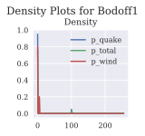

.. code:: ipython3

    uw['CMP']

.. parsed-literal::

    ('agg',
     {'exp_en': 268153.9,
      'freq_a': 0.28,
      'freq_name': 'gamma',
      'name': 'CMP',
      'note': 'US statutory industry commercial multiperil (property and liability), SNL 2017',
      'sev_cv': 0.5,
      'sev_mean': 100000.0,
      'sev_name': 'lognorm',
      'sev_wt': 1})

.. code:: ipython3

    ob = uw('agg MYCMP 0.01 *agg.CMP')
    ob.easy_update()
    ob.plot()

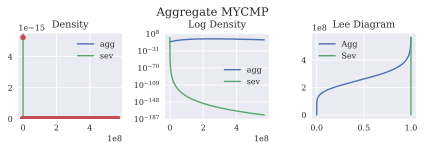

.. code:: ipython3

    ob

.. raw:: html

    <h3>Aggregate object: MYCMP</h3>
    Claim count 268,153.90, gamma distribution 
    Severity: lognorm distribution, unlimited 
    Updated with bucket size 69047.42 and log2 = 13

    
    <table border="1" class="dataframe">
      <thead>
        <tr style="text-align: right;">
          <th></th>
          <th>E(X)</th>
          <th>Est E(X)</th>
          <th>Err E(X)</th>
          <th>CV(X)</th>
          <th>Est CV(X)</th>
          <th>Err CV(X)</th>
          <th>Skew(X)</th>
        </tr>
        <tr>
          <th>X</th>
          <th></th>
          <th></th>
          <th></th>
          <th></th>
          <th></th>
          <th></th>
          <th></th>
        </tr>
      </thead>
      <tbody>
        <tr>
          <th>Sev</th>
          <td>1000.0</td>
          <td></td>
          <td></td>
          <td>0.500000</td>
          <td></td>
          <td></td>
          <td>1.625</td>
        </tr>
        <tr>
          <th>Freq</th>
          <td>268153.9</td>
          <td></td>
          <td></td>
          <td>0.280007</td>
          <td></td>
          <td></td>
          <td>0.560</td>
        </tr>
        <tr>
          <th>Agg</th>
          <td>268153900.0</td>
          <td>2.67818e+08</td>
          <td>-0.00125137</td>
          <td>0.280008</td>
          <td>0.277656</td>
          <td>-0.00840263</td>
          <td>0.560</td>
        </tr>
      </tbody>
    </table>
    

.. code:: ipython3

    sv = agg.Severity('lognorm', sev_mean = 1000, sev_cv = 0.5)

.. code:: ipython3

    sv.plot()

.. image:: output_41_0.svg

.. code:: ipython3

    c = uw.write('port test agg myCMP 0.01 * agg.CMP') 

.. code:: ipython3

    c.recommend_bucket()

.. raw:: html

    

    
    <table border="1" class="dataframe">
      <thead>
        <tr style="text-align: right;">
          <th></th>
          <th>bs10</th>
          <th>bs11</th>
          <th>bs12</th>
          <th>bs13</th>
          <th>bs14</th>
          <th>bs15</th>
          <th>bs16</th>
          <th>bs18</th>
          <th>bs20</th>
        </tr>
        <tr>
          <th>line</th>
          <th></th>
          <th></th>
          <th></th>
          <th></th>
          <th></th>
          <th></th>
          <th></th>
          <th></th>
          <th></th>
        </tr>
      </thead>
      <tbody>
        <tr>
          <th>myCMP</th>
          <td>552379.384854</td>
          <td>276189.692427</td>
          <td>138094.846214</td>
          <td>69047.423107</td>
          <td>34523.711553</td>
          <td>17261.855777</td>
          <td>8630.927888</td>
          <td>2157.731972</td>
          <td>539.432993</td>
        </tr>
        <tr>
          <th>total</th>
          <td>552379.384854</td>
          <td>276189.692427</td>
          <td>138094.846214</td>
          <td>69047.423107</td>
          <td>34523.711553</td>
          <td>17261.855777</td>
          <td>8630.927888</td>
          <td>2157.731972</td>
          <td>539.432993</td>
        </tr>
      </tbody>
    </table>
    

.. code:: ipython3

    c.update(log2=13, bs=100000)

.. code:: ipython3

    c.plot(subplots=True, height=4)

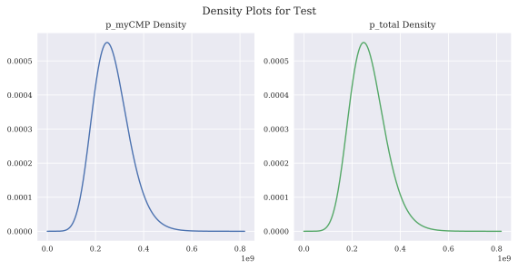

.. code:: ipython3

    c

.. raw:: html

    <h2>Portfolio object: test</h2>
    Portfolio contains 1 aggregate component
    

    
    <table border="1" class="dataframe">
      <thead>
        <tr style="text-align: right;">
          <th></th>
          <th>myCMP</th>
          <th>total</th>
        </tr>
      </thead>
      <tbody>
        <tr>
          <th>(freq, mean)</th>
          <td>268154</td>
          <td>268154</td>
        </tr>
        <tr>
          <th>(freq, cv)</th>
          <td>0.280007</td>
          <td>0.280007</td>
        </tr>
        <tr>
          <th>(freq, skew)</th>
          <td>0.56</td>
          <td>0.56</td>
        </tr>
        <tr>
          <th>(sev, mean)</th>
          <td>1000</td>
          <td>1000</td>
        </tr>
        <tr>
          <th>(sev, cv)</th>
          <td>0.5</td>
          <td>0.5</td>
        </tr>
        <tr>
          <th>(sev, skew)</th>
          <td>1.625</td>
          <td>1.625</td>
        </tr>
        <tr>
          <th>(agg, mean)</th>
          <td>2.68154e+08</td>
          <td>2.68154e+08</td>
        </tr>
        <tr>
          <th>(agg, cv)</th>
          <td>0.280008</td>
          <td>0.280008</td>
        </tr>
        <tr>
          <th>(agg, skew)</th>
          <td>0.56</td>
          <td>0.56</td>
        </tr>
        <tr>
          <th>Mean</th>
          <td>2.68154e+08</td>
          <td>2.68154e+08</td>
        </tr>
        <tr>
          <th>EmpMean</th>
          <td>2.68153e+08</td>
          <td>2.68153e+08</td>
        </tr>
        <tr>
          <th>MeanErr</th>
          <td>-2.00991e-06</td>
          <td>-2.00991e-06</td>
        </tr>
        <tr>
          <th>CV</th>
          <td>0.280008</td>
          <td>0.280008</td>
        </tr>
        <tr>
          <th>EmpCV</th>
          <td>0.280001</td>
          <td>0.280001</td>
        </tr>
        <tr>
          <th>CVErr</th>
          <td>-2.57259e-05</td>
          <td>-2.57259e-05</td>
        </tr>
        <tr>
          <th>P99.0</th>
          <td>4.737e+08</td>
          <td>4.737e+08</td>
        </tr>
      </tbody>
    </table>
    

.. code:: ipython3

    biz = uw['Homeowners'] 
    print(f'Type: {type(biz)}\nstr:  {biz}\nrepr: {repr(biz)}')
    display(biz)

.. parsed-literal::

    Type: <class 'tuple'>
    str:  ('agg', {'name': 'Homeowners', 'exp_en': 4337346.31, 'exp_attachment': 0.0, 'exp_limit': 2500.0, 'sev_name': 'lognorm', 'sev_mean': 15.0, 'sev_cv': 0.5, 'sev_wt': 1, 'freq_name': 'gamma', 'freq_a': 0.24, 'note': 'US statutory industry homeowners, SNL 2017'})
    repr: ('agg', {'name': 'Homeowners', 'exp_en': 4337346.31, 'exp_attachment': 0.0, 'exp_limit': 2500.0, 'sev_name': 'lognorm', 'sev_mean': 15.0, 'sev_cv': 0.5, 'sev_wt': 1, 'freq_name': 'gamma', 'freq_a': 0.24, 'note': 'US statutory industry homeowners, SNL 2017'})
    

.. parsed-literal::

    ('agg',
     {'exp_attachment': 0.0,
      'exp_en': 4337346.31,
      'exp_limit': 2500.0,
      'freq_a': 0.24,
      'freq_name': 'gamma',
      'name': 'Homeowners',
      'note': 'US statutory industry homeowners, SNL 2017',
      'sev_cv': 0.5,
      'sev_mean': 15.0,
      'sev_name': 'lognorm',
      'sev_wt': 1})

.. code:: ipython3

    biz = uw('Homeowners')
    print(f'Type: {type(biz)}\nstr:  {biz}\nrepr: {repr(biz)}')
    display(biz)

.. parsed-literal::

    Type: <class 'aggregate.distr.Aggregate'>
    str:  Aggregate: Homeowners
    	EN=4337346.31, CV(N)=0.240
    	1 severity, EX=15.0, ' CV(X)=0.500
    	EA=65,060,194.7, CV=0.240
    repr: <aggregate.distr.Aggregate object at 0x0000024C464ABEE8>
    

.. raw:: html

    <h3>Aggregate object: Homeowners</h3>
    Claim count 4,337,346.31, gamma distribution 
    Severity: lognorm[2,500 xs 0] distribution, 2500.0 xs 0.0 

    
    <table border="1" class="dataframe">
      <thead>
        <tr style="text-align: right;">
          <th></th>
          <th>E(X)</th>
          <th>CV(X)</th>
          <th>Skew(X)</th>
        </tr>
        <tr>
          <th>X</th>
          <th></th>
          <th></th>
          <th></th>
        </tr>
      </thead>
      <tbody>
        <tr>
          <th>Sev</th>
          <td>15.00</td>
          <td>0.500000</td>
          <td>1.625</td>
        </tr>
        <tr>
          <th>Freq</th>
          <td>4337346.31</td>
          <td>0.240000</td>
          <td>0.480</td>
        </tr>
        <tr>
          <th>Agg</th>
          <td>65060194.65</td>
          <td>0.240001</td>
          <td>0.480</td>
        </tr>
      </tbody>
    </table>
    

.. code:: ipython3

    biz.easy_update(10)
    print(f'Type: {type(biz)}\nstr:  {biz}\nrepr: {repr(biz)}')
    display(biz)
    biz.report('audit')

.. parsed-literal::

    Type: <class 'aggregate.distr.Aggregate'>
    str:  Aggregate: Homeowners
    	EN=4337346.31, CV(N)=0.240
    	1 severity, EX=15.0, ' CV(X)=0.500
    	EA=65,060,194.7, CV=0.240
    repr: <aggregate.distr.Aggregate object at 0x0000024C464ABEE8>
    

.. raw:: html

    <h3>Aggregate object: Homeowners</h3>
    Claim count 4,337,346.31, gamma distribution 
    Severity: lognorm[2,500 xs 0] distribution, 2500.0 xs 0.0 
    Updated with bucket size 121943.52 and log2 = 10

    
    <table border="1" class="dataframe">
      <thead>
        <tr style="text-align: right;">
          <th></th>
          <th>E(X)</th>
          <th>Est E(X)</th>
          <th>Err E(X)</th>
          <th>CV(X)</th>
          <th>Est CV(X)</th>
          <th>Err CV(X)</th>
          <th>Skew(X)</th>
        </tr>
        <tr>
          <th>X</th>
          <th></th>
          <th></th>
          <th></th>
          <th></th>
          <th></th>
          <th></th>
          <th></th>
        </tr>
      </thead>
      <tbody>
        <tr>
          <th>Sev</th>
          <td>15.00</td>
          <td></td>
          <td></td>
          <td>0.500000</td>
          <td></td>
          <td></td>
          <td>1.625</td>
        </tr>
        <tr>
          <th>Freq</th>
          <td>4337346.31</td>
          <td></td>
          <td></td>
          <td>0.240000</td>
          <td></td>
          <td></td>
          <td>0.480</td>
        </tr>
        <tr>
          <th>Agg</th>
          <td>65060194.65</td>
          <td>6.49926e+07</td>
          <td>-0.00103864</td>
          <td>0.240001</td>
          <td>0.238106</td>
          <td>-0.00789507</td>
          <td>0.480</td>
        </tr>
      </tbody>
    </table>
    

.. raw:: html

    <h1> Homeowners Audit Report

.. raw:: html

    

    
    <table border="1" class="dataframe">
      <thead>
        <tr style="text-align: right;">
          <th></th>
          <th>name</th>
          <th>limit</th>
          <th>attachment</th>
          <th>el</th>
          <th>freq_1</th>
          <th>sev_1</th>
          <th>agg_m</th>
          <th>agg_cv</th>
          <th>agg_skew</th>
          <th>emp_sev_1</th>
          <th>emp_sev_cv</th>
          <th>emp_agg_1</th>
          <th>emp_agg_cv</th>
        </tr>
      </thead>
      <tbody>
        <tr>
          <th>0</th>
          <td>Homeowners</td>
          <td>2500</td>
          <td>0</td>
          <td>6.50602e+07</td>
          <td>4.33735e+06</td>
          <td>15</td>
          <td>6.50602e+07</td>
          <td>0.240001</td>
          <td>0.48</td>
          <td>NaN</td>
          <td>NaN</td>
          <td>NaN</td>
          <td>NaN</td>
        </tr>
        <tr>
          <th>mixed</th>
          <td>Homeowners</td>
          <td>2500</td>
          <td>0</td>
          <td>6.50602e+07</td>
          <td>4.33735e+06</td>
          <td>15</td>
          <td>6.50602e+07</td>
          <td>0.240001</td>
          <td>0.48</td>
          <td>NaN</td>
          <td>NaN</td>
          <td>6.499262e+07</td>
          <td>0.238106</td>
        </tr>
      </tbody>
    </table>
    

.. code:: ipython3

    biz.recommend_bucket(verbose=True)

.. parsed-literal::

    Recommended bucket size with 1024 buckets: 121,944
    Recommended bucket size with 8192 buckets: 15,243
    Recommended bucket size with 65536 buckets: 1,905
    Bucket size set with 1024 buckets at 121,944
    

.. parsed-literal::

    121943.52258735427

.. code:: ipython3

    biz.easy_update(10, verbose=True)

.. raw:: html

    

    
    <table border="1" class="dataframe">
      <thead>
        <tr style="text-align: right;">
          <th></th>
          <th>limit</th>
          <th>attachment</th>
          <th>emp ex1</th>
          <th>emp cv</th>
          <th>freq_1</th>
          <th>sev_1</th>
          <th>sev_cv</th>
          <th>freq_cv</th>
          <th>abs sev err</th>
          <th>rel sev err</th>
        </tr>
        <tr>
          <th>n</th>
          <th></th>
          <th></th>
          <th></th>
          <th></th>
          <th></th>
          <th></th>
          <th></th>
          <th></th>
          <th></th>
          <th></th>
        </tr>
      </thead>
      <tbody>
        <tr>
          <th>0</th>
          <td>NaN</td>
          <td>NaN</td>
          <td>NaN</td>
          <td>NaN</td>
          <td>4.33735e+06</td>
          <td>15</td>
          <td>0.5</td>
          <td>0.24</td>
          <td>NaN</td>
          <td>NaN</td>
        </tr>
        <tr>
          <th>10001</th>
          <td>NaN</td>
          <td>NaN</td>
          <td>NaN</td>
          <td>NaN</td>
          <td>4.33735e+06</td>
          <td>15</td>
          <td>0.5</td>
          <td>0.24</td>
          <td>NaN</td>
          <td>NaN</td>
        </tr>
      </tbody>
    </table>
    

.. image:: output_51_1.svg

.. code:: ipython3

    biz.audit_df

.. raw:: html

    

    
    <table border="1" class="dataframe">
      <thead>
        <tr style="text-align: right;">
          <th></th>
          <th>name</th>
          <th>limit</th>
          <th>attachment</th>
          <th>el</th>
          <th>freq_1</th>
          <th>sev_1</th>
          <th>agg_m</th>
          <th>agg_cv</th>
          <th>agg_skew</th>
          <th>emp_sev_1</th>
          <th>emp_sev_cv</th>
          <th>emp_agg_1</th>
          <th>emp_agg_cv</th>
        </tr>
      </thead>
      <tbody>
        <tr>
          <th>0</th>
          <td>Homeowners</td>
          <td>2500</td>
          <td>0</td>
          <td>6.50602e+07</td>
          <td>4.33735e+06</td>
          <td>15</td>
          <td>6.50602e+07</td>
          <td>0.240001</td>
          <td>0.48</td>
          <td>NaN</td>
          <td>NaN</td>
          <td>NaN</td>
          <td>NaN</td>
        </tr>
        <tr>
          <th>mixed</th>
          <td>Homeowners</td>
          <td>2500</td>
          <td>0</td>
          <td>6.50602e+07</td>
          <td>4.33735e+06</td>
          <td>15</td>
          <td>6.50602e+07</td>
          <td>0.240001</td>
          <td>0.48</td>
          <td>NaN</td>
          <td>NaN</td>
          <td>6.499262e+07</td>
          <td>0.238106</td>
        </tr>
      </tbody>
    </table>
    

.. code:: ipython3

    biz.report('all')

.. raw:: html

    <h1> Homeowners Quick Report (Theoretic)

.. raw:: html

    

    
    <table border="1" class="dataframe">
      <thead>
        <tr>
          <th></th>
          <th colspan="8" halign="left">Homeowners</th>
        </tr>
        <tr>
          <th>measure</th>
          <th>P99.9e</th>
          <th>cv</th>
          <th>ex1</th>
          <th>ex2</th>
          <th>ex3</th>
          <th>limit</th>
          <th>mean</th>
          <th>skew</th>
        </tr>
        <tr>
          <th>component</th>
          <th></th>
          <th></th>
          <th></th>
          <th></th>
          <th></th>
          <th></th>
          <th></th>
          <th></th>
        </tr>
      </thead>
      <tbody>
        <tr>
          <th>agg</th>
          <td>1.248702e+08</td>
          <td>0.240001</td>
          <td>65060194.65</td>
          <td>4.476641e+15</td>
          <td>3.248034e+23</td>
          <td>2500.0</td>
          <td>65060194.65</td>
          <td>0.480</td>
        </tr>
        <tr>
          <th>freq</th>
          <td>NaN</td>
          <td>0.240000</td>
          <td>4337346.31</td>
          <td>1.989618e+13</td>
          <td>9.623804e+19</td>
          <td>NaN</td>
          <td>4337346.31</td>
          <td>0.480</td>
        </tr>
        <tr>
          <th>sev</th>
          <td>NaN</td>
          <td>0.500000</td>
          <td>15.00</td>
          <td>2.812500e+02</td>
          <td>6.591797e+03</td>
          <td>NaN</td>
          <td>15.00</td>
          <td>1.625</td>
        </tr>
      </tbody>
    </table>
    

.. raw:: html

    <h1> Homeowners Audit Report

.. raw:: html

    

    
    <table border="1" class="dataframe">
      <thead>
        <tr style="text-align: right;">
          <th></th>
          <th>name</th>
          <th>limit</th>
          <th>attachment</th>
          <th>el</th>
          <th>freq_1</th>
          <th>sev_1</th>
          <th>agg_m</th>
          <th>agg_cv</th>
          <th>agg_skew</th>
          <th>emp_sev_1</th>
          <th>emp_sev_cv</th>
          <th>emp_agg_1</th>
          <th>emp_agg_cv</th>
        </tr>
      </thead>
      <tbody>
        <tr>
          <th>0</th>
          <td>Homeowners</td>
          <td>2500</td>
          <td>0</td>
          <td>6.50602e+07</td>
          <td>4.33735e+06</td>
          <td>15</td>
          <td>6.50602e+07</td>
          <td>0.240001</td>
          <td>0.48</td>
          <td>NaN</td>
          <td>NaN</td>
          <td>NaN</td>
          <td>NaN</td>
        </tr>
        <tr>
          <th>mixed</th>
          <td>Homeowners</td>
          <td>2500</td>
          <td>0</td>
          <td>6.50602e+07</td>
          <td>4.33735e+06</td>
          <td>15</td>
          <td>6.50602e+07</td>
          <td>0.240001</td>
          <td>0.48</td>
          <td>NaN</td>
          <td>NaN</td>
          <td>6.499262e+07</td>
          <td>0.238106</td>
        </tr>
      </tbody>
    </table>
    

.. raw:: html

    <h1> Homeowners Statistics Report

.. raw:: html

    

    
    <table border="1" class="dataframe">
      <thead>
        <tr style="text-align: right;">
          <th></th>
          <th>name</th>
          <th>limit</th>
          <th>attachment</th>
          <th>sevcv_param</th>
          <th>el</th>
          <th>prem</th>
          <th>lr</th>
          <th>freq_1</th>
          <th>freq_2</th>
          <th>freq_3</th>
          <th>freq_m</th>
          <th>freq_cv</th>
          <th>freq_skew</th>
          <th>sev_1</th>
          <th>sev_2</th>
          <th>sev_3</th>
          <th>sev_m</th>
          <th>sev_cv</th>
          <th>sev_skew</th>
          <th>agg_1</th>
          <th>agg_2</th>
          <th>agg_3</th>
          <th>agg_m</th>
          <th>agg_cv</th>
          <th>agg_skew</th>
          <th>mix_cv</th>
          <th>wt</th>
        </tr>
      </thead>
      <tbody>
        <tr>
          <th>0</th>
          <td>Homeowners</td>
          <td>2500</td>
          <td>0</td>
          <td>0.5</td>
          <td>6.50602e+07</td>
          <td>0</td>
          <td>0</td>
          <td>4.33735e+06</td>
          <td>1.98962e+13</td>
          <td>9.6238e+19</td>
          <td>4.33735e+06</td>
          <td>0.24</td>
          <td>0.48</td>
          <td>15</td>
          <td>281.25</td>
          <td>6591.8</td>
          <td>15</td>
          <td>0.5</td>
          <td>1.625</td>
          <td>6.50602e+07</td>
          <td>4.47664e+15</td>
          <td>3.24803e+23</td>
          <td>6.50602e+07</td>
          <td>0.240001</td>
          <td>0.48</td>
          <td>0.24</td>
          <td>1</td>
        </tr>
      </tbody>
    </table>
    

Script Examples
===============

.. code:: ipython3

    s = uw.write('sev MyLN1 12 * lognorm 1; sev MyLN2 12 * lognorm 2; sev MyLN3 12 * lognorm 3; ')

.. code:: ipython3

    uw.describe('severity')

.. raw:: html

    

    
    <table border="1" class="dataframe">
      <thead>
        <tr style="text-align: right;">
          <th></th>
          <th>Type</th>
          <th>Severity</th>
          <th>ESev</th>
          <th>Sev_a</th>
          <th>Sev_b</th>
          <th>EN</th>
          <th>Freq_a</th>
          <th>ELoss</th>
          <th>Notes</th>
        </tr>
        <tr>
          <th>Name</th>
          <th></th>
          <th></th>
          <th></th>
          <th></th>
          <th></th>
          <th></th>
          <th></th>
          <th></th>
          <th></th>
        </tr>
      </thead>
      <tbody>
        <tr>
          <th>directorsA</th>
          <td>severity</td>
          <td>lognorm</td>
          <td>10000000.0</td>
          <td>0.0</td>
          <td>0</td>
          <td>0</td>
          <td>0</td>
          <td>0</td>
          <td>directors and officers liability class a, sigma=1.25</td>
        </tr>
        <tr>
          <th>directorsB</th>
          <td>severity</td>
          <td>lognorm</td>
          <td>10000000.0</td>
          <td>0.0</td>
          <td>0</td>
          <td>0</td>
          <td>0</td>
          <td>0</td>
          <td>directors and officers liability class b, sigma=1.75</td>
        </tr>
        <tr>
          <th>directorsC</th>
          <td>severity</td>
          <td>lognorm</td>
          <td>10000000.0</td>
          <td>0.0</td>
          <td>0</td>
          <td>0</td>
          <td>0</td>
          <td>0</td>
          <td>directors and officers liability class c, sigma=2.00</td>
        </tr>
        <tr>
          <th>cata</th>
          <td>severity</td>
          <td>pareto</td>
          <td>0.0</td>
          <td>2.1</td>
          <td>0</td>
          <td>0</td>
          <td>0</td>
          <td>0</td>
          <td>small cat, pareto 2.1</td>
        </tr>
        <tr>
          <th>catb</th>
          <td>severity</td>
          <td>pareto</td>
          <td>0.0</td>
          <td>1.7</td>
          <td>0</td>
          <td>0</td>
          <td>0</td>
          <td>0</td>
          <td>moderate cat, pareto 1.7</td>
        </tr>
        <tr>
          <th>catc</th>
          <td>severity</td>
          <td>pareto</td>
          <td>0.0</td>
          <td>1.4</td>
          <td>0</td>
          <td>0</td>
          <td>0</td>
          <td>0</td>
          <td>severe cat, pareto 1.4</td>
        </tr>
        <tr>
          <th>catd</th>
          <td>severity</td>
          <td>pareto</td>
          <td>0.0</td>
          <td>1.1</td>
          <td>0</td>
          <td>0</td>
          <td>0</td>
          <td>0</td>
          <td>very severe cat, pareto 1.1</td>
        </tr>
        <tr>
          <th>cate</th>
          <td>severity</td>
          <td>pareto</td>
          <td>0.0</td>
          <td>0.9</td>
          <td>0</td>
          <td>0</td>
          <td>0</td>
          <td>0</td>
          <td>extreme cat, pareto 0.9</td>
        </tr>
        <tr>
          <th>liaba</th>
          <td>severity</td>
          <td>lognorm</td>
          <td>50.0</td>
          <td>0.0</td>
          <td>0</td>
          <td>0</td>
          <td>0</td>
          <td>0</td>
          <td>prems ops A, lognormal cv=1.0</td>
        </tr>
        <tr>
          <th>liabb</th>
          <td>severity</td>
          <td>lognorm</td>
          <td>24.0</td>
          <td>0.0</td>
          <td>0</td>
          <td>0</td>
          <td>0</td>
          <td>0</td>
          <td>prems ops B, lognormal cv=1.5</td>
        </tr>
        <tr>
          <th>liabc</th>
          <td>severity</td>
          <td>lognorm</td>
          <td>50.0</td>
          <td>0.0</td>
          <td>0</td>
          <td>0</td>
          <td>0</td>
          <td>0</td>
          <td>prems ops C, lognormal cv=2.0</td>
        </tr>
        <tr>
          <th>MyLN1</th>
          <td>severity</td>
          <td>lognorm</td>
          <td>0.0</td>
          <td>1.0</td>
          <td>0</td>
          <td>0</td>
          <td>0</td>
          <td>0</td>
          <td></td>
        </tr>
        <tr>
          <th>MyLN2</th>
          <td>severity</td>
          <td>lognorm</td>
          <td>0.0</td>
          <td>2.0</td>
          <td>0</td>
          <td>0</td>
          <td>0</td>
          <td>0</td>
          <td></td>
        </tr>
        <tr>
          <th>MyLN3</th>
          <td>severity</td>
          <td>lognorm</td>
          <td>0.0</td>
          <td>3.0</td>
          <td>0</td>
          <td>0</td>
          <td>0</td>
          <td>0</td>
          <td></td>
        </tr>
      </tbody>
    </table>
    

.. code:: ipython3

    for v in s:
        print(v.moms())
        v.plot()
    print([ 12 * np.exp(x*x/2) for  x in [1,2,3]])

.. parsed-literal::

    (19.78465524839477, 1064.0240782460385, 155549.60288723477)
    (88.66867318549262, 429257.95012824325, 107363355574.23624)
    (1080.2055760001645, 5867615726.256582, 1.7579071533924387e+19)
    [19.784655248401538, 88.668673187167798, 1080.2055756062618]
    

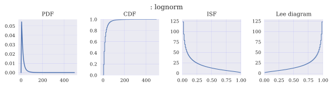

.. image:: output_57_2.svg

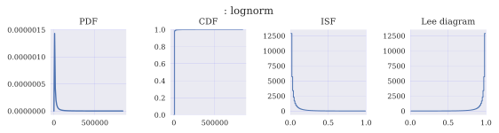

.. code:: ipython3

    uw.update = True
    pf = uw.write('port test: agg PA  0.0085 * agg.PersAuto agg CA: 0.02 * agg.CommAuto agg WC: 0.005 * agg.WorkComp', 
                  log2=16, bs=25e4, remove_fuzz=True, add_exa=False)

.. code:: ipython3

    pf

.. raw:: html

    <h2>Portfolio object: test</h2>
    Portfolio contains 3 aggregate components
    

    
    <table border="1" class="dataframe">
      <thead>
        <tr style="text-align: right;">
          <th></th>
          <th>CA</th>
          <th>PA</th>
          <th>WC</th>
          <th>total</th>
        </tr>
      </thead>
      <tbody>
        <tr>
          <th>(freq, mean)</th>
          <td>5.67607e+06</td>
          <td>5.67607e+06</td>
          <td>2.66434e+06</td>
          <td>1.40165e+07</td>
        </tr>
        <tr>
          <th>(freq, cv)</th>
          <td>0.0800011</td>
          <td>0.0800011</td>
          <td>0.190001</td>
          <td>0.0583398</td>
        </tr>
        <tr>
          <th>(freq, skew)</th>
          <td>0.16</td>
          <td>0.16</td>
          <td>0.38</td>
          <td>0.144957</td>
        </tr>
        <tr>
          <th>(sev, mean)</th>
          <td>600</td>
          <td>393.89</td>
          <td>75</td>
          <td>416.739</td>
        </tr>
        <tr>
          <th>(sev, cv)</th>
          <td>7</td>
          <td>3.79711</td>
          <td>7</td>
          <td>6.84521</td>
        </tr>
        <tr>
          <th>(sev, skew)</th>
          <td>334.643</td>
          <td>10.4951</td>
          <td>355.787</td>
          <td>433.697</td>
        </tr>
        <tr>
          <th>(agg, mean)</th>
          <td>3.40564e+09</td>
          <td>2.23575e+09</td>
          <td>1.99826e+08</td>
          <td>5.84122e+09</td>
        </tr>
        <tr>
          <th>(agg, cv)</th>
          <td>0.080055</td>
          <td>0.080017</td>
          <td>0.190049</td>
          <td>0.0562034</td>
        </tr>
        <tr>
          <th>(agg, skew)</th>
          <td>0.160007</td>
          <td>0.16</td>
          <td>0.380002</td>
          <td>0.118122</td>
        </tr>
        <tr>
          <th>Mean</th>
          <td>3.40564e+09</td>
          <td>2.23575e+09</td>
          <td>1.99826e+08</td>
          <td>5.84122e+09</td>
        </tr>
        <tr>
          <th>EmpMean</th>
          <td>3.40564e+09</td>
          <td>2.23575e+09</td>
          <td>1.99826e+08</td>
          <td>5.84122e+09</td>
        </tr>
        <tr>
          <th>MeanErr</th>
          <td>-8.42659e-14</td>
          <td>-5.26246e-14</td>
          <td>-3.475e-14</td>
          <td>-8.52651e-14</td>
        </tr>
        <tr>
          <th>CV</th>
          <td>0.080055</td>
          <td>0.080017</td>
          <td>0.190049</td>
          <td>0.0562034</td>
        </tr>
        <tr>
          <th>EmpCV</th>
          <td>0.080055</td>
          <td>0.080017</td>
          <td>0.190049</td>
          <td>0.0562034</td>
        </tr>
        <tr>
          <th>CVErr</th>
          <td>2.64655e-12</td>
          <td>1.70064e-12</td>
          <td>-6.77902e-13</td>
          <td>9.1871e-12</td>
        </tr>
        <tr>
          <th>P99.0</th>
          <td>4.07225e+09</td>
          <td>2.673e+09</td>
          <td>2.9875e+08</td>
          <td>6.63375e+09</td>
        </tr>
      </tbody>
    </table>
    

.. code:: ipython3

    pf.report('quick')

.. raw:: html

    <h1> Quick Report

.. raw:: html

      
    <table id="T_02a28698_c4cc_11e8_a4be_c49ded152ae4" > 
    <thead>    <tr> 
            <th class="blank level0" ></th> 
            <th class="col_heading level0 col0" >Mean</th> 
            <th class="col_heading level0 col1" >EmpMean</th> 
            <th class="col_heading level0 col2" >MeanErr</th> 
            <th class="col_heading level0 col3" >CV</th> 
            <th class="col_heading level0 col4" >EmpCV</th> 
            <th class="col_heading level0 col5" >CVErr</th> 
            <th class="col_heading level0 col6" >P99.0</th> 
        </tr></thead> 
    <tbody>    <tr> 
            <th id="T_02a28698_c4cc_11e8_a4be_c49ded152ae4level0_row0" class="row_heading level0 row0" >CA</th> 
            <td id="T_02a28698_c4cc_11e8_a4be_c49ded152ae4row0_col0" class="data row0 col0" >3.40564e+09</td> 
            <td id="T_02a28698_c4cc_11e8_a4be_c49ded152ae4row0_col1" class="data row0 col1" >3.40564e+09</td> 
            <td id="T_02a28698_c4cc_11e8_a4be_c49ded152ae4row0_col2" class="data row0 col2" >-8.42659e-14</td> 
            <td id="T_02a28698_c4cc_11e8_a4be_c49ded152ae4row0_col3" class="data row0 col3" >0.080055</td> 
            <td id="T_02a28698_c4cc_11e8_a4be_c49ded152ae4row0_col4" class="data row0 col4" >0.080055</td> 
            <td id="T_02a28698_c4cc_11e8_a4be_c49ded152ae4row0_col5" class="data row0 col5" >2.64655e-12</td> 
            <td id="T_02a28698_c4cc_11e8_a4be_c49ded152ae4row0_col6" class="data row0 col6" >4.07225e+09</td> 
        </tr>    <tr> 
            <th id="T_02a28698_c4cc_11e8_a4be_c49ded152ae4level0_row1" class="row_heading level0 row1" >PA</th> 
            <td id="T_02a28698_c4cc_11e8_a4be_c49ded152ae4row1_col0" class="data row1 col0" >2.23575e+09</td> 
            <td id="T_02a28698_c4cc_11e8_a4be_c49ded152ae4row1_col1" class="data row1 col1" >2.23575e+09</td> 
            <td id="T_02a28698_c4cc_11e8_a4be_c49ded152ae4row1_col2" class="data row1 col2" >-5.26246e-14</td> 
            <td id="T_02a28698_c4cc_11e8_a4be_c49ded152ae4row1_col3" class="data row1 col3" >0.080017</td> 
            <td id="T_02a28698_c4cc_11e8_a4be_c49ded152ae4row1_col4" class="data row1 col4" >0.080017</td> 
            <td id="T_02a28698_c4cc_11e8_a4be_c49ded152ae4row1_col5" class="data row1 col5" >1.70064e-12</td> 
            <td id="T_02a28698_c4cc_11e8_a4be_c49ded152ae4row1_col6" class="data row1 col6" >2.673e+09</td> 
        </tr>    <tr> 
            <th id="T_02a28698_c4cc_11e8_a4be_c49ded152ae4level0_row2" class="row_heading level0 row2" >WC</th> 
            <td id="T_02a28698_c4cc_11e8_a4be_c49ded152ae4row2_col0" class="data row2 col0" >1.99826e+08</td> 
            <td id="T_02a28698_c4cc_11e8_a4be_c49ded152ae4row2_col1" class="data row2 col1" >1.99826e+08</td> 
            <td id="T_02a28698_c4cc_11e8_a4be_c49ded152ae4row2_col2" class="data row2 col2" >-3.475e-14</td> 
            <td id="T_02a28698_c4cc_11e8_a4be_c49ded152ae4row2_col3" class="data row2 col3" >0.190049</td> 
            <td id="T_02a28698_c4cc_11e8_a4be_c49ded152ae4row2_col4" class="data row2 col4" >0.190049</td> 
            <td id="T_02a28698_c4cc_11e8_a4be_c49ded152ae4row2_col5" class="data row2 col5" >-6.77902e-13</td> 
            <td id="T_02a28698_c4cc_11e8_a4be_c49ded152ae4row2_col6" class="data row2 col6" >2.9875e+08</td> 
        </tr>    <tr> 
            <th id="T_02a28698_c4cc_11e8_a4be_c49ded152ae4level0_row3" class="row_heading level0 row3" >total</th> 
            <td id="T_02a28698_c4cc_11e8_a4be_c49ded152ae4row3_col0" class="data row3 col0" >5.84122e+09</td> 
            <td id="T_02a28698_c4cc_11e8_a4be_c49ded152ae4row3_col1" class="data row3 col1" >5.84122e+09</td> 
            <td id="T_02a28698_c4cc_11e8_a4be_c49ded152ae4row3_col2" class="data row3 col2" >-8.52651e-14</td> 
            <td id="T_02a28698_c4cc_11e8_a4be_c49ded152ae4row3_col3" class="data row3 col3" >0.0562034</td> 
            <td id="T_02a28698_c4cc_11e8_a4be_c49ded152ae4row3_col4" class="data row3 col4" >0.0562034</td> 
            <td id="T_02a28698_c4cc_11e8_a4be_c49ded152ae4row3_col5" class="data row3 col5" >9.1871e-12</td> 
            <td id="T_02a28698_c4cc_11e8_a4be_c49ded152ae4row3_col6" class="data row3 col6" >6.63375e+09</td> 
        </tr></tbody> 
    </table> 

.. code:: ipython3

    pf._add_exa()
    pf.plot('audit', aspect=1.4, height=2.25)

.. image:: output_61_0.svg

More complex program
--------------------

.. code:: ipython3

    uw.update=True
    uw.log2 = 13
    uw.bs = 0.25
    uw
    warnings.simplefilter('always')

.. code:: ipython3

    ans = uw.write("""port MyFirstPortfolio
        agg A1: 50  claims          sev gamma 12 cv .30 (mixed gamma 0.014)
        agg A2: 50  claims 30 xs 10 sev gamma 12 cv .30 (mixed gamma 0.014)
        agg A3: 50  claims          sev gamma 12 cv 1.30 (mixed gamma 0.014)
        agg A4: 50  claims 30 xs 20 sev gamma 12 cv 1.30 (mixed gamma 0.14)
        agg B 15 claims 15 xs 15 sev lognorm 12 cv 1.5 + 2 mixed gamma 4.8
        agg Cat 1.7 claims 25 xs 5  sev 25 * pareto 1.3 0 - 25 poisson 
        agg ppa: 1e-8 * agg.PPAL
    """, add_exa=False, remove_fuzz=True, trim_df=False)

.. code:: ipython3

    ans

.. raw:: html

    <h2>Portfolio object: MyFirstPortfolio</h2>
    Portfolio contains 7 aggregate components
    

    
    <table border="1" class="dataframe">
      <thead>
        <tr style="text-align: right;">
          <th></th>
          <th>A1</th>
          <th>A2</th>
          <th>A3</th>
          <th>A4</th>
          <th>B</th>
          <th>Cat</th>
          <th>ppa</th>
          <th>total</th>
        </tr>
      </thead>
      <tbody>
        <tr>
          <th>(freq, mean)</th>
          <td>50</td>
          <td>50</td>
          <td>50</td>
          <td>50</td>
          <td>15</td>
          <td>1.7</td>
          <td>5.67607e+06</td>
          <td>5.67629e+06</td>
        </tr>
        <tr>
          <th>(freq, cv)</th>
          <td>0.142113</td>
          <td>0.142113</td>
          <td>0.142113</td>
          <td>0.198997</td>
          <td>4.80694</td>
          <td>0.766965</td>
          <td>0.0800011</td>
          <td>0.079998</td>
        </tr>
        <tr>
          <th>(freq, skew)</th>
          <td>0.143492</td>
          <td>0.143492</td>
          <td>0.143492</td>
          <td>0.297491</td>
          <td>9.60001</td>
          <td>0.766965</td>
          <td>0.16</td>
          <td>0.16</td>
        </tr>
        <tr>
          <th>(sev, mean)</th>
          <td>12</td>
          <td>3.74292</td>
          <td>12</td>
          <td>13.9879</td>
          <td>9.1605</td>
          <td>16.6266</td>
          <td>5e-05</td>
          <td>0.000446774</td>
        </tr>
        <tr>
          <th>(sev, cv)</th>
          <td>0.3</td>
          <td>0.770578</td>
          <td>1.3</td>
          <td>0.741206</td>
          <td>0.603813</td>
          <td>0.554485</td>
          <td>9.95545</td>
          <td>201.103</td>
        </tr>
        <tr>
          <th>(sev, skew)</th>
          <td>0.6</td>
          <td>1.16227</td>
          <td>2.6</td>
          <td>0.373609</td>
          <td>-0.237051</td>
          <td>-0.489896</td>
          <td>1044.01</td>
          <td>378.632</td>
        </tr>
        <tr>
          <th>(agg, mean)</th>
          <td>600</td>
          <td>187.146</td>
          <td>600</td>
          <td>699.395</td>
          <td>137.407</td>
          <td>28.2652</td>
          <td>283.804</td>
          <td>2536.02</td>
        </tr>
        <tr>
          <th>(agg, cv)</th>
          <td>0.14831</td>
          <td>0.179086</td>
          <td>0.23237</td>
          <td>0.224917</td>
          <td>4.80947</td>
          <td>0.876978</td>
          <td>0.0801102</td>
          <td>0.27633</td>
        </tr>
        <tr>
          <th>(agg, skew)</th>
          <td>0.161661</td>
          <td>0.234015</td>
          <td>0.378143</td>
          <td>0.326112</td>
          <td>9.60003</td>
          <td>0.943368</td>
          <td>0.160062</td>
          <td>8.05816</td>
        </tr>
        <tr>
          <th>Mean</th>
          <td>600</td>
          <td>187.146</td>
          <td>600</td>
          <td>699.395</td>
          <td>137.407</td>
          <td>28.2652</td>
          <td>283.804</td>
          <td>2536.02</td>
        </tr>
        <tr>
          <th>EmpMean</th>
          <td>600</td>
          <td>186.374</td>
          <td>598.921</td>
          <td>701.038</td>
          <td>134.814</td>
          <td>28.7851</td>
          <td>283.804</td>
          <td>2529.02</td>
        </tr>
        <tr>
          <th>MeanErr</th>
          <td>-1.09597e-09</td>
          <td>-0.00412704</td>
          <td>-0.00179757</td>
          <td>0.00234841</td>
          <td>-0.0188717</td>
          <td>0.0183923</td>
          <td>-1.55431e-15</td>
          <td>-0.00275784</td>
        </tr>
        <tr>
          <th>CV</th>
          <td>0.14831</td>
          <td>0.179086</td>
          <td>0.23237</td>
          <td>0.224917</td>
          <td>4.80947</td>
          <td>0.876978</td>
          <td>0.0801102</td>
          <td>0.27633</td>
        </tr>
        <tr>
          <th>EmpCV</th>
          <td>0.1484</td>
          <td>0.180586</td>
          <td>0.23284</td>
          <td>0.225158</td>
          <td>4.64681</td>
          <td>0.879776</td>
          <td>0.0801102</td>
          <td>0.254087</td>
        </tr>
        <tr>
          <th>CVErr</th>
          <td>0.000600397</td>
          <td>0.0083731</td>
          <td>0.00202107</td>
          <td>0.00107112</td>
          <td>-0.0338205</td>
          <td>0.00319053</td>
          <td>-1.24345e-14</td>
          <td>-0.080494</td>
        </tr>
        <tr>
          <th>P99.0</th>
          <td>817.381</td>
          <td>270.446</td>
          <td>960.914</td>
          <td>1105.96</td>
          <td>3171.32</td>
          <td>102.739</td>
          <td>339.946</td>
          <td>5587.2</td>
        </tr>
      </tbody>
    </table>
    

.. code:: ipython3

    ans.statistics_df

.. raw:: html

    

    
    <table border="1" class="dataframe">
      <thead>
        <tr style="text-align: right;">
          <th></th>
          <th></th>
          <th>A1</th>
          <th>A2</th>
          <th>A3</th>
          <th>A4</th>
          <th>B</th>
          <th>Cat</th>
          <th>ppa</th>
          <th>total</th>
        </tr>
        <tr>
          <th>component</th>
          <th>measure</th>
          <th></th>
          <th></th>
          <th></th>
          <th></th>
          <th></th>
          <th></th>
          <th></th>
          <th></th>
        </tr>
      </thead>
      <tbody>
        <tr>
          <th rowspan="6" valign="top">freq</th>
          <th>ex1</th>
          <td>5.000000e+01</td>
          <td>5.000000e+01</td>
          <td>5.000000e+01</td>
          <td>5.000000e+01</td>
          <td>1.500000e+01</td>
          <td>1.700000</td>
          <td>5.676073e+06</td>
          <td>5.676290e+06</td>
        </tr>
        <tr>
          <th>ex2</th>
          <td>2.550490e+03</td>
          <td>2.550490e+03</td>
          <td>2.550490e+03</td>
          <td>2.599000e+03</td>
          <td>5.424000e+03</td>
          <td>4.590000</td>
          <td>3.242401e+13</td>
          <td>3.242647e+13</td>
        </tr>
        <tr>
          <th>ex3</th>
          <td>1.326250e+05</td>
          <td>1.326250e+05</td>
          <td>1.326250e+05</td>
          <td>1.401430e+05</td>
          <td>3.836078e+06</td>
          <td>15.283000</td>
          <td>1.863968e+20</td>
          <td>1.864179e+20</td>
        </tr>
        <tr>
          <th>mean</th>
          <td>5.000000e+01</td>
          <td>5.000000e+01</td>
          <td>5.000000e+01</td>
          <td>5.000000e+01</td>
          <td>1.500000e+01</td>
          <td>1.700000</td>
          <td>5.676073e+06</td>
          <td>5.676290e+06</td>
        </tr>
        <tr>
          <th>cv</th>
          <td>1.421126e-01</td>
          <td>1.421126e-01</td>
          <td>1.421126e-01</td>
          <td>1.989975e-01</td>
          <td>4.806939e+00</td>
          <td>0.766965</td>
          <td>8.000110e-02</td>
          <td>7.999805e-02</td>
        </tr>
        <tr>
          <th>skew</th>
          <td>1.434918e-01</td>
          <td>1.434918e-01</td>
          <td>1.434918e-01</td>
          <td>2.974912e-01</td>
          <td>9.600010e+00</td>
          <td>0.766965</td>
          <td>1.600000e-01</td>
          <td>1.600000e-01</td>
        </tr>
        <tr>
          <th rowspan="6" valign="top">sev</th>
          <th>ex1</th>
          <td>1.200000e+01</td>
          <td>3.742924e+00</td>
          <td>1.200000e+01</td>
          <td>1.398791e+01</td>
          <td>9.160499e+00</td>
          <td>16.626589</td>
          <td>5.000004e-05</td>
          <td>4.467739e-04</td>
        </tr>
        <tr>
          <th>ex2</th>
          <td>1.569600e+02</td>
          <td>2.232818e+01</td>
          <td>3.873600e+02</td>
          <td>3.031554e+02</td>
          <td>1.145092e+02</td>
          <td>361.436887</td>
          <td>2.502777e-07</td>
          <td>8.072822e-03</td>
        </tr>
        <tr>
          <th>ex3</th>
          <td>2.222554e+03</td>
          <td>1.737314e+02</td>
          <td>2.035964e+04</td>
          <td>7.664118e+03</td>
          <td>1.569368e+03</td>
          <td>8451.896373</td>
          <td>1.288018e-07</td>
          <td>2.746357e-01</td>
        </tr>
        <tr>
          <th>mean</th>
          <td>1.200000e+01</td>
          <td>3.742924e+00</td>
          <td>1.200000e+01</td>
          <td>1.398791e+01</td>
          <td>9.160499e+00</td>
          <td>16.626589</td>
          <td>5.000004e-05</td>
          <td>4.467739e-04</td>
        </tr>
        <tr>
          <th>cv</th>
          <td>3.000000e-01</td>
          <td>7.705784e-01</td>
          <td>1.300000e+00</td>
          <td>7.412060e-01</td>
          <td>6.038127e-01</td>
          <td>0.554485</td>
          <td>9.955448e+00</td>
          <td>2.011035e+02</td>
        </tr>
        <tr>
          <th>skew</th>
          <td>6.000000e-01</td>
          <td>1.162266e+00</td>
          <td>2.600000e+00</td>
          <td>3.736092e-01</td>
          <td>-2.370509e-01</td>
          <td>-0.489896</td>
          <td>1.044006e+03</td>
          <td>3.786325e+02</td>
        </tr>
        <tr>
          <th rowspan="8" valign="top">agg</th>
          <th>ex1</th>
          <td>6.000000e+02</td>
          <td>1.871462e+02</td>
          <td>6.000000e+02</td>
          <td>6.993954e+02</td>
          <td>1.374075e+02</td>
          <td>28.265201</td>
          <td>2.838039e+02</td>
          <td>2.536018e+03</td>
        </tr>
        <tr>
          <th>ex2</th>
          <td>3.679186e+05</td>
          <td>3.614697e+04</td>
          <td>3.794386e+05</td>
          <td>5.138991e+05</td>
          <td>4.556125e+05</td>
          <td>1413.364318</td>
          <td>8.106155e+04</td>
          <td>6.922477e+06</td>
        </tr>
        <tr>
          <th>ex3</th>
          <td>2.303673e+08</td>
          <td>7.194012e+06</td>
          <td>2.520142e+08</td>
          <td>3.953014e+08</td>
          <td>2.953357e+09</td>
          <td>89051.944675</td>
          <td>2.330086e+07</td>
          <td>2.281951e+10</td>
        </tr>
        <tr>
          <th>mean</th>
          <td>6.000000e+02</td>
          <td>1.871462e+02</td>
          <td>6.000000e+02</td>
          <td>6.993954e+02</td>
          <td>1.374075e+02</td>
          <td>28.265201</td>
          <td>2.838039e+02</td>
          <td>2.536018e+03</td>
        </tr>
        <tr>
          <th>cv</th>
          <td>1.483105e-01</td>
          <td>1.790861e-01</td>
          <td>2.323704e-01</td>
          <td>2.249172e-01</td>
          <td>4.809467e+00</td>
          <td>0.876978</td>
          <td>8.011016e-02</td>
          <td>2.763297e-01</td>
        </tr>
        <tr>
          <th>skew</th>
          <td>1.616606e-01</td>
          <td>2.340151e-01</td>
          <td>3.781433e-01</td>
          <td>3.261119e-01</td>
          <td>9.600026e+00</td>
          <td>0.943368</td>
          <td>1.600618e-01</td>
          <td>8.058160e+00</td>
        </tr>
        <tr>
          <th>limit</th>
          <td>inf</td>
          <td>3.000000e+01</td>
          <td>inf</td>
          <td>3.000000e+01</td>
          <td>1.500000e+01</td>
          <td>25.000000</td>
          <td>inf</td>
          <td>inf</td>
        </tr>
        <tr>
          <th>P99.9e</th>
          <td>8.961279e+02</td>
          <td>3.023859e+02</td>
          <td>1.111052e+03</td>
          <td>1.262958e+03</td>
          <td>8.302744e+03</td>
          <td>142.377231</td>
          <td>3.594082e+02</td>
          <td>1.059784e+04</td>
        </tr>
      </tbody>
    </table>
    

.. code:: ipython3

    ans.recommend_bucket()

.. raw:: html

    

    
    <table border="1" class="dataframe">
      <thead>
        <tr style="text-align: right;">
          <th></th>
          <th>bs10</th>
          <th>bs11</th>
          <th>bs12</th>
          <th>bs13</th>
          <th>bs14</th>
          <th>bs15</th>
          <th>bs16</th>
          <th>bs18</th>
          <th>bs20</th>
        </tr>
        <tr>
          <th>line</th>
          <th></th>
          <th></th>
          <th></th>
          <th></th>
          <th></th>
          <th></th>
          <th></th>
          <th></th>
          <th></th>
        </tr>
      </thead>
      <tbody>
        <tr>
          <th>A1</th>
          <td>0.875125</td>
          <td>0.437562</td>
          <td>0.218781</td>
          <td>0.109391</td>
          <td>0.054695</td>
          <td>0.027348</td>
          <td>0.013674</td>
          <td>0.003418</td>
          <td>0.000855</td>
        </tr>
        <tr>
          <th>A2</th>
          <td>0.295299</td>
          <td>0.147649</td>
          <td>0.073825</td>
          <td>0.036912</td>
          <td>0.018456</td>
          <td>0.009228</td>
          <td>0.004614</td>
          <td>0.001154</td>
          <td>0.000288</td>
        </tr>
        <tr>
          <th>A3</th>
          <td>1.085012</td>
          <td>0.542506</td>
          <td>0.271253</td>
          <td>0.135626</td>
          <td>0.067813</td>
          <td>0.033907</td>
          <td>0.016953</td>
          <td>0.004238</td>
          <td>0.001060</td>
        </tr>
        <tr>
          <th>A4</th>
          <td>1.233357</td>
          <td>0.616678</td>
          <td>0.308339</td>
          <td>0.154170</td>
          <td>0.077085</td>
          <td>0.038542</td>
          <td>0.019271</td>
          <td>0.004818</td>
          <td>0.001204</td>
        </tr>
        <tr>
          <th>B</th>
          <td>8.108148</td>
          <td>4.054074</td>
          <td>2.027037</td>
          <td>1.013518</td>
          <td>0.506759</td>
          <td>0.253380</td>
          <td>0.126690</td>
          <td>0.031672</td>
          <td>0.007918</td>
        </tr>
        <tr>
          <th>Cat</th>
          <td>0.139040</td>
          <td>0.069520</td>
          <td>0.034760</td>
          <td>0.017380</td>
          <td>0.008690</td>
          <td>0.004345</td>
          <td>0.002173</td>
          <td>0.000543</td>
          <td>0.000136</td>
        </tr>
        <tr>
          <th>ppa</th>
          <td>0.350985</td>
          <td>0.175492</td>
          <td>0.087746</td>
          <td>0.043873</td>
          <td>0.021937</td>
          <td>0.010968</td>
          <td>0.005484</td>
          <td>0.001371</td>
          <td>0.000343</td>
        </tr>
        <tr>
          <th>total</th>
          <td>12.086965</td>
          <td>6.043483</td>
          <td>3.021741</td>
          <td>1.510871</td>
          <td>0.755435</td>
          <td>0.377718</td>
          <td>0.188859</td>
          <td>0.047215</td>
          <td>0.011804</td>
        </tr>
      </tbody>
    </table>
    

.. code:: ipython3

    ans.update(14, 1, remove_fuzz=True)
    ans

.. raw:: html

    <h2>Portfolio object: MyFirstPortfolio</h2>
    Portfolio contains 7 aggregate components
    

    
    <table border="1" class="dataframe">
      <thead>
        <tr style="text-align: right;">
          <th></th>
          <th>A1</th>
          <th>A2</th>
          <th>A3</th>
          <th>A4</th>
          <th>B</th>
          <th>Cat</th>
          <th>ppa</th>
          <th>total</th>
        </tr>
      </thead>
      <tbody>
        <tr>
          <th>(freq, mean)</th>
          <td>50</td>
          <td>50</td>
          <td>50</td>
          <td>50</td>
          <td>15</td>
          <td>1.7</td>
          <td>5.67607e+06</td>
          <td>5.67629e+06</td>
        </tr>
        <tr>
          <th>(freq, cv)</th>
          <td>0.142113</td>
          <td>0.142113</td>
          <td>0.142113</td>
          <td>0.198997</td>
          <td>4.80694</td>
          <td>0.766965</td>
          <td>0.0800011</td>
          <td>0.079998</td>
        </tr>
        <tr>
          <th>(freq, skew)</th>
          <td>0.143492</td>
          <td>0.143492</td>
          <td>0.143492</td>
          <td>0.297491</td>
          <td>9.60001</td>
          <td>0.766965</td>
          <td>0.16</td>
          <td>0.16</td>
        </tr>
        <tr>
          <th>(sev, mean)</th>
          <td>12</td>
          <td>3.74292</td>
          <td>12</td>
          <td>13.9879</td>
          <td>9.1605</td>
          <td>16.6266</td>
          <td>5e-05</td>
          <td>0.000446774</td>
        </tr>
        <tr>
          <th>(sev, cv)</th>
          <td>0.3</td>
          <td>0.770578</td>
          <td>1.3</td>
          <td>0.741206</td>
          <td>0.603813</td>
          <td>0.554485</td>
          <td>9.95545</td>
          <td>201.103</td>
        </tr>
        <tr>
          <th>(sev, skew)</th>
          <td>0.6</td>
          <td>1.16227</td>
          <td>2.6</td>
          <td>0.373609</td>
          <td>-0.237051</td>
          <td>-0.489896</td>
          <td>1044.01</td>
          <td>378.632</td>
        </tr>
        <tr>
          <th>(agg, mean)</th>
          <td>600</td>
          <td>187.146</td>
          <td>600</td>
          <td>699.395</td>
          <td>137.407</td>
          <td>28.2652</td>
          <td>283.804</td>
          <td>2536.02</td>
        </tr>
        <tr>
          <th>(agg, cv)</th>
          <td>0.14831</td>
          <td>0.179086</td>
          <td>0.23237</td>
          <td>0.224917</td>
          <td>4.80947</td>
          <td>0.876978</td>
          <td>0.0801102</td>
          <td>0.27633</td>
        </tr>
        <tr>
          <th>(agg, skew)</th>
          <td>0.161661</td>
          <td>0.234015</td>
          <td>0.378143</td>
          <td>0.326112</td>
          <td>9.60003</td>
          <td>0.943368</td>
          <td>0.160062</td>
          <td>8.05816</td>
        </tr>
        <tr>
          <th>Mean</th>
          <td>600</td>
          <td>187.146</td>
          <td>600</td>
          <td>699.395</td>
          <td>137.407</td>
          <td>28.2652</td>
          <td>283.804</td>
          <td>2536.02</td>
        </tr>
        <tr>
          <th>EmpMean</th>
          <td>600</td>
          <td>186.809</td>
          <td>599.44</td>
          <td>699.286</td>
          <td>136.5</td>
          <td>28.2629</td>
          <td>283.804</td>
          <td>2532.86</td>
        </tr>
        <tr>
          <th>MeanErr</th>
          <td>8.30003e-13</td>
          <td>-0.00180148</td>
          <td>-0.000933893</td>
          <td>-0.000156099</td>
          <td>-0.00660264</td>
          <td>-8.16325e-05</td>
          <td>-1.9984e-15</td>
          <td>-0.00124597</td>
        </tr>
        <tr>
          <th>CV</th>
          <td>0.14831</td>
          <td>0.179086</td>
          <td>0.23237</td>
          <td>0.224917</td>
          <td>4.80947</td>
          <td>0.876978</td>
          <td>0.0801102</td>
          <td>0.27633</td>
        </tr>
        <tr>
          <th>EmpCV</th>
          <td>0.148349</td>
          <td>0.17974</td>
          <td>0.23261</td>
          <td>0.22496</td>
          <td>4.74615</td>
          <td>0.877132</td>
          <td>0.0801102</td>
          <td>0.267866</td>
        </tr>
        <tr>
          <th>CVErr</th>
          <td>0.00026306</td>
          <td>0.0036523</td>
          <td>0.00103241</td>
          <td>0.000189671</td>
          <td>-0.0131658</td>
          <td>0.000175445</td>
          <td>1.62093e-14</td>
          <td>-0.0306278</td>
        </tr>
        <tr>
          <th>P99.0</th>
          <td>817</td>
          <td>271</td>
          <td>962</td>
          <td>1102</td>
          <td>3159</td>
          <td>100</td>
          <td>339</td>
          <td>5574</td>
        </tr>
      </tbody>
    </table>
    

.. code:: ipython3

    ans.plot('density', subplots=True, logy=True)

.. image:: output_69_0.svg

.. code:: ipython3

    ans.report('audit')

.. raw:: html

    <h1> Audit Report

.. raw:: html

      
    <table id="T_1649b00c_c4cc_11e8_840f_c49ded152ae4" > 
    <thead>    <tr> 
            <th class="blank level0" ></th> 
            <th class="col_heading level0 col0" >Mean</th> 
            <th class="col_heading level0 col1" >CV</th> 
            <th class="col_heading level0 col2" >Skew</th> 
            <th class="col_heading level0 col3" >Limit</th> 
            <th class="col_heading level0 col4" >P99.9Est</th> 
            <th class="col_heading level0 col5" >Sum log</th> 
            <th class="col_heading level0 col6" >EmpMean</th> 
            <th class="col_heading level0 col7" >EmpCV</th> 
            <th class="col_heading level0 col8" >EmpSkew</th> 
            <th class="col_heading level0 col9" >EmpEX1</th> 
            <th class="col_heading level0 col10" >EmpEX2</th> 
            <th class="col_heading level0 col11" >EmpEX3</th> 
            <th class="col_heading level0 col12" >P90.0</th> 
            <th class="col_heading level0 col13" >P95.0</th> 
            <th class="col_heading level0 col14" >P99.0</th> 
            <th class="col_heading level0 col15" >P99.6</th> 
            <th class="col_heading level0 col16" >P99.9</th> 
            <th class="col_heading level0 col17" >P99.99</th> 
            <th class="col_heading level0 col18" >P99.9999</th> 
            <th class="col_heading level0 col19" >MeanErr</th> 
            <th class="col_heading level0 col20" >CVErr</th> 
            <th class="col_heading level0 col21" >SkewErr</th> 
        </tr></thead> 
    <tbody>    <tr> 
            <th id="T_1649b00c_c4cc_11e8_840f_c49ded152ae4level0_row0" class="row_heading level0 row0" >A1</th> 
            <td id="T_1649b00c_c4cc_11e8_840f_c49ded152ae4row0_col0" class="data row0 col0" >600</td> 
            <td id="T_1649b00c_c4cc_11e8_840f_c49ded152ae4row0_col1" class="data row0 col1" >0.14831</td> 
            <td id="T_1649b00c_c4cc_11e8_840f_c49ded152ae4row0_col2" class="data row0 col2" >0.161661</td> 
            <td id="T_1649b00c_c4cc_11e8_840f_c49ded152ae4row0_col3" class="data row0 col3" >inf</td> 
            <td id="T_1649b00c_c4cc_11e8_840f_c49ded152ae4row0_col4" class="data row0 col4" >896.128</td> 
            <td id="T_1649b00c_c4cc_11e8_840f_c49ded152ae4row0_col5" class="data row0 col5" >1</td> 
            <td id="T_1649b00c_c4cc_11e8_840f_c49ded152ae4row0_col6" class="data row0 col6" >600</td> 
            <td id="T_1649b00c_c4cc_11e8_840f_c49ded152ae4row0_col7" class="data row0 col7" >0.148349</td> 
            <td id="T_1649b00c_c4cc_11e8_840f_c49ded152ae4row0_col8" class="data row0 col8" >0.161748</td> 
            <td id="T_1649b00c_c4cc_11e8_840f_c49ded152ae4row0_col9" class="data row0 col9" >600</td> 
            <td id="T_1649b00c_c4cc_11e8_840f_c49ded152ae4row0_col10" class="data row0 col10" >367923</td> 
            <td id="T_1649b00c_c4cc_11e8_840f_c49ded152ae4row0_col11" class="data row0 col11" >2.30375e+08</td> 
            <td id="T_1649b00c_c4cc_11e8_840f_c49ded152ae4row0_col12" class="data row0 col12" >716</td> 
            <td id="T_1649b00c_c4cc_11e8_840f_c49ded152ae4row0_col13" class="data row0 col13" >750</td> 
            <td id="T_1649b00c_c4cc_11e8_840f_c49ded152ae4row0_col14" class="data row0 col14" >817</td> 
            <td id="T_1649b00c_c4cc_11e8_840f_c49ded152ae4row0_col15" class="data row0 col15" >850</td> 
            <td id="T_1649b00c_c4cc_11e8_840f_c49ded152ae4row0_col16" class="data row0 col16" >895</td> 
            <td id="T_1649b00c_c4cc_11e8_840f_c49ded152ae4row0_col17" class="data row0 col17" >961</td> 
            <td id="T_1649b00c_c4cc_11e8_840f_c49ded152ae4row0_col18" class="data row0 col18" >1073</td> 
            <td id="T_1649b00c_c4cc_11e8_840f_c49ded152ae4row0_col19" class="data row0 col19" >8.30003e-13</td> 
            <td id="T_1649b00c_c4cc_11e8_840f_c49ded152ae4row0_col20" class="data row0 col20" >0.00026306</td> 
            <td id="T_1649b00c_c4cc_11e8_840f_c49ded152ae4row0_col21" class="data row0 col21" >0.000539621</td> 
        </tr>    <tr> 
            <th id="T_1649b00c_c4cc_11e8_840f_c49ded152ae4level0_row1" class="row_heading level0 row1" >A2</th> 
            <td id="T_1649b00c_c4cc_11e8_840f_c49ded152ae4row1_col0" class="data row1 col0" >187.146</td> 
            <td id="T_1649b00c_c4cc_11e8_840f_c49ded152ae4row1_col1" class="data row1 col1" >0.179086</td> 
            <td id="T_1649b00c_c4cc_11e8_840f_c49ded152ae4row1_col2" class="data row1 col2" >0.234015</td> 
            <td id="T_1649b00c_c4cc_11e8_840f_c49ded152ae4row1_col3" class="data row1 col3" >30</td> 
            <td id="T_1649b00c_c4cc_11e8_840f_c49ded152ae4row1_col4" class="data row1 col4" >302.386</td> 
            <td id="T_1649b00c_c4cc_11e8_840f_c49ded152ae4row1_col5" class="data row1 col5" >1</td> 
            <td id="T_1649b00c_c4cc_11e8_840f_c49ded152ae4row1_col6" class="data row1 col6" >186.809</td> 
            <td id="T_1649b00c_c4cc_11e8_840f_c49ded152ae4row1_col7" class="data row1 col7" >0.17974</td> 
            <td id="T_1649b00c_c4cc_11e8_840f_c49ded152ae4row1_col8" class="data row1 col8" >0.233972</td> 
            <td id="T_1649b00c_c4cc_11e8_840f_c49ded152ae4row1_col9" class="data row1 col9" >186.809</td> 
            <td id="T_1649b00c_c4cc_11e8_840f_c49ded152ae4row1_col10" class="data row1 col10" >36025</td> 
            <td id="T_1649b00c_c4cc_11e8_840f_c49ded152ae4row1_col11" class="data row1 col11" >7.15989e+06</td> 
            <td id="T_1649b00c_c4cc_11e8_840f_c49ded152ae4row1_col12" class="data row1 col12" >231</td> 
            <td id="T_1649b00c_c4cc_11e8_840f_c49ded152ae4row1_col13" class="data row1 col13" >244</td> 
            <td id="T_1649b00c_c4cc_11e8_840f_c49ded152ae4row1_col14" class="data row1 col14" >271</td> 
            <td id="T_1649b00c_c4cc_11e8_840f_c49ded152ae4row1_col15" class="data row1 col15" >284</td> 
            <td id="T_1649b00c_c4cc_11e8_840f_c49ded152ae4row1_col16" class="data row1 col16" >301</td> 
            <td id="T_1649b00c_c4cc_11e8_840f_c49ded152ae4row1_col17" class="data row1 col17" >328</td> 
            <td id="T_1649b00c_c4cc_11e8_840f_c49ded152ae4row1_col18" class="data row1 col18" >374</td> 
            <td id="T_1649b00c_c4cc_11e8_840f_c49ded152ae4row1_col19" class="data row1 col19" >-0.00180148</td> 
            <td id="T_1649b00c_c4cc_11e8_840f_c49ded152ae4row1_col20" class="data row1 col20" >0.0036523</td> 
            <td id="T_1649b00c_c4cc_11e8_840f_c49ded152ae4row1_col21" class="data row1 col21" >-0.00018311</td> 
        </tr>    <tr> 
            <th id="T_1649b00c_c4cc_11e8_840f_c49ded152ae4level0_row2" class="row_heading level0 row2" >A3</th> 
            <td id="T_1649b00c_c4cc_11e8_840f_c49ded152ae4row2_col0" class="data row2 col0" >600</td> 
            <td id="T_1649b00c_c4cc_11e8_840f_c49ded152ae4row2_col1" class="data row2 col1" >0.23237</td> 
            <td id="T_1649b00c_c4cc_11e8_840f_c49ded152ae4row2_col2" class="data row2 col2" >0.378143</td> 
            <td id="T_1649b00c_c4cc_11e8_840f_c49ded152ae4row2_col3" class="data row2 col3" >inf</td> 
            <td id="T_1649b00c_c4cc_11e8_840f_c49ded152ae4row2_col4" class="data row2 col4" >1111.05</td> 
            <td id="T_1649b00c_c4cc_11e8_840f_c49ded152ae4row2_col5" class="data row2 col5" >1</td> 
            <td id="T_1649b00c_c4cc_11e8_840f_c49ded152ae4row2_col6" class="data row2 col6" >599.44</td> 
            <td id="T_1649b00c_c4cc_11e8_840f_c49ded152ae4row2_col7" class="data row2 col7" >0.23261</td> 
            <td id="T_1649b00c_c4cc_11e8_840f_c49ded152ae4row2_col8" class="data row2 col8" >0.378086</td> 
            <td id="T_1649b00c_c4cc_11e8_840f_c49ded152ae4row2_col9" class="data row2 col9" >599.44</td> 
            <td id="T_1649b00c_c4cc_11e8_840f_c49ded152ae4row2_col10" class="data row2 col10" >378770</td> 
            <td id="T_1649b00c_c4cc_11e8_840f_c49ded152ae4row2_col11" class="data row2 col11" >2.51384e+08</td> 
            <td id="T_1649b00c_c4cc_11e8_840f_c49ded152ae4row2_col12" class="data row2 col12" >783</td> 
            <td id="T_1649b00c_c4cc_11e8_840f_c49ded152ae4row2_col13" class="data row2 col13" >843</td> 
            <td id="T_1649b00c_c4cc_11e8_840f_c49ded152ae4row2_col14" class="data row2 col14" >962</td> 
            <td id="T_1649b00c_c4cc_11e8_840f_c49ded152ae4row2_col15" class="data row2 col15" >1021</td> 
            <td id="T_1649b00c_c4cc_11e8_840f_c49ded152ae4row2_col16" class="data row2 col16" >1105</td> 
            <td id="T_1649b00c_c4cc_11e8_840f_c49ded152ae4row2_col17" class="data row2 col17" >1230</td> 
            <td id="T_1649b00c_c4cc_11e8_840f_c49ded152ae4row2_col18" class="data row2 col18" >1453</td> 
            <td id="T_1649b00c_c4cc_11e8_840f_c49ded152ae4row2_col19" class="data row2 col19" >-0.000933893</td> 
            <td id="T_1649b00c_c4cc_11e8_840f_c49ded152ae4row2_col20" class="data row2 col20" >0.00103241</td> 
            <td id="T_1649b00c_c4cc_11e8_840f_c49ded152ae4row2_col21" class="data row2 col21" >-0.000151096</td> 
        </tr>    <tr> 
            <th id="T_1649b00c_c4cc_11e8_840f_c49ded152ae4level0_row3" class="row_heading level0 row3" >A4</th> 
            <td id="T_1649b00c_c4cc_11e8_840f_c49ded152ae4row3_col0" class="data row3 col0" >699.395</td> 
            <td id="T_1649b00c_c4cc_11e8_840f_c49ded152ae4row3_col1" class="data row3 col1" >0.224917</td> 
            <td id="T_1649b00c_c4cc_11e8_840f_c49ded152ae4row3_col2" class="data row3 col2" >0.326112</td> 
            <td id="T_1649b00c_c4cc_11e8_840f_c49ded152ae4row3_col3" class="data row3 col3" >30</td> 
            <td id="T_1649b00c_c4cc_11e8_840f_c49ded152ae4row3_col4" class="data row3 col4" >1262.96</td> 
            <td id="T_1649b00c_c4cc_11e8_840f_c49ded152ae4row3_col5" class="data row3 col5" >1</td> 
            <td id="T_1649b00c_c4cc_11e8_840f_c49ded152ae4row3_col6" class="data row3 col6" >699.286</td> 
            <td id="T_1649b00c_c4cc_11e8_840f_c49ded152ae4row3_col7" class="data row3 col7" >0.22496</td> 
            <td id="T_1649b00c_c4cc_11e8_840f_c49ded152ae4row3_col8" class="data row3 col8" >0.326114</td> 
            <td id="T_1649b00c_c4cc_11e8_840f_c49ded152ae4row3_col9" class="data row3 col9" >699.286</td> 
            <td id="T_1649b00c_c4cc_11e8_840f_c49ded152ae4row3_col10" class="data row3 col10" >513748</td> 
            <td id="T_1649b00c_c4cc_11e8_840f_c49ded152ae4row3_col11" class="data row3 col11" >3.95137e+08</td> 
            <td id="T_1649b00c_c4cc_11e8_840f_c49ded152ae4row3_col12" class="data row3 col12" >906</td> 
            <td id="T_1649b00c_c4cc_11e8_840f_c49ded152ae4row3_col13" class="data row3 col13" >972</td> 
            <td id="T_1649b00c_c4cc_11e8_840f_c49ded152ae4row3_col14" class="data row3 col14" >1102</td> 
            <td id="T_1649b00c_c4cc_11e8_840f_c49ded152ae4row3_col15" class="data row3 col15" >1167</td> 
            <td id="T_1649b00c_c4cc_11e8_840f_c49ded152ae4row3_col16" class="data row3 col16" >1258</td> 
            <td id="T_1649b00c_c4cc_11e8_840f_c49ded152ae4row3_col17" class="data row3 col17" >1394</td> 
            <td id="T_1649b00c_c4cc_11e8_840f_c49ded152ae4row3_col18" class="data row3 col18" >1633</td> 
            <td id="T_1649b00c_c4cc_11e8_840f_c49ded152ae4row3_col19" class="data row3 col19" >-0.000156099</td> 
            <td id="T_1649b00c_c4cc_11e8_840f_c49ded152ae4row3_col20" class="data row3 col20" >0.000189671</td> 
            <td id="T_1649b00c_c4cc_11e8_840f_c49ded152ae4row3_col21" class="data row3 col21" >5.67954e-06</td> 
        </tr>    <tr> 
            <th id="T_1649b00c_c4cc_11e8_840f_c49ded152ae4level0_row4" class="row_heading level0 row4" >B</th> 
            <td id="T_1649b00c_c4cc_11e8_840f_c49ded152ae4row4_col0" class="data row4 col0" >137.407</td> 
            <td id="T_1649b00c_c4cc_11e8_840f_c49ded152ae4row4_col1" class="data row4 col1" >4.80947</td> 
            <td id="T_1649b00c_c4cc_11e8_840f_c49ded152ae4row4_col2" class="data row4 col2" >9.60003</td> 
            <td id="T_1649b00c_c4cc_11e8_840f_c49ded152ae4row4_col3" class="data row4 col3" >15</td> 
            <td id="T_1649b00c_c4cc_11e8_840f_c49ded152ae4row4_col4" class="data row4 col4" >8302.74</td> 
            <td id="T_1649b00c_c4cc_11e8_840f_c49ded152ae4row4_col5" class="data row4 col5" >0.999955</td> 
            <td id="T_1649b00c_c4cc_11e8_840f_c49ded152ae4row4_col6" class="data row4 col6" >136.5</td> 
            <td id="T_1649b00c_c4cc_11e8_840f_c49ded152ae4row4_col7" class="data row4 col7" >4.74615</td> 
            <td id="T_1649b00c_c4cc_11e8_840f_c49ded152ae4row4_col8" class="data row4 col8" >8.95327</td> 
            <td id="T_1649b00c_c4cc_11e8_840f_c49ded152ae4row4_col9" class="data row4 col9" >136.5</td> 
            <td id="T_1649b00c_c4cc_11e8_840f_c49ded152ae4row4_col10" class="data row4 col10" >438342</td> 
            <td id="T_1649b00c_c4cc_11e8_840f_c49ded152ae4row4_col11" class="data row4 col11" >2.60889e+09</td> 
            <td id="T_1649b00c_c4cc_11e8_840f_c49ded152ae4row4_col12" class="data row4 col12" >171</td> 
            <td id="T_1649b00c_c4cc_11e8_840f_c49ded152ae4row4_col13" class="data row4 col13" >689</td> 
            <td id="T_1649b00c_c4cc_11e8_840f_c49ded152ae4row4_col14" class="data row4 col14" >3159</td> 
            <td id="T_1649b00c_c4cc_11e8_840f_c49ded152ae4row4_col15" class="data row4 col15" >5058</td> 
            <td id="T_1649b00c_c4cc_11e8_840f_c49ded152ae4row4_col16" class="data row4 col16" >8300</td> 
            <td id="T_1649b00c_c4cc_11e8_840f_c49ded152ae4row4_col17" class="data row4 col17" >14241</td> 
            <td id="T_1649b00c_c4cc_11e8_840f_c49ded152ae4row4_col18" class="data row4 col18" >0</td> 
            <td id="T_1649b00c_c4cc_11e8_840f_c49ded152ae4row4_col19" class="data row4 col19" >-0.00660264</td> 
            <td id="T_1649b00c_c4cc_11e8_840f_c49ded152ae4row4_col20" class="data row4 col20" >-0.0131658</td> 
            <td id="T_1649b00c_c4cc_11e8_840f_c49ded152ae4row4_col21" class="data row4 col21" >-0.0673705</td> 
        </tr>    <tr> 
            <th id="T_1649b00c_c4cc_11e8_840f_c49ded152ae4level0_row5" class="row_heading level0 row5" >Cat</th> 
            <td id="T_1649b00c_c4cc_11e8_840f_c49ded152ae4row5_col0" class="data row5 col0" >28.2652</td> 
            <td id="T_1649b00c_c4cc_11e8_840f_c49ded152ae4row5_col1" class="data row5 col1" >0.876978</td> 
            <td id="T_1649b00c_c4cc_11e8_840f_c49ded152ae4row5_col2" class="data row5 col2" >0.943368</td> 
            <td id="T_1649b00c_c4cc_11e8_840f_c49ded152ae4row5_col3" class="data row5 col3" >25</td> 
            <td id="T_1649b00c_c4cc_11e8_840f_c49ded152ae4row5_col4" class="data row5 col4" >142.377</td> 
            <td id="T_1649b00c_c4cc_11e8_840f_c49ded152ae4row5_col5" class="data row5 col5" >1</td> 
            <td id="T_1649b00c_c4cc_11e8_840f_c49ded152ae4row5_col6" class="data row5 col6" >28.2629</td> 
            <td id="T_1649b00c_c4cc_11e8_840f_c49ded152ae4row5_col7" class="data row5 col7" >0.877132</td> 
            <td id="T_1649b00c_c4cc_11e8_840f_c49ded152ae4row5_col8" class="data row5 col8" >0.943343</td> 
            <td id="T_1649b00c_c4cc_11e8_840f_c49ded152ae4row5_col9" class="data row5 col9" >28.2629</td> 
            <td id="T_1649b00c_c4cc_11e8_840f_c49ded152ae4row5_col10" class="data row5 col10" >1413.35</td> 
            <td id="T_1649b00c_c4cc_11e8_840f_c49ded152ae4row5_col11" class="data row5 col11" >89055.6</td> 
            <td id="T_1649b00c_c4cc_11e8_840f_c49ded152ae4row5_col12" class="data row5 col12" >62</td> 
            <td id="T_1649b00c_c4cc_11e8_840f_c49ded152ae4row5_col13" class="data row5 col13" >75</td> 
            <td id="T_1649b00c_c4cc_11e8_840f_c49ded152ae4row5_col14" class="data row5 col14" >100</td> 
            <td id="T_1649b00c_c4cc_11e8_840f_c49ded152ae4row5_col15" class="data row5 col15" >115</td> 
            <td id="T_1649b00c_c4cc_11e8_840f_c49ded152ae4row5_col16" class="data row5 col16" >133</td> 
            <td id="T_1649b00c_c4cc_11e8_840f_c49ded152ae4row5_col17" class="data row5 col17" >163</td> 
            <td id="T_1649b00c_c4cc_11e8_840f_c49ded152ae4row5_col18" class="data row5 col18" >215</td> 
            <td id="T_1649b00c_c4cc_11e8_840f_c49ded152ae4row5_col19" class="data row5 col19" >-8.16325e-05</td> 
            <td id="T_1649b00c_c4cc_11e8_840f_c49ded152ae4row5_col20" class="data row5 col20" >0.000175445</td> 
            <td id="T_1649b00c_c4cc_11e8_840f_c49ded152ae4row5_col21" class="data row5 col21" >-2.64776e-05</td> 
        </tr>    <tr> 
            <th id="T_1649b00c_c4cc_11e8_840f_c49ded152ae4level0_row6" class="row_heading level0 row6" >ppa</th> 
            <td id="T_1649b00c_c4cc_11e8_840f_c49ded152ae4row6_col0" class="data row6 col0" >283.804</td> 
            <td id="T_1649b00c_c4cc_11e8_840f_c49ded152ae4row6_col1" class="data row6 col1" >0.0801102</td> 
            <td id="T_1649b00c_c4cc_11e8_840f_c49ded152ae4row6_col2" class="data row6 col2" >0.160062</td> 
            <td id="T_1649b00c_c4cc_11e8_840f_c49ded152ae4row6_col3" class="data row6 col3" >inf</td> 
            <td id="T_1649b00c_c4cc_11e8_840f_c49ded152ae4row6_col4" class="data row6 col4" >359.408</td> 
            <td id="T_1649b00c_c4cc_11e8_840f_c49ded152ae4row6_col5" class="data row6 col5" >1</td> 
            <td id="T_1649b00c_c4cc_11e8_840f_c49ded152ae4row6_col6" class="data row6 col6" >283.804</td> 
            <td id="T_1649b00c_c4cc_11e8_840f_c49ded152ae4row6_col7" class="data row6 col7" >0.0801102</td> 
            <td id="T_1649b00c_c4cc_11e8_840f_c49ded152ae4row6_col8" class="data row6 col8" >0.160062</td> 
            <td id="T_1649b00c_c4cc_11e8_840f_c49ded152ae4row6_col9" class="data row6 col9" >283.804</td> 
            <td id="T_1649b00c_c4cc_11e8_840f_c49ded152ae4row6_col10" class="data row6 col10" >81061.6</td> 
            <td id="T_1649b00c_c4cc_11e8_840f_c49ded152ae4row6_col11" class="data row6 col11" >2.33009e+07</td> 
            <td id="T_1649b00c_c4cc_11e8_840f_c49ded152ae4row6_col12" class="data row6 col12" >313</td> 
            <td id="T_1649b00c_c4cc_11e8_840f_c49ded152ae4row6_col13" class="data row6 col13" >322</td> 
            <td id="T_1649b00c_c4cc_11e8_840f_c49ded152ae4row6_col14" class="data row6 col14" >339</td> 
            <td id="T_1649b00c_c4cc_11e8_840f_c49ded152ae4row6_col15" class="data row6 col15" >348</td> 
            <td id="T_1649b00c_c4cc_11e8_840f_c49ded152ae4row6_col16" class="data row6 col16" >359</td> 
            <td id="T_1649b00c_c4cc_11e8_840f_c49ded152ae4row6_col17" class="data row6 col17" >377</td> 
            <td id="T_1649b00c_c4cc_11e8_840f_c49ded152ae4row6_col18" class="data row6 col18" >406</td> 
            <td id="T_1649b00c_c4cc_11e8_840f_c49ded152ae4row6_col19" class="data row6 col19" >-1.9984e-15</td> 
            <td id="T_1649b00c_c4cc_11e8_840f_c49ded152ae4row6_col20" class="data row6 col20" >1.62093e-14</td> 
            <td id="T_1649b00c_c4cc_11e8_840f_c49ded152ae4row6_col21" class="data row6 col21" >-1.19246e-11</td> 
        </tr>    <tr> 
            <th id="T_1649b00c_c4cc_11e8_840f_c49ded152ae4level0_row7" class="row_heading level0 row7" >total</th> 
            <td id="T_1649b00c_c4cc_11e8_840f_c49ded152ae4row7_col0" class="data row7 col0" >2536.02</td> 
            <td id="T_1649b00c_c4cc_11e8_840f_c49ded152ae4row7_col1" class="data row7 col1" >0.27633</td> 
            <td id="T_1649b00c_c4cc_11e8_840f_c49ded152ae4row7_col2" class="data row7 col2" >8.05816</td> 
            <td id="T_1649b00c_c4cc_11e8_840f_c49ded152ae4row7_col3" class="data row7 col3" >inf</td> 
            <td id="T_1649b00c_c4cc_11e8_840f_c49ded152ae4row7_col4" class="data row7 col4" >10597.8</td> 
            <td id="T_1649b00c_c4cc_11e8_840f_c49ded152ae4row7_col5" class="data row7 col5" >0.99989</td> 
            <td id="T_1649b00c_c4cc_11e8_840f_c49ded152ae4row7_col6" class="data row7 col6" >2532.86</td> 
            <td id="T_1649b00c_c4cc_11e8_840f_c49ded152ae4row7_col7" class="data row7 col7" >0.267866</td> 
            <td id="T_1649b00c_c4cc_11e8_840f_c49ded152ae4row7_col8" class="data row7 col8" >7.11032</td> 
            <td id="T_1649b00c_c4cc_11e8_840f_c49ded152ae4row7_col9" class="data row7 col9" >2532.86</td> 
            <td id="T_1649b00c_c4cc_11e8_840f_c49ded152ae4row7_col10" class="data row7 col10" >6.87569e+06</td> 
            <td id="T_1649b00c_c4cc_11e8_840f_c49ded152ae4row7_col11" class="data row7 col11" >2.19676e+10</td> 
            <td id="T_1649b00c_c4cc_11e8_840f_c49ded152ae4row7_col12" class="data row7 col12" >2844</td> 
            <td id="T_1649b00c_c4cc_11e8_840f_c49ded152ae4row7_col13" class="data row7 col13" >3162</td> 
            <td id="T_1649b00c_c4cc_11e8_840f_c49ded152ae4row7_col14" class="data row7 col14" >5574</td> 
            <td id="T_1649b00c_c4cc_11e8_840f_c49ded152ae4row7_col15" class="data row7 col15" >7470</td> 
            <td id="T_1649b00c_c4cc_11e8_840f_c49ded152ae4row7_col16" class="data row7 col16" >10709</td> 
            <td id="T_1649b00c_c4cc_11e8_840f_c49ded152ae4row7_col17" class="data row7 col17" >0</td> 
            <td id="T_1649b00c_c4cc_11e8_840f_c49ded152ae4row7_col18" class="data row7 col18" >0</td> 
            <td id="T_1649b00c_c4cc_11e8_840f_c49ded152ae4row7_col19" class="data row7 col19" >-0.00124597</td> 
            <td id="T_1649b00c_c4cc_11e8_840f_c49ded152ae4row7_col20" class="data row7 col20" >-0.0306278</td> 
            <td id="T_1649b00c_c4cc_11e8_840f_c49ded152ae4row7_col21" class="data row7 col21" >-0.117624</td> 
        </tr></tbody> 
    </table> 

.. code:: ipython3

    for a in ans:
        display(a)

.. raw:: html

    <h3>Aggregate object: A1</h3>
    Claim count 50.00, gamma distribution 
    Severity: gamma distribution, unlimited 
    Updated with bucket size 1.00 and log2 = 14

    
    <table border="1" class="dataframe">
      <thead>
        <tr style="text-align: right;">
          <th></th>
          <th>E(X)</th>
          <th>Est E(X)</th>
          <th>Err E(X)</th>
          <th>CV(X)</th>
          <th>Est CV(X)</th>
          <th>Err CV(X)</th>
          <th>Skew(X)</th>
        </tr>
        <tr>
          <th>X</th>
          <th></th>
          <th></th>
          <th></th>
          <th></th>
          <th></th>
          <th></th>
          <th></th>
        </tr>
      </thead>
      <tbody>
        <tr>
          <th>Sev</th>
          <td>12.0</td>
          <td>12</td>
          <td>1.61426e-12</td>
          <td>0.300000</td>
          <td>0.300963</td>
          <td>0.00320987</td>
          <td>0.600000</td>
        </tr>
        <tr>
          <th>Freq</th>
          <td>50.0</td>
          <td></td>
          <td></td>
          <td>0.142113</td>
          <td></td>
          <td></td>
          <td>0.143492</td>
        </tr>
        <tr>
          <th>Agg</th>
          <td>600.0</td>
          <td>600</td>
          <td>2.48757e-12</td>
          <td>0.148310</td>
          <td>0.148349</td>
          <td>0.000263061</td>
          <td>0.161661</td>
        </tr>
      </tbody>
    </table>
    

.. raw:: html

    <h3>Aggregate object: A2</h3>
    Claim count 50.00, gamma distribution 
    Severity: gamma[30 xs 10] distribution, 30.0 xs 10.0 
    Updated with bucket size 1.00 and log2 = 14

    
    <table border="1" class="dataframe">
      <thead>
        <tr style="text-align: right;">
          <th></th>
          <th>E(X)</th>
          <th>Est E(X)</th>
          <th>Err E(X)</th>
          <th>CV(X)</th>
          <th>Est CV(X)</th>
          <th>Err CV(X)</th>
          <th>Skew(X)</th>
        </tr>
        <tr>
          <th>X</th>
          <th></th>
          <th></th>
          <th></th>
          <th></th>
          <th></th>
          <th></th>
          <th></th>
        </tr>
      </thead>
      <tbody>
        <tr>
          <th>Sev</th>
          <td>3.742924</td>
          <td>3.73618</td>
          <td>-0.00180148</td>
          <td>0.770578</td>
          <td>0.778156</td>
          <td>0.00983306</td>
          <td>1.162266</td>
        </tr>
        <tr>
          <th>Freq</th>
          <td>50.000000</td>
          <td></td>
          <td></td>
          <td>0.142113</td>
          <td></td>
          <td></td>
          <td>0.143492</td>
        </tr>
        <tr>
          <th>Agg</th>
          <td>187.146200</td>
          <td>186.809</td>
          <td>-0.00180148</td>
          <td>0.179086</td>
          <td>0.17974</td>
          <td>0.0036523</td>
          <td>0.234015</td>
        </tr>
      </tbody>
    </table>
    

.. raw:: html

    <h3>Aggregate object: A3</h3>
    Claim count 50.00, gamma distribution 
    Severity: gamma distribution, unlimited 
    Updated with bucket size 1.00 and log2 = 14

    
    <table border="1" class="dataframe">
      <thead>
        <tr style="text-align: right;">
          <th></th>
          <th>E(X)</th>
          <th>Est E(X)</th>
          <th>Err E(X)</th>
          <th>CV(X)</th>
          <th>Est CV(X)</th>
          <th>Err CV(X)</th>
          <th>Skew(X)</th>
        </tr>
        <tr>
          <th>X</th>
          <th></th>
          <th></th>
          <th></th>
          <th></th>
          <th></th>
          <th></th>
          <th></th>
        </tr>
      </thead>
      <tbody>
        <tr>
          <th>Sev</th>
          <td>12.0</td>
          <td>11.9888</td>
          <td>-0.000933893</td>
          <td>1.300000</td>
          <td>1.30214</td>
          <td>0.00164879</td>
          <td>2.600000</td>
        </tr>
        <tr>
          <th>Freq</th>
          <td>50.0</td>
          <td></td>
          <td></td>
          <td>0.142113</td>
          <td></td>
          <td></td>
          <td>0.143492</td>
        </tr>
        <tr>
          <th>Agg</th>
          <td>600.0</td>
          <td>599.44</td>
          <td>-0.000933893</td>
          <td>0.232370</td>
          <td>0.23261</td>
          <td>0.00103241</td>
          <td>0.378143</td>
        </tr>
      </tbody>
    </table>
    

.. raw:: html

    <h3>Aggregate object: A4</h3>
    Claim count 50.00, gamma distribution 
    Severity: gamma[30 xs 20] distribution, 30.0 xs 20.0 
    Updated with bucket size 1.00 and log2 = 14

    
    <table border="1" class="dataframe">
      <thead>
        <tr style="text-align: right;">
          <th></th>
          <th>E(X)</th>
          <th>Est E(X)</th>
          <th>Err E(X)</th>
          <th>CV(X)</th>
          <th>Est CV(X)</th>
          <th>Err CV(X)</th>
          <th>Skew(X)</th>
        </tr>
        <tr>
          <th>X</th>
          <th></th>
          <th></th>
          <th></th>
          <th></th>
          <th></th>
          <th></th>
          <th></th>
        </tr>
      </thead>
      <tbody>
        <tr>
          <th>Sev</th>
          <td>13.987908</td>
          <td>13.9857</td>
          <td>-0.000156099</td>
          <td>0.741206</td>
          <td>0.741853</td>
          <td>0.000872949</td>
          <td>0.373609</td>
        </tr>
        <tr>
          <th>Freq</th>
          <td>50.000000</td>
          <td></td>
          <td></td>
          <td>0.198997</td>
          <td></td>
          <td></td>
          <td>0.297491</td>
        </tr>
        <tr>
          <th>Agg</th>
          <td>699.395414</td>
          <td>699.286</td>
          <td>-0.000156099</td>
          <td>0.224917</td>
          <td>0.22496</td>
          <td>0.000189671</td>
          <td>0.326112</td>
        </tr>
      </tbody>
    </table>
    

.. raw:: html

    <h3>Aggregate object: B</h3>
    Claim count 15.00, gamma distribution 
    Severity: lognorm[15 xs 15] distribution, 15.0 xs 15.0 
    Updated with bucket size 1.00 and log2 = 14

    
    <table border="1" class="dataframe">
      <thead>
        <tr style="text-align: right;">
          <th></th>
          <th>E(X)</th>
          <th>Est E(X)</th>
          <th>Err E(X)</th>
          <th>CV(X)</th>
          <th>Est CV(X)</th>
          <th>Err CV(X)</th>
          <th>Skew(X)</th>
        </tr>
        <tr>
          <th>X</th>
          <th></th>
          <th></th>
          <th></th>
          <th></th>
          <th></th>
          <th></th>
          <th></th>
        </tr>
      </thead>
      <tbody>
        <tr>
          <th>Sev</th>
          <td>9.160499</td>
          <td>9.15796</td>
          <td>-0.000276859</td>
          <td>0.603813</td>
          <td>0.605214</td>
          <td>0.00232055</td>
          <td>-0.237051</td>
        </tr>
        <tr>
          <th>Freq</th>
          <td>15.000000</td>
          <td></td>
          <td></td>
          <td>4.806939</td>
          <td></td>
          <td></td>
          <td>9.600010</td>
        </tr>
        <tr>
          <th>Agg</th>
          <td>137.407489</td>
          <td>136.5</td>
          <td>-0.00660264</td>
          <td>4.809467</td>
          <td>4.74615</td>
          <td>-0.0131658</td>
          <td>9.600026</td>
        </tr>
      </tbody>
    </table>
    

.. raw:: html

    <h3>Aggregate object: Cat</h3>
    Claim count 1.70, poisson distribution 
    Severity: pareto[25 xs 5] distribution, 25.0 xs 5.0 
    Updated with bucket size 1.00 and log2 = 14

    
    <table border="1" class="dataframe">
      <thead>
        <tr style="text-align: right;">
          <th></th>
          <th>E(X)</th>
          <th>Est E(X)</th>
          <th>Err E(X)</th>
          <th>CV(X)</th>
          <th>Est CV(X)</th>
          <th>Err CV(X)</th>
          <th>Skew(X)</th>
        </tr>
        <tr>
          <th>X</th>
          <th></th>
          <th></th>
          <th></th>
          <th></th>
          <th></th>
          <th></th>
          <th></th>
        </tr>
      </thead>
      <tbody>
        <tr>
          <th>Sev</th>
          <td>16.626589</td>
          <td>16.6252</td>
          <td>-8.16325e-05</td>
          <td>0.554485</td>
          <td>0.554898</td>
          <td>0.000745872</td>
          <td>-0.489896</td>
        </tr>
        <tr>
          <th>Freq</th>
          <td>1.700000</td>
          <td></td>
          <td></td>
          <td>0.766965</td>
          <td></td>
          <td></td>
          <td>0.766965</td>
        </tr>
        <tr>
          <th>Agg</th>
          <td>28.265201</td>
          <td>28.2629</td>
          <td>-8.16325e-05</td>
          <td>0.876978</td>
          <td>0.877132</td>
          <td>0.000175445</td>
          <td>0.943368</td>
        </tr>
      </tbody>
    </table>
    

.. raw:: html

    <h3>Aggregate object: ppa</h3>
    Claim count 5,676,073.30, gamma distribution 
    Severity: lognorm distribution, unlimited 
    Updated with bucket size 1.00 and log2 = 14

    
    <table border="1" class="dataframe">
      <thead>
        <tr style="text-align: right;">
          <th></th>
          <th>E(X)</th>
          <th>Est E(X)</th>
          <th>Err E(X)</th>
          <th>CV(X)</th>
          <th>Est CV(X)</th>
          <th>Err CV(X)</th>
          <th>Skew(X)</th>
        </tr>
        <tr>
          <th>X</th>
          <th></th>
          <th></th>
          <th></th>
          <th></th>
          <th></th>
          <th></th>
          <th></th>
        </tr>
      </thead>
      <tbody>
        <tr>
          <th>Sev</th>
          <td>5.000004e-05</td>
          <td></td>
          <td></td>
          <td>9.955448</td>
          <td></td>
          <td></td>
          <td>1044.005523</td>
        </tr>
        <tr>
          <th>Freq</th>
          <td>5.676073e+06</td>
          <td></td>
          <td></td>
          <td>0.080001</td>
          <td></td>
          <td></td>
          <td>0.160000</td>
        </tr>
        <tr>
          <th>Agg</th>
          <td>2.838039e+02</td>
          <td>283.804</td>
          <td>-2.22045e-16</td>
          <td>0.080110</td>
          <td>0.0801102</td>
          <td>-7.01661e-14</td>
          <td>0.160062</td>
        </tr>
      </tbody>
    </table>
    

.. code:: ipython3

    ans.report()

.. raw:: html

    <h1> Quick Report

.. raw:: html

      
    <table id="T_18f03b2e_c4cc_11e8_aa54_c49ded152ae4" > 
    <thead>    <tr> 
            <th class="blank level0" ></th> 
            <th class="col_heading level0 col0" >Mean</th> 
            <th class="col_heading level0 col1" >EmpMean</th> 
            <th class="col_heading level0 col2" >MeanErr</th> 
            <th class="col_heading level0 col3" >CV</th> 
            <th class="col_heading level0 col4" >EmpCV</th> 
            <th class="col_heading level0 col5" >CVErr</th> 
            <th class="col_heading level0 col6" >P99.0</th> 
        </tr></thead> 
    <tbody>    <tr> 
            <th id="T_18f03b2e_c4cc_11e8_aa54_c49ded152ae4level0_row0" class="row_heading level0 row0" >A1</th> 
            <td id="T_18f03b2e_c4cc_11e8_aa54_c49ded152ae4row0_col0" class="data row0 col0" >600</td> 
            <td id="T_18f03b2e_c4cc_11e8_aa54_c49ded152ae4row0_col1" class="data row0 col1" >600</td> 
            <td id="T_18f03b2e_c4cc_11e8_aa54_c49ded152ae4row0_col2" class="data row0 col2" >8.30003e-13</td> 
            <td id="T_18f03b2e_c4cc_11e8_aa54_c49ded152ae4row0_col3" class="data row0 col3" >0.14831</td> 
            <td id="T_18f03b2e_c4cc_11e8_aa54_c49ded152ae4row0_col4" class="data row0 col4" >0.148349</td> 
            <td id="T_18f03b2e_c4cc_11e8_aa54_c49ded152ae4row0_col5" class="data row0 col5" >0.00026306</td> 
            <td id="T_18f03b2e_c4cc_11e8_aa54_c49ded152ae4row0_col6" class="data row0 col6" >817</td> 
        </tr>    <tr> 
            <th id="T_18f03b2e_c4cc_11e8_aa54_c49ded152ae4level0_row1" class="row_heading level0 row1" >A2</th> 
            <td id="T_18f03b2e_c4cc_11e8_aa54_c49ded152ae4row1_col0" class="data row1 col0" >187.146</td> 
            <td id="T_18f03b2e_c4cc_11e8_aa54_c49ded152ae4row1_col1" class="data row1 col1" >186.809</td> 
            <td id="T_18f03b2e_c4cc_11e8_aa54_c49ded152ae4row1_col2" class="data row1 col2" >-0.00180148</td> 
            <td id="T_18f03b2e_c4cc_11e8_aa54_c49ded152ae4row1_col3" class="data row1 col3" >0.179086</td> 
            <td id="T_18f03b2e_c4cc_11e8_aa54_c49ded152ae4row1_col4" class="data row1 col4" >0.17974</td> 
            <td id="T_18f03b2e_c4cc_11e8_aa54_c49ded152ae4row1_col5" class="data row1 col5" >0.0036523</td> 
            <td id="T_18f03b2e_c4cc_11e8_aa54_c49ded152ae4row1_col6" class="data row1 col6" >271</td> 
        </tr>    <tr> 
            <th id="T_18f03b2e_c4cc_11e8_aa54_c49ded152ae4level0_row2" class="row_heading level0 row2" >A3</th> 
            <td id="T_18f03b2e_c4cc_11e8_aa54_c49ded152ae4row2_col0" class="data row2 col0" >600</td> 
            <td id="T_18f03b2e_c4cc_11e8_aa54_c49ded152ae4row2_col1" class="data row2 col1" >599.44</td> 
            <td id="T_18f03b2e_c4cc_11e8_aa54_c49ded152ae4row2_col2" class="data row2 col2" >-0.000933893</td> 
            <td id="T_18f03b2e_c4cc_11e8_aa54_c49ded152ae4row2_col3" class="data row2 col3" >0.23237</td> 
            <td id="T_18f03b2e_c4cc_11e8_aa54_c49ded152ae4row2_col4" class="data row2 col4" >0.23261</td> 
            <td id="T_18f03b2e_c4cc_11e8_aa54_c49ded152ae4row2_col5" class="data row2 col5" >0.00103241</td> 
            <td id="T_18f03b2e_c4cc_11e8_aa54_c49ded152ae4row2_col6" class="data row2 col6" >962</td> 
        </tr>    <tr> 
            <th id="T_18f03b2e_c4cc_11e8_aa54_c49ded152ae4level0_row3" class="row_heading level0 row3" >A4</th> 
            <td id="T_18f03b2e_c4cc_11e8_aa54_c49ded152ae4row3_col0" class="data row3 col0" >699.395</td> 
            <td id="T_18f03b2e_c4cc_11e8_aa54_c49ded152ae4row3_col1" class="data row3 col1" >699.286</td> 
            <td id="T_18f03b2e_c4cc_11e8_aa54_c49ded152ae4row3_col2" class="data row3 col2" >-0.000156099</td> 
            <td id="T_18f03b2e_c4cc_11e8_aa54_c49ded152ae4row3_col3" class="data row3 col3" >0.224917</td> 
            <td id="T_18f03b2e_c4cc_11e8_aa54_c49ded152ae4row3_col4" class="data row3 col4" >0.22496</td> 
            <td id="T_18f03b2e_c4cc_11e8_aa54_c49ded152ae4row3_col5" class="data row3 col5" >0.000189671</td> 
            <td id="T_18f03b2e_c4cc_11e8_aa54_c49ded152ae4row3_col6" class="data row3 col6" >1102</td> 
        </tr>    <tr> 
            <th id="T_18f03b2e_c4cc_11e8_aa54_c49ded152ae4level0_row4" class="row_heading level0 row4" >B</th> 
            <td id="T_18f03b2e_c4cc_11e8_aa54_c49ded152ae4row4_col0" class="data row4 col0" >137.407</td> 
            <td id="T_18f03b2e_c4cc_11e8_aa54_c49ded152ae4row4_col1" class="data row4 col1" >136.5</td> 
            <td id="T_18f03b2e_c4cc_11e8_aa54_c49ded152ae4row4_col2" class="data row4 col2" >-0.00660264</td> 
            <td id="T_18f03b2e_c4cc_11e8_aa54_c49ded152ae4row4_col3" class="data row4 col3" >4.80947</td> 
            <td id="T_18f03b2e_c4cc_11e8_aa54_c49ded152ae4row4_col4" class="data row4 col4" >4.74615</td> 
            <td id="T_18f03b2e_c4cc_11e8_aa54_c49ded152ae4row4_col5" class="data row4 col5" >-0.0131658</td> 
            <td id="T_18f03b2e_c4cc_11e8_aa54_c49ded152ae4row4_col6" class="data row4 col6" >3159</td> 
        </tr>    <tr> 
            <th id="T_18f03b2e_c4cc_11e8_aa54_c49ded152ae4level0_row5" class="row_heading level0 row5" >Cat</th> 
            <td id="T_18f03b2e_c4cc_11e8_aa54_c49ded152ae4row5_col0" class="data row5 col0" >28.2652</td> 
            <td id="T_18f03b2e_c4cc_11e8_aa54_c49ded152ae4row5_col1" class="data row5 col1" >28.2629</td> 
            <td id="T_18f03b2e_c4cc_11e8_aa54_c49ded152ae4row5_col2" class="data row5 col2" >-8.16325e-05</td> 
            <td id="T_18f03b2e_c4cc_11e8_aa54_c49ded152ae4row5_col3" class="data row5 col3" >0.876978</td> 
            <td id="T_18f03b2e_c4cc_11e8_aa54_c49ded152ae4row5_col4" class="data row5 col4" >0.877132</td> 
            <td id="T_18f03b2e_c4cc_11e8_aa54_c49ded152ae4row5_col5" class="data row5 col5" >0.000175445</td> 
            <td id="T_18f03b2e_c4cc_11e8_aa54_c49ded152ae4row5_col6" class="data row5 col6" >100</td> 
        </tr>    <tr> 
            <th id="T_18f03b2e_c4cc_11e8_aa54_c49ded152ae4level0_row6" class="row_heading level0 row6" >ppa</th> 
            <td id="T_18f03b2e_c4cc_11e8_aa54_c49ded152ae4row6_col0" class="data row6 col0" >283.804</td> 
            <td id="T_18f03b2e_c4cc_11e8_aa54_c49ded152ae4row6_col1" class="data row6 col1" >283.804</td> 
            <td id="T_18f03b2e_c4cc_11e8_aa54_c49ded152ae4row6_col2" class="data row6 col2" >-1.9984e-15</td> 
            <td id="T_18f03b2e_c4cc_11e8_aa54_c49ded152ae4row6_col3" class="data row6 col3" >0.0801102</td> 
            <td id="T_18f03b2e_c4cc_11e8_aa54_c49ded152ae4row6_col4" class="data row6 col4" >0.0801102</td> 
            <td id="T_18f03b2e_c4cc_11e8_aa54_c49ded152ae4row6_col5" class="data row6 col5" >1.62093e-14</td> 
            <td id="T_18f03b2e_c4cc_11e8_aa54_c49ded152ae4row6_col6" class="data row6 col6" >339</td> 
        </tr>    <tr> 
            <th id="T_18f03b2e_c4cc_11e8_aa54_c49ded152ae4level0_row7" class="row_heading level0 row7" >total</th> 
            <td id="T_18f03b2e_c4cc_11e8_aa54_c49ded152ae4row7_col0" class="data row7 col0" >2536.02</td> 
            <td id="T_18f03b2e_c4cc_11e8_aa54_c49ded152ae4row7_col1" class="data row7 col1" >2532.86</td> 
            <td id="T_18f03b2e_c4cc_11e8_aa54_c49ded152ae4row7_col2" class="data row7 col2" >-0.00124597</td> 
            <td id="T_18f03b2e_c4cc_11e8_aa54_c49ded152ae4row7_col3" class="data row7 col3" >0.27633</td> 
            <td id="T_18f03b2e_c4cc_11e8_aa54_c49ded152ae4row7_col4" class="data row7 col4" >0.267866</td> 
            <td id="T_18f03b2e_c4cc_11e8_aa54_c49ded152ae4row7_col5" class="data row7 col5" >-0.0306278</td> 
            <td id="T_18f03b2e_c4cc_11e8_aa54_c49ded152ae4row7_col6" class="data row7 col6" >5574</td> 
        </tr></tbody> 
    </table> 

Integrated Parser
=================

.. code:: ipython3

    program1 = """port Program1
        agg A:    50  claims,             sev  gamma 12 cv .30          mixed gamma 0.014
        agg Ba:  500 loss,                sev lognorm 50 cv .8  poisson
        agg Bb:  500 loss,  1000 xs 0     sev lognorm 50 cv .8  poisson
        agg Bg:  500 loss,                sev gamma 50 cv .8    poisson
        agg C:   500  loss,      75 xs 25, sev lognorm 50 cv .9  poisson
        agg D:    25  claims,    30 xs 20,  sev gamma 12 cv 1.30         (mixed gamma 0.85)
        agg Cat1:  1.7 claims,  125 xs 5,   sev 25 * pareto 1.3 - 25  poisson
        agg Cat2:  3.5 claims, 1000 xs 0,  sev 25 * pareto 2.3 0 - 25 poisson
    """
    program2 = """port Program2
        agg Thick:  500 loss,            sev lognorm 50 cv .8  poisson
        agg Thin:  500 loss,  1000 xs 0  sev lognorm 50 cv .8  poisson
        agg Cat:  2 claims,  1250 xs 5,  sev 25 * pareto 1.3 - 25   poisson
    """
    
    program3 = '''port Program3
        agg Cat: 50000000 loss 1e9 xs 0 sev 50000000 * pareto 1.3 - 50000000   poisson
        agg MyWC: 0.005 * agg.WorkComp
        agg HeterogCA: agg.CommAuto * 0.002 ;
        agg HomogCA: 0.001 * agg.CommAuto'''
    # TODO: if agg Cat is at the end there is a parse error 

.. code:: ipython3

    ans1 = uw.write(program1, log2=13, bs=0.5, remove_fuzz=True, trim_df=False)

.. code:: ipython3

    ans2 = uw.write(program2, log2=10, remove_fuzz=True, trim_df=False)
    ans3 = uw.write(program3, log2=11, padding=2, remove_fuzz=True, trim_df=False)
    # %timeit ans = uw.write(program, 'script example', False) #, False, log2=13, bs=0.5, remove_fuzz=True, trim_df=False)
    ans = [ans1, ans2, ans3]

.. code:: ipython3

    for a in ans:
        a.report()
        a.plot('density', subplots=True, logy=True)

.. raw:: html

    <h1> Quick Report

.. raw:: html

      
    <table id="T_250acd3a_c4cc_11e8_9407_c49ded152ae4" > 
    <thead>    <tr> 
            <th class="blank level0" ></th> 
            <th class="col_heading level0 col0" >Mean</th> 
            <th class="col_heading level0 col1" >EmpMean</th> 
            <th class="col_heading level0 col2" >MeanErr</th> 
            <th class="col_heading level0 col3" >CV</th> 
            <th class="col_heading level0 col4" >EmpCV</th> 
            <th class="col_heading level0 col5" >CVErr</th> 
            <th class="col_heading level0 col6" >P99.0</th> 
        </tr></thead> 
    <tbody>    <tr> 
            <th id="T_250acd3a_c4cc_11e8_9407_c49ded152ae4level0_row0" class="row_heading level0 row0" >A</th> 
            <td id="T_250acd3a_c4cc_11e8_9407_c49ded152ae4row0_col0" class="data row0 col0" >600</td> 
            <td id="T_250acd3a_c4cc_11e8_9407_c49ded152ae4row0_col1" class="data row0 col1" >600</td> 
            <td id="T_250acd3a_c4cc_11e8_9407_c49ded152ae4row0_col2" class="data row0 col2" >-1.98952e-13</td> 
            <td id="T_250acd3a_c4cc_11e8_9407_c49ded152ae4row0_col3" class="data row0 col3" >0.14831</td> 
            <td id="T_250acd3a_c4cc_11e8_9407_c49ded152ae4row0_col4" class="data row0 col4" >0.14832</td> 
            <td id="T_250acd3a_c4cc_11e8_9407_c49ded152ae4row0_col5" class="data row0 col5" >6.57716e-05</td> 
            <td id="T_250acd3a_c4cc_11e8_9407_c49ded152ae4row0_col6" class="data row0 col6" >817.5</td> 
        </tr>    <tr> 
            <th id="T_250acd3a_c4cc_11e8_9407_c49ded152ae4level0_row1" class="row_heading level0 row1" >Ba</th> 
            <td id="T_250acd3a_c4cc_11e8_9407_c49ded152ae4row1_col0" class="data row1 col0" >500</td> 
            <td id="T_250acd3a_c4cc_11e8_9407_c49ded152ae4row1_col1" class="data row1 col1" >500</td> 
            <td id="T_250acd3a_c4cc_11e8_9407_c49ded152ae4row1_col2" class="data row1 col2" >-6.67886e-09</td> 
            <td id="T_250acd3a_c4cc_11e8_9407_c49ded152ae4row1_col3" class="data row1 col3" >0.404969</td> 
            <td id="T_250acd3a_c4cc_11e8_9407_c49ded152ae4row1_col4" class="data row1 col4" >0.40497</td> 
            <td id="T_250acd3a_c4cc_11e8_9407_c49ded152ae4row1_col5" class="data row1 col5" >2.39805e-06</td> 
            <td id="T_250acd3a_c4cc_11e8_9407_c49ded152ae4row1_col6" class="data row1 col6" >1066.5</td> 
        </tr>    <tr> 
            <th id="T_250acd3a_c4cc_11e8_9407_c49ded152ae4level0_row2" class="row_heading level0 row2" >Bb</th> 
            <td id="T_250acd3a_c4cc_11e8_9407_c49ded152ae4row2_col0" class="data row2 col0" >500</td> 
            <td id="T_250acd3a_c4cc_11e8_9407_c49ded152ae4row2_col1" class="data row2 col1" >500</td> 
            <td id="T_250acd3a_c4cc_11e8_9407_c49ded152ae4row2_col2" class="data row2 col2" >2.51776e-12</td> 
            <td id="T_250acd3a_c4cc_11e8_9407_c49ded152ae4row2_col3" class="data row2 col3" >0.404932</td> 
            <td id="T_250acd3a_c4cc_11e8_9407_c49ded152ae4row2_col4" class="data row2 col4" >0.404933</td> 
            <td id="T_250acd3a_c4cc_11e8_9407_c49ded152ae4row2_col5" class="data row2 col5" >2.54115e-06</td> 
            <td id="T_250acd3a_c4cc_11e8_9407_c49ded152ae4row2_col6" class="data row2 col6" >1066.5</td> 
        </tr>    <tr> 
            <th id="T_250acd3a_c4cc_11e8_9407_c49ded152ae4level0_row3" class="row_heading level0 row3" >Bg</th> 
            <td id="T_250acd3a_c4cc_11e8_9407_c49ded152ae4row3_col0" class="data row3 col0" >500</td> 
            <td id="T_250acd3a_c4cc_11e8_9407_c49ded152ae4row3_col1" class="data row3 col1" >500</td> 
            <td id="T_250acd3a_c4cc_11e8_9407_c49ded152ae4row3_col2" class="data row3 col2" >-1.5087e-07</td> 
            <td id="T_250acd3a_c4cc_11e8_9407_c49ded152ae4row3_col3" class="data row3 col3" >0.404969</td> 
            <td id="T_250acd3a_c4cc_11e8_9407_c49ded152ae4row3_col4" class="data row3 col4" >0.40497</td> 
            <td id="T_250acd3a_c4cc_11e8_9407_c49ded152ae4row3_col5" class="data row3 col5" >2.692e-06</td> 
            <td id="T_250acd3a_c4cc_11e8_9407_c49ded152ae4row3_col6" class="data row3 col6" >1050.5</td> 
        </tr>    <tr> 
            <th id="T_250acd3a_c4cc_11e8_9407_c49ded152ae4level0_row4" class="row_heading level0 row4" >C</th> 
            <td id="T_250acd3a_c4cc_11e8_9407_c49ded152ae4row4_col0" class="data row4 col0" >500</td> 
            <td id="T_250acd3a_c4cc_11e8_9407_c49ded152ae4row4_col1" class="data row4 col1" >499.996</td> 
            <td id="T_250acd3a_c4cc_11e8_9407_c49ded152ae4row4_col2" class="data row4 col2" >-7.38872e-06</td> 
            <td id="T_250acd3a_c4cc_11e8_9407_c49ded152ae4row4_col3" class="data row4 col3" >0.321273</td> 
            <td id="T_250acd3a_c4cc_11e8_9407_c49ded152ae4row4_col4" class="data row4 col4" >0.321278</td> 
            <td id="T_250acd3a_c4cc_11e8_9407_c49ded152ae4row4_col5" class="data row4 col5" >1.43077e-05</td> 
            <td id="T_250acd3a_c4cc_11e8_9407_c49ded152ae4row4_col6" class="data row4 col6" >916.5</td> 
        </tr>    <tr> 
            <th id="T_250acd3a_c4cc_11e8_9407_c49ded152ae4level0_row5" class="row_heading level0 row5" >Cat1</th> 
            <td id="T_250acd3a_c4cc_11e8_9407_c49ded152ae4row5_col0" class="data row5 col0" >66.131</td> 
            <td id="T_250acd3a_c4cc_11e8_9407_c49ded152ae4row5_col1" class="data row5 col1" >66.1303</td> 
            <td id="T_250acd3a_c4cc_11e8_9407_c49ded152ae4row5_col2" class="data row5 col2" >-1.13373e-05</td> 
            <td id="T_250acd3a_c4cc_11e8_9407_c49ded152ae4row5_col3" class="data row5 col3" >1.1174</td> 
            <td id="T_250acd3a_c4cc_11e8_9407_c49ded152ae4row5_col4" class="data row5 col4" >1.11742</td> 
            <td id="T_250acd3a_c4cc_11e8_9407_c49ded152ae4row5_col5" class="data row5 col5" >1.45988e-05</td> 
            <td id="T_250acd3a_c4cc_11e8_9407_c49ded152ae4row5_col6" class="data row5 col6" >301</td> 
        </tr>    <tr> 
            <th id="T_250acd3a_c4cc_11e8_9407_c49ded152ae4level0_row6" class="row_heading level0 row6" >Cat2</th> 
            <td id="T_250acd3a_c4cc_11e8_9407_c49ded152ae4row6_col0" class="data row6 col0" >66.7689</td> 
            <td id="T_250acd3a_c4cc_11e8_9407_c49ded152ae4row6_col1" class="data row6 col1" >66.7655</td> 
            <td id="T_250acd3a_c4cc_11e8_9407_c49ded152ae4row6_col2" class="data row6 col2" >-5.02269e-05</td> 
            <td id="T_250acd3a_c4cc_11e8_9407_c49ded152ae4row6_col3" class="data row6 col3" >1.20361</td> 
            <td id="T_250acd3a_c4cc_11e8_9407_c49ded152ae4row6_col4" class="data row6 col4" >1.20368</td> 
            <td id="T_250acd3a_c4cc_11e8_9407_c49ded152ae4row6_col5" class="data row6 col5" >5.58747e-05</td> 
            <td id="T_250acd3a_c4cc_11e8_9407_c49ded152ae4row6_col6" class="data row6 col6" >372.5</td> 
        </tr>    <tr> 
            <th id="T_250acd3a_c4cc_11e8_9407_c49ded152ae4level0_row7" class="row_heading level0 row7" >D</th> 
            <td id="T_250acd3a_c4cc_11e8_9407_c49ded152ae4row7_col0" class="data row7 col0" >349.698</td> 
            <td id="T_250acd3a_c4cc_11e8_9407_c49ded152ae4row7_col1" class="data row7 col1" >349.682</td> 
            <td id="T_250acd3a_c4cc_11e8_9407_c49ded152ae4row7_col2" class="data row7 col2" >-4.59169e-05</td> 
            <td id="T_250acd3a_c4cc_11e8_9407_c49ded152ae4row7_col3" class="data row7 col3" >0.885706</td> 
            <td id="T_250acd3a_c4cc_11e8_9407_c49ded152ae4row7_col4" class="data row7 col4" >0.885677</td> 
            <td id="T_250acd3a_c4cc_11e8_9407_c49ded152ae4row7_col5" class="data row7 col5" >-3.32205e-05</td> 
            <td id="T_250acd3a_c4cc_11e8_9407_c49ded152ae4row7_col6" class="data row7 col6" >1417</td> 
        </tr>    <tr> 
            <th id="T_250acd3a_c4cc_11e8_9407_c49ded152ae4level0_row8" class="row_heading level0 row8" >total</th> 
            <td id="T_250acd3a_c4cc_11e8_9407_c49ded152ae4row8_col0" class="data row8 col0" >3082.6</td> 
            <td id="T_250acd3a_c4cc_11e8_9407_c49ded152ae4row8_col1" class="data row8 col1" >2925.23</td> 
            <td id="T_250acd3a_c4cc_11e8_9407_c49ded152ae4row8_col2" class="data row8 col2" >-0.0510496</td> 
            <td id="T_250acd3a_c4cc_11e8_9407_c49ded152ae4row8_col3" class="data row8 col3" >0.166859</td> 
            <td id="T_250acd3a_c4cc_11e8_9407_c49ded152ae4row8_col4" class="data row8 col4" >0.245283</td> 
            <td id="T_250acd3a_c4cc_11e8_9407_c49ded152ae4row8_col5" class="data row8 col5" >0.470001</td> 
            <td id="T_250acd3a_c4cc_11e8_9407_c49ded152ae4row8_col6" class="data row8 col6" >0</td> 
        </tr></tbody> 
    </table> 

.. raw:: html

    <h1> Quick Report

.. raw:: html

      
    <table id="T_2562c33a_c4cc_11e8_be44_c49ded152ae4" > 
    <thead>    <tr> 
            <th class="blank level0" ></th> 
            <th class="col_heading level0 col0" >Mean</th> 
            <th class="col_heading level0 col1" >EmpMean</th> 
            <th class="col_heading level0 col2" >MeanErr</th> 
            <th class="col_heading level0 col3" >CV</th> 
            <th class="col_heading level0 col4" >EmpCV</th> 
            <th class="col_heading level0 col5" >CVErr</th> 
            <th class="col_heading level0 col6" >P99.0</th> 
        </tr></thead> 
    <tbody>    <tr> 
            <th id="T_2562c33a_c4cc_11e8_be44_c49ded152ae4level0_row0" class="row_heading level0 row0" >Cat</th> 
            <td id="T_2562c33a_c4cc_11e8_be44_c49ded152ae4row0_col0" class="data row0 col0" >135.136</td> 
            <td id="T_2562c33a_c4cc_11e8_be44_c49ded152ae4row0_col1" class="data row0 col1" >135.088</td> 
            <td id="T_2562c33a_c4cc_11e8_be44_c49ded152ae4row0_col2" class="data row0 col2" >-0.00035846</td> 
            <td id="T_2562c33a_c4cc_11e8_be44_c49ded152ae4row0_col3" class="data row0 col3" >1.78082</td> 
            <td id="T_2562c33a_c4cc_11e8_be44_c49ded152ae4row0_col4" class="data row0 col4" >1.7826</td> 
            <td id="T_2562c33a_c4cc_11e8_be44_c49ded152ae4row0_col5" class="data row0 col5" >0.000997402</td> 
            <td id="T_2562c33a_c4cc_11e8_be44_c49ded152ae4row0_col6" class="data row0 col6" >1293.44</td> 
        </tr>    <tr> 
            <th id="T_2562c33a_c4cc_11e8_be44_c49ded152ae4level0_row1" class="row_heading level0 row1" >Thick</th> 
            <td id="T_2562c33a_c4cc_11e8_be44_c49ded152ae4row1_col0" class="data row1 col0" >500</td> 
            <td id="T_2562c33a_c4cc_11e8_be44_c49ded152ae4row1_col1" class="data row1 col1" >499.999</td> 
            <td id="T_2562c33a_c4cc_11e8_be44_c49ded152ae4row1_col2" class="data row1 col2" >-2.18072e-06</td> 
            <td id="T_2562c33a_c4cc_11e8_be44_c49ded152ae4row1_col3" class="data row1 col3" >0.404969</td> 
            <td id="T_2562c33a_c4cc_11e8_be44_c49ded152ae4row1_col4" class="data row1 col4" >0.405058</td> 
            <td id="T_2562c33a_c4cc_11e8_be44_c49ded152ae4row1_col5" class="data row1 col5" >0.000218911</td> 
            <td id="T_2562c33a_c4cc_11e8_be44_c49ded152ae4row1_col6" class="data row1 col6" >1067.08</td> 
        </tr>    <tr> 
            <th id="T_2562c33a_c4cc_11e8_be44_c49ded152ae4level0_row2" class="row_heading level0 row2" >Thin</th> 
            <td id="T_2562c33a_c4cc_11e8_be44_c49ded152ae4row2_col0" class="data row2 col0" >500</td> 
            <td id="T_2562c33a_c4cc_11e8_be44_c49ded152ae4row2_col1" class="data row2 col1" >499.999</td> 
            <td id="T_2562c33a_c4cc_11e8_be44_c49ded152ae4row2_col2" class="data row2 col2" >-2.26806e-06</td> 
            <td id="T_2562c33a_c4cc_11e8_be44_c49ded152ae4row2_col3" class="data row2 col3" >0.404932</td> 
            <td id="T_2562c33a_c4cc_11e8_be44_c49ded152ae4row2_col4" class="data row2 col4" >0.405021</td> 
            <td id="T_2562c33a_c4cc_11e8_be44_c49ded152ae4row2_col5" class="data row2 col5" >0.000217998</td> 
            <td id="T_2562c33a_c4cc_11e8_be44_c49ded152ae4row2_col6" class="data row2 col6" >1067.08</td> 
        </tr>    <tr> 
            <th id="T_2562c33a_c4cc_11e8_be44_c49ded152ae4level0_row3" class="row_heading level0 row3" >total</th> 
            <td id="T_2562c33a_c4cc_11e8_be44_c49ded152ae4row3_col0" class="data row3 col0" >1135.14</td> 
            <td id="T_2562c33a_c4cc_11e8_be44_c49ded152ae4row3_col1" class="data row3 col1" >1135.08</td> 
            <td id="T_2562c33a_c4cc_11e8_be44_c49ded152ae4row3_col2" class="data row3 col2" >-5.10046e-05</td> 
            <td id="T_2562c33a_c4cc_11e8_be44_c49ded152ae4row3_col3" class="data row3 col3" >0.329512</td> 
            <td id="T_2562c33a_c4cc_11e8_be44_c49ded152ae4row3_col4" class="data row3 col4" >0.329635</td> 
            <td id="T_2562c33a_c4cc_11e8_be44_c49ded152ae4row3_col5" class="data row3 col5" >0.000372245</td> 
            <td id="T_2562c33a_c4cc_11e8_be44_c49ded152ae4row3_col6" class="data row3 col6" >2383.62</td> 
        </tr></tbody> 
    </table> 

.. raw:: html

    <h1> Quick Report

.. raw:: html

      
    <table id="T_258a0654_c4cc_11e8_a5a5_c49ded152ae4" > 
    <thead>    <tr> 
            <th class="blank level0" ></th> 
            <th class="col_heading level0 col0" >Mean</th> 
            <th class="col_heading level0 col1" >EmpMean</th> 
            <th class="col_heading level0 col2" >MeanErr</th> 
            <th class="col_heading level0 col3" >CV</th> 
            <th class="col_heading level0 col4" >EmpCV</th> 
            <th class="col_heading level0 col5" >CVErr</th> 
            <th class="col_heading level0 col6" >P99.0</th> 
        </tr></thead> 
    <tbody>    <tr> 
            <th id="T_258a0654_c4cc_11e8_a5a5_c49ded152ae4level0_row0" class="row_heading level0 row0" >Cat</th> 
            <td id="T_258a0654_c4cc_11e8_a5a5_c49ded152ae4row0_col0" class="data row0 col0" >5e+07</td> 
            <td id="T_258a0654_c4cc_11e8_a5a5_c49ded152ae4row0_col1" class="data row0 col1" >4.99847e+07</td> 
            <td id="T_258a0654_c4cc_11e8_a5a5_c49ded152ae4row0_col2" class="data row0 col2" >-0.000306864</td> 
            <td id="T_258a0654_c4cc_11e8_a5a5_c49ded152ae4row0_col3" class="data row0 col3" >2.93726</td> 
            <td id="T_258a0654_c4cc_11e8_a5a5_c49ded152ae4row0_col4" class="data row0 col4" >2.93593</td> 
            <td id="T_258a0654_c4cc_11e8_a5a5_c49ded152ae4row0_col5" class="data row0 col5" >-0.000454807</td> 
            <td id="T_258a0654_c4cc_11e8_a5a5_c49ded152ae4row0_col6" class="data row0 col6" >9.99506e+08</td> 
        </tr>    <tr> 
            <th id="T_258a0654_c4cc_11e8_a5a5_c49ded152ae4level0_row1" class="row_heading level0 row1" >HeterogCA</th> 
            <td id="T_258a0654_c4cc_11e8_a5a5_c49ded152ae4row1_col0" class="data row1 col0" >3.40564e+08</td> 
            <td id="T_258a0654_c4cc_11e8_a5a5_c49ded152ae4row1_col1" class="data row1 col1" >3.40564e+08</td> 
            <td id="T_258a0654_c4cc_11e8_a5a5_c49ded152ae4row1_col2" class="data row1 col2" >-6.66134e-15</td> 
            <td id="T_258a0654_c4cc_11e8_a5a5_c49ded152ae4row1_col3" class="data row1 col3" >0.104027</td> 
            <td id="T_258a0654_c4cc_11e8_a5a5_c49ded152ae4row1_col4" class="data row1 col4" >0.104027</td> 
            <td id="T_258a0654_c4cc_11e8_a5a5_c49ded152ae4row1_col5" class="data row1 col5" >-1.24345e-14</td> 
            <td id="T_258a0654_c4cc_11e8_a5a5_c49ded152ae4row1_col6" class="data row1 col6" >4.30208e+08</td> 
        </tr>    <tr> 
            <th id="T_258a0654_c4cc_11e8_a5a5_c49ded152ae4level0_row2" class="row_heading level0 row2" >MyWC</th> 
            <td id="T_258a0654_c4cc_11e8_a5a5_c49ded152ae4row2_col0" class="data row2 col0" >1.99826e+08</td> 
            <td id="T_258a0654_c4cc_11e8_a5a5_c49ded152ae4row2_col1" class="data row2 col1" >1.99826e+08</td> 
            <td id="T_258a0654_c4cc_11e8_a5a5_c49ded152ae4row2_col2" class="data row2 col2" >-8.10463e-15</td> 
            <td id="T_258a0654_c4cc_11e8_a5a5_c49ded152ae4row2_col3" class="data row2 col3" >0.190049</td> 
            <td id="T_258a0654_c4cc_11e8_a5a5_c49ded152ae4row2_col4" class="data row2 col4" >0.190049</td> 
            <td id="T_258a0654_c4cc_11e8_a5a5_c49ded152ae4row2_col5" class="data row2 col5" >-1.6398e-13</td> 
            <td id="T_258a0654_c4cc_11e8_a5a5_c49ded152ae4row2_col6" class="data row2 col6" >2.98666e+08</td> 
        </tr>    <tr> 
            <th id="T_258a0654_c4cc_11e8_a5a5_c49ded152ae4level0_row3" class="row_heading level0 row3" >total</th> 
            <td id="T_258a0654_c4cc_11e8_a5a5_c49ded152ae4row3_col0" class="data row3 col0" >5.9039e+08</td> 
            <td id="T_258a0654_c4cc_11e8_a5a5_c49ded152ae4row3_col1" class="data row3 col1" >5.90074e+08</td> 
            <td id="T_258a0654_c4cc_11e8_a5a5_c49ded152ae4row3_col2" class="data row3 col2" >-0.000535104</td> 
            <td id="T_258a0654_c4cc_11e8_a5a5_c49ded152ae4row3_col3" class="data row3 col3" >0.263853</td> 
            <td id="T_258a0654_c4cc_11e8_a5a5_c49ded152ae4row3_col4" class="data row3 col4" >0.26177</td> 
            <td id="T_258a0654_c4cc_11e8_a5a5_c49ded152ae4row3_col5" class="data row3 col5" >-0.00789151</td> 
            <td id="T_258a0654_c4cc_11e8_a5a5_c49ded152ae4row3_col6" class="data row3 col6" >1.48362e+09</td> 
        </tr></tbody> 
    </table> 

.. image:: output_77_6.svg

.. image:: output_77_7.svg

.. image:: output_77_8.svg

Distortions and Pricing
=======================

.. code:: ipython3

    portfolio_program = """port distortionTest
    	agg mix    50 claims              [50, 100, 150, 200] xs 0  sev lognorm 12 cv [1,2,3,4]    poisson          
    	agg low    500 premium at 0.5     5 xs 5                    sev gamma 12 cv .30            mixed gamma 0.2
    	agg med    500 premium at 0.5 lr  15 xs 10                  sev gamma 12 cv .30            mixed gamma 0.4  
    	agg xsa    50  claims             30 xs 10                  sev gamma 12 cv .30            mixed gamma 1.2  
    	agg hcmp   1e-8 * agg.CMP                                                                                  
        agg ihmp   agg.PPAL * 1e-8
    """

.. code:: ipython3

    uw.update = False
    port = uw.write(portfolio_program)

.. parsed-literal::

    ..\aggregate\utils.py:682: RuntimeWarning: invalid value encountered in sqrt
      sd = np.sqrt(var)
    ..\aggregate\utils.py:682: RuntimeWarning: invalid value encountered in sqrt
      sd = np.sqrt(var)
    ..\aggregate\utils.py:682: RuntimeWarning: invalid value encountered in sqrt
      sd = np.sqrt(var)
    ..\aggregate\utils.py:682: RuntimeWarning: invalid value encountered in sqrt
      sd = np.sqrt(var)
    

.. code:: ipython3

    port.update(log2=13, bs=10, remove_fuzz=True)
    port

.. raw:: html

    <h2>Portfolio object: distortionTest</h2>
    Portfolio contains 6 aggregate components
    

    
    <table border="1" class="dataframe">
      <thead>
        <tr style="text-align: right;">
          <th></th>
          <th>hcmp</th>
          <th>ihmp</th>
          <th>low</th>
          <th>med</th>
          <th>mix</th>
          <th>total</th>
          <th>xsa</th>
        </tr>
      </thead>
      <tbody>
        <tr>
          <th>(freq, mean)</th>
          <td>268154</td>
          <td>0.0567607</td>
          <td>55.9971</td>
          <td>66.8838</td>
          <td>200</td>
          <td>268527</td>
          <td>50</td>
        </tr>
        <tr>
          <th>(freq, cv)</th>
          <td>0.280007</td>
          <td>4.19812</td>
          <td>0.240537</td>
          <td>0.418272</td>
          <td>0.0707107</td>
          <td>0.279618</td>
          <td>1.2083</td>
        </tr>
        <tr>
          <th>(freq, skew)</th>
          <td>0.56</td>
          <td>4.19964</td>
          <td>0.406832</td>
          <td>0.800798</td>
          <td>0.0707107</td>
          <td>0.559999</td>
          <td>2.40006</td>
        </tr>
        <tr>
          <th>(sev, mean)</th>
          <td>0.001</td>
          <td>5000</td>
          <td>4.46452</td>
          <td>3.73782</td>
          <td>11.1603</td>
          <td>0.0129267</td>
          <td>3.74292</td>
        </tr>
        <tr>
          <th>(sev, cv)</th>
          <td>0.5</td>
          <td>NaN</td>
          <td>0.235684</td>
          <td>0.765472</td>
          <td>1.68939</td>
          <td>50.3599</td>
          <td>0.770578</td>
        </tr>
        <tr>
          <th>(sev, skew)</th>
          <td>6.48154</td>
          <td>NaN</td>
          <td>-2.09278</td>
          <td>1.08435</td>
          <td>4.80822</td>
          <td>198.55</td>
          <td>1.16227</td>
        </tr>
        <tr>
          <th>(agg, mean)</th>
          <td>268.154</td>
          <td>283.804</td>
          <td>250</td>
          <td>250</td>
          <td>2232.06</td>
          <td>3471.16</td>
          <td>187.146</td>
        </tr>
        <tr>
          <th>(agg, cv)</th>
          <td>0.280008</td>
          <td>0.42539</td>
          <td>0.24259</td>
          <td>0.428616</td>
          <td>0.138817</td>
          <td>0.123216</td>
          <td>1.21321</td>
        </tr>
        <tr>
          <th>(agg, skew)</th>
          <td>0.56</td>
          <td>3.218</td>
          <td>0.408037</td>
          <td>0.80398</td>
          <td>0.306028</td>
          <td>0.564645</td>
          <td>2.40032</td>
        </tr>
        <tr>
          <th>Mean</th>
          <td>268.154</td>
          <td>283.804</td>
          <td>250</td>
          <td>250</td>
          <td>2232.06</td>
          <td>3471.16</td>
          <td>187.146</td>
        </tr>
        <tr>
          <th>EmpMean</th>
          <td>268.154</td>
          <td>168.777</td>
          <td>387.691</td>
          <td>188.712</td>
          <td>2232.06</td>
          <td>3384.29</td>
          <td>141.078</td>
        </tr>
        <tr>
          <th>MeanErr</th>
          <td>8.5346e-10</td>
          <td>-0.405305</td>
          <td>0.550766</td>
          <td>-0.245151</td>
          <td>-4.32987e-15</td>
          <td>-0.0250265</td>
          <td>-0.246161</td>
        </tr>
        <tr>
          <th>CV</th>
          <td>0.280008</td>
          <td>0.42539</td>
          <td>0.24259</td>
          <td>0.428616</td>
          <td>0.138817</td>
          <td>0.123216</td>
          <td>1.21321</td>
        </tr>
        <tr>
          <th>EmpCV</th>
          <td>0.280008</td>
          <td>11.7693</td>
          <td>0.256503</td>
          <td>0.462686</td>
          <td>0.138817</td>
          <td>0.585625</td>
          <td>1.22977</td>
        </tr>
        <tr>
          <th>CVErr</th>
          <td>-6.10235e-09</td>
          <td>26.6671</td>
          <td>0.0573501</td>
          <td>0.0794884</td>
          <td>-7.79377e-14</td>
          <td>3.75284</td>
          <td>0.0136543</td>
        </tr>
        <tr>
          <th>P99.0</th>
          <td>470</td>
          <td>3460</td>
          <td>650</td>
          <td>440</td>
          <td>3020</td>
          <td>6710</td>
          <td>800</td>
        </tr>
      </tbody>
    </table>
    

.. code:: ipython3

    a = agg.axiter_factory(None, 24, aspect=1.4, height=2)
    port.plot('quick', axiter=a)
    port.plot('density', axiter=a, subplots=True, aspect=1.4, height=2)
    port.plot('density', axiter=a, subplots=True, aspect=1.4, height=2, logy=True, ylim=[1e-10, 1e-2])
    a.tidy()
    agg.suptitle_and_tight('Density Plots for Portfolio 1')

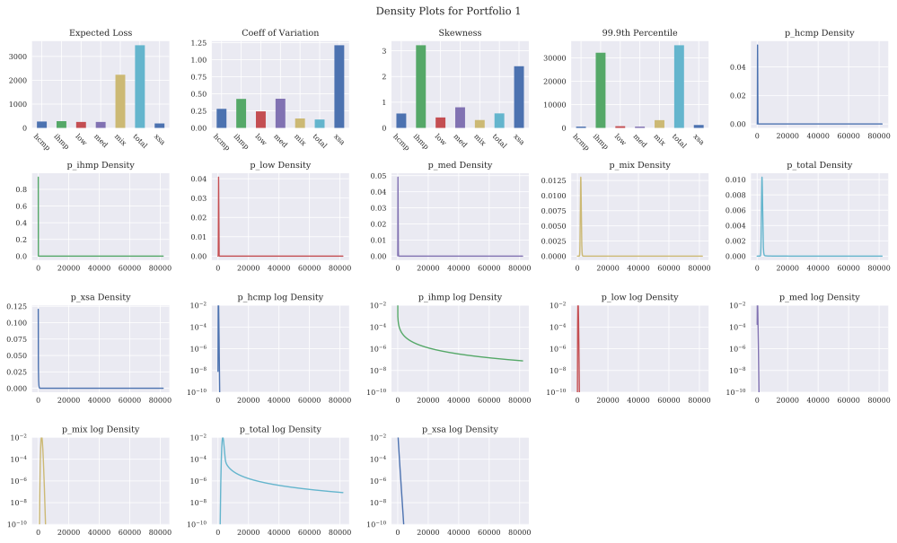

.. code:: ipython3

    port.plot('audit', aspect=1.2, height=2.5)

.. image:: output_83_0.svg

.. code:: ipython3

    port.plot('priority', aspect=1.2, height=2.5)

.. image:: output_84_0.svg

.. code:: ipython3

    port.uat(verbose=True,);

.. raw:: html

    <h1> Combined, Overall Error 1.543E-03

.. raw:: html

    

    
    <table border="1" class="dataframe">
      <thead>
        <tr style="text-align: right;">
          <th></th>
          <th>exag_mix</th>
          <th>mix</th>
          <th>err_mix</th>
          <th>exag_low</th>
          <th>low</th>
          <th>err_low</th>
          <th>exag_med</th>
          <th>med</th>
          <th>err_med</th>
          <th>exag_xsa</th>
          <th>xsa</th>
          <th>err_xsa</th>
          <th>exag_hcmp</th>
          <th>hcmp</th>
          <th>err_hcmp</th>
          <th>exag_ihmp</th>
          <th>ihmp</th>
          <th>err_ihmp</th>
          <th>exag_total</th>
          <th>total</th>
          <th>err_total</th>
          <th>exag_sumparts</th>
          <th>err sum/total</th>
          <th>a</th>
          <th>applyLR</th>
          <th>target</th>
          <th>errs</th>
        </tr>
      </thead>
      <tbody>
        <tr>
          <th>clin</th>
          <td>2276.278409</td>
          <td>2276.278409</td>
          <td>-9.992007e-16</td>
          <td>391.302808</td>
          <td>391.302808</td>
          <td>1.110223e-15</td>
          <td>192.223922</td>
          <td>192.223922</td>
          <td>-4.440892e-16</td>
          <td>159.494910</td>
          <td>159.494910</td>
          <td>-6.661338e-16</td>
          <td>269.831446</td>
          <td>269.831446</td>
          <td>0.000000e+00</td>
          <td>82.619011</td>
          <td>82.619011</td>
          <td>-1.554312e-15</td>
          <td>3371.888360</td>
          <td>3371.888360</td>
          <td>4.440892e-16</td>
          <td>3371.750507</td>
          <td>-0.000041</td>
          <td>4580.0</td>
          <td>0.965</td>
          <td>0.965</td>
          <td>6.661338e-16</td>
        </tr>
        <tr>
          <th>lep</th>
          <td>2242.996479</td>
          <td>2242.996479</td>
          <td>-2.220446e-16</td>
          <td>386.205141</td>
          <td>386.205141</td>
          <td>4.440892e-16</td>
          <td>189.366493</td>
          <td>189.366493</td>
          <td>8.881784e-16</td>
          <td>158.387534</td>
          <td>158.387534</td>
          <td>-2.220446e-16</td>
          <td>266.536246</td>
          <td>266.536246</td>
          <td>-6.661338e-16</td>
          <td>125.406289</td>
          <td>125.406289</td>
          <td>-2.664535e-15</td>
          <td>3371.888360</td>
          <td>3371.888360</td>
          <td>0.000000e+00</td>
          <td>3368.898181</td>
          <td>-0.000887</td>
          <td>4580.0</td>
          <td>0.965</td>
          <td>0.965</td>
          <td>1.091452e-10</td>
        </tr>
        <tr>
          <th>ly</th>
          <td>2264.401061</td>
          <td>2264.401061</td>
          <td>-4.440892e-16</td>
          <td>389.267810</td>
          <td>389.267810</td>
          <td>-1.110223e-16</td>
          <td>191.099414</td>
          <td>191.099414</td>
          <td>-1.110223e-16</td>
          <td>162.135026</td>
          <td>162.135026</td>
          <td>4.440892e-16</td>
          <td>268.583603</td>
          <td>268.583603</td>
          <td>-8.881784e-16</td>
          <td>96.229497</td>
          <td>96.229497</td>
          <td>2.220446e-16</td>
          <td>3371.888360</td>
          <td>3371.888360</td>
          <td>0.000000e+00</td>
          <td>3371.716410</td>
          <td>-0.000051</td>
          <td>4580.0</td>
          <td>0.965</td>
          <td>0.965</td>
          <td>2.033562e-11</td>
        </tr>
        <tr>
          <th>ph</th>
          <td>2229.006300</td>
          <td>2229.006300</td>
          <td>-2.220446e-16</td>
          <td>383.699999</td>
          <td>383.699999</td>
          <td>2.220446e-16</td>
          <td>188.155341</td>
          <td>188.155341</td>
          <td>0.000000e+00</td>
          <td>155.035158</td>
          <td>155.035158</td>
          <td>-5.551115e-16</td>
          <td>264.834540</td>
          <td>264.834540</td>
          <td>-2.220446e-16</td>
          <td>149.640615</td>
          <td>149.640615</td>
          <td>1.110223e-15</td>
          <td>3371.888360</td>
          <td>3371.888360</td>
          <td>-7.771561e-16</td>
          <td>3370.371953</td>
          <td>-0.000450</td>
          <td>4580.0</td>
          <td>0.965</td>
          <td>0.965</td>
          <td>-1.029177e-13</td>
        </tr>
        <tr>
          <th>wang</th>
          <td>2258.577025</td>
          <td>2258.577025</td>
          <td>2.220446e-16</td>
          <td>388.094433</td>
          <td>388.094433</td>
          <td>-5.551115e-16</td>
          <td>190.648028</td>
          <td>190.648028</td>
          <td>2.220446e-16</td>
          <td>157.185762</td>
          <td>157.185762</td>
          <td>0.000000e+00</td>
          <td>267.690990</td>
          <td>267.690990</td>
          <td>-2.220446e-16</td>
          <td>109.305610</td>
          <td>109.305610</td>
          <td>4.440892e-16</td>
          <td>3371.888361</td>
          <td>3371.888361</td>
          <td>2.220446e-16</td>
          <td>3371.501849</td>
          <td>-0.000115</td>
          <td>4580.0</td>
          <td>0.965</td>
          <td>0.965</td>
          <td>-7.895384e-11</td>
        </tr>
      </tbody>
    </table>
    

.. code:: ipython3

    K = port.q(0.995)  # Resonable capital scale
    LR = 0.925
    K

.. parsed-literal::

    11460.0

.. code:: ipython3

    cd = port.calibrate_distortions(LRs=[LR], As=[K])

.. code:: ipython3

    cd

.. raw:: html

    

    
    <table border="1" class="dataframe">
      <thead>
        <tr style="text-align: right;">
          <th></th>
          <th></th>
          <th></th>
          <th>$S$</th>
          <th>$\iota$</th>
          <th>$\delta$</th>
          <th>$\nu$</th>
          <th>$EL$</th>
          <th>$P$</th>
          <th>Levg</th>
          <th>$K$</th>
          <th>ROE</th>
          <th>param</th>
          <th>error</th>
        </tr>
        <tr>
          <th>$a$</th>
          <th>LR</th>
          <th>method</th>
          <th></th>
          <th></th>
          <th></th>
          <th></th>
          <th></th>
          <th></th>
          <th></th>
          <th></th>
          <th></th>
          <th></th>
          <th></th>
        </tr>
      </thead>
      <tbody>
        <tr>
          <th rowspan="5" valign="top">11460.0</th>
          <th rowspan="5" valign="top">0.925</th>
          <th>ph</th>
          <td>0.005</td>
          <td>0.034133</td>
          <td>0.033007</td>
          <td>0.966993</td>
          <td>3315.495947</td>
          <td>3584.319943</td>
          <td>0.455112</td>
          <td>7875.680057</td>
          <td>0.034133</td>
          <td>0.745732</td>
          <td>3.137757e-11</td>
        </tr>
        <tr>
          <th>wang</th>
          <td>0.005</td>
          <td>0.034133</td>
          <td>0.033007</td>
          <td>0.966993</td>
          <td>3315.495947</td>
          <td>3584.319943</td>
          <td>0.455112</td>
          <td>7875.680057</td>
          <td>0.034133</td>
          <td>0.384146</td>
          <td>5.879701e-07</td>
        </tr>
        <tr>
          <th>lep</th>
          <td>0.005</td>
          <td>0.034133</td>
          <td>0.033007</td>
          <td>0.966993</td>
          <td>3315.495947</td>
          <td>3584.319943</td>
          <td>0.455112</td>
          <td>7875.680057</td>
          <td>0.034133</td>
          <td>0.056227</td>
          <td>-5.130005e-09</td>
        </tr>
        <tr>
          <th>ly</th>
          <td>0.005</td>
          <td>0.034133</td>
          <td>0.033007</td>
          <td>0.966993</td>
          <td>3315.495947</td>
          <td>3584.319943</td>
          <td>0.455112</td>
          <td>7875.680057</td>
          <td>0.034133</td>
          <td>0.117114</td>
          <td>-2.218688e-06</td>
        </tr>
        <tr>
          <th>clin</th>
          <td>0.005</td>
          <td>0.034133</td>
          <td>0.033007</td>
          <td>0.966993</td>
          <td>3315.495947</td>
          <td>3584.319943</td>
          <td>0.455112</td>
          <td>7875.680057</td>
          <td>0.034133</td>
          <td>0.997677</td>
          <td>-4.547474e-13</td>
        </tr>
      </tbody>
    </table>
    

.. code:: ipython3

    dd = agg.Distortion.distortions_from_params(cd, (K, LR), plot=True)

.. parsed-literal::

    ..\aggregate\spectral.py:150: RuntimeWarning: invalid value encountered in sqrt
      rad = np.sqrt(mb * mb - 4 * a * c)
    ..\aggregate\spectral.py:153: RuntimeWarning: invalid value encountered in maximum
      return np.where(x < d, 0, np.maximum(0, u))
    

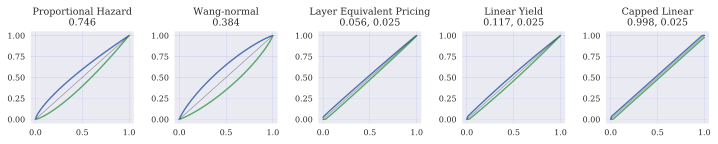

.. code:: ipython3

    dd

.. parsed-literal::

    {'clin': clin (0.9976771384733425, 0.025),
     'lep': lep (0.05622694676898763, 0.025),
     'ly': ly (0.11711429176867784, 0.025),
     'ph': ph (0.7457318253968621),
     'wang': wang (0.38414569240466323)}

.. code:: ipython3

    ans_table, ans_stacked = port.apply_distortions(dd, As=[port.q(0.99), port.q(0.995), port.q(0.999)], num_plots=2)

Another Interesting Example
===========================

.. code:: ipython3

    cata = uw('agg mycat 4 claims sev 1000 * sev.cata poisson')
    cata.easy_update(11)
    cata.plot()

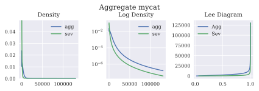

.. code:: ipython3

    uw['mycat'] # GOHERE

.. parsed-literal::

    ('agg',
     {'exp_en': 4.0,
      'freq_name': 'poisson',
      'name': 'mycat',
      'note': '',
      'sev_a': 2.1,
      'sev_loc': -1000.0,
      'sev_name': 'pareto',
      'sev_scale': 1000.0,
      'sev_wt': 1})

.. code:: ipython3

    cata = uw('agg mycat 4 claims sev 1000 * pareto 2.1 - 1000 poisson')
    cata

.. raw:: html

    <h3>Aggregate object: mycat</h3>
    Claim count 4.00, poisson distribution 
    Severity: pareto distribution, unlimited 

    
    <table border="1" class="dataframe">
      <thead>
        <tr style="text-align: right;">
          <th></th>
          <th>E(X)</th>
          <th>CV(X)</th>
          <th>Skew(X)</th>
        </tr>
        <tr>
          <th>X</th>
          <th></th>
          <th></th>
          <th></th>
        </tr>
      </thead>
      <tbody>
        <tr>
          <th>Sev</th>
          <td>909.090909</td>
          <td>4.582574</td>
          <td>60.212877</td>
        </tr>
        <tr>
          <th>Freq</th>
          <td>4.000000</td>
          <td>0.500000</td>
          <td>0.500000</td>
        </tr>
        <tr>
          <th>Agg</th>
          <td>3636.363636</td>
          <td>2.345207</td>
          <td>28.387341</td>
        </tr>
      </tbody>
    </table>
    

.. code:: ipython3

    cata.easy_update(11)
    cata.plot()

.. image:: output_96_0.svg

.. code:: ipython3

    cata

.. raw:: html

    <h3>Aggregate object: mycat</h3>
    Claim count 4.00, poisson distribution 
    Severity: pareto distribution, unlimited 
    Updated with bucket size 63.80 and log2 = 11

    
    <table border="1" class="dataframe">
      <thead>
        <tr style="text-align: right;">
          <th></th>
          <th>E(X)</th>
          <th>Est E(X)</th>
          <th>Err E(X)</th>
          <th>CV(X)</th>
          <th>Est CV(X)</th>
          <th>Err CV(X)</th>
          <th>Skew(X)</th>
        </tr>
        <tr>
          <th>X</th>
          <th></th>
          <th></th>
          <th></th>
          <th></th>
          <th></th>
          <th></th>
          <th></th>
        </tr>
      </thead>
      <tbody>
        <tr>
          <th>Sev</th>
          <td>909.090909</td>
          <td>899.9</td>
          <td>-0.01011</td>
          <td>4.582574</td>
          <td>2.35714</td>
          <td>-0.485631</td>
          <td>60.212877</td>
        </tr>
        <tr>
          <th>Freq</th>
          <td>4.000000</td>
          <td></td>
          <td></td>
          <td>0.500000</td>
          <td></td>
          <td></td>
          <td>0.500000</td>
        </tr>
        <tr>
          <th>Agg</th>
          <td>3636.363636</td>
          <td>3598.35</td>
          <td>-0.0104531</td>
          <td>2.345207</td>
          <td>1.27583</td>
          <td>-0.455985</td>
          <td>28.387341</td>
        </tr>
      </tbody>
    </table>
    

.. code:: ipython3

    uw['mycat']

.. parsed-literal::

    ('agg',
     {'exp_en': 4.0,
      'freq_name': 'poisson',
      'name': 'mycat',
      'note': '',
      'sev_a': 2.1,
      'sev_loc': -1000.0,
      'sev_name': 'pareto',
      'sev_scale': 1000.0,
      'sev_wt': 1})

.. code:: ipython3

    uw.update = False
    uw.log2 = 11
    ag = uw('agg myCatA 2 claims sev  1000 * pareto 2.1 - 1000 fixed')
    # ag.plot()
    # ag = uw.write('agg myCatA 2 claims sev 10000*agg.cata fixed')
    ag.update(50. * np.arange(1<<11), padding=1, verbose=False )
    ag.plot()

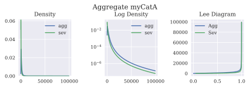

.. code:: ipython3

    ag

.. raw:: html

    <h3>Aggregate object: myCatA</h3>
    Claim count 2.00, fixed distribution 
    Severity: pareto distribution, unlimited 
    Updated with bucket size 50.00 and log2 = 11

    
    <table border="1" class="dataframe">
      <thead>
        <tr style="text-align: right;">
          <th></th>
          <th>E(X)</th>
          <th>Est E(X)</th>
          <th>Err E(X)</th>
          <th>CV(X)</th>
          <th>Est CV(X)</th>
          <th>Err CV(X)</th>
          <th>Skew(X)</th>
        </tr>
        <tr>
          <th>X</th>
          <th></th>
          <th></th>
          <th></th>
          <th></th>
          <th></th>
          <th></th>
          <th></th>
        </tr>
      </thead>
      <tbody>
        <tr>
          <th>Sev</th>
          <td>909.090909</td>
          <td>897.37</td>
          <td>-0.0128926</td>
          <td>4.582574</td>
          <td>2.28215</td>
          <td>-0.501995</td>
          <td>60.2129</td>
        </tr>
        <tr>
          <th>Freq</th>
          <td>2.000000</td>
          <td></td>
          <td></td>
          <td>0.000000</td>
          <td></td>
          <td></td>
          <td></td>
        </tr>
        <tr>
          <th>Agg</th>
          <td>1818.181818</td>
          <td>1794.49</td>
          <td>-0.0130286</td>
          <td>3.240369</td>
          <td>1.61151</td>
          <td>-0.502677</td>
          <td>42.5769</td>
        </tr>
      </tbody>
    </table>
    

.. code:: ipython3

    uw.update = False
    uw.verbose = False
    pf = uw("""port smallLarge 
        agg cat 2 claims sev 10000 * pareto 1.3  - 10000 poisson
        agg noncat 120 claims sev lognorm 1000 cv 0.5 poisson""")
    pf

.. parsed-literal::

    ..\aggregate\utils.py:682: RuntimeWarning: invalid value encountered in sqrt
      sd = np.sqrt(var)
    ..\aggregate\utils.py:682: RuntimeWarning: invalid value encountered in sqrt
      sd = np.sqrt(var)
    ..\aggregate\utils.py:682: RuntimeWarning: invalid value encountered in sqrt
      sd = np.sqrt(var)
    ..\aggregate\utils.py:682: RuntimeWarning: invalid value encountered in sqrt
      sd = np.sqrt(var)
    ..\aggregate\utils.py:682: RuntimeWarning: invalid value encountered in sqrt
      sd = np.sqrt(var)
    

.. raw:: html

    <h2>Portfolio object: smallLarge</h2>
    Portfolio contains 2 aggregate components
    

    
    <table border="1" class="dataframe">
      <thead>
        <tr style="text-align: right;">
          <th></th>
          <th></th>
          <th>cat</th>
          <th>noncat</th>
          <th>total</th>
        </tr>
        <tr>
          <th>component</th>
          <th>measure</th>
          <th></th>
          <th></th>
          <th></th>
        </tr>
      </thead>
      <tbody>
        <tr>
          <th rowspan="3" valign="top">freq</th>
          <th>mean</th>
          <td>2.000000</td>
          <td>120.000000</td>
          <td>122.000000</td>
        </tr>
        <tr>
          <th>cv</th>
          <td>0.707107</td>
          <td>0.091287</td>
          <td>0.090536</td>
        </tr>
        <tr>
          <th>skew</th>
          <td>0.707107</td>
          <td>0.091287</td>
          <td>0.090536</td>
        </tr>
        <tr>
          <th rowspan="3" valign="top">sev</th>
          <th>mean</th>
          <td>33333.333335</td>
          <td>1000.000000</td>
          <td>1530.054645</td>
        </tr>
        <tr>
          <th>cv</th>
          <td>NaN</td>
          <td>0.500000</td>
          <td>NaN</td>
        </tr>
        <tr>
          <th>skew</th>
          <td>NaN</td>
          <td>1.625000</td>
          <td>NaN</td>
        </tr>
        <tr>
          <th rowspan="3" valign="top">agg</th>
          <th>mean</th>
          <td>66666.666671</td>
          <td>120000.000000</td>
          <td>186666.666671</td>
        </tr>
        <tr>
          <th>cv</th>
          <td>0.118232</td>
          <td>0.102062</td>
          <td>0.078025</td>
        </tr>
        <tr>
          <th>skew</th>
          <td>78151.555878</td>
          <td>0.127578</td>
          <td>12387.180210</td>
        </tr>
      </tbody>
    </table>
    

.. code:: ipython3

    pf.recommend_bucket()

.. raw:: html

    

    
    <table border="1" class="dataframe">
      <thead>
        <tr style="text-align: right;">
          <th></th>
          <th>bs10</th>
          <th>bs11</th>
          <th>bs12</th>
          <th>bs13</th>
          <th>bs14</th>
          <th>bs15</th>
          <th>bs16</th>
          <th>bs18</th>
          <th>bs20</th>
        </tr>
        <tr>
          <th>line</th>
          <th></th>
          <th></th>
          <th></th>
          <th></th>
          <th></th>
          <th></th>
          <th></th>
          <th></th>
          <th></th>
        </tr>
      </thead>
      <tbody>
        <tr>
          <th>cat</th>
          <td>88.890854</td>
          <td>44.445427</td>
          <td>22.222714</td>
          <td>11.111357</td>
          <td>5.555678</td>
          <td>2.777839</td>
          <td>1.388920</td>
          <td>0.347230</td>
          <td>0.086807</td>
        </tr>
        <tr>
          <th>noncat</th>
          <td>156.376425</td>
          <td>78.188213</td>
          <td>39.094106</td>
          <td>19.547053</td>
          <td>9.773527</td>
          <td>4.886763</td>
          <td>2.443382</td>
          <td>0.610845</td>
          <td>0.152711</td>
        </tr>
        <tr>
          <th>total</th>
          <td>245.267279</td>
          <td>122.633640</td>
          <td>61.316820</td>
          <td>30.658410</td>
          <td>15.329205</td>
          <td>7.664602</td>
          <td>3.832301</td>
          <td>0.958075</td>
          <td>0.239519</td>
        </tr>
      </tbody>
    </table>
    

.. code:: ipython3

    pf.update(log2=18, bs=10000, padding=1, add_exa=False)
    pf.plot(subplots=True, logy=True)
    pf

.. raw:: html

    <h2>Portfolio object: smallLarge</h2>
    Portfolio contains 2 aggregate components
    

    
    <table border="1" class="dataframe">
      <thead>
        <tr style="text-align: right;">
          <th></th>
          <th>cat</th>
          <th>noncat</th>
          <th>total</th>
        </tr>
      </thead>
      <tbody>
        <tr>
          <th>(freq, mean)</th>
          <td>2</td>
          <td>120</td>
          <td>122</td>
        </tr>
        <tr>
          <th>(freq, cv)</th>
          <td>0.707107</td>
          <td>0.0912871</td>
          <td>0.0905357</td>
        </tr>
        <tr>
          <th>(freq, skew)</th>
          <td>0.707107</td>
          <td>0.0912871</td>
          <td>0.0905357</td>
        </tr>
        <tr>
          <th>(sev, mean)</th>
          <td>33333.3</td>
          <td>1000</td>
          <td>1530.05</td>
        </tr>
        <tr>
          <th>(sev, cv)</th>
          <td>NaN</td>
          <td>0.5</td>
          <td>NaN</td>
        </tr>
        <tr>
          <th>(sev, skew)</th>
          <td>NaN</td>
          <td>1.625</td>
          <td>NaN</td>
        </tr>
        <tr>
          <th>(agg, mean)</th>
          <td>66666.7</td>
          <td>120000</td>
          <td>186667</td>
        </tr>
        <tr>
          <th>(agg, cv)</th>
          <td>0.118232</td>
          <td>0.102062</td>
          <td>0.0780247</td>
        </tr>
        <tr>
          <th>(agg, skew)</th>
          <td>78151.6</td>
          <td>0.127578</td>
          <td>12387.2</td>
        </tr>
        <tr>
          <th>Mean</th>
          <td>66666.7</td>
          <td>120000</td>
          <td>186667</td>
        </tr>
        <tr>
          <th>EmpMean</th>
          <td>63694.6</td>
          <td>120000</td>
          <td>183695</td>
        </tr>
        <tr>
          <th>MeanErr</th>
          <td>-0.0445811</td>
          <td>5.21072e-12</td>
          <td>-0.015922</td>
        </tr>
        <tr>
          <th>CV</th>
          <td>0.118232</td>
          <td>0.102062</td>
          <td>0.0780247</td>
        </tr>
        <tr>
          <th>EmpCV</th>
          <td>23.8312</td>
          <td>0.102062</td>
          <td>8.26342</td>
        </tr>
        <tr>
          <th>CVErr</th>
          <td>200.564</td>
          <td>-1.11202e-10</td>
          <td>104.908</td>
        </tr>
        <tr>
          <th>P99.0</th>
          <td>620000</td>
          <td>150000</td>
          <td>740000</td>
        </tr>
      </tbody>
    </table>
    

.. image:: output_103_1.svg

.. code:: ipython3

    pf

.. raw:: html

    <h2>Portfolio object: smallLarge</h2>
    Portfolio contains 2 aggregate components
    

    
    <table border="1" class="dataframe">
      <thead>
        <tr style="text-align: right;">
          <th></th>
          <th>cat</th>
          <th>noncat</th>
          <th>total</th>
        </tr>
      </thead>
      <tbody>
        <tr>
          <th>(freq, mean)</th>
          <td>2</td>
          <td>120</td>
          <td>122</td>
        </tr>
        <tr>
          <th>(freq, cv)</th>
          <td>0.707107</td>
          <td>0.0912871</td>
          <td>0.0905357</td>
        </tr>
        <tr>
          <th>(freq, skew)</th>
          <td>0.707107</td>
          <td>0.0912871</td>
          <td>0.0905357</td>
        </tr>
        <tr>
          <th>(sev, mean)</th>
          <td>33333.3</td>
          <td>1000</td>
          <td>1530.05</td>
        </tr>
        <tr>
          <th>(sev, cv)</th>
          <td>NaN</td>
          <td>0.5</td>
          <td>NaN</td>
        </tr>
        <tr>
          <th>(sev, skew)</th>
          <td>NaN</td>
          <td>1.625</td>
          <td>NaN</td>
        </tr>
        <tr>
          <th>(agg, mean)</th>
          <td>66666.7</td>
          <td>120000</td>
          <td>186667</td>
        </tr>
        <tr>
          <th>(agg, cv)</th>
          <td>0.118232</td>
          <td>0.102062</td>
          <td>0.0780247</td>
        </tr>
        <tr>
          <th>(agg, skew)</th>
          <td>78151.6</td>
          <td>0.127578</td>
          <td>12387.2</td>
        </tr>
        <tr>
          <th>Mean</th>
          <td>66666.7</td>
          <td>120000</td>
          <td>186667</td>
        </tr>
        <tr>
          <th>EmpMean</th>
          <td>63694.6</td>
          <td>120000</td>
          <td>183695</td>
        </tr>
        <tr>
          <th>MeanErr</th>
          <td>-0.0445811</td>
          <td>5.21072e-12</td>
          <td>-0.015922</td>
        </tr>
        <tr>
          <th>CV</th>
          <td>0.118232</td>
          <td>0.102062</td>
          <td>0.0780247</td>
        </tr>
        <tr>
          <th>EmpCV</th>
          <td>23.8312</td>
          <td>0.102062</td>
          <td>8.26342</td>
        </tr>
        <tr>
          <th>CVErr</th>
          <td>200.564</td>
          <td>-1.11202e-10</td>
          <td>104.908</td>
        </tr>
        <tr>
          <th>P99.0</th>
          <td>620000</td>
          <td>150000</td>
          <td>740000</td>
        </tr>
      </tbody>
    </table>
    

.. code:: ipython3

    pf.plot()

.. image:: output_105_0.svg

Distortions
===========

.. code:: ipython3

    agg.Distortion.available_distortions()

.. parsed-literal::

    ('ph', 'wang', 'lep', 'ly', 'clin')

.. code:: ipython3

    agg.Distortion.test()

.. parsed-literal::

    ..\aggregate\spectral.py:150: RuntimeWarning: invalid value encountered in sqrt
      rad = np.sqrt(mb * mb - 4 * a * c)
    ..\aggregate\spectral.py:153: RuntimeWarning: invalid value encountered in maximum
      return np.where(x < d, 0, np.maximum(0, u))
    ..\aggregate\spectral.py:150: RuntimeWarning: invalid value encountered in sqrt
      rad = np.sqrt(mb * mb - 4 * a * c)
    ..\aggregate\spectral.py:153: RuntimeWarning: invalid value encountered in maximum
      return np.where(x < d, 0, np.maximum(0, u))
    

.. image:: output_108_1.svg

.. code:: ipython3

    agg.insurability_triangle()

.. parsed-literal::

    ..\aggregate\utils.py:395: RuntimeWarning: divide by zero encountered in true_divide
      δ = (1 - LR) / LR / (λ - 1)
    ..\aggregate\utils.py:395: RuntimeWarning: divide by zero encountered in true_divide
      δ = (1 - LR) / LR / (λ - 1)
    ..\aggregate\utils.py:395: RuntimeWarning: divide by zero encountered in true_divide
      δ = (1 - LR) / LR / (λ - 1)
    ..\aggregate\utils.py:395: RuntimeWarning: divide by zero encountered in true_divide
      δ = (1 - LR) / LR / (λ - 1)
    ..\aggregate\utils.py:395: RuntimeWarning: divide by zero encountered in true_divide
      δ = (1 - LR) / LR / (λ - 1)
    ..\aggregate\utils.py:395: RuntimeWarning: divide by zero encountered in true_divide
      δ = (1 - LR) / LR / (λ - 1)
    ..\aggregate\utils.py:395: RuntimeWarning: divide by zero encountered in true_divide
      δ = (1 - LR) / LR / (λ - 1)
    ..\aggregate\utils.py:395: RuntimeWarning: divide by zero encountered in true_divide
      δ = (1 - LR) / LR / (λ - 1)
    ..\aggregate\utils.py:406: RuntimeWarning: divide by zero encountered in true_divide
      levg = np.where(λ * LR > 1, 1 / (λ * LR - 1), 4)  # hide the discontinuity
    ..\aggregate\utils.py:406: RuntimeWarning: divide by zero encountered in true_divide
      levg = np.where(λ * LR > 1, 1 / (λ * LR - 1), 4)  # hide the discontinuity
    ..\aggregate\utils.py:406: RuntimeWarning: divide by zero encountered in true_divide
      levg = np.where(λ * LR > 1, 1 / (λ * LR - 1), 4)  # hide the discontinuity
    ..\aggregate\utils.py:406: RuntimeWarning: divide by zero encountered in true_divide
      levg = np.where(λ * LR > 1, 1 / (λ * LR - 1), 4)  # hide the discontinuity
    ..\aggregate\utils.py:406: RuntimeWarning: divide by zero encountered in true_divide
      levg = np.where(λ * LR > 1, 1 / (λ * LR - 1), 4)  # hide the discontinuity
    ..\aggregate\utils.py:406: RuntimeWarning: divide by zero encountered in true_divide
      levg = np.where(λ * LR > 1, 1 / (λ * LR - 1), 4)  # hide the discontinuity
    

.. image:: output_109_1.svg

.. code:: ipython3

    uw.update = False
    # basic = uw('''
    # port basic
    #     ppa 4000 claims 1e6 x 0 sev lognorm 10000 cv 15
    #     ho  800 claims 2e6 x 0 sev gamma 50000 cv 10
    #     cat 2 claims 20e6 x 0 sev 1e5 * pareto 2.1 - 1e5
    # ''')

.. code:: ipython3

    # this is about Intereseting_Cat Example See LCA_08_25
    # 
    basic = uw('''
    port basic
        agg attrit 10000 claims 500 x 0 sev lognorm 1 cv 1.75 mixed gamma 0.5
        agg paretoccat 2 claims      sev 50 * pareto 1.25 - 50 poisson
        agg lognccat  3.5 claims 40e3 x 0 sev 200 * lognorm 1.25 poisson
    ''')

.. parsed-literal::

    ..\aggregate\utils.py:682: RuntimeWarning: invalid value encountered in sqrt
      sd = np.sqrt(var)
    ..\aggregate\utils.py:682: RuntimeWarning: invalid value encountered in sqrt
      sd = np.sqrt(var)
    ..\aggregate\utils.py:682: RuntimeWarning: invalid value encountered in sqrt
      sd = np.sqrt(var)
    ..\aggregate\utils.py:682: RuntimeWarning: invalid value encountered in sqrt
      sd = np.sqrt(var)
    ..\aggregate\utils.py:682: RuntimeWarning: invalid value encountered in sqrt
      sd = np.sqrt(var)
    ..\aggregate\utils.py:682: RuntimeWarning: invalid value encountered in sqrt
      sd = np.sqrt(var)
    ..\aggregate\utils.py:682: RuntimeWarning: invalid value encountered in sqrt
      sd = np.sqrt(var)
    ..\aggregate\utils.py:682: RuntimeWarning: invalid value encountered in sqrt
      sd = np.sqrt(var)
    C:\Users\steve\Anaconda3\lib\site-packages\scipy\stats\_distn_infrastructure.py:872: RuntimeWarning: invalid value encountered in greater
      cond = logical_and(cond, (asarray(arg) > 0))
    C:\Users\steve\Anaconda3\lib\site-packages\scipy\stats\_distn_infrastructure.py:872: RuntimeWarning: invalid value encountered in greater
      cond = logical_and(cond, (asarray(arg) > 0))
    C:\Users\steve\Anaconda3\lib\site-packages\scipy\stats\_distn_infrastructure.py:872: RuntimeWarning: invalid value encountered in greater
      cond = logical_and(cond, (asarray(arg) > 0))
    C:\Users\steve\Anaconda3\lib\site-packages\scipy\stats\_distn_infrastructure.py:1945: RuntimeWarning: invalid value encountered in greater
      cond0 = self._argcheck(*args) & (scale > 0) & (loc == loc)
    C:\Users\steve\Anaconda3\lib\site-packages\scipy\stats\_distn_infrastructure.py:872: RuntimeWarning: invalid value encountered in greater
      cond = logical_and(cond, (asarray(arg) > 0))
    C:\Users\steve\Anaconda3\lib\site-packages\scipy\stats\_distn_infrastructure.py:1945: RuntimeWarning: invalid value encountered in greater
      cond0 = self._argcheck(*args) & (scale > 0) & (loc == loc)
    

.. code:: ipython3

    basic.recommend_bucket()

.. code:: ipython3

    basic.update(14, 10,  add_exa=True, remove_fuzz=True, approx_freq_ge=100, approx_type='slognorm', discretization_calc='distribution', trim_df=False)
    basic

.. code:: ipython3

    basic.plot('quick')
    basic.plot('density', subplots=True)
    basic.plot('density', subplots=True, logy=True)
    basic.plot('density', aspect=1.9, logy=True)

.. code:: ipython3

    bfit = uw(basic.fit())

.. code:: ipython3

    bfit.update(basic.density_df.loss.values)

.. code:: ipython3

    bfit2 = basic.collapse()

.. code:: ipython3

    bfit.plot()

.. code:: ipython3

    plt.plot(basic.density_df.loss, basic.density_df.p_total, label='exact')
    plt.plot(bfit.xs, bfit.agg_density, label='approx')
    plt.yscale('log')
    plt.legend()

.. code:: ipython3

    xs = basic.density_df.loss
    print(np.sum(xs * basic.density_df.p_total))
    print(np.sum(xs * bfit.agg_density))

.. code:: ipython3

     bfit.agg_density.sum()

The plot of EXEQA is very intesting… different behaviours at different size losses
==================================================================================

.. code:: ipython3

    axiter = agg.axiter_factory(None, 24, aspect=1.4)
    distort = agg.Distortion('wang', 2.25)
    df, audit = basic.apply_distortion(distort, axiter)

.. code:: ipython3

    params = basic.calibrate_distortions(LRs=[0.85, 0.90], Ps=[0.99, 0.98], r0=0.025)
    params

.. code:: ipython3

    gs = agg.Distortion.distortions_from_params(params, (basic.q(0.99), 0.85), r0=0.025)

.. code:: ipython3

    gs

The first apply distortion was random and extreme. Now we apply Wang with a more reasonable shift.
^^^^^^^^^^^^^^^^^^^^^^^^^^^^^^^^^^^^^^^^^^^^^^^^^^^^^^^^^^^^^^^^^^^^^^^^^^^^^^^^^^^^^^^^^^^^^^^^^^

.. code:: ipython3

    axiter = agg.axiter_factory(None, 24, aspect=1.25)
    df, au = basic.apply_distortion(gs['ly'] , axiter)

.. code:: ipython3

    test = basic.top_down(gs, 0.99)

.. code:: ipython3

    ans = basic.apply_distortions(gs, Ps=[0.98, 0.99], num_plots=3)

.. code:: ipython3

    a, p, test, arams, dd, table, stacked = basic.uat(LRs=[0.9], verbose=True)

.. code:: ipython3

    basic.density_df.filter(regex='exa[g]?_[st][a-z]+$').plot(kind='line')

.. code:: ipython3

    table

.. code:: ipython3

    uw('sev stepEg dhistogram xps [0, 1, 2, 3, 4] [.2, .3, .4, .05, .05]  ').plot()

.. code:: ipython3

    uw('sev stepEg chistogram xps [0, 1, 2, 3, 4] [.2, .3, .4, .05, .05]  ').plot()

.. code:: ipython3

    uw('sev stepEg dhistogram xps [0, 1, 2, 3, 4] .2 ').plot()

.. code:: ipython3

    uw('sev stepEg chistogram xps [0, 1, 2, 3, 4] .2 ').plot()

.. code:: ipython3

    fixed = uw('sev my chistogram xps [0,1,2,3,4] [.1,.2,.3, 0, .4]')
    fixed.plot()
    fixed.moms()==(2.9000000000000004, 10.449999999999999, 41.825000000000003)

A fixed distribution is just a discrete histogram with only one value
^^^^^^^^^^^^^^^^^^^^^^^^^^^^^^^^^^^^^^^^^^^^^^^^^^^^^^^^^^^^^^^^^^^^^

.. code:: ipython3

    fixed = uw('sev my dhistogram xps [2] [1]')
    fixed.plot()
    fixed.moms() == (2, 4, 8)

.. code:: ipython3

    # cts version is uniform? How exactly is this working?! 
    fixed = uw('sev my chistogram xps [0 2] [0 1]')
    fixed.plot()
    fixed.moms() == (2, 4, 8)

.. code:: ipython3

    reload(trash)
    uw = trash.Underwriter()
    uw.update = True
    uw.verbose = True
    uw.log2 = 10

.. code:: ipython3

    s = f'''agg logo 1 claim {np.linspace(10, 250, 15)} sev lognorm 100 cv {np.linspace(.2, 10, 15)} fixed'''

.. code:: ipython3

    s = f'''agg logo 1 claim {np.linspace(10, 500, 100)} xs 0 sev lognorm 100 cv 1 fixed'''

.. code:: ipython3

    print(s)

.. code:: ipython3

    logo = uw.write(s, update=False)
    logo.recommend_bucket(verbose=True)

.. code:: ipython3

    uw['logo']
    N = 2**14
    bs = 1
    xs = np.linspace(0, bs * N, N, endpoint=False)
    junk = logo.update(xs, verbose=True)

.. code:: ipython3

    logo.plot()

.. code:: ipython3

    # can get the dictionary 
    uw['logo']

.. code:: ipython3

    s = f'agg FixedClaim 1 claim sev dhistogram xps [5 10 20 ] [.5 .25 .25 ] fixed'
    print(s)

.. code:: ipython3

    uw.update = True
    uw.verbose = True
    uw.log2 = 8
    fixed = uw.write(s, approximation='exact')
    fixed.plot('quick')
    fixed

.. code:: ipython3

    a = fixed.update(1.0 * np.arange(256), verbose=True)
    display(a)

.. code:: ipython3

    fixed.plot('quick')

.. code:: ipython3

    warnings.simplefilter('default')
    fixed.plot('long')

.. code:: ipython3

    uw.update = True
    uw.log2 = 1

.. code:: ipython3

    uw.update = True
    # interesting = uw("""agg home 1 claim sev 20 * triang 0.5 fixed""")
    interesting = uw("""agg home 1 claim sev 20 * uniform fixed""")
    interesting.plot()

.. code:: ipython3

    uw.update = False
    interesting1 = uw("""
    port easy
        agg home 1 claim sev 20 * uniform fixed
        agg auto 1 claim sev 50 * triang 0.5 fixed
    """)
    interesting2 = uw("""
    port easy
        agg home 2 claim sev 30 * uniform + 4 fixed
        agg auto 1 claim sev 50 * uniform + 2 fixed
    """)

.. code:: ipython3

    interesting2

.. code:: ipython3

    interesting = interesting2
    interesting.update(8, 1)
    interesting

.. code:: ipython3

    interesting.plot()

.. code:: ipython3

    p = interesting
    p.plot(kind='density', line='all')
    p.plot(kind='collateral', line='auto', c=45, a=90)

.. code:: ipython3

    acc = []
    for a in range(10, 150, 5):
        s, ans = p.analysis_collateral('home', c=0, a=a, debug=True)
        acc.append(s)
        # change percent here to move line up or down 
        s, ans = p.analysis_collateral('home', c=a*.9, a=a, debug=True)
        acc.append(s)
        s, ans = p.analysis_collateral('home', c=a, a=a, debug=True)
        acc.append(s)
    res = pd.concat(acc).sort_index()
    res = res.set_index('a')
    res[['exa', 'ecac', 'lev']].plot(marker='o')
    # display(res)
    assert(np.allclose(res.query('c==0')['exa'], res.query('c==0')['ecac']))

Credit Puzzle and Empirical Distortions
---------------------------------------

https://www.bis.org/publ/qtrpdf/r_qt0312e.pdf

.. code:: ipython3

    oneyear= '''AAA 49.50 0.06 63.86 0.18 70.47 0.33 73.95 0.61
    AA 58.97 1.24 71.22 1.44 82.36 1.86 88.57 2.70
    A 88.82 1.12 102.91 2.78 110.71 4.71 117.52 7.32
    BBB 168.99 12.48 170.89 20.12 185.34 27.17 179.63 34.56
    BB 421.20 103.09 364.55 126.74 345.37 140.52 322.32 148.05
    B 760.84 426.16 691.81 400.52 571.94 368.38 512.43 329.40'''

.. code:: ipython3

    oy = oneyear.split('\n')
    oyo = [i.split(' ') for i in oy]
    df = pd.DataFrame(oyo, columns=['rating', 's_13', 'el_13', 's_35', 'el_35', 's_57', 'el_57', 's_710', 'el_710'], dtype=float)
    df = df.set_index('rating')
    df = df.sort_index(axis=1)
    df.columns = pd.MultiIndex.from_product((('el', 'spread'), ('1-3', '3-5', '5-7', '7-10')), names=['type', 'maturity'])
    df

.. code:: ipython3

    for m in ('1-3', '3-5', '5-7', '7-10'):
        df[('lr', m)] = df[('el', m)] / df[('spread', m)]
    df

.. code:: ipython3

    df['lr'].plot(kind='bar')

.. code:: ipython3

    temp = df.loc[:, [('el', '1-3'), ('spread', '1-3')]] / 10000
    temp.columns =['el', 'spread']
    temp.loc['AAAA', :] = (0,0)
    temp = temp.sort_values('el')
    temp.plot(x='el', y='spread')
    temp

.. code:: ipython3

    from scipy.spatial import ConvexHull
    
    hull = ConvexHull(temp)
    
    plt.plot(temp.el, temp.spread, 'o')
    for simplex in hull.simplices:
        print(simplex)
        plt.plot(temp.iloc[simplex, 0], temp.iloc[simplex, 1], 'k-')
    plt.xlim(0, .002)
    plt.ylim(0, 0.02)

Audit from 08_28 on Sum of Parts
================================

.. code:: ipython3

    uw['MASSTEST']

.. code:: ipython3

    mt = uw("""
    port mass
        agg a 2 claims sev 10 * uniform + 5 fixed
        agg b 1 claim  sev 10 * uniform fixed
        agg c 1 claim  sev 15 * uniform fixed
    """)

.. code:: ipython3

    mt.update(6, 1)

.. code:: ipython3

    mt.plot(height=3, aspect=1.5)

.. code:: ipython3

    a, p, test, params, dd, table, stacked = mt.uat(Ps=[0.95, .97], LRs=[0.9], r0=0.1, verbose=True)

.. code:: ipython3

    mt.plot()

.. code:: ipython3

    mt.fit(output='dict')

.. code:: ipython3

    mt.collapse()

.. code:: ipython3

    mt.xs

.. code:: ipython3

    uw['mt']

Dealing with Meta objects
=========================

.. code:: ipython3

    reload(trash)
    uw = trash.Underwriter()

.. code:: ipython3

    port = uw('port xx agg A1 5 claims sev lognorm 10 cv 2 poisson')
    port.update(6, 10)
    # port.plot()
    # port

.. code:: ipython3

    ag = uw('agg A2 12 claims sev lognorm 10 cv 0.5 mixed gamma .3')
    ag.easy_update(9, 1)
    # ag.plot()
    # ag

.. code:: ipython3

    import scipy.stats as ss
    
    def makeEg(port):
        ps = port.density_df.p_total.values
        xs = port.density_df.loss.values
        bs = xs[1]
        xss = np.hstack((-bs*1e-7, 0, xs[1:]-bs/2, xs[-1]+bs/2))
        pss = np.hstack((ps[0]/1e-7, 0, ps[1:]))
        fz = ss.rv_histogram((pss, xss))
        m = np.sum(xs * ps)
        v = np.sum(xs**2 * ps) - m*m
        print(m, v, fz.stats(), m / fz.stats()[0]-1)
        plt.plot(xs , np.cumsum(ps),  drawstyle='steps-post', label='orig')
        ex = np.arange(1000, dtype=float)*.1
        plt.plot(ex, fz.cdf(ex), label='approx',drawstyle='steps-post')
        plt.xlim(-0.5, 100)
        plt.ylim(0, 1)
        plt.legend()

.. code:: ipython3

    # makeEg(port)

.. code:: ipython3

    metap = uw('sev MyMeta meta.port 6 10', globs=globals())

.. parsed-literal::

    In meta, Portfolio name           xx             
    Theoretic expected loss             50.0
    Actual expected loss                46.2
    Error                          -0.076078
    Discretization size                    6
    Bucket size                        10.00
    <aggregate.port.Portfolio object at 0x000001979CA388D0>, <class 'aggregate.port.Portfolio'>
    

.. code:: ipython3

    metap.plot()

.. image:: output_188_0.svg

.. code:: ipython3

    metaport = uw('agg MyMetaAgg 1 claims 200 x 0 sev meta.port 6 10 fixed', globs=globals())

.. parsed-literal::

    In meta, Portfolio name           xx             
    Theoretic expected loss             50.0
    Actual expected loss                46.2
    Error                          -0.076078
    Discretization size                    6
    Bucket size                        10.00
    <aggregate.port.Portfolio object at 0x000001979CA388D0>, <class 'aggregate.port.Portfolio'>
    

.. code:: ipython3

    metaport.easy_update(10, 10)

.. code:: ipython3

    port.plot()
    metaport.plot()

.. image:: output_191_0.svg

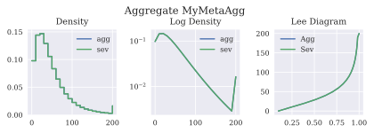

