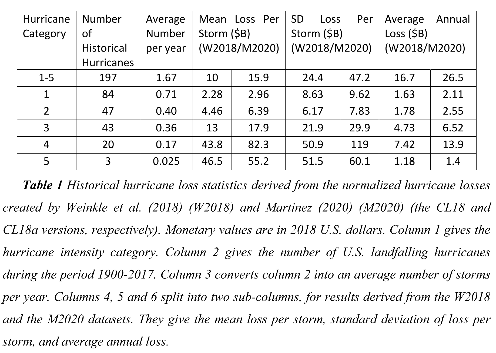

.. _2_x_cat:

.. reviewed 2022-12-24

Catastrophe Modeling
======================

**Objectives:** Applications of the :class:`Aggregate` class to catastrophe risk evaluation and pricing using thick-tailed Poisson Pareto and lognormal models, including occurrence and aggregate PMLs (OEP, AEP) and layer loss costs. Covers material on CAS Parts 8 and 9.

**Audience:** Catastrophe modelers, reinsurance actuaries, and risk management professionals.

**Prerequisites:** Basics of catastrophe modeling, catastrophe insurance and reinsurance terminology, use of ``build``.

**See also:** :doc:`2_x_capital`, :doc:`2_x_strategy`, :doc:`2_x_re_pricing`, :doc:`2_x_ir_pricing`.

**Contents:**

#. :ref:`Helpful References`
#. :ref:`cat jewsons pml estimates`
#. :ref:`cat jewsons climate estimates`
#. :ref:`ILW Pricing`
#. :ref:`Secondary Uncertainty`
#. :ref:`cat summary`

Helpful References
--------------------

* :cite:t:`Jewson2022b`
* :cite:t:`MitchellWallace2017`
* :cite:t:`Anderson1988`
* :cite:t:`Woo2002`

.. _cat jewsons pml estimates:

Jewson's US Wind PML Estimates
-------------------------------

Model Description
~~~~~~~~~~~~~~~~~~~

`Stephen Jewson <https://www.linkedin.com/in/steve-jewson-phd-052bb417/>`_ *Projections of Changes in U.S. Hurricane Damage Due to Projected Changes in Hurricane Frequencies* (submitted, under peer review), :cite:t:`Jewson2022b` reports the following frequency and severity statistics for US hurricane losses.

The dataframe ``jewson`` recreates the table and adds severity CVs.

.. ipython:: python
    :okwarning:

    from aggregate import build, qd, mv
    import pandas as pd
    import matplotlib.pyplot as plt
    jewson = pd.DataFrame(
        {'Num': [197, 84, 47, 43, 20, 3],
        'EN': [1.67, 0.71, 0.4, 0.36, 0.17, 0.025],
        'ES_W': [10.0, 2.28, 4.46, 13.0, 43.8, 46.5],
        'ES_M': [15.9, 2.96, 6.39, 17.9, 82.3, 55.2],
        'SD_W': [24.4, 8.63, 6.17, 21.9, 50.9, 51.5],
        'SD_M': [47.2, 9.62, 7.83, 29.9, 119.0, 60.1],
        'EX_W': [16.7, 1.63, 1.78, 4.73, 7.42, 1.18],
        'EX_M': [26.5, 2.11, 2.55, 6.52, 13.9, 1.4]},
        index=pd.Index(['1-5', '1', '2', '3', '4', '5'],
        dtype='object', name='Cat')
        )

    jewson['CV_W'] = jewson.SD_W / jewson.ES_W;   \
    jewson['CV_M'] = jewson.SD_M / jewson.ES_M

    qd(jewson)

Jewson models aggregate losses with Poisson frequency and lognormal severity assumptions.
Use ``build`` to create :class:`Aggregate` models of the two implied distributions. Adjust ``bs`` from recommended 1/16 to 1/8 for thick tailed distributions.

.. ipython:: python
    :okwarning:

    w = build('agg Cat:USWind:W '
              f'{jewson.loc["1":"5", "EN"].to_numpy()} claims '
              f'sev lognorm {jewson.loc["1":"5", "ES_W"].to_numpy()} '
              f'cv {jewson.loc["1":"5", "CV_W"].to_numpy()}'
              'poisson'
              , bs=1/8)
    m = build('agg Cat:USWind:M: '
              f'{jewson.loc["1":"5", "EN"].to_numpy()} claims '
              f'sev lognorm {jewson.loc["1":"5", "ES_M"].to_numpy()} '
              f'cv {jewson.loc["1":"5", "CV_M"].to_numpy()}'
              'poisson'
               , bs=1/8 )
    qd(w)
    mv(w)
    qd(m)
    mv(m)

Plots of the severity and aggregate distributions confirms they are very thick tailed.

.. ipython:: python
    :okwarning:

    @savefig catw1.png
    w.plot()

    @savefig catm1.png
    m.plot()

Aggregate PML Estimates
~~~~~~~~~~~~~~~~~~~~~~~~~

It is easy to compute aggregate PML points (aggregate quantiles). The next table shows values at a range of return periods. The return period corresponding to a :math:`p` quantile is :math:`1/(1-p)`. In a Poisson frequency model, the reciprocal of the frequency equals the average waiting time between events because of the relationship between the Poisson and exponential distributions. Amounts are in USD billions.

.. ipython:: python
    :okwarning:

    agg_pmls = pd.DataFrame({'Return': [2, 5, 10, 20, 25, 50, 100, 200, 250, 1000, 10000]}, dtype=float)
    agg_pmls['p'] = 1 - 1/agg_pmls.Return
    agg_pmls['Weinkle'] = [w.q(i) for i in agg_pmls.p]
    agg_pmls['Martinez'] = [m.q(i) for i in agg_pmls.p]
    agg_pmls = agg_pmls.set_index(['Return'])
    qd(agg_pmls)

Occurrence PML Estimates
~~~~~~~~~~~~~~~~~~~~~~~~~

Occurrence PMLs, called **occurrence exceeding probability** (OEP) points, can be computed for a compound Poisson model as adjusted severity quantiles.
The :math:`n` year OEP is defined as the loss level :math:`\mathit{OEP}(n)` so that

    there is a :math:`1/n` chance of one or more losses greater than :math:`\mathit{OEP}(n)` per year.

The definition is valid only for :math:`n\ge 1` since :math:`1/n` is interpreted as a probability. If :math:`\lambda` is the annual event frequency and :math:`S` the severity survival function, then the annual frequency of losses greater than :math:`x` equals :math:`\lambda S(x)` and therefore chance of one or more losses greater than :math:`x` equals :math:`1-\exp(-\lambda S(x))` with Poisson frequency (one minus chance of no events). Rearranging gives

.. math::

    \mathit{OEP}(n) = q\left(1 + \frac{\log(1-1/n)}{\lambda}\right)

where :math:`q` is the severity distribution quantile function.

:cite:t:`Jewson2022` considers the related notion of **event exceedance frequency** (EEF). Here, the :math:`n` year EEF is defined as the loss level :math:`\mathit{EEF}(n)` with a :math:`1/n` annual frequency. Thus

.. math::

    \mathit{EEF}(n) = q\left(1 - \frac{1}{\lambda n}\right).

This definition is valid for any :math:`n > 0` since the result is a frequency rather than a probability.
OEP and EEF are very similar for large :math:`n` because
:math:`\log(1+x)\approx x` for small :math:`x`, but they diverge significantly for small :math:`n` and only the latter makes sense for :math:`0 < n < 1`.
Jewson shows EEFs in his Figure 2.
See :ref:`Aggregate and Occurrence Probable Maximal Loss and Catastrophe Model Output`.

Jewson comments that OEP is useful for validating the frequency of annual maximum loss, which is affected by clustering. Thus OEP estimates are important for validating models that include clustering.
EEF is useful for validating whether a model captures the mean frequency of events, including events with frequency greater than 1 per year.

The following table shows OEP and EEF points, comparing the two statistics.

.. ipython:: python
    :okwarning:

    oep = pd.DataFrame({'Return': [2, 5, 10, 20, 25, 50, 100, 200, 250, 1000, 10000]}, dtype=float); \
    oep['p'] = 1 - 1/oep.Return;                                       \
    oep['W OEP'] = [w.q_sev(1 + np.log(i) / w.n) for i in oep.p];      \
    oep["W EEF"] = [w.q_sev(1 - 1 / i /w.n) for i in oep.Return];     \
    oep['M OEP'] = [m.q_sev(1 + np.log(i) / m.n) for i in oep.p];      \
    oep["M EEF"] = [m.q_sev(1 - 1 / i /m.n) for i in oep.Return];     \
    oep = oep.set_index(['Return']);                                   \
    qd(oep)

The next block of code shows the same information as Jewson's Figure 2. It includes OEP and EEF for comparison. The dashed line shows a third alternative ``aggregate`` implementation using the exact continuous weighted severity survival function ``m.sev.sf``, rather than the discrete approximation in ``m.density_df``.

.. ipython:: python
    :okwarning:

    fig, axs = plt.subplots(1, 2, figsize=(2 * 3.5, 2.45), constrained_layout=True)
    for ax, mw, title, xmax in zip(axs.flat[::-1], [m, w], ['Martinez estimates', 'Weinkel estimates'], [550, 240]):
        bit = np.exp(-(1-mw.density_df.F_sev.loc[:1000]) * m.n)
        bit = 1 / (1 - bit)
        bit.plot(logy=True, ax=ax, label='OEP = Pr no events in year')
        bit = 1 / ((1 - mw.density_df.F_sev.loc[:20000]) * m.n)
        bit.plot(logy=True, ax=ax, label='EEF RP = 1/freq')
        xs = np.linspace(0, 500, 501)
        if title[0] == 'M':
            rp = 1 / (m.n * m.sev.sf(xs))
        else:
            rp = 1 / (m.n * w.sev.sf(xs))
        ax.plot(xs, rp, c='r', ls='--', lw=2, alpha=0.25, label='From sev sf')
        ax.legend()
        ax.set(xlim=[-10, xmax], ylim=[400, .5], title=title)
        ax.set_yscale('log', base=10)
        ticks = [1, 3, 10, 30, 100, 300]
        ax.set_yticks(ticks)
        ax.set_yticklabels([f'{x}' for x in ticks]);

    @savefig jewson_fig2.png scale=20
    fig;

Feller's Relationship between AEP and OEP
~~~~~~~~~~~~~~~~~~~~~~~~~~~~~~~~~~~~~~~~~~~

For thick tailed distributions, AEP and OEP points are closely related by Feller's theorem, which says that for :math:`A\sim \mathsf{CP}(\lambda, X)` with severity :math:`X` subexponential,

.. math::

    \lambda \Pr(X>x) \to \Pr(A>x)

as :math:`x\to\infty`, see REF. The next plot confirms that Feller's approximation is very good. Note the extreme return periods returned by ``aggregate`` that would be hard to estimate with simulation.

.. ipython:: python
    :okwarning:

    fig, axs = plt.subplots(1, 2, figsize=(2 * 3.5, 2.55), constrained_layout=True)

    for ax, mw, lim, title in zip(axs.flat[::-1], [m, w], [5000, 5000], ['Martinez', 'Weinkle']):
        bit = mw.density_df.loc[:5000, ['S', 'S_sev']]
        bit['Feller'] = bit.S_sev * mw.n
        bit = 1 / bit
        bit.plot(xlim=[-10, lim], logy=True, ax=ax, ylim=[1000000, 0.5], lw=1)
        ax.set_yscale('log', base=10)
        ticks = [1,10,100,1000,10000, 1e5, 1e6]
        ax.set_yticks(ticks)
        ax.set_yticklabels([f'{x:.0g}' for x in ticks]);
        ax.set(title=title);
        if ax is axs[0]: ax.set(ylabel='Return period (years)');

    @savefig cat_feller.png scale=20
    fig.suptitle("Feller's approximation to aggregate PMLs")

.. note::

    These graphs demonstrate computational facility. I'm not suggesting one million year PML is a reliable estimate. But the figure is **reliably computing what the specified statistical model implies**. The losses shown range up to USD 5 trillion, about 20% of GDP.

.. _cat jewsons climate estimates:

Jewson's US Wind Climate Change Estimates
--------------------------------------------

Jewson Table 2 provides estimates for the impact of a 2 degree Celcius increase in global mean surface temperature (GMST) on event frequency by Safir-Simpson category. He also provides the standard deviation of the impact. These are added in the next dataframe.

.. ipython:: python
    :okwarning:

    jewson['Freq Chg'] = [None, 1.011, 1.095, 1.134, 1.179, 1.236]
    jewson['Freq Chg SD'] = [None, 0.3179, .4176, .4638, .5174, .5830]
    qd(jewson.loc["1":"5", ['Freq Chg', 'Freq Chg SD']])

He models the impact of climate change on PMLs by assuming the frequency of each category is perturbed using a lognormal with mean and standard deviation given by the last two columns of the above table. He assumes that the perturbations across categories are comonotonic. In actuarial terms, he is using comonotonic frequency mixing variables, to create a mixed compound Poisson.

We can create a similar effect using ``aggregate`` first by adjusting the baseline event frequencies by the ``Freq Chg`` column and then by applying shared mixing across all events together (resulting in comonotonic perturbations). We select a mix CV equal to Jewson's estimate for Category 4 events. The categories are similar --- in light of the overall uncertainty of the analysis.

.. ipython:: python
    :okwarning:

    qd((jewson.iloc[1:, -1] / jewson.iloc[1:, -2]))
    mix_cv = 0.5174 / 1.179
    mix_cv

The adjusted model is built using inverse Gaussian mixing variables (slightly thicker tail than gamma), rather than Jewson's lognormals. Note that the standard deviations increase but the CVs decrease.

.. ipython:: python
    :okwarning:

    wcc = build('agg Cat:USWind:Wcc '
              f'{jewson.loc["1":"5", "EN"].to_numpy() * jewson.loc["1":"5", "Freq Chg"].to_numpy()} claims '
              f'sev lognorm {jewson.loc["1":"5", "ES_W"].to_numpy()} '
              f'cv {jewson.loc["1":"5", "CV_W"].to_numpy()}'
              f'mixed ig {mix_cv}'
              , bs=1/8)
    mcc = build('agg Cat:USWind:Mcc '
              f'{jewson.loc["1":"5", "EN"].to_numpy() * jewson.loc["1":"5", "Freq Chg"].to_numpy()} claims '
              f'sev lognorm {jewson.loc["1":"5", "ES_M"].to_numpy()} '
              f'cv {jewson.loc["1":"5", "CV_M"].to_numpy()}'
              f'mixed ig {mix_cv}'
               , bs=1/8 )
    qd(wcc)
    mv(wcc)
    qd(mcc)
    mv(mcc)

The new models produce the following AALs, compare Jewson Figure 3.

.. ipython:: python
    :okwarning:

    base = pd.concat((w.report_df.loc['agg_m'].T,
               m.report_df.loc['agg_m'].T), axis=1,
              keys=['Weinkle', 'Martinez']); \
    cc = pd.concat((wcc.report_df.loc['agg_m'].T,
               mcc.report_df.loc['agg_m'].T), axis=1,
              keys=['Weinkle', 'Martinez']); \
    df = pd.concat((base, cc), axis=1,
                   keys=[' Base', 'Adjusted']); \
    df[('Change', 'Martinez')] = (df[('Adjusted', 'Martinez')] -  df[(' Base', 'Martinez')]); \
    df[('Change', 'Weinkle')] = (df[('Adjusted', 'Weinkle')] -  df[(' Base', 'Weinkle')]); \
    df[('Pct Change', 'Martinez')] = (df[('Adjusted', 'Martinez')] -
                        df[(' Base', 'Martinez')]) / jewson.iloc[0]['EX_M']; \
    df[('Pct Change', 'Weinkle')] = (df[('Adjusted', 'Weinkle')] -
                        df[(' Base', 'Weinkle')]) / jewson.iloc[0]['EX_W']; \
    df = df.iloc[[0,1,2,3,4,6]]; \
    df.index = [1,2,3,4,5, 'Total']; \
    df.index.name = 'Category'; \
    df = df.swaplevel(axis=1); \
    df = df.sort_index(axis=1, ascending=[False, True]); \
    qd(df.stack(0).swaplevel(0).sort_index(ascending=[False,True]))

Here are plots of the base and adjusted AEP and OEP curves. Compare Jewson Figure 5 (a) and (b) for aggregate and Figure 6 (a) and (b) for occurrence.

.. ipython:: python
    :okwarning:

    fig, axs = plt.subplots(2, 2, figsize=(2 * 3.5, 2 * 2.5), constrained_layout=True)
    axs = axs.flat[::-1]
    for axo, axa, (mw, mwcc), title in zip(axs.flat[0::2], axs.flat[1::2], [(m, mcc), (w, wcc)], ['Martinez', 'Weinkle']):
        bit = 1 / ((1 - mw.density_df.F_sev.loc[:2000]) * mw.n)
        bit.plot(logy=True, ax=axo, label='OEP');
        bit = 1 / ((1 - mwcc.density_df.F_sev.loc[:2000]) * mw.n)
        bit.plot(logy=True, ax=axo, label='OEP, climate chanage');
        bit = 1 / (1 - mw.density_df.F.loc[:2000])
        bit.plot(logy=True, ax=axa, label='AEP');
        bit = 1 / (1 - mwcc.density_df.F.loc[:2000])
        bit.plot(logy=True, ax=axa, label='AEP, climate change');
        axo.set(title=f'{title} OEP');
        axa.set(title=f'{title} AEP');

    for ax in axs.flat:
        ax.set(xlim=[-10, 325], ylim=[130, .5], xlabel='Loss');
        if ax in [axs.flat[1], axs.flat[3]]:
            ax.set(ylabel='Return period');
        ax.set_yscale('log', base=10);
        ticks = [1, 2, 5, 10, 20, 50, 100]
        ax.set_yticks(ticks);
        ax.set_yticklabels([f'{x}' for x in ticks]);
        ax.legend()

    @savefig cat_aep_oep.png scale=20
    fig.suptitle('Impact of climate change on AEP and OEP curves');

ILW Pricing
-------------

Industry Loss Warranties (ILW) are securities that pay an agreed amount if losses from a named peril exceed a threshold during the contract term. They are usually written on an occurrence basis and are triggered by losses from a single event. For example, a US hurricane $20 billion ILW pays 1 if there is a US hurricane causing $20 billion or more losses during the contract period. They are used by insurers to provide cat capacity. Because they are not written on an indemnity basis there is no underwriting, which simplifies their pricing.

Brokers publish price sheets for ILWs to give a view of market pricing. Price is expressed as a percentage of the face value. A recent sheet quoted prices for US hurricane as follows.

.. math::
    \small
    \begin{matrix}
    \begin{array}{@{}cr@{}}\hline
        \textbf{Attachment} & \textbf{Price (Pct)}\\ \hline
        15B  &   47.0   \\
        20B  &   38.0   \\
        25B  &   33.0   \\
        30B  &   27.5   \\
        40B  &   17.5   \\
        50B  &   13.0   \\
        60B  &   10.75   \\ \hline
      \end{array}
    \end{matrix}

The next dataframe adds expected losses and compares them to the ILW pricing. The expected loss is given by the occurrence survival function --- it is simply the probability of attaching the layer. The ``EL`` columns show Jewson's expected losses across the four views discussed above. The impact on EL is only caused by greater event frequency. Its effect increases with attachment.

.. ipython:: python
    :okwarning:

    views = ['Weinkle', 'Weinkle Adj', 'Martinez', 'Martinez Adj']
    ilw = pd.concat((x.density_df.loc[[15, 20, 25, 30, 40, 50, 60],
                        ['S_sev']].rename(columns={'S_sev': 'EL'})
                        for x in [w, wcc, m, mcc]),
                   axis=1, keys=views,
                   names=['View', 'Stat']); \
    ilw['Price'] = [.47, .38, .33, .275, .175, .13, .1075]; \
    ilw.index.name = 'Trigger'; \
    ilw = ilw.iloc[:, [-1,0,1,2,3]]; \
    qd(ilw, float_format=lambda x: f'{x:.4f}')

Cat pricing is often expressed in terms of the implied multiple: the ratio of premium to EL (reciprocal of the loss ratio).

Cat pricing multiples are usually in the range of 2 to 5 times the standard commercial models' estimates of expected loss. The base model pricing multiples, shown below, fall into this range. The climate adjusted multiples fall outside, which is not unexpected, since the pricing is for the coming period and not a future climate-impacted period.

.. ipython:: python
    :okwarning:

    ilw[[(v, 'Multiple') for v in views]] = ilw[['Price']].values / ilw[[(v, 'EL') for v in views]]; \
    qd(ilw.iloc[:, [0,5,6,7,8]])

The next table shows implied distortion parameters calibrated to market pricing for the dual

.. math:: g(s) = 1 - (1-s)^p, \ p>1

and proportional hazard (PH)

.. math:: g(s) = s^p, \ p<1

parametric families (see :cite:t:`PIR`). In both cases, a higher parameter corresponds to a higher risk load. The dual is body-risk centric and the PH is tail-risk centric. The indicated parameters are quite high, consistent with the expense of bearing cat risk. (The parameters are incomparable between distortions.)

.. ipython:: python
    :okwarning:

    params = pd.concat((np.log(1 - ilw[['Price']]).values / np.log(1 - ilw.xs('EL', axis=1, level=1)),
                    np.log(ilw[['Price']].values) / np.log(ilw.xs('EL', axis=1, level=1))),
                    axis=1, keys=['Dual', 'PH'])
    qd(params.xs('Dual', axis=1, level=0))
    qd(params.xs('PH', axis=1, level=0))

Secondary Uncertainty
------------------------

Secondary uncertainty is the practice of expanding cat model simulated output by assuming that the results from each event form a distribution. It is usual to assume the distribution is a beta. The model output provides the beta's mean and standard deviation. Given this output, modelers often need to compute statistics, such as a layer expected loss, reflecting the secondary uncertainty. This calculation can be performed in ``aggergate`` as follows.

**Assumptions:** Assume one location with a TIV of 2500 and simple cat model output with only three equally-likely events with mean losses 100, 200, and 1100 and secondary uncertainty standard deviation 100, 150, and 600. The overall event frequency is 1.6 with a Poisson distribution.

**Question:** What is the expected loss to a 1000 xs 1000 per risk cover with and without secondary uncertainty?

**Solution:** Start by building the answer without secondary uncertainty. It is convenient to put the assumptions in a dataframe.

.. ipython:: python
    :okwarning:

    df = pd.DataFrame({'GroundUpLoss': [100, 200, 1100],
                   'GroundUpSD': [100, 150, 600]})

The model with no secondary uncertainty is a simple mixed severity.

.. ipython:: python
    :okwarning:

    base = build('agg Cat:Base '
                 '1.6 claims '
                 f'dsev {df.GroundUpLoss.values} '
                 'occurrence ceded to 1000 xs 1000 '
                 'poisson'
                 , bs=1)
    qd(base)

To incorporate the secondary uncertainty, we first compute the beta parameters using the method of moments. Then build the :class:`Aggregate` model incorporating secondary uncertainty in each loss.

.. ipython:: python
    :okwarning:

    tiv = 2500;                               \
    m = df['GroundUpLoss'] / tiv;             \
    v = (df['GroundUpSD'] / tiv) ** 2;        \
    sev_a = m * (m * (1 - m) / v - 1);        \
    sev_b = (1 - m) * (m * (1 - m) / v - 1);  \
    sec = build(f'agg Cat:Secondary '
                '1.6 claims '
                f'sev {tiv} * beta {sev_a.values} {sev_b.values} wts=3 '
                'occurrence ceded to 1000 xs 1000 '
                'poisson')
    qd(sec)

Including secondary uncertainty nearly triples the expected loss to the layer, from 53 to 154. Had the third loss been only 1000, there would be no loss at all to the layer without secondary uncertainty.

The next plot compares the gross severity and aggregate distributions.

.. ipython:: python
    :okwarning:

    fig, axs = plt.subplots(1, 2, figsize=(2 * 3.5, 2.45), constrained_layout=True); \
    ax0, ax1 = axs.flat
    base.reinsurance_df['p_sev_gross'].cumsum().plot(xlim=[0, 2500], ax=ax0, label='Base'); \
    sec.reinsurance_df['p_sev_gross'].cumsum().plot(xlim=[0, 2500], ax=ax0, label='Secondary'); \
    base.reinsurance_df['p_agg_gross_occ'].cumsum().plot(xlim=[0, 2500], ax=ax1, label='Base'); \
    sec.reinsurance_df['p_agg_gross_occ'].cumsum().plot(xlim=[0, 2500], ax=ax1, label='Secondary'); \
    ax0.set(title='Occurrence', xlabel='Loss', ylabel='Distribution'); \
    ax1.set(title='Aggregate', xlabel='Loss', ylabel='Distribution'); \
    ax0.legend();
    @savefig cat_secondary.png scale=20
    ax1.legend();

.. _cat summary:

Summary of Objects Created by DecL
-------------------------------------

The following objects are created by :meth:`build` in this guide.

.. ipython:: python
    :okwarning:
    :okexcept:

    from aggregate import pprint_ex
    for n, r in build.qlist('^Cat:').iterrows():
        pprint_ex(r.program, split=20)

.. ipython:: python
    :okwarning:
    :suppress:

    plt.close('all')
