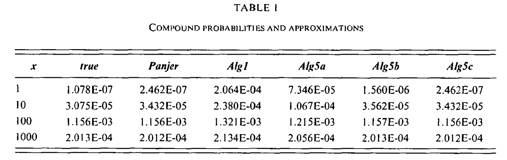

Grübel and Hermesmeier (1999)
-------------------------------

Poisson/Levy Example
~~~~~~~~~~~~~~~~~~~~~~

Here is an example from :cite:t:`Grubel1999`.
The Levy distribution is a zero parameter distribution in ``scipy.stats``. The paper considers an aggregate with Poisson(20) claim count.
The Panjer recursion column can be replicated using more buckets and padding with ``bs=1``. The ``exact`` column uses conditional probability to
compute the aggregate probability of :math:`x-1/2 < X < x+1/2` exactly. The Levy is stable with index :math:`\alpha=1/2`, which means that

.. math::

    X_1 + \cdots + X_n =_d n^2X

for iid Levy variables.

The other models use ``log2=10``, no padding, and varying amounts of **exponential
tilting** :cite:p:`Grubel1999`. Tilting multiplies the discretized severity by
:math:`e^{-\theta k}` before the transform and divides it back out afterwards,
damping the wrapped (aliased) mass so it does not contaminate the low buckets;
Embrechts and Frei recommend :math:`\theta\, N \le 20`. Tilting is purely a
teaching device here — the production convolution controls aliasing through
padding alone and carries no tilt. The illustration lives in
:mod:`aggregate.pedagogy`: ``tilted_aggregate_density`` runs one tilted
convolution and ``gh_tilting_exhibit`` assembles the whole comparison.

.. ipython:: python
    :okwarning:

    from aggregate import build, qd
    from aggregate.pedagogy import gh_tilting_exhibit, tilted_aggregate_density

    a = build('agg L 20 claim sev levy poisson', update=False)

    bs = 1
    a.update(log2=16, bs=bs, padding=2, normalize=False)
    df = a.density_df.loc[[1, 10, 100, 1000], ['p_total']] / a.bs
    df.columns = ['accurate']

    # coarse log2=10 grid, no padding, varying tilt theta (None == untilted)
    for tilt in [None, 1/1024, 5/1024, 25/1024]:
        series = tilted_aggregate_density(a, log2=10, bs=bs, padding=0, tilt=tilt)
        key = 0.0 if tilt is None else tilt
        df[f'tilt {key:.4f}'] = series.loc[[1, 10, 100, 1000]].to_numpy() / bs

    qd(df, accuracy=3)

The whole table — including the closed-form ``exact`` column — is produced in one
call by ``gh_tilting_exhibit``:

.. ipython:: python
    :okwarning:

    qd(gh_tilting_exhibit(), accuracy=3)

This table is identical to the table shown in the paper.

