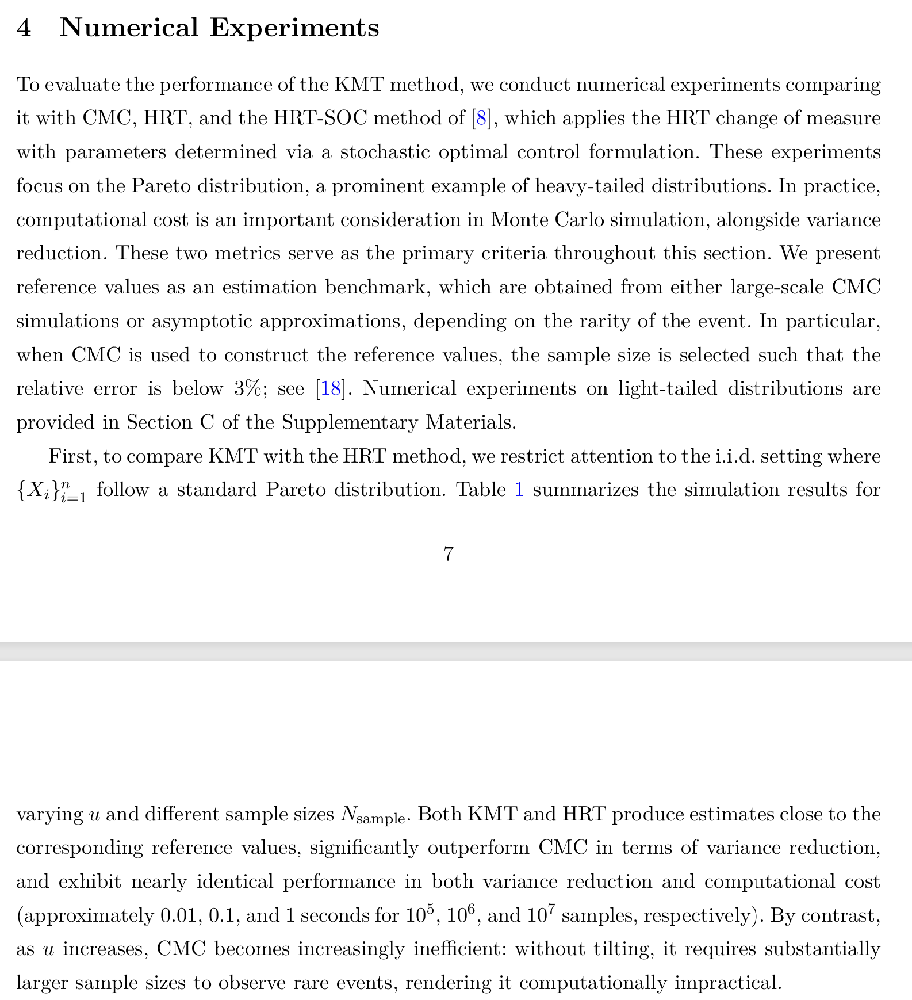
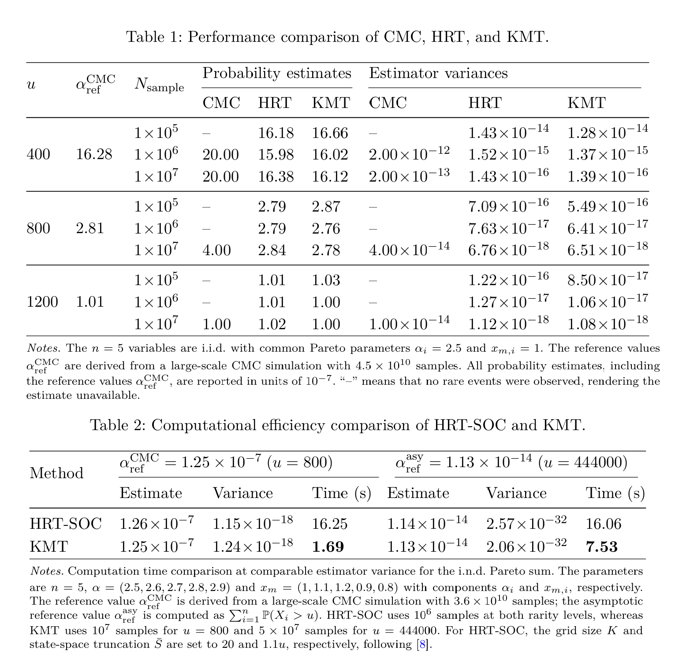
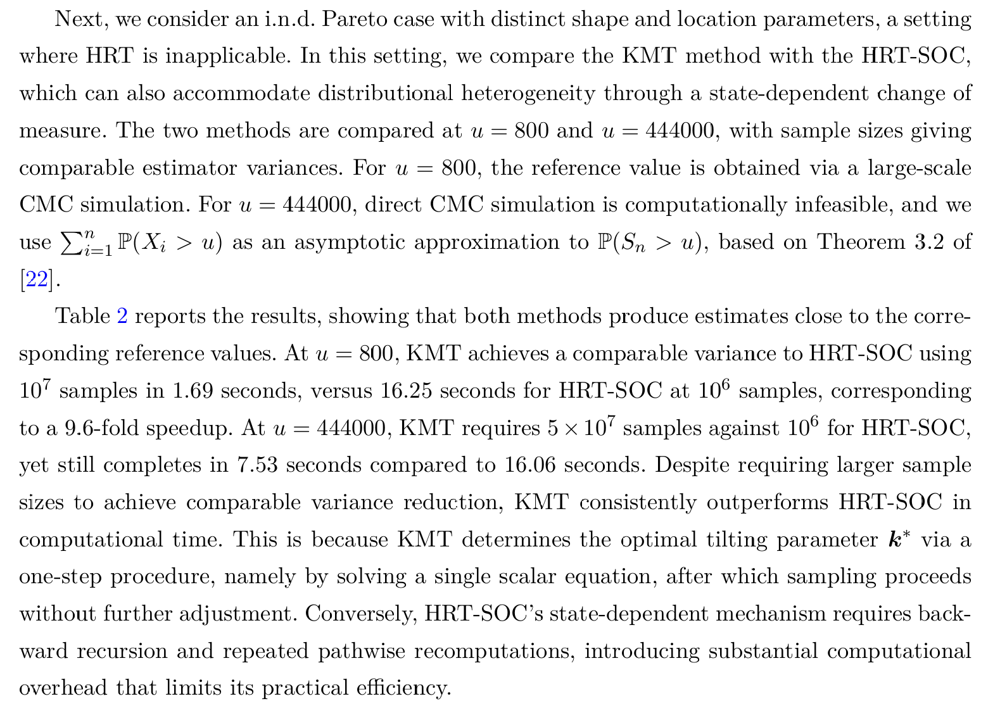
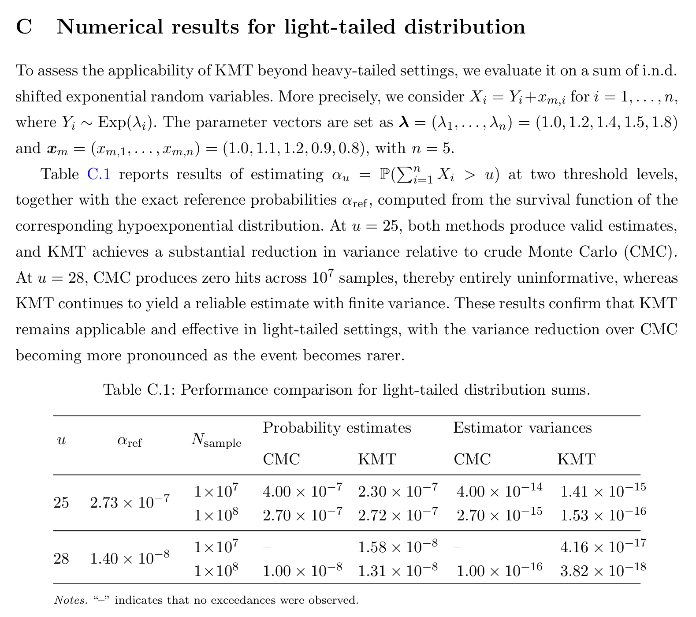

## Introduction

@Liu2026 estimates the right-tail probability

$$\alpha_u = \mathsf P(S_n > u), \qquad S_n = \sum_{i=1}^n X_i,$$

for independent, not necessarily identically distributed, positive $X_i$ and large $u$. Their method is **k-moment tilting** (KMT), an importance sampling scheme that tilts each marginal by a power rather than by an exponential:

$$g_i(x) = \frac{x^{k_i} f_i(x)}{\mathsf E_{f_i}[X_i^{k_i}]}, \qquad k_i \in [0, \bar k_i).$$

The reason for a power rather than an exponential is immediate: exponential tilting needs a finite moment generating function, which heavy-tailed laws do not have. A power tilt only needs a finite $k$-th moment, so it survives on the Pareto. Since $g_i/f_i$ is non-decreasing, the tilted variable stochastically dominates the original, which is what fixes the low hit rate.

The paper's three claims are that KMT (i) applies to heavy- and light-tailed marginals under the general independent non-identically distributed setting, where hazard rate twisting cannot go because it assumes a single common hazard function, (ii) admits closed-form optimal tilting parameters obtained by minimizing a deterministic upper bound rather than the intractable second moment, with a clean characterization of the rare-event threshold $u_0$ below which no tilting is needed, and (iii) is asymptotically optimal for the Pareto family, and beats the HRT-SOC scheme of @BenAmar2023 on computational time by roughly 9.6-fold at $u = 800$.

That last comparison is the thread back to the rest of this group. @BenAmar2023 is the state-dependent stochastic control method reproduced on its own page, and its weakness, that a backward recursion must be re-solved for each problem, is precisely what KMT is designed to avoid:

> KMT determines the optimal tilting parameter $k^*$ via a one-step procedure, namely by solving a single scalar equation, after which sampling proceeds without further adjustment. Conversely, HRT-SOC's state-dependent mechanism requires backward recursion and repeated pathwise recomputations, introducing substantial computational overhead that limits its practical efficiency.

{width=85%}

## What is reproducible

Unlike @BenAmar2023, this paper reports the probabilities, and it is careful about where its reference values come from. That makes it the best reproduction target of the group.

| Table | Setting | Threshold | Reference | Provenance |
|---|---|---|---|---|
| 1 | i.i.d. Pareto, $\alpha = 2.5$, $x_m = 1$, $n = 5$ | $u = 400, 800, 1200$ | $16.28, 2.81, 1.01 \times 10^{-7}$ | CMC, $4.5\times10^{10}$ samples |
| 2 | i.n.d. Pareto, $\alpha = (2.5 \ldots 2.9)$, $x_m = (1, 1.1, 1.2, 0.9, 0.8)$ | $u = 800$ | $1.25 \times 10^{-7}$ | CMC, $3.6\times10^{10}$ samples |
| 2 | as above | $u = 444000$ | $1.13 \times 10^{-14}$ | asymptotic, $\sum_i \mathsf P(X_i > u)$ |
| C.1 | i.n.d. shifted exponential, $\lambda = (1.0, 1.2, 1.4, 1.5, 1.8)$ | $u = 25, 28$ | $2.73\times10^{-7}$, $1.40\times10^{-8}$ | **exact**, hypoexponential |

The Table C.1 references are exact in closed form, and the Table 2 reference at $u = 444000$ is an analytic asymptotic. Both can be checked independently, which is done below before any of them is used to judge `aggregate`.

The estimator variances and CPU timings in all three tables measure KMT and are not reproducible here, nor should they be.

{width=95%}

## Setup, and one parameterization trap

```{python}
#| label: setup
import numpy as np
import pandas as pd
from aggregate import build

ALPHAS = [2.5, 2.6, 2.7, 2.8, 2.9]
XM = [1.0, 1.1, 1.2, 0.9, 0.8]
LAM = [1.0, 1.2, 1.4, 1.5, 1.8]
```

The paper uses the **Type I** Pareto,

$$f_i(x) = \frac{\alpha_i x_{m,i}^{\alpha_i}}{x^{\alpha_i + 1}}\, \mathbf 1_{\{x \ge x_{m,i}\}},$$

so $x_{m,i}$ enters as a **scale**, not as a location shift. This is the one place a reproduction silently goes wrong. In DecL, `sev pareto 2.5` is `scipy.stats.pareto(2.5)` with unit scale, giving support $[1, \infty)$ and mean $\alpha/(\alpha-1)$. To move the support to $[x_m, \infty)$ with the paper's shape you must write `sev {xm} * pareto {alpha}`. Writing `sev pareto {alpha} + {xm - 1}` also puts the support in the right place but produces a *shifted* Pareto with a different tail, and the resulting probabilities are low by a few percent.

```{python}
#| label: parameterization
rows = []
for prog, want in [('sev 1 * pareto 2.5', 2.5 * 1.0 / 1.5),
                   ('sev 1.1 * pareto 2.6', 2.6 * 1.1 / 1.6),
                   ('sev 1.2 * pareto 2.7', 2.7 * 1.2 / 1.7)]:
    obj = build(f'agg T dfreq [1] {prog}', log2=18, bs=1 / 64, normalize=False)
    rows.append({'DecL': prog, 'agg mean': obj.est_m,
                 'paper mean, a xm/(a-1)': want})
pd.DataFrame(rows)
```

Before trusting the paper's own reference values, check the two that are analytic.

```{python}
#| label: check-references
def asymptotic(u):
    """Sum_i P(X_i > u) for Type I Pareto: the Table 2 reference at u=444000."""
    return sum((x / u) ** a for a, x in zip(ALPHAS, XM))

def hypoexponential_sf(t, lam):
    """Exact survival of a sum of independent exponentials with distinct rates."""
    lam = np.asarray(lam)
    return sum(np.prod(np.delete(lam, i) / (np.delete(lam, i) - li)) * np.exp(-li * t)
               for i, li in enumerate(lam))

pd.DataFrame([
    {'quantity': 'Table 2, u=444000', 'recomputed': asymptotic(444000.0),
     'paper': 1.13e-14},
    {'quantity': 'Table C.1, u=25', 'recomputed': hypoexponential_sf(25.0 - sum(XM), LAM),
     'paper': 2.73e-7},
    {'quantity': 'Table C.1, u=28', 'recomputed': hypoexponential_sf(28.0 - sum(XM), LAM),
     'paper': 1.40e-8},
])
```

Both reproduce to the quoted precision, which confirms the Type I reading and the shift convention $X_i = Y_i + x_{m,i}$ in the light-tailed case.

## Table 1: i.i.d. Pareto

Five i.i.d. Pareto variables is `dfreq [5]` against a single severity.

```{python}
#| label: table-1
iid = build('agg T dfreq [5] sev 1 * pareto 2.5',
            log2=22, bs=1 / 16, padding=1, normalize=False)

rows = []
for u, ref, kmt in [(400, 1.628e-6, 1.612e-6), (800, 2.81e-7, 2.78e-7),
                    (1200, 1.01e-7, 1.00e-7)]:
    s = iid.density_df.loc[u, 'S']
    rows.append({'u': u, 'agg': s, 'paper CMC reference': ref,
                 'rel err vs reference': abs(s / ref - 1),
                 'KMT at 1e7 samples': kmt})
pd.DataFrame(rows)
```

Agreement to between 0.1% and 0.6%. The reference itself comes from $4.5 \times 10^{10}$ CMC samples, whose own relative standard error at $\alpha \approx 10^{-7}$ is about 0.5%, so `aggregate` is inside the reference's precision at every threshold and is at least as accurate as the KMT column at $10^7$ samples.

The estimator variances in Table 1 are not reproducible, but they are still usable: they turn the paper into a formal acceptance test. If `aggregate` is right, it should fall inside the KMT estimator's own confidence interval.

```{python}
#| label: acceptance
kmt = [(400, 1.612e-6, 1.39e-16), (800, 2.78e-7, 6.51e-18),
       (1200, 1.00e-7, 1.08e-18)]        # estimate and variance at 1e7 samples

rows = []
for u, est, var in kmt:
    sd = var ** 0.5
    s = iid.density_df.loc[u, 'S']
    rows.append({'u': u, 'KMT estimate': est, 'KMT sd': sd,
                 'lower 3 sd': est - 3 * sd, 'agg': s, 'upper 3 sd': est + 3 * sd,
                 'z score': (s - est) / sd,
                 'inside': abs(s - est) < 3 * sd})
pd.DataFrame(rows)
```

`aggregate` sits within 1.6 standard errors of the KMT estimate at all three thresholds, which is what an unbiased estimator and an exact computation should do relative to one another. The $z$ scores are notably consistent, all near $+1.5$, which would suggest a small downward bias in the tabulated $10^7$-sample estimates if it were not for the fact that three points is too few to say so, and nothing in the paper indicates whether the three rows come from independent runs.

## Table 2: i.n.d. Pareto, and where this stops working

Distinct shapes and locations means a `port` of five one-claim aggregates.

{width=85%}

```{python}
#| label: table-2
units = '\n'.join(f'\tagg P{i} dfreq [1] sev {x} * pareto {al}'
                  for i, (al, x) in enumerate(zip(ALPHAS, XM)))
ind = build('port Paretos hints{log2=22;bs=1/8;padding=1;normalize=False}\n' + units)

rows = []
for u, ref, kind in [(800, 1.25e-7, 'CMC, 3.6e10 samples'),
                     (444000, 1.13e-14, 'asymptotic')]:
    s = ind.density_df.loc[u, 'S']
    rows.append({'u': u, 'agg': s, 'paper reference': ref,
                 'reference kind': kind, 'ratio agg / reference': s / ref})
pd.DataFrame(rows)
```

The $u = 800$ row lands at 0.2%, against a reference built from $3.6 \times 10^{10}$ Monte Carlo samples.

The $u = 444000$ row is wrong by a factor of about 1550, and it is worth being precise about why, because the reason is not the model and not the parameterization. It is accumulated FFT roundoff. `aggregate` forms $S(u)$ by summing bucket masses above $u$, each carrying a rounding error of order machine epsilon times the local scale. Those errors are individually negligible and do not cancel, so the total scales with the *number of buckets summed*. At `bs = 1/8` there are 642,304 buckets above 444000 and the accumulated bias swamps a $10^{-14}$ answer.

That diagnosis makes a testable prediction: coarsen the grid, sum fewer buckets, and the answer should come back.

```{python}
#| label: grid-study
rows = []
for bs, log2 in [(1 / 8, 22), (1.0, 20), (8.0, 18), (64.0, 16),
                 (512.0, 13), (4096.0, 10)]:
    p = build(f'port P hints{{log2={log2};bs={bs};padding=1;normalize=False}}\n' + units)
    xs = p.density_df.index.values
    i = np.searchsorted(xs, 444000.0)
    s = float(p.density_df['S'].iloc[i])
    rows.append({'bs': bs, 'log2': log2, 'x_max': xs[-1],
                 'buckets above u': len(xs) - i, 'agg S(444000)': s,
                 'ratio to reference': s / asymptotic(444000.0)})
pd.DataFrame(rows)
```

Exactly as predicted, and monotonically. From 642,304 buckets down to 915, the ratio falls from 1545 to 1.01. At `bs = 4096` the computed value is $1.1435 \times 10^{-14}$ against the asymptotic reference $1.1331 \times 10^{-14}$, a 0.9% agreement, and the small remaining excess is the genuine difference between the exact probability and the first-order asymptotic, which should be positive.

The practical lesson is counterintuitive and worth stating plainly: **for a very small right-tail probability, coarsen the grid**. Fine buckets buy resolution you do not need and pay for it in accumulated noise you cannot afford. This is the same absolute error floor documented on the @BenRached2024 and @Wilson2017 pages, in a third guise: there it capped the depth of a left tail, here it caps the depth of a right tail, and in both cases it is proportional to how much of the density gets summed.

## Table C.1: light-tailed, against an exact reference

{width=85%}

Here $X_i = Y_i + x_{m,i}$ with $Y_i \sim \mathrm{Exp}(\lambda_i)$, so the shift genuinely is a shift and DecL's `+` is correct. The reference is exact, which makes this the sharpest comparison in the paper.

```{python}
#| label: table-c1
units_lt = '\n'.join(f'\tagg C{i} dfreq [1] sev {1 / l} * expon + {x}'
                     for i, (l, x) in enumerate(zip(LAM, XM)))
lt = build('port LT hints{log2=18;bs=1/1024;padding=1;normalize=False}\n' + units_lt)

rows = []
for u, kmt7, kmt8 in [(25, 2.30e-7, 2.72e-7), (28, 1.58e-8, 1.31e-8)]:
    s = lt.density_df.loc[u, 'S']
    exact = hypoexponential_sf(u - sum(XM), LAM)
    rows.append({'u': u, 'exact': exact, 'agg': s,
                 'agg rel err': abs(s / exact - 1),
                 'KMT 1e7': kmt7, 'KMT 1e7 rel err': abs(kmt7 / exact - 1),
                 'KMT 1e8': kmt8, 'KMT 1e8 rel err': abs(kmt8 / exact - 1)})
pd.DataFrame(rows)
```

`aggregate` matches the exact value to about $5 \times 10^{-4}$ at both thresholds. For comparison, KMT at $10^8$ samples is 0.4% off at $u = 25$ and 6.5% off at $u = 28$, and at $10^7$ samples it is 16% and 13% off. On this problem one deterministic build is between one and two orders of magnitude more accurate than $10^8$ importance samples, and the gap widens as the event gets rarer, which is the opposite of how a sampler behaves.

That is not a criticism of KMT, whose target is generality rather than precision on a five-variable convolution. It is a statement about which tool fits this particular question.

## Discussion

Three of the paper's four reference points reproduce cleanly, two of them against references the paper itself derived analytically rather than by simulation. The fourth, $u = 444000$, exceeds what a double precision FFT can deliver at a fine grid, and the grid study locates that boundary precisely rather than leaving it as a caveat.

The comparison worth drawing is with @BenAmar2023, reproduced on its own page. That paper reported no probabilities at all, only sample counts and CPU seconds, and the seven usable numbers had to be dug out of prose. This one tabulates the estimates, states the provenance of every reference, and gives exact references where exact references exist. The result is that it can be checked, and it checks out. Papers that report what they computed are more useful than papers that report only how fast they computed it, and this is a clean illustration.

On the substance, KMT looks right for what it claims. The power tilt is the natural move for a distribution with no moment generating function, minimizing a deterministic upper bound instead of the second moment is the standard tractable surrogate, and the threshold $u_0$ characterizing where tilting starts to help is a genuinely useful practical output that most rare-event papers do not provide. The honest limitation, which the authors state, is independence: the whole construction is a product of marginal tilts, and dependence is listed as future work.

For the library, the note to carry forward is the parameterization trap and the grid lesson. Type I Pareto takes $x_m$ as a scale, `sev {xm} * pareto {alpha}`, and getting that wrong costs a few percent in a way that shrinks with $u$ and so looks like a convergence issue rather than a specification error. And when the target probability approaches $10^{-13}$, the question to ask is not whether the grid is fine enough but whether it is too fine.

## References

::: {#refs}
:::
