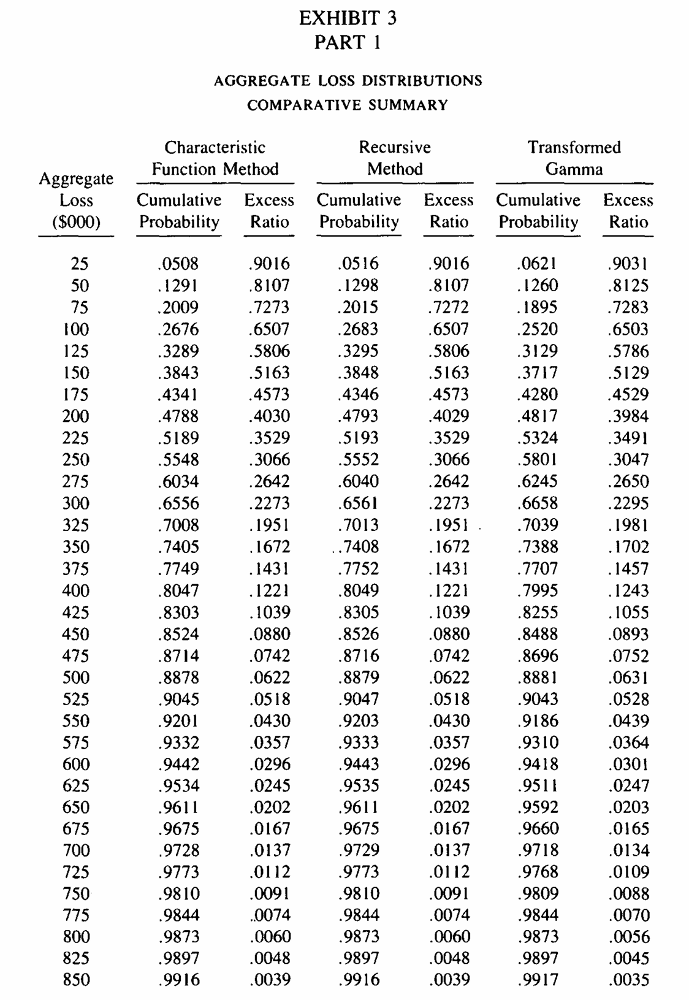
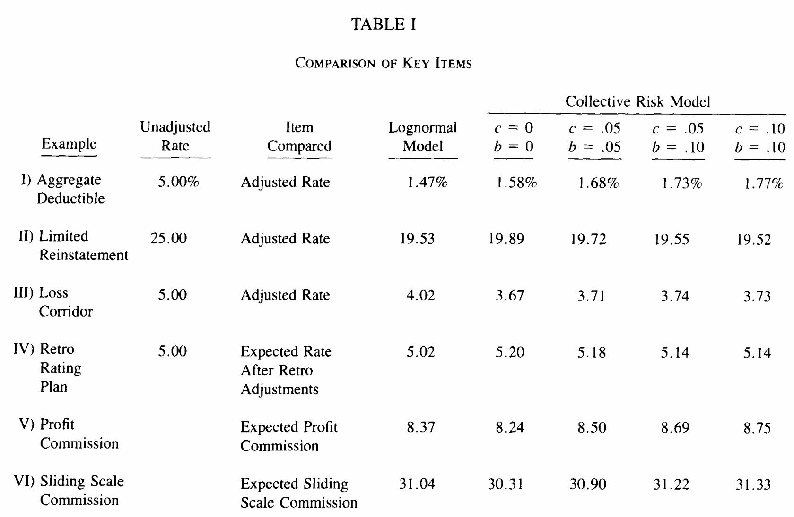
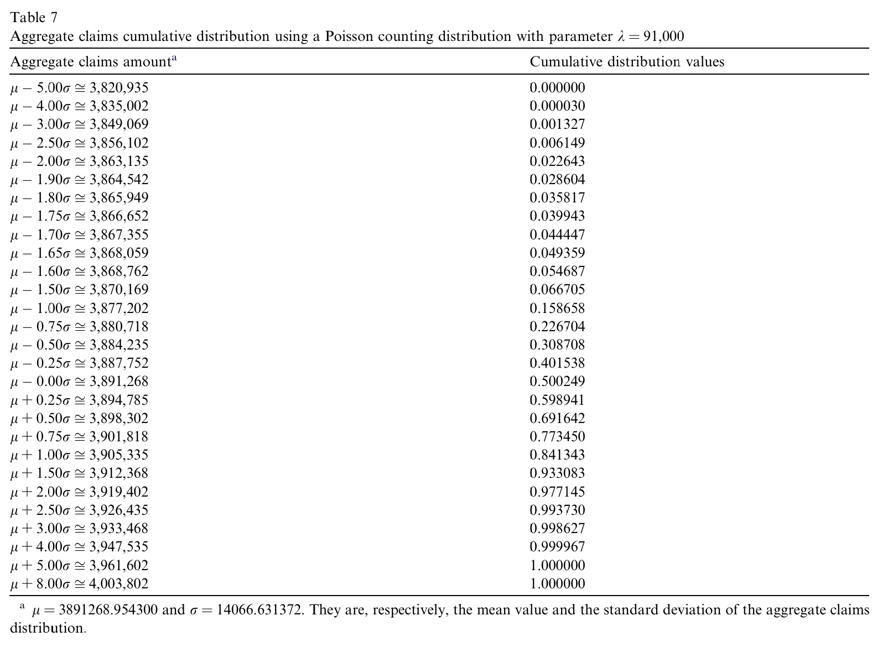

## How to read this chapter

This section presents a DecL version of five published results. Each has the same four parts: what the paper was doing, the exhibit it printed, the DecL program that reproduces it, and the answer beside the paper's own numbers.

The program on each page is not typed into the page. It is read back off the object that produced the table below it, so the two cannot drift apart. Nothing else is shown, because nothing else is needed: no discretization, no grid loop, no convolution. The bucket size and grid, where they matter, ride inside the program in the `hints{}` clause.

The five results are chosen to make five different points. @Venter1983 is about accuracy against a paper that computed the same thing two other ways. @Bear1990 is about the language, six treaty features in six clauses. @Homer2003 is about reach, a joint distribution that is a view of a program rather than a second model. @Bruno2006 is about speed. @Mata2005 is about the reproduction checking the paper rather than the other way round.

The rest of this book is the detail: fifteen papers, the transcription decisions, the readings that had to be inferred, and the cases that did not work. This chapter gives just the DecL highlights and omits the standard Python scaffolding.

```{python}
#| label: setup
#| echo: false
import re
import textwrap
import time

import numpy as np
import pandas as pd
from aggregate import build, format_program
from greater_tables import GT


def show(obj, width=76):
    """Print an object's own program, wrapped. DecL ignores line breaks.

    Whitespace runs are collapsed: `program` is preprocessor output, and the
    bracket collapse step leaves double spaces around a list. Cosmetic only.
    """
    TW = textwrap.TextWrapper(width, subsequent_indent='    ')
    # the issue is the CHist gets injected
    text = format_program(obj.program).split('\n')
    print('\n'.join(TW.fill(t) for t in text))

def summary(**kw):
    """One row of headline numbers."""
    return GT(pd.DataFrame([kw]))
```

## Venter (PCAS, 1983): Transformed Beta And Gamma Distributions And Aggregate Losses

@Venter1983 introduced the transformed gamma to actuarial work and closed by testing it against the exact aggregate distribution. His Exhibit 3 computes the cumulative probability distribution of one compound Poisson three ways over \$25,000 to \$850,000: by characteristic function inversion, by the Adelson and Panjer recursion, and by a transformed gamma matched to three moments. Frequency is Poisson with $\lambda = 13.7376$ and severity is a piecewise linear claim size CDF to a \$250,000 policy limit, tabulated at 23 points.

{width=75%}

```{python}
#| label: venter-program
#| echo: false
# The pwl severity is available in the standard library
def venter(bs, log2):
    """DecL program to build Venter aggregate with input bs and log2."""
    return build(f'agg Venter 13.7376 claims 250000 xs 0 sev  sev.Venter1983.Piecewise '
                 f'poisson hints{{log2={log2}; bs={bs}; normalize=False; padding=1}}')
# default algo bs = 80, but need at Venter points
# so use 100
v500, v5, vdef = venter(500, 16), venter(5, 18), venter(100, 16)
show(v500)
```

The small bucket size does not have full extent and triggers the (harmless) DefectiveDistributionWarning. The validation explains.

```{python}
print(textwrap.fill(v5.validation_explanation, 72))
```


```{python}
#| label: venter-exhibit
#| echo: false
XS = np.arange(25_000, 875_000, 25_000)
CHAR = np.array([.0508, .1291, .2009, .2676, .3289, .3843, .4341, .4788, .5189,
                 .5548, .6034, .6556, .7008, .7405, .7749, .8047, .8303, .8524,
                 .8714, .8878, .9045, .9201, .9332, .9442, .9534, .9611, .9675,
                 .9728, .9773, .9810, .9844, .9873, .9897, .9916])
RECU = np.array([.0516, .1298, .2015, .2683, .3295, .3848, .4346, .4793, .5193,
                 .5552, .6040, .6561, .7013, .7408, .7752, .8049, .8305, .8526,
                 .8716, .8879, .9047, .9203, .9333, .9443, .9535, .9611, .9675,
                 .9729, .9773, .9810, .9844, .9873, .9897, .9916])
F500 = np.array([v500.density_df.loc[x, 'F'] for x in XS])
F5 = np.array([v5.density_df.loc[x, 'F'] for x in XS])
FD = np.array([vdef.density_df.loc[x, 'F'] for x in XS])
ven = pd.DataFrame({'aggregate loss': XS, 'Venter char fn': CHAR,
                    'Venter recursive': RECU, 'agg bs=500': F500,
                    'agg bs=5': F5, f'agg bs={vdef.bs}': FD}).set_index('aggregate loss')
GT(ven.iloc[8:16], float_format=4)
```

The table shows eight of the thirty four rows, at the middle of the range. Over all thirty four:

```{python}
#| label: venter-verdict
#| echo: false
summary(**{'rows compared': len(XS),
           'agg bs=500 vs his recursive column':
               f'{np.abs(F500 - RECU).max():.1e}',
           'agg bs=5 vs his characteristic function column':
               f'{np.abs(F5 - CHAR).max():.1e}'})
```

Venter presents two exact *methods* that differ by up to 0.0008, and reads that gap as the cost of discretizing severity. Forty years later we can reproduce both with one method using two resolutions. Change `bs=500` to `bs=5`, one token in one program, and `aggregate` stops agreeing with his recursion and starts agreeing with his characteristic function instead. The 0.0008 was never a difference between the methods. It was the \$500 bucket, and it is the same error `aggregate` incurs when asked for the same bucket.

## Bear and Nemlick (1990): six treaty features, six clauses

@Bear1990 price six reinsurance treaties that each carry one adjustable feature, comparing a lognormal approximation of the aggregate against the collective risk model. Table I shows the six answers. The subject book is two excess casualty classes written at \$160,000 xs 0 with Pareto severities and gamma mixed Poisson counts. Treaty I puts an annual aggregate deductible of \$360,000 against \$450,000 of expected layer loss, an entry ratio of 0.800, and the indicated rate is the loss cost surviving the deductible loaded 100/75.

{width=100%}


```{python}
#| label: bear-program
#| echo: false
BOOK = ('agg BN.One [9000 3000] exposure at [0.04 0.03] rate 160 xs 0 '
        'sev 40 * pareto [0.90 0.95] - 40 poisson')
gross = build(BOOK)
net = build(BOOK + ' aggregate net of 360 xs 0')
show(net)
```

An aggregate deductible is an aggregate layer the cedant keeps, so the recovery is the aggregate net of it, and the whole feature is the last clause. Nothing else in the program changes.

```{python}
#| label: bear-exhibit
#| echo: false
charge = net.est_m / gross.actual_m
summary(**{'expected layer loss, 000s': f'{gross.actual_m:,.1f}',
           'insurance charge, exact': f'{charge:.4f}',
           'indicated rate %, agg': f'{100 / 75 * 3.75 * charge:.4f}',
           'Table I, collective risk': 1.58,
           'Table I, lognormal': 1.47})
```

The exact answer is 1.5755% against 1.58% printed, and the lognormal shortcut the paper was testing reads 1.47%. The other five treaties are one clause each, and the detail chapter prices all six.

| Treaty | Feature | DecL clause |
|---|---|---|
| I | annual aggregate deductible | `aggregate net of 360 xs 0` |
| II | three free reinstatements | `reinstatements 3 free` |
| III | loss corridor | `corridor` |
| IV | retrospective rating | `retro` |
| V | three year profit commission | `pc` |
| VI | sliding scale commission | `slide` |

Six treaties, six clauses, and no arithmetic outside the loading factors the slips specify. The detail chapter reproduces the lognormal column exactly at every printed digit and the collective risk column to the printed digit in five of the six.

Here are all six programs, at Poisson counts, as the detail chapter writes them. They are worth reading side by side: every one is the same shape, a subject book with a feature clause on the end, and the differences between the six treaties are differences of one clause. Five wrap in an `xpnl`, the walk face, which books each cession as its own step so the recovery, the ceded premium and any commission come back as separate legs. Treaty IV uses `pnl` instead, because a retro plan varies the gross premium rather than ceding anything, so there is no cession to walk and the plan replaces the premium at the head of the program.

These are shown as authored rather than as parsed, which is the one place in this chapter where that distinction matters. The canonical form the parser renders back spells several of these clauses differently: `reinstatements 3 free` is stored as a vector of three zero charges and comes back `reinstatements [0 0 0]`, percentages resolve to decimals so `corridor 100% po 100% xs 100%` comes back `corridor 1 po 1 xs 1`, and `exposure at rate` and `premium at lr` are one construct with `premium` as the canonical spelling. Everything downstream is driven by the parse, not by this text. The slip language is what is worth reading here.

```{python}
#| label: bear-all-programs
#| echo: false
TREATIES = {
    'I: annual aggregate deductible': '''
agg BN.One [9000 3000] exposure at [0.04 0.03] rate 160 xs 0
    sev 40 * pareto [0.90 0.95] - 40
    poisson
    aggregate net of 360 xs 0''',
    'II: three free reinstatements': '''
xpnl BN.TreatyII 1172 premium less
    agg BN.Two [2000 2000 2000] exposure at [0.10 0.14 0.21] rate 700 xs 0
        sev 300 * pareto [1.5 1.3 1.1] - 300
        occurrence net of 700 xs 0 deposit 1172 reinstatements 3 free as "Layer"
        poisson''',
    'III: loss corridor': '''
xpnl BN.TreatyIII 10000 premium less
    agg BN.Three [4500 4500 1000] exposure at [0.032 0.038 0.035] rate 400 xs 0
        sev 100 * pareto 1.1 - 100
        poisson
        aggregate net of 10000 xs 0 deposit 350
                       corridor 100% po 100% xs 100% as "Corridor"''',
    'IV: retrospective rating': '''
pnl BN.TreatyIV retro basic 0 lcm 1.3333333333 min 360 max 1200 premium less
    agg BN.Four [9000 3000] exposure at [0.04 0.03] rate 160 xs 0
        sev 40 * pareto [0.90 0.95] - 40
        poisson''',
    'V: three year profit commission': '''
xpnl BN.TreatyV 18000 premium less
    agg BN.Five [6000 6000 6000] exposure at [0.10 0.14 0.21] rate 700 xs 0
        sev 300 * pareto [1.5 1.3 1.1] - 300
        poisson
        aggregate net of 80% so 100000 xs 0 deposit 5625
                       pc 25% after 20% as "PC layer"''',
    'VI: sliding scale commission': '''
xpnl BN.TreatyVI 25000 premium less
    agg BN.Six 25000 exposure at 0.10 rate 900 xs 0
        sev 100 * pareto 0.98 - 100
        poisson
        aggregate net of 100000 xs 0 deposit 5000
                       slide 40% at 35% and 25% at 55% and 20% at 65% as "Slide"''',
}
for label, program in TREATIES.items():
    print(f'Treaty {label}{format_program(program)}\n')
```

Three details these programs make visible that the prose above glosses over. The nominal wide layers in III, V and VI (`10000 xs 0`, `100000 xs 0`) are not terms of the treaty: a decorator clause has to sit on an aggregate layer, so the layer is written high enough to reach everything the aggregate does and the feature supplies the only binding term. The `deposit` in each is the base premium the feature prices against, which is why the corridor's `100% po 100% xs 100%` reads in loss ratio points exactly as the slip does. And the `80% so` in Treaty V is a placement rather than a cession: premium clauses are quoted at 100% and scaled by the fraction placed, so the slip's \$4,500 on an 80% placement is a `deposit` of \$5,625.

The one genuine constraint is that each program carries exactly one feature. Three of the five features read a ceded loss ratio, and that ratio is only a deterministic rescaling of the ceded loss while the denominator stays fixed. Put two features on one program and the second reads a random denominator. The paper reaches the same conclusion from the other side in its section 5, and proposes running the collective risk model a second time on the post-coinsurance distribution: a two stage construction, not a single decorated layer.

## Homer and Clark (2003): the joint distribution is a view, not a second model

@Homer2003 introduces the two dimensional FFT to actuarial work, for the case where two covers on the same book are driven by the same losses and so cannot be priced separately. Section 2 retains \$600,000 per occurrence, buys \$400,000 xs \$600,000 per occurrence, and puts a \$5,000,000 xs \$3,000,000 stop loss on the retention. The paper builds the joint law of retained and ceded by hand, as its Table 2.3.

::: {.callout-note appearance="simple"}
**Exhibit placeholder.** Drop the scan at `img/Homer2003-Section2.png`, then replace this block with `{width=100%}`.
:::

```{python}
#| label: homer-program
#| echo: false
K = 200_000.0
a = build('agg HC 5 claims '
          'dsev [200000 400000 600000 800000 1000000] [.378 .235 .146 .091 .15] '
          'occurrence net of 400000 xs 600000 '
          'mixed gamma 0.2 hints{log2=8; bs=200000}')
show(a)
bd = a.occ_bivariate(views=('net', 'ceded'), bs=K, log2_x=7, log2_y=5)
```

That program declares the treaty and nothing two dimensional. Retained and ceded are the net and ceded views of an occurrence layer already in it, so the joint severity is the cession map applied to the gross severity, and the joint distribution is one call away: `a.occ_bivariate(views=('net', 'ceded'))`. The paper's Table 2.3 falls out as a by-product rather than an input.

```{python}
#| label: homer-exhibit
#| echo: false
d = bd.density
gy = bd.axis_xs[1]
k = int(round(3_000_000 / K))
d25 = np.vstack([d[:k + 1].sum(axis=0)[None, :], d[k + 1:]])
g25 = np.arange(d25.shape[0]) * K
hit = 1 - d25.sum(axis=1)[0]
GT(pd.DataFrame([
    {'statistic': 'expected loss to the stop loss layer',
     'aggregate': (d25.sum(axis=1) * g25).sum(), 'paper': 123_529},
    {'statistic': 'probability the stop loss is hit',
     'aggregate': hit, 'paper': 0.1508},
    {'statistic': 'mean stop loss given it is hit',
     'aggregate': (d25[1:].sum(axis=1) * g25[1:]).sum() / hit, 'paper': 819_210},
    {'statistic': 'expected loss to the per-occurrence layer',
     'aggregate': (d25.sum(axis=0) * gy).sum(), 'paper': 391_000},
    {'statistic': 'expected per-occurrence loss given the stop loss is hit',
     'aggregate': (d25[1:].sum(axis=0) * gy).sum() / hit, 'paper': 830_334},
]).set_index('statistic'), float_format=4)
```

All five to the digit, and the last two are the paper's point. The per-occurrence layer costs \$391,000 on average but \$830,334 in the scenarios where the stop loss also pays. Writing both covers is more than twice as bad as the two expected values suggest, and that is invisible to anyone pricing them separately.

## Bruno, Camerini, Manna and Tomassetti (2006): 92,832 convolutions

@Bruno2006 proposes thresholded direct convolution as a cheaper alternative to Panjer recursion, De Pril transforms and the FFT. Table 7 is the showcase: a Poisson with $\lambda = 91{,}000$ against a fourteen point discrete severity, which their formalization reaches in 92,832 convolutions. Table 4 records that Panjer recursion and De Pril both underflow at $\lambda$ as low as 1,004.8, that their own method took 1,950 seconds here, and that their FFT comparison stopped at $\lambda = 5{,}004.8$ after 3,850 seconds.


{width=100%}

```{python}
#| label: bruno-program
#| echo: false
t0 = time.time()
a7 = build('agg B7 91000 claims '
           'dsev [14 15 16 17 18 19 20 24 26 28 30 31 55 60] '
           '[.0103301 .0307990 .0293511 .0103301 .0730414 .0111568 .0264554 '
           '.1002133 .0815418 .0252146 .0212857 .0254214 .0991756 .4556837] '
           'poisson hints{log2=23; bs=1; padding=0; normalize=False}')
elapsed = time.time() - t0
show(a7)
```

```{python}
#| label: bruno-exhibit
#| echo: false
T7 = [(3877202, .158658), (3880718, .226704), (3884235, .308708),
      (3887752, .401538), (3891268, .500249), (3894785, .598941),
      (3898302, .691642), (3901818, .773450)]
T7ALL = [(3820935, .000000), (3835002, .000030), (3849069, .001327),
         (3856102, .006149), (3863135, .022643), (3864542, .028604),
         (3865949, .035817), (3866652, .039943), (3867355, .044447),
         (3868059, .049359), (3868762, .054687), (3870169, .066705),
         (3905335, .841343), (3912368, .933083), (3919402, .977145),
         (3926435, .993730), (3933468, .998627), (3947535, .999967),
         (3961602, 1.000000), (4003802, 1.000000)] + T7
F7 = a7.density_df['F']
GT(pd.DataFrame([{'aggregate loss': x, 'agg CDF': F7.loc[x], 'Table 7 CDF': c}
                 for x, c in T7]).set_index('aggregate loss'), float_format=6)
```

```{python}
#| label: bruno-verdict
#| echo: false
diff = max(abs(float(F7.loc[x]) - c) for x, c in T7ALL)
summary(**{'rows compared': len(T7ALL),
           'largest CDF difference': f'{diff:.1e}',
           'aggregate seconds': round(elapsed, 1),
           'paper seconds': 1950,
           'grid points': f'{2 ** 23:,}',
           'mean': f'{a7.est_m:,.4f}', 'paper mean': '3,891,268.9543'})
```

All twenty eight published values exact at the six decimals printed. The paper counted the FFT as one transform per convolution and summed over 92,832 of them, which is not how a compound distribution is computed: the frequency enters through its probability generating function applied pointwise to the severity transform, so the whole distribution costs two transforms whether $\lambda$ is 500 or 91,000. Some of the timing gap is twenty years of hardware but that structural part is not.

## Mata and Verheyen (2005): the check runs both ways

@Mata2005 derives trend and exposure adjustment by layer from the mathematics of exposure rating, so that lower layers can be trended without individual claim detail. Everything reduces to limited expected values, and Table 1 is the paper's foundation: $\mathsf E[X \wedge a]$ for a lognormal with $\mu = 9.31$ and $\sigma = 2.29$ at the five policy limits the example writes. The lognormal limited expected value has a closed form, so this is a rare case where a third opinion is available.

::: {.callout-note appearance="simple"}
**Exhibit placeholder.** Drop the scan at `img/Mata2005-Table1.png`, then replace this block with `{width=100%}`.
:::

```{python}
#| label: mata-program
#| echo: false
import scipy.stats as ss

MU, SIGMA = 9.31, 2.29
MEAN = float(np.exp(MU + SIGMA ** 2 / 2))
PL = [250e3, 500e3, 750e3, 1e6, 5e6]

def mata(a):
    """One limit. `exp(9.31)` is the paper's own mu, evaluated by the parser."""
    return build(f'agg M 1 claim {a:.0f} xs 0 sev exp({MU}) * lognorm {SIGMA} fixed '
                 'hints{log2=20; bs=25; normalize=False}')

builds = {a: mata(a).est_m for a in PL}
show(mata(1e6))
```

The program carries the paper's parameters as the paper writes them. DecL evaluates arithmetic in a declaration, so $\mu = 9.31$ goes in as `exp(9.31)`, the scale a lognormal actually takes, with no rounding step in between for a discrepancy to hide in.

```{python}
#| label: mata-exhibit
#| echo: false
FZ = ss.lognorm(SIGMA, scale=np.exp(MU))
closed = {a: MEAN * ss.norm.cdf((np.log(a) - MU - SIGMA ** 2) / SIGMA)
             + a * FZ.sf(a) for a in PL}
PAPER = dict(zip(PL, [48539, 64416, 74252, 81301, 117221]))
mata = pd.DataFrame([
    {'policy limit': a, 'closed form': closed[a], 'aggregate': builds[a],
     'Table 1': PAPER[a], 'agg / closed - 1': builds[a] / closed[a] - 1,
     'Table 1 / closed - 1': PAPER[a] / closed[a] - 1} for a in PL
]).set_index('policy limit')
GT(mata, formatters={'closed form': '{x:,.2f}', 'aggregate': '{x:,.2f}',
                     'Table 1': '{x:,.0f}', 'agg / closed - 1': '{x:.2e}',
                     'Table 1 / closed - 1': '{x:.2e}'})
```

`aggregate` matches the closed form to better than five parts in a hundred million at every limit. The paper's own Table 1 runs 0.04% high at \$250,000 and drifts steadily to 0.24% low at \$5,000,000, in a smooth progression, which is the signature of a numerical integration losing tail as its upper limit moves out. Nothing in the paper's conclusions depends on it, and the detail chapter reproduces every derived table to the last printed digit when driven off the paper's own Table 1. The finding is what a reproduction is for: two independent computations of one quantity, and one of them turns out to be an approximation nobody flagged.

## Where the detail is

Each of these has a chapter, and the chapters carry what a page cannot: the transcription decisions, the readings that had to be inferred and then confirmed by fit, the grid caveats, and the arithmetic behind every acceptance test. @Venter1983, @Bear1990 and @Homer2003 are in the actuarial models part, @Bruno2006 in the part on exact computation, @Mata2005 alongside @Mack2003 in the actuarial models part as well.

The book also carries what did not work, which is the more informative half. @Jin2016 has a part to itself and is not a reproduction: the feature it needs, common shock dependence on frequencies rather than on a joint severity, does not exist. @BenRached2024 and @Wilson2016a locate a floor under FFT accuracy, below roughly $10^{-13}$, and @Wilson2017 shows the repair. Three of the fifteen papers contain errors the reproduction found, which is not a criticism of the authors so much as evidence that the check runs in both directions.
