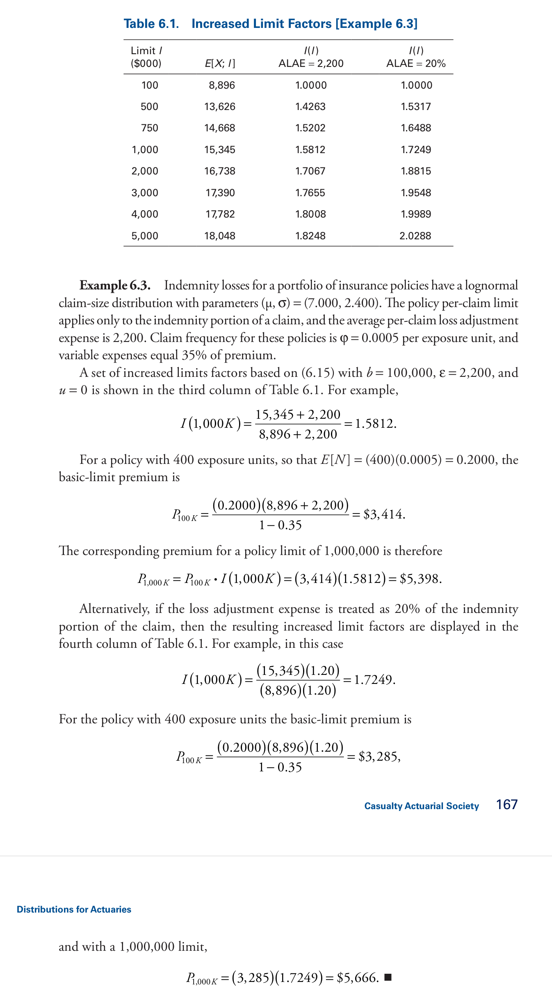

---
jupyter:
  jupytext:
    formats: ipynb,md
    text_representation:
      extension: .md
      format_name: markdown
      format_version: '1.3'
      jupytext_version: 1.13.5
  kernelspec:
    display_name: Python 3 (ipykernel)
    language: python
    name: python3
---

# Problems and Solutions 

Exercies from books and exams. Good tests!

Will be basis for Student (& Prof) Vignette. 

## Provenance

* Oct 2022 created new.

```python
from aggregate import build
from aggregate import Distortion, make_mosaic_figure, Aggregate, Portfolio
```

# Exercises from LDA (Frees Book) 

```python
ex_3_3_5 = build('agg AEQ 1 claim sev [200 200] * [expon pareto] [1 3] wts [.25 .75] + [0 -200] fixed',
             normalize=False)
    # , discretization_calc='both', log2=16)
                 # sev_calc='continuous')
                 # log2=16, bs=1/64) # , sev_calc='continuous')
self = ex_3_3_5
1/ex_3_3_5.bs
```

```python
ex_3_3_5
```

```python
f, f2 = ex_3_3_5.sev_cdf(100, True)
f, .25*(1-np.exp(-(100/(100 + 100)))) + .75*(1 - (200/(100+200))**3), ex_3_3_5.cdf(100), ex_3_3_5.sev_cdf(100+ex_3_3_5.bs/2)
```

```python
from aggregate import build
import aggregate as agg
```

```python
build('agg AEQ2 1 claim inf xs 200 sev lognorm 200 cv .3  fixed') #, bs=1/16)
```

```python
ex_3_4_1 = build('agg AEQ2 1 claim inf xs 100 sev 1000 * expon 1 ! fixed') # , bs=1/16)
# ex_3_4_1 = build('agg AEQ2 1 claim sev 1000 @ expon 1 occurrence net of 100 x 0 fixed', log2=16)
self = ex_3_4_1
```

```python
self
```

```python
1000 * np.exp(-0.1) , (1000 * np.exp(-0.1) * 1.1)**2
```

```python
%%sf 1 1 
self.density_df.F.plot(ax=ax)
ax.set(ylim=[-0.05, 1.05])
ax.grid(lw=.25, c='w')
```

```python
ex_3_4_2 = build('agg AEQ2 1 claim sev 10 * beta 2 1 occurrence net of 4 x 0 fixed')
self = ex_3_4_2
self
```

```python
ex_3_4_2 = build('agg AEQ2 1 claim 6 x 4 sev 10 * beta 2 1 fixed')
self = ex_3_4_2
self
```

```python
ex_3_4_2 = build('agg AEQ2 1 claim 6 x 4 sev 10 * beta 2 1 ! fixed')
self = ex_3_4_2
self
```

```python
%%sf 1 1 
self.density_df.F.plot(ax=ax)
ax.set(ylim=[-0.05, 1.05])
ax.grid(lw=.25, c='w')
```

```python
xs = np.linspace(0, 4, 2**13, endpoint=False)
F = np.where(xs<3,(xs * xs  * (2 - xs / 3)) / 9, 1)
ps = np.diff(F, append=1)
plt.plot(xs, ps)
```

```python
ex_3_4_4 = Aggregate('Example', exp_en=1, sev_name='dhistogram', sev_xs=xs, sev_ps=ps, 
                 exp_attachment=0, exp_limit=1, freq_name='fixed')
self = ex_3_4_4
self
```

```python
ex3_4_5_06 = build('agg X06 1 claim 500 x 100 sev 1000 * expon fixed')
ex3_4_5_07 = build('agg X07 1 claim 500 x 100 sev 1050 * expon fixed')
ans = pd.concat((ex3_4_5_06.describe, ex3_4_5_07.describe), keys=['2006', '2007'])
display(ans)
ans.iloc[3, 0] / ans.iloc[0, 0] - 1
```

```python
ans = build.write('agg Copart 1 claim sev 3600 * pareto 5 -3600 fixed')
```

```python
list(ans.keys())
```

```python
ans[('agg', 'Copart')].object
```

```python
build('agg Copart 1 claim 5000 xs 0 sev 3600 * pareto 5 - 3600 occurrence net of 0.15 so 5000 xs 0 fixed', log2=16)
```

```python
# their cv
987.6108 / 741.5103
```

```python
from aggregate import build
```

```python
ob = build('agg Copart 1 claim sev 3600*pareto 5 - 3600 occurrence net of 0.15 so 1e7 xs 0 fixed', log2=18, bs=1/4)
ob
```

```python
ex3_4_4 = build('agg Copart 1 claim sev 3600 * pareto 5 - 3600 occurrence net of 0.15 so 5000 xs 0 and 1e20 xs 5000 fixed')
self = ex3_4_4
```

```python
self
```

```python
741.5103 * .85
```

```python

```

```python
self.density_df.F.plot()
```

# Agg Loss Models, Ch 5

```python
ex_5_3_1 = build('agg QU 12 claims dsev [1 2 3] [1/2 1/3 1/6] poisson')
ex_5_3_1
```

```python
ex_5_3_1.agg_m, ex_5_3_1.agg_var
```

```python
ex_5_3_2 = build('agg QU2 dfreq [1 2] [.8 .2] dsev [0 100 1000] [.2 .7 .1]')
ex_5_3_2
```

```python
ex_5_3_2.agg_m, ex_5_3_2.agg_sd, ex_5_3_2.agg_var 
```

```python
ex_5_3_3 = build('agg QU3 4 claims dsev [1:4] geometric')  
ex_5_3_3
```

```python
ex_5_3_3.cdf(3)
```

```python
ex_5_3_3.density_df.F[:20]
```

```python
from aggregate import MomentAggregator
import scipy.stats as ss
```

```python
ex_5_3_5 = build('agg Pharma 25 claims sev 90 * uniform 1 + 5 poisson')
```

```python
ex_5_3_5.sf(2000), ex_5_3_5.agg_m, ex_5_3_5.agg_var
```

```python
import scipy.stats as ss
```

```python
m, sd =  ex_5_3_5.agg_m, ex_5_3_5.agg_var**.5
fz = ss.norm(loc=m, scale=sd)
```

```python
mom = MomentAggregator.agg_from_fs2(8, 9, 10000, 3937**2)
fz = ss.norm(loc=mom.ex, scale=mom.sd)
mom['prob'] = fz.sf(1.5*m)
mom
```

```python
ax = (ex_5_3_5.density_df.p / ex_5_3_5.bs).plot(label='Exact')
ax.plot(ex_5_3_5.xs, fz.pdf(ex_5_3_5.xs), label='Normal approx')
ax.grid(lw=.25, c='w')
ax.set(xlim=[0, 3000], title='Normal approximation')
ax.legend(loc='upper right')
```

```python
ex_5_3_6a = build('agg Projects 2 claims dsev [5 10 20] [.2 .3 .5] geometric')
ex_5_3_6a
```

```python
# geometric, mean=beta, p=1/(1+beta), var=b(1+b)
np.sqrt(2*3) / 2
```

```python
ex_5_3_6b = build('agg Projects 2 claims dsev [5 10 20] [.2 .3 .5] geometric aggregate net of 15 x 0')
ex_5_3_6b
```

```python
ex_5_3_6c = build('agg Projects 2 claims dsev [5 10 20] [.2 .3 .5] geometric aggregate net of 5 x 0')
ex_5_3_6d = build('agg Projects 2 claims dsev [5 10 20] [.2 .3 .5] geometric aggregate net of 10 x 0')
display(ex_5_3_6c)
ex_5_3_6d
```

```python
# var(NB) = n (1+cn), c = (v/n-1)/n, cv=c*c
c = (8/3-1)/300
cv = c**.5
c, cv
```

```python
# unconditional doesn't work with dsev?
# ex_5_5_5 = build(f'agg Projects 300 claims inf xs 10 dsev [4*1.5 8*1.5 12*1.5 20*1.5] ! mixed gamma {cv}')
ex_5_5_5 = build(f'agg Projects 300 claims inf xs 10 sev dhistogram xps [{4*1.5} {8*1.5} {12*1.5} {20*1.5}] ! mixed gamma {cv}')
ex_5_5_5
```

```python
np.sqrt(800)/ 300
```

```python
ex_5_5_5.agg_var
```

```python
cv
```

```python
ex_5_5_7 = build(f'agg Auto {20 * 0.8} claims inf xs 100 sev 200 * expon ! poisson')
ex_5_5_7
```

## Aggregate loss guided tutorials

https://www.ssc.wisc.edu/~jfrees/loss-data-analytics/aggregate-loss-guided-tutorials/

```python
soa113 = build('agg SOA113 dfreq [0 2 3] [.7 .2 .1] dsev [0, 10] [.8 .2]')
soa113
```

```python
soa113.sf(soa113.agg_m + 2 * soa113.agg_sd)
```

```python
soa99 = build('agg SOA99 2 claims dsev [1 2 3] poisson aggregate net of 2 x 0')
soa99
```

```python
soa212 = build('agg SOA212 10 claims 6 x 4 sev 10 * uniform ! poisson')
soa212
```

```python
soa212.agg_var
```

# web trawling
https://web.ma.utexas.edu/users/mcudina/m339j-sample-three-probs.pdf


Problem 3.5. (10 points) The frequency random variable N is assumed to have a Poisson distribution
with a mean of 2. Individual claim severity random variable X has the following probability mass
function
pX(100) = 0.6, pX(200) = 0.3, pX(300) = 0.1.
Let the above be the common distribution of the i.i.d. severity random variables {Xj ; j = 1, 2, . . . },
and Let our usual assumptions hold, i.e., let N be independent of {Xj ; j = 1, 2, . . . }. Define the
aggregate loss as S =
PN
j=1 Xj . Calculate the probability that S is exactly equal to 300.

```python
web = build('agg Web 2 claims dsev [100 200 300] [.6 .3 .1] poisson')
web
```

```python
web.pmf(300)
```

Problem 3.6. (6 points) In the compound model for aggregate claims, let the frequency random
variable N have the probability (mass) function
pN (0) = 0.4, pN (1) = 0.3, pN (2) = 0.2, pN (4) = 0.1.
Moreover, let the common distribution of the i.i.d. severity random variables {Xj ; j = 1, 2, . . . } be
given by the probability (mass) function pX(1) = 0.3 and pX(2) = 0.7.
Let our usual assumptions hold, i.e., let N be independent of {Xj ; j = 1, 2, . . . }.
Define the aggregate loss as S =
PN
j=1 Xj .
Calculate E[(S − 2)+].


```python
web2 = build('agg Web2 dfreq [0 1 2 4] [.4 .3 .2 .1] dsev [1 2] [.3 .7] aggregate net of 2 x 0')
web2
```

# KPW: Loss Models, Fifth Edition


An insurable event has a 10% probability of occurring and when it occurs results in
a loss of 5,000. Market research has indicated that consumers will pay at most 550
to purchase insurance against this event. How many policies must a company sell in
order to have a 95% chance of making money (ignoring expenses)?

```python
from aggregate import MomentAggregator, MomentWrangler
```

```python
ma = MomentAggregator()
```

```python
MomentAggregator.agg_from_fs2(100, 300, 10, 16)
```

```python
type(_)
```

```python
b = build('agg FreqBinomial 2 claims dsev [1] binomial 0.25')
b
```

```python
import scipy.stats as ss
fz = ss.binom(8, 0.25)
[fz.pmf(i) for i in range(9)]
```

```python
b.density_df.query('p > 0').p
```

```python
from aggregate import build
```

```python
for n in range(2430, 2440):
    kpw91 = build(f'agg KPW9.1 {n * 0.1} claims dsev [5] [.3 .7] binomial 0.1', update=False)
    fz = kpw91.fit('norm')
    z = fz.cdf(n*.55)
    print(n, z)
    if z >= 0.95:
        break
# kpw91.update(approximation='exact', log2=18, bs=1)
```

```python
kpw91.update(log2=17, approximation='exact')
```

```python
kpw91.bs, kpw91.cdf(n*0.55)
```

```python
fz.stats()
```

```python
n = 2435.42
(.11 * n - 0.1 *n) / np.sqrt(0.1*0.9*n)
```

## KWP 9.3, 9.4

```python
moms = MomentAggregator.agg_from_fs2(6.7, 2.3**2, 179247, 52141**2)
moms
```

```python
fzn = ss.norm(loc=moms.ex, scale=moms.sd)
sigma = np.sqrt(np.log(moms.cv**2 + 1))
fzl = ss.lognorm(sigma, scale=moms.ex*np.exp(-sigma**2/2))
fzn.stats(), fzl.stats(), fzn.sf(1.4 * moms.ex), fzl.sf(1.4 * moms.ex)
```

```python
sigma
```

## Example KPW 9.5, 9.6

Noote: units of 25

```python
from aggregate import build
```

```python
kpw95 = build('agg KPW.95 dfreq  [0:8] [0.05, 0.1, 0.15, 0.2, 0.25, 0.15, 0.06, 0.03, 0.01]'
              'dsev [1:10] [0.15, 0.2, 0.25, 0.125, 0.075, 0.05, 0.05, 0.05, 0.025, 0.025]')
kpw95
```

```python
kpw95.agg_m, kpw95.agg_var
```

```python
p = kpw95.density_df.query('p > 0')[['p', 'S']]
p.head()
```

```python
kpw95.agg_m, kpw95.agg_var
```

```python
(p.S[::-1].cumsum()[::-1] * 25)[:8]
```

## Example 9.9, 9.10

```python
from aggregate import build
from aggregate import Aggregate
```

```python
od = build.interpret_program('''
port Ex9.9
    agg A 2 claims dsev [1 2] [.6 .4] poisson
    agg B 1 claims dsev [1 3] [.7 .3] poisson
''')
```

```python
od[0].list()
```

```python

```

```python
od[0].spec
```

```python
from aggregate import build
```

```python
from aggregate import Portfolio
```

```python
from numpy import array
```

```python
p = Portfolio('test', [{'name': 'A', 'exp_en': 2.0, 'sev_name': 'dhistogram', 'sev_xs': array([         1,          2]), 'sev_ps': array([       0.6,        0.4]), 'freq_name': 'poisson', 'note': ''}, {'name': 'B', 'exp_en': 1.0, 'sev_name': 'dhistogram', 'sev_xs': array([         1,          3]), 'sev_ps': array([       0.7,        0.3]), 'freq_name': 'poisson', 'note': ''}])
```

```python
a = build("""
agg logo1 0.05 claim [10, 22.632, 35.263, 47.895, 60.526, 73.158, 85.789, 98.421, 111.05, 123.68, 136.32, 148.95, 161.58, 174.21, 186.84, 199.47, 212.11, 224.74, 237.37, 250] xs 0 sev lognorm 100 cv 1 fixed
agg logo2    1 claim [10, 22.632, 35.263, 47.895, 60.526, 73.158, 85.789, 98.421, 111.05, 123.68, 136.32, 148.95, 161.58, 174.21, 186.84, 199.47, 212.11, 224.74, 237.37, 250] xs 0 sev lognorm 100 cv 1 fixed
""")
a
```

```python
a[0].object.plot()
```

```python
ax = a[1].object.density_df.p_sev.plot()
ax.set(xlim=[0, 275]);
```

```python
port = build('''
port Ex9.9
    agg A 2 claims dsev [1 2] [.6 .4] poisson
    agg B 1 claims dsev [1 3] [.7 .3] poisson
''', bs=1, log_level=26)
port
```

```python
port.pmf(2)
```

```python
np.exp(-3)
```

```python
port.density_df.loc[:10, ['p_total']]  / np.exp(-3)
```

# Exerc 9.40

```python
from aggregate import build
```

```python
port0940 = build('''

port Ex9.40
    agg A 50 claims dsev [10] poisson
    agg B 60 claims dsev [20] poisson
    agg C 30 claims dsev [40] poisson
    
''')

port0940
```

```python
port0940.agg_m, port0940.agg_sd,port0940.agg_var , port0940.agg_skew
```

```python
port0940.density_df.F.plot()
```

# Bahnemann Chapter 6: Limits and Deductibles 

```python
## Example 4.1
```

```python
a = build('agg Ex.4.1 dfreq[0 1 2][.6 .3 .1] dsev[1 2 3][.4 .5 .1]')
a
```

```python
a.agg_m, a.agg_var
```

```python
a.density_df.query('p_total > 0') [['p_total', 'F']]
```

## Example 4.2

```python
from aggregate import build
```

```python
a = build('agg Ex.4.2 2.5 claims sev 4 * gamma 3 poisson', log2=16)
a
```

```python
a.agg_m, a.agg_var
```

```python
a.density_df.loc[sorted(np.hstack((5, np.arange(0, 100.5, 10)))), 
                        ['F']].style.format(lambda x: f'{x:.4g}')
```

```python

```

```python

```

```python

```

## Bahnemann Example 6.3

 

```python
from aggregate import build
f3 = lambda x: f'{x:.3f}'
f4 = lambda x: f'{x:.4f}'
g3 = lambda x: f'{x:.3g}'
fc1 = lambda x: f'{x:,.1f}'
fc0 = lambda x: f'{x:,.0f}'
import scipy.stats as ss
```

```python
def qd(df, caption=''):
    f3 = lambda x: f'{x:.3f}'
    f4 = lambda x: f'{x:.4f}'
    g3 = lambda x: f'{x:.3g}'
    fc1 = lambda x: f'{x:,.1f}'
    fc0 = lambda x: f'{x:,.0f}'
    mns = df.mean()
    ans = {}
    for c, mn in zip(df, mns): 
        ans[c] = f4 if mn < 10 else fc0
    if caption == '': 
        display(df.style.format(ans))
    else:
        display(df.style.format(ans).set_caption(caption))
        
```

```python
# need up to 5M and need a reasonably small bs, say 50
# hence neeed log2 ge
np.ceil(np.log(5e6 / 50) / np.log(2))
```

```python
# actual mean
np.exp(7+2.4**2/2), np.exp(7)
```

```python
a = build('agg B.Ex.6.3 1 claim '
          'sev exp(7) * lognorm 2.4 '
          'fixed', bs=50, log2=17, 
          # Normalize=false is critical to getting the right accuracy
          # you can see this will be an issue because you won't get 
          # to the "end" of the distribution 
          normalize=False, 
         )
a
```

```python
# survival
a.density_df.loc[[1e5,  5e5, 7.5e5, 1e6, 2e6, 3e6, 4e6, 5e6], ['F', 'S', 'lev']].style.format({'F': f3, 'S': g3, 'lev': fc1})
```

```python
alae = ε = 2200
ϕ = 0.0005
ve = 0.35
```

```python
# survival
rows = [1e5,  5e5, 7.5e5, 1e6, 2e6, 3e6, 4e6, 5e6]
bit = a.density_df.loc[rows, ['lev']]
bit['Fixed ALAE'] = (bit.lev + alae) / (bit.lev.iloc[0] + alae)
bit['Prop ALAE'] = bit.lev / bit.lev.iloc[0]
qd(bit.reset_index(drop=False), 'Table 6.1: Increased limits factors')
```

```python
# exposure
m = 400
prem_bl = m * ϕ * (bit.loc[100000, 'lev'] + alae) / (1 - ve)
prem_bl
```

## Bahnemann Example 6.4

```python
bit['Premium'] = m * ϕ * (bit['lev'] + alae) / (1 - ve)
# bit = bit.drop([500000, 750000])
bit['Layer Premium'] = np.diff(bit.Premium, prepend=0)
qd(bit.reset_index(drop=False), 'Table 6.2')
```

```python
bl = build('agg Basic 0.2 claims 100000 x 0 sev lognorm 
```

```python
1/1.2
```

```python
# ALAE factor
u = 1.2
```

```python
bl = build('agg B.Basic 0.2 claims '
           '100000 xs 0 '
          'sev exp(7) * lognorm 2.4 '
          'poisson', bs=50, log2=17, 
          normalize=False, 
         )

b1m = build('agg B.Basic 0.2 claims '
           '1000000 xs 0 '
          'sev exp(7) * lognorm 2.4 '
          'poisson', bs=50, log2=17, 
          normalize=False, 
         )
```

```python
bl.describe
```

```python
k_prime = 0.0277
k = k_prime * np.sqrt(m * ϕ)
ex, cvx = bl.describe.loc['Sev', ['E(X)', 'CV(X)']]
vx = (cvx * ex) **2
ex2 = vx + ex**2
ex, cvx, ex2, k_prime * np.sqrt(ex2), k * bl.describe.loc['Agg', 'CV(X)'] * ex
```

```python
ex, cvx = b1m.describe.loc['Sev', ['E(X)', 'CV(X)']]
vx = (cvx * ex) **2
ex2 = vx + ex**2
ex, cvx, ex2, k_prime * np.sqrt(ex2), k * b1m.describe.loc['Agg', 'CV(X)'] * ex
```

```python
b10m = build(f'agg B.Basic.All {m * ϕ} claims '
           '10000000 xs 0 '
          'sev exp(7) * lognorm 2.4 '
          'poisson', bs=50, log2=18, 
          normalize=False, 
         )
b1m
```

```python
df = b10m.density_df[['loss', 'p_sev', 'S_sev', 'lev', 'exlea']]
# severity lev
df['ex_lt'] = (df.loss * df.p_sev).cumsum()
df['sev_lev'] = df.ex_lt + df.S_sev * df.loss
# sev lev squared
df['ex2_lt'] = (df.loss ** 2 * df.p_sev).cumsum()
df['ex2'] = df.ex2_lt + df.S_sev * df.loss ** 2
df['rho'] = df.ex2 ** 0.5 * k_prime
```

```python
rows = [100000.0, 500000.0, 1000000.0, 2000000.0, 3000000.0, 4000000.0, 5000000.0]
```

```python
df['LLAE'] = df.sev_lev * u
df['I wo'] = df.sev_lev / df.loc[100000, 'sev_lev']
df['I with'] = (df.LLAE + df.rho) / (df.LLAE[100000] + df.rho[100000])
qd(df.loc[rows, ['loss', 'LLAE', 'rho', 'I wo', 'I with']].reset_index(drop=True), 'Table 6.3')
```

```python
np.sqrt(0.1)
```

```python
bagg500 = build(f'agg B.Basic.All 1.2 claims '
           '500000 xs 0 '
          'sev exp(7.6) * lognorm 2.4 '
          f'mixed gamma {np.sqrt(0.1)}', bs=50, log2=18, 
          normalize=False, 
         )
bagg2m = build(f'agg B.Basic.2M 1.2 claims '
                '2000000 xs 0 '
                'sev exp(7.6) * lognorm 2.4 '
               f'mixed gamma {np.sqrt(0.1)} ', 
                bs=50, log2=18, 
                normalize=False, 
         )
bagg2m3a = build(f'agg B.Basic.2M 1.2 claims '
                '2000000 xs 0 '
                'sev exp(7.6) * lognorm 2.4 '
               f'mixed gamma {np.sqrt(0.1)} aggregate ceded to {3000000} xs 0', 
                bs=50, log2=18, 
                normalize=False, 
         )
```

```python
bagg500
```

```python
bagg2m
```

```python
bagg2m3a
```

```python
bagg2m.agg_sd,bagg2m.agg_var, bagg2m.agg_skew
```

```python
fz = bagg2m.approximate('sgamma')
```

```python
from scipy.integrate import quad
```

```python
fz.stats('mvs')
```

```python
quad(fz.sf, 3e6, np.inf)
```

```python
quad(fz.sf, 3e6, 50e6)
```

```python
quad(lambda x : (x-3e6) * fz.pdf(x), 3e6, np.inf)
```

```python
fz.sf(3e6), bagg2m.sf(3.e6), fz.sf(3e6) - bagg2m.sf(3.e6)
```

```python
bagg2m.density_df.loc[3e6, 'S'] - fz.sf(3e6), \
bagg2m.density_df.loc[3e6, 'F'] - fz.cdf(3e6)
```

```python
(bagg2m.density_df.loc[3e6:, 'S'].sum() * bagg2m.bs * 100
```

```python
bagg2m.describe#.iloc[-1, :2].diff()
```

```python
df = bagg2m.density_df.filter(regex='loss|^p$|F|S|lev')
df['sg'] = fz.cdf(df.loss)
df['pdf'] = fz.pdf(df.loss)
df
```

```python
df.loc[3e6, 'S'] * 1000, fz.sf(3.e6) * 1000
```

```python
bagg2m.limits()
```

```python
%%sf  1 1 6 4 
df[['p', 'pdf']].plot(ax=ax)
ax.set(xlim=[0, 6e6], yscale='log') # ylim=[0, 1e-5], yscale='log') #  ylim=bagg2m.limits('density'))

# df[['F', 'sg']].plot(ax=ax)
# ax.set(xlim=bagg2m.limits())
```

```python
df.loc[3e6]
```

```python
bagg2m# .reins_audit_df.T
```

```python

```
